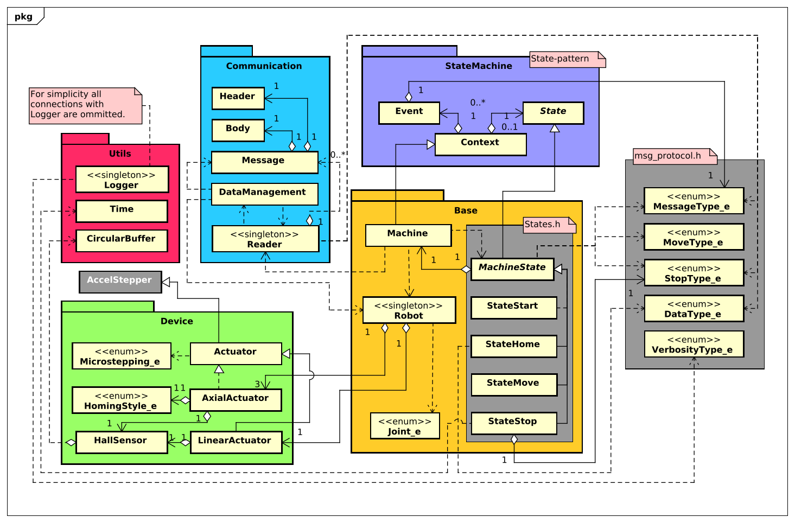

De firmware applicatie is onderverdeeld in meerdere *packages*, ook wel *namespaces*. Het algemene overzicht van de gehele applicatie is weergegeven aan de hand van een design klasse diagram (zie onderstaand). Vervolgens is er per package een klasse diagram opgesteld met een bijhorende beschrijving, deze volgen in de onderstaande onderdelen.

|                                                                        |
| :--------------------------------------------------------------------: |
|  |
|      **!diagram** - *Design class diagram - Firmware applicatie*       |

Zoals te zien in het bovenstaande diagram is de applicatie geschreven met een minimale *coupling* in het achterhoofd. Deze minimale coupling is gerealiseerd door waar mogelijk gebruik te maken van een *facade pattern*. Een voorbeeld van dit design pattern is te zien bij de klasse Reader en Robot, beide deze klasse fungeren als deur naar een dieper complex systeem. Hierover is meer te lezen in de onderstaande onderdelen.