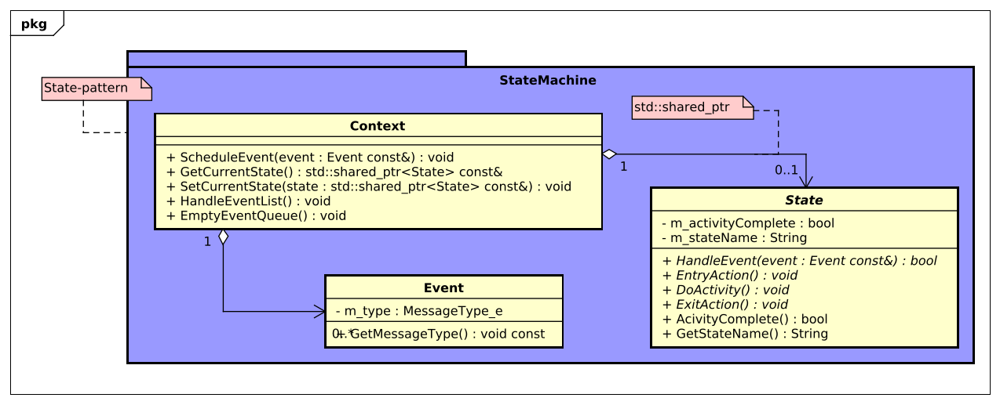
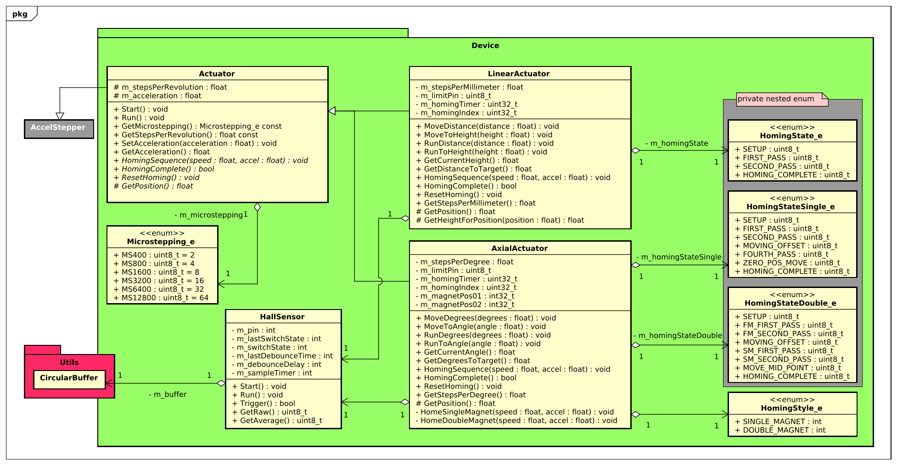

<style>
span.rob   {color:#000000; border-radius:3px}
span.o     {color:#787878; border-radius:3px}
span.x     {color:#79C6E2; border-radius:3px}
</style>

<br>
<br>

<div align="center">
    <h1 style="font-size:50px;"> 
        <span class=rob>ROB</span><span class=o>O</span><span class=x>X</span> - Firmware  
    </h1>
    <h2 style="font-size:30px;">
        Software design description
    <h2>
    

</div>


<br>
<br>


|                    |                                     |                      |                                 |
| :----------------- | :---------------------------------- | -------------------- | ------------------------------- |
| **Auteur**         | Luke van Luijn                      | **Minor**            | Digital Media Productions (DMP) |
| **Student nummer** | 587478                              | **Docentbegeleider** | Mario de Vries                  |
| **Opleiding**      | HBO-ICT                             | **Plaats**           | Nijmegen                        |
| **Profiel**        | Embedded Software Development (ESD) | **Datum**            | 27-05-2022                      |
| **Studiejaar**     | Jaar 3                              | **Versie**           | 1.0                             |

<div style="page-break-after: always;"></div>

<div style="page-break-after: always;"></div>

# Inhoudsopgaven

- 1 [Termen](#chapter0)
- 2 [Introductie](#chapter1)
	- 2.1 [Doel en domein](#chapter2)
	- 2.2 [Doelgroep](#chapter3)
	- 2.3 [Doel van het document](#chapter4)
- 3 [Architectural overview](#chapter5)
- 4 [Detailed design description](#chapter6)
	- 4.1 [Package - Communication](#chapter7)
		- 4.1.1 [Ontwerp keuzes](#chapter8)
	- 4.2 [Package - State machine](#chapter9)
		- 4.2.1 [Ontwerp keuzes](#chapter10)
	- 4.3 [Package - Device](#chapter11)
		- 4.3.1 [Ontwerp keuzes](#chapter12)
	- 4.4 [Package - Utils](#chapter13)
		- 4.4.1 [Ontwerp keuzes](#chapter14)
	- 4.5 [Package - Base](#chapter15)
		- 4.5.1 [Ontwerp keuzes](#chapter16)
- 5 [Literatuurlijst](#chapter17)

<div style="page-break-after: always;"></div>

# 1. Termen <a name="chapter0"></a>

|Index|Term|Beschrijving|
|:---:|:---|:---|
|00|**ROBOX/ Robot**|Met deze term wordt de fysieke robot ofwel het apparaat bedoelt.|
|01|**UML**|*Unified modeling language* De taal die gebruikt wordt voor het modelleren van een software systeem.|
|02|**SRS**|*Software requirements specification* Het ontwerp document van de geschreven software.|
|03|**Package/ Namespace**|Een groepering van software componenten die een soortgelijk doel nastreven.|
|04|**Coupling**|De graad van samenhang tussen verschillende componenten in een systeem (Wikipedia contributors, 2022a).|
|05|**Overkoepelende systeem/ gebruiker**|Met deze term wordt de grafische user interface bedoelt.|
|06|**Seriële bus**|Een veelgebruikt, maar ouderwets, protocol waarmee verschillende apparaten, bijvoorbeeld via USB, data kunnen uitwisselen (Wikipedia-bijdragers, 2022).|
|07|**Parsen**|Het uitlezen van een [ASCII](https://en.wikipedia.org/wiki/ASCII) string, om hier vervolgens de correcte waardes uit te halen.|
|08|**Singleton pattern**|Een design pattern die het mogelijk maakt om precies een instantie van een klasse te hebben (Sourcemaking, z.d.-a). |
|09|**Facade pattern**|Een design pattern die complexe (sub) systemen verbergt en de functionaliteit toegankelijk maakt door middel van een 'deur'-class (Sourcemaking, z.d.-b).|
|10|**State pattern**|Een design pattern die het mogelijk maakt op een elegante manier verschillende functionaliteiten uit te voeren op basis van verschillende inputs (Sourcemaking, z.d.-c).|
|11|**Homing**|De robot weet niet in welke positie de stepper motoren zich bevinden. Door een homing sequence uit te voeren weet de robot waar de motoren zich precies bevinden. Na een homing sequence kunnen er dus exacte bewegingen gedaan worden.|
|12|**Blokkeren**|Het ophouden van de algemene 'flow' van de applicatie. Als iets blokkerend is staat verder alles stil tot de blokkade is verholpen.|
|13|**Severity**|De rangschikking van de log berichten. ERROR > WARNING > INFO > DEBUG.|


# 2. Introductie <a name="chapter1"></a>


In dit document zal het ontwerp van de firmware beschreven worden. Hoe deze applicatie in essentie uitgewerkt is.

## 2.1. Doel en domein <a name="chapter2"></a>

Dit project, ROBOX, dient als een initiële opzet voor een groeiend project. De firmware zal in de toekomst verder uitgebreid en verbetert worden of door de ontwikkelaar zelf of door externe belangstellende. Het doel van de huidige iteratie is om een goed werkend product te ontwikkelen dat de basis functionaliteit implementeert.

## 2.2. Doelgroep <a name="chapter3"></a>

Het Software design description document is geschreven voor de projectbegeleiding en eventueel andere (externe) belangstellende. In dit document wordt aangenomen dat de lezer een basis kennis bevat van UML en softwareontwikkeling. Ook wordt er vanuit gegaan dat de lezer kennis heeft van het [SRS](https://github.com/LukevLuijn/robox_docs/blob/f1926df7065f7596bd7ae3ef2e1dc76c82e2e259/design/firmware/srs/srs_firmware.pdf) document gemaakt voor de firmware. 

## 2.3. Doel van het document <a name="chapter4"></a>

Dit document is opgezet om een duidelijk beeld te creëren van de werking van het product. In dit document worden de verschillende componenten toegelicht aan de hand van class diagrams en eventueel sequence diagrams.

<div style="page-break-after: always;"></div>


# 3. Architectural overview <a name="chapter5"></a>

De firmware applicatie is onderverdeeld in meerdere *packages*, ook wel *namespaces*. Het algemene overzicht van de gehele applicatie is weergegeven aan de hand van een design klasse diagram (zie onderstaand). Vervolgens is er per package een klasse diagram opgesteld met een bijhorende beschrijving, deze volgen in de onderstaande onderdelen.

|                                                                        |
| :--------------------------------------------------------------------: |
|  |
|      **Diagram 1** - *Design class diagram - Firmware applicatie*       |

Zoals te zien in het bovenstaande diagram is de applicatie geschreven met een minimale *coupling* in het achterhoofd. Deze minimale coupling is gerealiseerd door waar mogelijk gebruik te maken van een *facade pattern*. Een voorbeeld van dit design pattern is te zien bij de klasse Reader en Robot, beide deze klasse fungeren als deur naar een dieper complex systeem. Hierover is meer te lezen in de onderstaande onderdelen.

<div style="page-break-after: always;"></div>


# 4. Detailed design description <a name="chapter6"></a>

## 4.1. Package - Communication <a name="chapter7"></a>

|                                                                                |
| :----------------------------------------------------------------------------: |
|  |
|          **Diagram 2** - *Class diagram - Communication package*           |

De package [**Communication**](https://github.com/LukevLuijn/robox/tree/main/robox_firmware_v0.1/include/communication) is verandtwoordelijk voor de communicatie met het *overkoepelende systeem*. Het regelt beide het schrijven en lezen over de *seriële bus*. De communicatie is gebaseerd op de klasse [**Message**](https://github.com/LukevLuijn/robox/blob/98aca16f7c2ca8de0ee4921713f2d635fee8d508/robox_firmware_v0.1/include/communication/Message.h#L83), deze klasse is in essentie een buffer voor een inkomend bericht. Een message bestaat uit een [**Header**](https://github.com/LukevLuijn/robox/blob/98aca16f7c2ca8de0ee4921713f2d635fee8d508/robox_firmware_v0.1/include/communication/Message.h#L18) en een [**Body**](https://github.com/LukevLuijn/robox/blob/98aca16f7c2ca8de0ee4921713f2d635fee8d508/robox_firmware_v0.1/include/communication/Message.h#L48). De Header bevat het type bericht en de variant van dit type (zie [message protocol](linkje)). De body bevat eventuele parameters die het bericht bevat. De klasse [**DataManager**](https://github.com/LukevLuijn/robox/blob/main/robox_firmware_v0.1/include/communication/DataMenagement.h) is verantwoordelijk voor het correct *parsen* en opstellen van de berichten. Deze functionaliteit is gebaseerd op het *message protocol*.

De klasse [**Reader**](https://github.com/LukevLuijn/robox/blob/main/robox_firmware_v0.1/include/communication/Reader.h) is de klasse die daadwerkelijk de inkomende berichten leest. Omdat de seriële bus maar op een enkele locatie tegelijk aangesproken kan worden is er bij deze klasse gebruik gemaakt van een *singleton pattern*. Deze klasse kijkt continue naar de seriële bus, als er een bericht beschikbaar is zal deze gecontroleerd worden op basis van het *message protocol* en, indien goedgekeurd, gesorteerd worden in de messageQueue. Tijdens het sorteren zal er gekeken worden naar de header van de message. Als blijkt dat de header van de message een datatype is (DataType_e) zal dit bericht direct afgehandeld worden door een response te creëren. Als het een E-Stop bericht te zijn zullen de motoren direct gedeactiveerd worden en wordt de gehele messageQueue geleegd zodat de robot stopt met bewegen en ook niet meer verder gaat. Als dit beide niet het geval is zal het bericht aan de messageQueue worden toegevoegd. Wanneer de state machine gereed is om een beweging te maken zal de messageQueue worden afgehandeld.

<div style="page-break-after: always;"></div>


### 4.1.1. Ontwerp keuzes <a name="chapter8"></a>

|||
|:---|:---|
|**Probleem**|De seriële bus mag maar door een instantie tegelijk aangesproken worden.|
|**Besluit**|Er is voor een singleton pattern gekozen.|
|**Alternatieve**|Handmatig bijhouden welke instantie wanneer de serieele bus aanspreekt.|
|**Argumenten**|Een singleton klasse heeft als eigenschap dat er altijd precies 1 instantie, dezelfde, actief is in de applicatie.|

**Tabel 1** - *Communication - ontwerp keuze 1*

|||
|:---|:---|
|**Probleem**|Hoe verzeker je dat de applicatie alle inkomende berichten altijd op dezelfde manier verwerkt (*parsed*)?|
|**Besluit**|Het opstellen van een **Message** klasse. De klasse kan maar op een manier aangemaakt worden en is dus naast de inhoud altijd hetzelfde.|
|**Alternatieve**|Het individueel parsen van de inkomende berichten waar nodig.|
|**Argumenten**|Door een **Message** te maken is er een gestandaardiseerde methode om berichten te maken en uit te lezen. Dit maakt het voor de huidige en toekomstige klasse makkelijk om om te gaan met de seriële communicatie.|

**Tabel 2** - *Communication - ontwerp keuze 2*

|||
|:---|:---|
|**Probleem**|Hoe zorg je dat de berichten verstuurd tussen de applicaties altijd op dezelfde manier opgesteld zijn?|
|**Besluit**|Het opstellen van een bestand message protocol ([**msg_protocol.h**](https://github.com/LukevLuijn/robox/blob/main/robox_firmware_v0.1/include/config/msg_protocol.h)), en dit bestand vervolgens voor beide applicaties gebruiken.|
|**Alternatieve**|Erg goed opletten dat de berichten altijd volgens hetzelfde patroon verlopen.|
|**Argumenten**|Door een protocol op te stellen is het makkelijker om een correct geformuleerd bericht op te zetten. Het uitlezen van berichten is hierdoor ook veel minder *'error-prone'*.|

**Tabel 3** - *Communication - ontwerp keuze 3*

<div style="page-break-after: always;"></div>


## 4.2. Package - State machine <a name="chapter9"></a>

|                                                                                |
| :----------------------------------------------------------------------------: |
|  |
|          **Diagram 3** - *Class diagram - State machine package*           |

De package [**State Machine**](https://github.com/LukevLuijn/robox/tree/main/robox_firmware_v0.1/include/state_machine) is verantwoordelijk voor de opzet en uitwerking van de statemachine. Deze package is een uitwerking van de *state pattern*. Door gebruik te maken van een state machine is het makkelijk om op basis van een bepaalde input (een serieel bericht) een bepaalde functionaliteit uit te voeren.

De klasse [**State**](https://github.com/LukevLuijn/robox/blob/main/robox_firmware_v0.1/include/state_machine/State.h) is een abstracte uitwerking van een state. Het is de bedoeling dat deze in de daadwerkelijke applicatie uitgewerkt wordt (zie Package - Base). De klasse [**Event**](https://github.com/LukevLuijn/robox/blob/main/robox_firmware_v0.1/include/state_machine/Event.h) fungeert als een trigger. Aan de hand van deze klasse kunnen verschillende transities getriggerd worden binnen de state machine. Tot slot de klasse [**Context**](https://github.com/LukevLuijn/robox/blob/main/robox_firmware_v0.1/include/state_machine/Context.h). De Context klasse regelt de samenhang tussen state en event. Deze klasse bevat een lijst met events die een voor een afgehandeld worden. Ook heeft deze klasse een instantie van de huidige state. Context is ook verantwoordelijk voor het uitvoeren van de transities tussen states.

### 4.2.1. Ontwerp keuzes <a name="chapter10"></a>

|||
|:---|:---|
|**Probleem**|Hoe voer je verschillende functionaliteiten uit op basis van input?|
|**Besluit**|Het opstellen van een state machine, volgens het state pattern.|
|**Alternatieve**|Een omvangrijke 'if else'-boom, switch case.|
|**Argumenten**|Een state machine is een elegante oplossing voor het probleem. Het levert de mogelijkheid om op een overzichtelijke manier de verschillende situaties (states) af te handelen.|

**Tabel 4** - *State machine - ontwerp keuze 1*

<div style="page-break-after: always;"></div>

## 4.3. Package - Device  <a name="chapter11"></a>

|                                                                                |
| :----------------------------------------------------------------------------: |
|  |
|          **Diagram 4** - *Class diagram - Device package*           |

De package [**Device**](https://github.com/LukevLuijn/robox/tree/main/robox_firmware_v0.1/include/device) heeft als verantwoordelijkheid het direct aanspreken van de verschillende hardware componenten. De klasse [**Actuator**](https://github.com/LukevLuijn/robox/blob/main/robox_firmware_v0.1/include/device/Actuator.h) is de overkoepelende actuator klasse die de algemene zaken regelt die voor beide onderliggende actuator classen hetzelfde zijn. [**Linear**](https://github.com/LukevLuijn/robox/blob/main/robox_firmware_v0.1/include/device/LinearActuator.h) & [**AxialActuator**](https://github.com/LukevLuijn/robox/blob/main/robox_firmware_v0.1/include/device/AxialActuator.h) zijn de daadwerkelijke actuators. De applicatie heeft drie axiale actuators en een lineaire actuator. De axiale actuator regelt beweging in graden en de lineaire actuator regelt beweging in millimeters. Beide deze uitwerkingen maken gebruik van een [**HallSensor**](https://github.com/LukevLuijn/robox/blob/main/robox_firmware_v0.1/include/device/HallSensor.h) instantie voor *homing*. De enumeraties [**HomingState_e**](https://github.com/LukevLuijn/robox/blob/98aca16f7c2ca8de0ee4921713f2d635fee8d508/robox_firmware_v0.1/include/device/LinearActuator.h#L19), [**HomingStateSingle_e**](https://github.com/LukevLuijn/robox/blob/98aca16f7c2ca8de0ee4921713f2d635fee8d508/robox_firmware_v0.1/include/device/AxialActuator.h#L21) & [**HomingStateDouble_e**](https://github.com/LukevLuijn/robox/blob/98aca16f7c2ca8de0ee4921713f2d635fee8d508/robox_firmware_v0.1/include/device/AxialActuator.h#L31) worden gebruikt voor de homing sequence van de actuatoren. 

### 4.3.1. Ontwerp keuzes <a name="chapter12"></a>

|||
|:---|:---|
|**Probleem**|Hoe kun je een homing sequence uitvoeren voor vier verschillende motoren zonder dat deze sequence het resterende programma *blokkeert*?|
|**Besluit**|Het gebruik van verschillende enumeraties die de verschillende stadia van de sequence weergegeven zodat het voor de applicatie duidelijk is welke actie ondernomen moet worden.|
|**Alternatieve**|Een homing sequence gebruiken die wel blokkeert.|
|**Argumenten**|Gezien de lineaire actuator vrij traag is en de axiale actuatoren ook niet bijster snel ontstond er een homing sequence van ongeveer twee minuten, in blokkerende toestand. Het was dus noodzakelijk om een niet-blokkerende homing sequence op te zetten zodat in ieder geval alle actuator tegelijkertijd de sequence konden uitvoeren.|

**Tabel 5** - *Device - ontwerp keuze 1*


## 4.4. Package - Utils <a name="chapter13"></a>

|                                                                                |
| :----------------------------------------------------------------------------: |
|  |
|          **Diagram 5** - *Class diagram - Utils*           |


De [**Utils**](https://github.com/LukevLuijn/robox/tree/main/robox_firmware_v0.1/include/utils) package is een verzameling van verschillende klasse die ieder een eigen functionaliteit bevatten. De klasse Time bestaat uit een enkele methode *MicroTimer*. De klasse [**CircularBuffer**](https://github.com/LukevLuijn/robox/blob/main/robox_firmware_v0.1/include/utils/CircularBuffer.h) is een C++ implementatie van de [circulaire buffer](https://en.wikipedia.org/wiki/Circular_buffer) (Wikipedia contributors, 2022a) bedoelt voor het efficiënt opslaan en uitlezen van sensor waarde. 

De [**Logger**](https://github.com/LukevLuijn/robox/blob/main/robox_firmware_v0.1/include/utils/Logger.h) klasse heeft iets meer substantie dan de andere twee. De logger wordt door vrijwel de gehele applicatie gebruikt. De logger geeft de mogelijkheid om berichten naar de console te schrijven in een voorbepaald format. De Logger is de enige klasse die naar de seriële bus mag schrijven en is daarom, net zoals de reader, een singleton. Dit maakt het en makkelijk om vanaf meerdere locaties in de applicatie gebruik te maken van de logger en zorgt ervoor dat er nooit van meerdere locaties naar de seriële bus geschreven wordt. De logger houdt ook de *severity* van een bericht bij. Er zijn vier verschillende severities; ERROR, WARNING, INFO en DEBUG. Ieder van deze niveaus kan worden uit- en ingeschakeld. Naast de severity wordt ook de locatie van aanroepen meegenomen in het bericht. De methode, bestandsnaam en lijnnummer moet worden bijgehouden. Omdat het meegegeven van al deze data nogal veel typ-werk is is er bij de logger ook gebruik gemaakt van verschillende *Macro's*, deze macro's zijn [hier](https://github.com/LukevLuijn/robox/blob/98aca16f7c2ca8de0ee4921713f2d635fee8d508/robox_firmware_v0.1/include/utils/Logger.h#L12-L31) terug te vinden. Door gebruik te maken van deze macro's is het opstellen van een log-bericht een stuk simpeler.

|||
|:---|:---|
|Zonder macro|```Utils::Logger::GetInstance().Error("message", __func__,__FILE__,__LINE__, "vars");```|
|Met macro|```ERROR("message", "vars");```|

Door log berichten te voorzien van deze verschillende data-elementen is het tijdens het afspelen van de applicatie vele malen makkelijker om bij te houden wat er precies gebeurt in de applicatie.

### 4.4.1. Ontwerp keuzes <a name="chapter14"></a>

|||
|:---|:---|
|**Probleem**|Hoe kan op een efficiënte manier data opgeslagen en uitgelezen worden, verkregen van sensoren?|
|**Besluit**|Het opstellen van een circulaire buffer.|
|**Alternatieve**|Grote arrays, of dynamische opties zoals vectoren.|
|**Argumenten**|Een circulaire buffer is erg efficiënt qua opslag en geheugen. Het levert altijd een relatief betrouwbaar gemiddelde van de huidige data en is makkelijk in gebruik.|

**Tabel 6** - *Utils - ontwerp keuze 1*

|||
|:---|:---|
|**Probleem**|Hoe verzeker je dat er maar een instantie tegelijkertijd naar de seriële bus schrijft.|
|**Besluit**|Er is wederom gekozen voor het gebruik van het singleton pattern.|
|**Alternatieve**|Zeer precies bijhouden wanneer er geschreven wordt naar de seriële bus.|
|**Argumenten**|Zoals eerder vermeld, een singleton heeft maar een enkele instantie. Het is daarom een ideale keuze voor een probleem als deze.|

**Tabel 7** - *Utils - ontwerp keuze 2*

|||
|:---|:---|
|**Probleem**|Hoe kun je als gebruiker van de applicatie duidelijk zien wanneer, waar, wat gebeurt?|
|**Besluit**|Door tijd, methode, bestandsnaam en lijnnummer bij te houden van elke aanroep van een log bericht.|
|**Alternatieve**|deze data handmatig in het bericht te verwerken.|
|**Argumenten**|De bovenstaande velden zijn ingebouwde macro's van C++ en zijn opgesteld precies om de reden die hier als probleem is opgesteld. Door deze data mee te geven aan elk log bericht is het meteen duidelijk waar er gekeken moet worden bij een onverwachte situatie.|

**Tabel 8** - *Utils - ontwerp keuze 3*

|||
|:---|:---|
|**Probleem**|Hoe kun je op efficiënte manier log berichten opstellen met toch de adequate data onderdelen.|
|**Besluit**|Het opstellen van verschillende macro's die al deze datavelden automatisch aanroepen.|
|**Alternatieve**|Het handmatig meegegeven van deze velden.|
|**Argumenten**|Zoals verteld zijn de velden ingebouwde C++ macro's en zijn daarom ideaal om gebruikt te worden voor een situatie als deze.|

**Tabel 9** - *Utils - ontwerp keuze 4*


## 4.5. Package - Base <a name="chapter15"></a>

|                                                                                |
| :----------------------------------------------------------------------------: |
|  |
|          **Diagram 6** - *Class diagram - Base*           |

De [**Base**](https://github.com/LukevLuijn/robox/tree/main/robox_firmware_v0.1/include/base) package is het centrale punt van de applicatie. In deze package is de samenhang tussen de package communication, StateMachine en device geregeld. De base package is opgedeeld in twee hoofd onderdelen. 

Aan de ene kan is de [**Robot**](https://github.com/LukevLuijn/robox/blob/main/robox_firmware_v0.1/include/base/Robot.h) klasse. Deze klasse is verantwoordelijk voor alles hardware. In deze klasse worden de verschillende actuatoren aangestuurd en gevalideerd. De Robot klasse is gemaakt volgens het singleton pattern, net zoals bij de seriële bus mag er altijd, maar precies, een instantie gebruik maken van de hardware. Verder wordt in de Robot klasse nog [inverse en forward kinematica](https://github.com/LukevLuijn/robox/blob/98aca16f7c2ca8de0ee4921713f2d635fee8d508/robox_firmware_v0.1/src/Robot.cpp#L368-L435) toegepast voor het vertalen van hoeken naar positie en van positie naar hoeken. 

Aan de andere kant de state machine implementatie. De klasse [**Machine**](https://github.com/LukevLuijn/robox/blob/main/robox_firmware_v0.1/include/base/Machine.h) is een afgeleide van de klasse Context en draagt dezelfde verantwoordelijkheid. De klasse [**MachineState**](https://github.com/LukevLuijn/robox/blob/98aca16f7c2ca8de0ee4921713f2d635fee8d508/robox_firmware_v0.1/include/base/States.h#L16) is een directe afgeleide van de State klasse, alle onderliggende state-klasse staan hieronder beschreven;

|Class|Beschrijving|
|:---|:---|
|[**StartState**](https://github.com/LukevLuijn/robox/blob/98aca16f7c2ca8de0ee4921713f2d635fee8d508/robox_firmware_v0.1/src/States.cpp#L16-L44)|Start state is de staat waar de applicatie wacht op input van de gebruiker. In deze state zijn alle motoren uitgeschakeld.|
|[**HomeState**](https://github.com/LukevLuijn/robox/blob/98aca16f7c2ca8de0ee4921713f2d635fee8d508/robox_firmware_v0.1/src/States.cpp#L45-L106)|In deze state voert de applicatie de homing sequence uit voor de vier verschillende actuatoren. Tijdens deze state is het mogelijk om een E-Stop uit te voeren. Zodra de homing sequence voltooid is zal de flag: 'activityComplete' op true gezet worden.|
|[**MoveState**](https://github.com/LukevLuijn/robox/blob/98aca16f7c2ca8de0ee4921713f2d635fee8d508/robox_firmware_v0.1/src/States.cpp#L107-L216)|In de move state worden de motors direct aangesproken en zal de robot gaan bewegen. Zodra de beweging voltooid is zal de flag 'activityComplete' op true gezet worden. Ook tijdens deze state kan er een E-Stop uitgevoerd worden.|
|[**StopState**](https://github.com/LukevLuijn/robox/blob/98aca16f7c2ca8de0ee4921713f2d635fee8d508/robox_firmware_v0.1/src/States.cpp#L217-L320)|In de stop state wordt het stoppen en pauzeren van de robot geregeld. Bij het pauzeren van de robot wordt er een timer aangezet, zodra de timer afloopt zal de activityComplete flag op true gezet worden. Bij het stoppen van de robot wordt de robot naar de *idle positions* bewogen. Zodra de robot aangekomen is op deze posities worden de motoren uitgeschakeld en de activityComplete flag op true gezet.|

**Tabel 10** - State beschrijvingen

In het onderstaande state machine diagram is het verloop van de statemachine nogmaals afgebeeld.

|                                                                                |
| :----------------------------------------------------------------------------: |
|  |
|          **Diagram 7** - *Statemachine diagram*           |


### 4.5.1. Ontwerp keuzes <a name="chapter16"></a>

|||
|:---|:---|
|**Probleem**|Hoe verzeker je dat er maar een instantie tegelijkertijd met de hardware componenten communiceert?|
|**Besluit**|Het opstellen van een singleton class.|
|**Alternatieve**|Het zeer accuraat bijhouden wie er met de componenten praat.|
|**Argumenten**|Zoals meerdere malen verteld is een singleton uitermate geschikt als een restrictie voor het vanaf verschillende locaties praten met onderdelen.|

**Tabel 11** - *Base - ontwerp keuze 1*

|||
|:---|:---|
|**Probleem**|Hoe kun je vanuit hoeken voor iedere joint berekenen wat de uiteindelijke positie van de gripper zal zijn?|
|**Besluit**|Het toepassen van forwards kinematica.|
|**Alternatieve**|geen.|
|**Argumenten**|Het toepassen van forwards kinematica levert de mogelijkheid om vanuit de eerder genoemde hoeken de eindpositie van de gripper te berekenen.|

**Tabel 12** - *Base - ontwerp keuze 2*

|||
|:---|:---|
|**Probleem**|Hoe kun je vanuit een eindpositie van de gripper bepalen wat de hoeken moeten zijn voor de rest van de robot?|
|**Besluit**|Get toepassen van inverse kinematica.|
|**Alternatieve**|geen.|
|**Argumenten**|Het toepassen van inverse kinematica levert de mogelijkheid om vanuit de eerder genoemde positie de verschillende hoeken van de robot te berekenen.|

**Tabel 13** - *Base - ontwerp keuze 3*


<div style="page-break-after: always;"></div>

# 5. Literatuurlijst <a name="chapter17"></a>

| Index | Source                                                                                                                                                                                                                                              | 
| :---: | :---                                                                                                                                                                                                                                                | 
| 1     | Sourcemaking. (z.d.-a). Design Patterns and Refactoring. Singleton. Geraadpleegd op 27 mei 2022, van [https://sourcemaking.com/design_patterns/singleton](https://sourcemaking.com/design_patterns/singleton)                                       | 
| 2     | Sourcemaking. (z.d.-b). Design Patterns and Refactoring. Facade. Geraadpleegd op 27 mei 2022, van [https://sourcemaking.com/design_patterns/facade](https://sourcemaking.com/design_patterns/facade)                                                | 
| 3     | Sourcemaking. (z.d.-c). Design Patterns and Refactoring. State. Geraadpleegd op 27 mei 2022, van [https://sourcemaking.com/design_patterns/state](https://sourcemaking.com/design_patterns/state)                                                   | 
| 4     | Wikipedia contributors. (2022a, mei 6). Coupling (computer programming). Wikipedia. Geraadpleegd op 27 mei 2022, van [https://en.wikipedia.org/wiki/Coupling_(computer_programming)](https://en.wikipedia.org/wiki/Coupling_(computer_programming)) | 
| 5     | Wikipedia contributors. (2022b, mei 23). ASCII. Wikipedia. Geraadpleegd op 27 mei 2022, van [https://en.wikipedia.org/wiki/ASCII](https://en.wikipedia.org/wiki/ASCII)                                                                              | 
| 6     | Wikipedia-bijdragers. (2022, 10 februari). Universal serial bus. Wikipedia. Geraadpleegd op 27 mei 2022, van [https://nl.wikipedia.org/wiki/Universal_serial_bus](https://nl.wikipedia.org/wiki/Universal_serial_bus)                               | 
| 7     | Wikipedia contributors. (2022a, april 26). Circular buffer. Wikipedia. Geraadpleegd op 27 mei 2022, van [ https://en.wikipedia.org/wiki/Circular_buffer]( https://en.wikipedia.org/wiki/Circular_buffer)                                            | 


