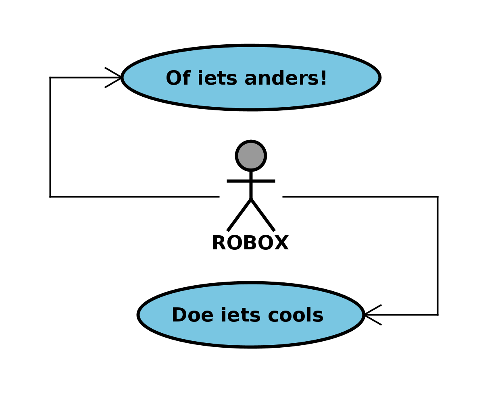
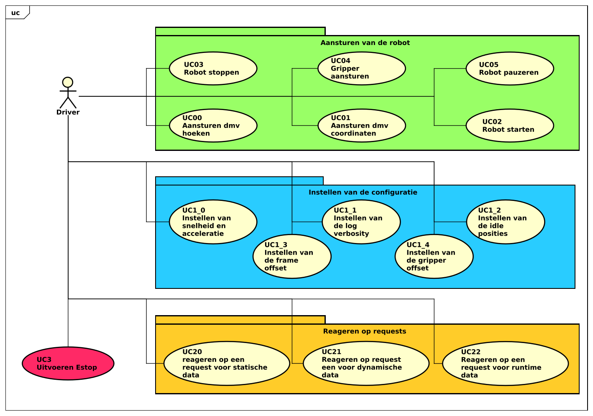

<style>
span.rob   {color:#000000; border-radius:3px}
span.o     {color:#787878; border-radius:3px}
span.x     {color:#79C6E2; border-radius:3px}
</style>

<br>
<br>

<div align="center">
    <h1 style="font-size:50px;"> 
        <span class=rob>ROB</span><span class=o>O</span><span class=x>X</span> - Firmware  
    </h1>
    <h2 style="font-size:30px;">
        Software requirements specification
    <h2>
    

</div>


<br>
<br>


|                    |                                     |                      |                                 |
| :----------------- | :---------------------------------- | -------------------- | ------------------------------- |
| **Auteur**         | Luke van Luijn                      | **Minor**            | Digital Media Productions (DMP) |
| **Student nummer** | 587478                              | **Docentbegeleider** | Mario de Vries                  |
| **Opleiding**      | HBO-ICT                             | **Plaats**           | Nijmegen                        |
| **Profiel**        | Embedded Software Development (ESD) | **Datum**            | 25-05-2022                      |
| **Studiejaar**     | Jaar 3                              | **Versie**           | 1.0                             |

<div style="page-break-after: always;"></div>

<div style="page-break-after: always;"></div>

# Inhoudsopgaven

- 1 [Termen](#chapter0)
- 2 [Introductie](#chapter1)
	- 2.1 [Gebruikers, klassen en karakteristieken](#chapter2)
	- 2.2 [Ontwerp- en implementatie beperkingen](#chapter3)
	- 2.3 [Ontwikkelomgeving](#chapter4)
	- 2.4 [Product functionaliteiten](#chapter5)
- 3 [Usecase beschrijvingen](#chapter6)
	- 3.1 [UC0 - Aansturen van de robot](#chapter7)
		- 3.1.1 [UC0_0 - Aansturen door middel van hoeken](#chapter8)
		- 3.1.2 [UC0_1 - Aansturen door middel van coördinaten](#chapter9)
		- 3.1.3 [UC0_2 - Robot starten](#chapter10)
		- 3.1.4 [UC0_3 - Robot stoppen](#chapter11)
		- 3.1.5 [UC0_4 - Aansturen van de gripper](#chapter12)
		- 3.1.6 [UC0_5 - Robot pauzeren](#chapter13)
	- 3.2 [UC1 - Instellen van de configuratie](#chapter14)
	- 3.3 [UC2 - Reageren op requests](#chapter15)
	- 3.4 [UC3 - Uitvoeren Noodstop](#chapter16)
- 4 [Requirements](#chapter17)
	- 4.1 [Functionele requirements](#chapter18)
	- 4.2 [Niet functionele requirements](#chapter19)
		- 4.2.1 [QoS - Usability](#chapter20)
		- 4.2.2 [QoS - Reliability](#chapter21)
		- 4.2.3 [QoS - Performance](#chapter22)
		- 4.2.4 [QoS - Supportability](#chapter23)
- 5 [Literatuurlijst](#chapter24)

<div style="page-break-after: always;"></div>

# 1. Termen <a name="chapter0"></a>


|Index|Term|Beschrijving|
|:---:|:---|:---|
|00|**ROBOX/Robot**|Met deze term wordt het fysieke apparaat bedoelt.|
|01|**Microcontroller**|Een [microcontroller](https://en.wikipedia.org/wiki/Microcontroller) (Wikipedia-bijdragers, 2022a) is een kleine computer die het mogelijk maakt om direct met de input en output pinnen te communiceren.|
|02|**Clock/klok snelheid**|Hoe snel een processor (van bijvoorbeeld een microcontroller) een commando kan uit voeren per seconde. Een kloksnelheid van 16MHz staat dus voor 16.000.000 commando's per seconde (Wikipedia-bijdragers, 2020).|
|03|**Computer**|Hiermee wordt een 'normale' computer bedoelt, bijvoorbeeld een laptop of desktop.|
|04|**Software/overkoepelende software**|Hiermee wordt de bijhorende applicatie bedoelt.|
|05|**Firmware**|De software die op een apparaat, bijvoorbeeld een microcontroller, draait.|
|06|**Actor**|De gebruiker van een systeem.|
|07|**32 bits**|Deze term geeft aan hoeveel geheugen een processor tegelijkertijd kan aanspreken. 32 bits kan dus 2^32 waardes opslaan, een 8 bits architectuur kan maar 2^8 aantal waardes opslaan (Wikipedia-bijdragers, 2022a)|
|08|**IC**|'integrated circuit' een chip die meestal op een printplaat verwerkt is.|
|09|**Run time data**|De data velden die tijdens het afspelen van de applicatie veranderen.|
|10|**Compile time data**|De data velden die op het moment van compileren bepaald worden en verder niet veranderen.|
|11|**Seriële bus**|Een veelgebruikt, maar ouderwets, protocol waarmee verschillende apparaten, bijvoorbeeld via USB, data kunnen uitwisselen (Wikipedia-bijdragers, 2022).|
|12|**PWM**|'Pulse width modulation' Een blokgolf signaal die een bepaalde waarde kan weergeven, in dit geval een 8 bits waarde (0/255).|


<div style="page-break-after: always;"></div>

# 2. Introductie <a name="chapter1"></a>


Dit is het software requirements specification document van het firmware aspect van het ROBOX project. De firmware van dit project zal draaien op een microcontroller in de robot zelf. Deze firmware is verantwoordelijk voor het correct interpreteren van de verschillende commando's afkomstig van de overkoepelende software draaiend op een verbonden computer. Verder is de firmware verantwoordelijk voor het waarborgen van de verschillende veiligheidseisen, eisen zoals tijdig stoppen, niet voorbij mini- en maximale waardes gaan en soortgelijke situaties.

## 2.1. Gebruikers, klassen en karakteristieken <a name="chapter2"></a>

Voor de firmware is er een enkele actor; Het overkoepelende systeem draaiend op een aangrenzende computer. De gebruiker van ROBOX zal geen directe interactie met de firmware hebben.

## 2.2. Ontwerp- en implementatie beperkingen <a name="chapter3"></a>

Gezien microcontrollers een beperkte hoeveelheid RAM en Geheugen hebben zal er tijdens de ontwikkeling rekening gehouden worden met deze beperkingen. De firmware zal dus waar mogelijk geen gebruik maken van dynamisch geheugen en zo veel mogelijk aspecten beperken op gebied van 'run time data' en de data maximaliseren op gebied van 'compile time data'.

## 2.3. Ontwikkelomgeving <a name="chapter4"></a>

De firmware zal ontwikkeld worden voor een moderne microcontroller met een degelijke clock snelheid. Een voorbeeld van een dergelijke microcontroller is bijvoorbeeld de [Teensy 4.0](https://www.pjrc.com/store/teensy40.html) (PJRC, n.d.), deze microcontroller beschikt over een 32 bits ARM IC met een clock snelheid van 600 MHz. Een voorbeeld van een niet geschikte microcontroller is bijvoorbeeld de [Arduino Uno](http://store.arduino.cc/products/arduino-uno-rev3) (Arduino, n.d.), deze microcontroller beschikt over een 8 bits ATmega IC met een clock snelheid van 16MHz.

De gebruikte microcontroller zal verder moeten beschikken over een seriële bus die aanspreekbaar is over USB. De communicatie met de overkoepelende software zal hier namelijk gebruik van maken.

## 2.4. Product functionaliteiten <a name="chapter5"></a>

De firmware zal verantwoordelijk zijn voor het aansturen en uitlezen van de verschillende hardware componenten. Hierbij is het belangrijk dat de componenten op correcte wijzen aangestuurd worden en mini- en maximalen waardes niet overschreden worden. Dit is belangrijk omdat er gewerkt zal worden met een fysiek apparaat dat zal beschikken over motors die krachtig genoeg zijn om het apparaat te vernielen. 


<div style="page-break-after: always;"></div>

# 3. Usecase beschrijvingen <a name="chapter6"></a>


In het onderstaande diagram zijn de verschillende usecases te vinden omtrent de firmware. In dit diagram is (schematische) samenhang weergegeven van de verschillende onderdelen van het systeem en hoe de gebruiker (de driver) gebruik kan maken van het systeem.

||
|:---:|
||
|**Diagram 1** - *Usecase diagram Firmware*|

In het diagram is te zien dat de verschillende usecases opgedeeld zijn in vier verschillende segmenten.

Het eerste segment 'Aansturen van de robot' is verantwoordelijk voor alle usecases die betrekking hebben tot het bewegen van de robot. Denk hierbij aan het bewegen naar een bepaalde positie of het pauzeren van de robot.

Het tweede segment, 'Instellen van de configuratie', regelt het instellen van de robot. Bijvoorbeeld het instellen van de snelheid en acceleratie.

Het derde segment 'Reageren op requests' is verantwoordelijk voor het opsturen van de data naar de driver. Het opsturen van de huidige positie is een voorbeeld hiervan.

Tot slot het vierde onderdeel; 'Uitvoeren Estop'. Het uitvoeren van een noodstop zal een andere uitvoering krijgen dan de onderdelen verwerkt in 'Aansturen van de robot', en heeft hierdoor ook een apart segment.

<div style="page-break-after: always;"></div>

## 3.1. UC0 - Aansturen van de robot <a name="chapter7"></a>

In dit onderdeel zullen de verschillende usecases uit het onderdeel 'Aansturen van de robot' dieper toegelicht worden.

### 3.1.1. UC0_0 - Aansturen door middel van hoeken <a name="chapter8"></a>

|||
|:---|:---|
|Primary actor:|Driver|
|Brief description:|Het systeem reageert op een inkomend bericht omtrent het aansturen door middel van hoeken en stuurt de robot vervolgens adequaat aan. |
|Preconditions:|De robot heeft een 'start'-bericht ontvangen en verwerkt (bevind zich in een bekende positie).|
|Postconditions:|De robot zal zich bevinden in de ontvangen positie.|

||Actor action||System resposibility|
|:---:|:---|:---:|:---|
|1.|Geeft een nieuwe positie op.|2.|Verwerkt het ontvangen bericht.|
|||3.|Kijkt of de posities binnen de uiterste waardes vallen.|
|||4.|Kijkt of de robot klaar is om een beweging te maken.|
|||5.|Beweegt de verschillende assen naar de gewenste hoeken.|
||**Alternative flow 01:**|||
||||*De waardes vallen niet binnen de uiterste waardes.*|
|||4a.|Het systeem zal een log bericht versturen waarin vermeld wordt dat de positie niet uitgevoerd kan worden.|
||**Alternative flow 02:**|||
||||*De robot is niet klaar om een nieuwe beweging uit te voeren.*|
|||5a.|Het bericht wordt toegevoegd een queue en op een later moment uitgevoerd worden.|
|||||

**Usecase 1** - *Fully dressed usecase description - UC00*

<div style="page-break-after: always;"></div>

### 3.1.2. UC0_1 - Aansturen door middel van coördinaten <a name="chapter9"></a>

|||
|:---|:---|
|Primary actor:|Driver|
|Brief description:|Het systeem reageert op een inkomend bericht omtrent het aansturen door middel van hoeken en stuurt de robot vervolgens adequaat aan. |
|Preconditions:|De robot heeft een 'start'-bericht ontvangen en verwerkt (bevind zich in een bekende positie).|
|Postconditions:|De robot zal zich bevinden in de ontvangen positie.|

||Actor action||System resposibility|
|:---:|:---|:---:|:---|
|1.|Geeft een nieuwe positie op.|2.|Verwerkt het ontvangen bericht.|
|||3.|Berekent de hoeken op basis van de ontvangen coördinaten.|
|||4.|Kijkt of de posities binnen de uiterste waardes vallen.|
|||5.|Kijkt of de robot klaar is om een beweging te maken.|
|||6.|Beweegt de verschillende assen naar de berekende hoeken.|
||**Alternative flow 01:**|||
||||*De waardes vallen niet binnen de uiterste waardes.*|
|||5a.|Het systeem zal een log bericht versturen waarin vermeld wordt dat de positie niet uitgevoerd kan worden.|
||**Alternative flow 02:**|||
||||*De robot is niet klaar om een nieuwe beweging uit te voeren.*|
|||6a.|Het bericht wordt toegevoegd een queue en op een later moment uitgevoerd worden.|
|||||

**Usecase 2** - *Fully dressed usecase description - UC01*

<div style="page-break-after: always;"></div>


### 3.1.3. UC0_2 - Robot starten <a name="chapter10"></a>

|||
|:---|:---|
|Primary actor:|Driver|
|Brief description:|Het systeem reageert op een inkomend bericht omtrent het starten van de robot, vervolgens zal het systeem de stappen ondernemen om de robot te starten.|
|Preconditions:|Er is een seriële verbinding met de driver en de robot bevind zich in een onbekende positie, of net opgestart, of gestopt.|
|Postconditions:|De robot bevind zich in een bekende positie.|

||Actor action||System resposibility|
|:---:|:---|:---:|:---|
|1.|Stuurt een start commando.|2.|Verwerkt het ontvangen bericht.|
|||3.|Voert de homing sequence uit voor de verschillende actuatoren in de robot.|
|||4.|Update alle data, omtrent positionering van de robot, naar de nieuwe waardes.|
|||5.|Stuurt een bericht naar de driver omtrent het voltooien van de homing sequence.|

**Usecase 3** - *Fully dressed usecase description - UC02*

<div style="page-break-after: always;"></div>

### 3.1.4. UC0_3 - Robot stoppen <a name="chapter11"></a>

|||
|:---|:---|
|Primary actor:|Driver|
|Brief description:|Het systeem reageert op een inkomend bericht omtrent het stoppen van de robot, vervolgens zal het systeem de stappen ondernemen om de robot te stoppen.|
|Preconditions:|De robot heeft een 'start'-bericht ontvangen en verwerkt (bevind zich in een bekende positie).|
|Postconditions:|De robot bevind zich in de 'idle'-positie en de motoren zijn uitgeschakeld.|

||Actor action||System resposibility|
|:---:|:---|:---:|:---|
|1.|Stuurt een stop commando.|2.|Verwerkt het ontvangen bericht.|
|||3.|Kijkt of de robot klaar is om een beweging te maken.|
|||4.|Beweegt de assen naar de verschillende 'idle'-posities.|
|||5.|Deactiveert de verschillende motoren in de robot.|
|||6.|Verwijderd alle ge-queuede bewegingscommando's uit het systeem.|
||**Alternative flow 01:**|||
||||*De robot is niet klaar om een nieuwe beweging uit te voeren.*|
|||4a.|Het bericht wordt toegevoegd een queue en op een later moment uitgevoerd worden.|
||||Zodra het bericht uitgevoerd wordt zal er gestart worden bij stap 4.|

**Usecase 4** - *Fully dressed usecase description - UC03*

<div style="page-break-after: always;"></div>


### 3.1.5. UC0_4 - Aansturen van de gripper <a name="chapter12"></a>

|||
|:---|:---|
|Primary actor:|Driver|
|Brief description:|Het systeem reageert op een inkomend bericht omtrent het aansturen van de gripper.|
|Preconditions:|De robot heeft een 'start'-bericht ontvangen en verwerkt (bevind zich in een bekende positie).|
|Postconditions:|De gripper is aangestuurd met de gevraagde PWM waarde.|


||Actor action||System resposibility|
|:---:|:---|:---:|:---|
|1.|Stuurt een nieuwe gripper waarde.|2.|Verwerkt het ontvangen bericht.|
|||3.|Kijkt of de waarde binnen de uiterste vallen.|
|||4.|Kijkt of de robot klaar is om een beweging te maken.|
|||5.|Activeert de gripper met de opgegeven PWM waarde.|
||**Alternative flow 01:**|||
||||*De waarde valt niet binnen de uiterste.*|
|||4a.|Er zal een bericht naar de driver gestuurd worden waarin vermeld wordt dat de opgegeven waardes niet uitgevoerd kunnen worden.|
||**Alternative flow 02:**|||
||||*De robot is niet klaar om een beweging te maken.*|
|||5a.|Het bericht wordt toegevoegd aan een queue en zal op een later moment uitgevoerd worden.|

**Usecase 5** - *Fully dressed usecase description - UC04*

<div style="page-break-after: always;"></div>

### 3.1.6. UC0_5 - Robot pauzeren <a name="chapter13"></a>

|||
|:---|:---|
|Primary actor:|Driver|
|Brief description:|Het systeem reageert op een inkomend bericht omtrent het pauzeren van de robot. Het systeem zal de robot pauzeren voor de aangegeven tijd.|
|Preconditions:|De robot heeft een 'start'-bericht ontvangen en verwerkt (bevind zich in een bekende positie).|
|Postconditions:|De robot heeft gepauzeerd voor de aangegeven tijd.|

||Actor action||System resposibility|
|:---:|:---|:---:|:---|
|1.|Stuurt een 'pauzeer'-bericht|2.|Verwerkt het ontvangen bericht|
|||3.|Kijkt of de robot klaar is om een beweging te maken.|
|||4.|Pauzeert de robot voor het aangeven aantal milliseconden.|
||**Alternative flow 01:**|||
||||*De robot is niet klaar om een nieuwe beweging te maken.*|
|||4a.|Het bericht wordt toegevoegd aan een queue en op een later moment zal het bericht uitgevoerd worden.|

**Usecase 6** - *Fully dressed usecase description - UC05*


## 3.2. UC1 - Instellen van de configuratie <a name="chapter14"></a>

De usecases die vallen onder dit onderdeel zijn allemaal soortgelijk in uitvoering. Door deze gelijksoortigheid is er gekozen om een enkele 'fully dressed' uitwerking te maken.

|||
|:---|:---|
|Primary actor:|Driver|
|Brief description:|Het systeem verwerkt een configuratie bericht.|
|Preconditions:|Er is een seriële verbinding met de driver.|
|Postconditions:|De configuratie is verwerkt in het systeem.|

||Actor action||System resposibility|
|:---:|:---|:---:|:---|
|1.|Stuurt een configuratie bericht.|2.|Verwerkt het bericht.|
|||3.|De bijhorende waarde in het systeem wordt aangepast naar de waarde vermeld in het ontvangen bericht.|

**Usecase 7** - *Fully dressed usecase description - Instellen van configuratie*

## 3.3. UC2 - Reageren op requests <a name="chapter15"></a>

De usecases die vallen onder dit onderdeel zijn allemaal soortgelijk in uitvoering. Door deze gelijksoortigheid is er gekozen om een enkele 'fully dressed' uitwerking te maken.

|||
|:---|:---|
|Primary actor:|Driver|
|Brief description:|Het systeem reageert op een inkomend data-request bericht. Het systeem zal een response opzetten en terug sturen naar de driver.|
|Preconditions:|Er is een seriële verbinding met de driver.|
|Postconditions:|Een response met de corresponderende data is verstuurd naar de driver.|

||Actor action||System resposibility|
|:---:|:---|:---:|:---|
|1.|Stuurt een data request bericht|2.|Verwerkt het bericht.|
|||3.|Stelt een bericht samen met de bijhorende waardes.|
|||4.|Verstuurd het bericht naar de driver.|

**Usecase 8** - *Fully dressed usecase description - Reageren op requests*

## 3.4. UC3 - Uitvoeren Noodstop <a name="chapter16"></a>

|||
|:---|:---|
|Primary actor:|Driver|
|Brief description:|Het systeem ontvangt een noodstop bericht en zal vervolgens direct alle beweging van de robot staken.|
|Preconditions:|Er is een seriële verbinding met de driver.|
|Postconditions:|De robot is direct gestopt en alle motoren zijn uitgeschakeld.|

||Actor action||System resposibility|
|:---:|:---|:---:|:---|
|1.|Stuurt een 'noodstop'-bericht.|2.|Identificeert het bericht als 'noodstop'.|
|||3.|Schakelt direct alle motoren uit.|
|||4.|Verwijderd alle opgeslagen bewegings-berichten uit de queue.|

**Usecase 9** - *Fully dressed usecase description - UC*


<div style="page-break-after: always;"></div>

# 4. Requirements <a name="chapter17"></a>


<style>
span.error       {color:#FF0000; background-color:#000000; border-radius:3px}
span.warning     {color:#FFFF00; background-color:#000000; border-radius:3px}
span.info        {color:#00FF00; background-color:#000000; border-radius:3px}
span.debug       {color:#FF00FF; background-color:#000000; border-radius:3px}
p.must           {margin-left:auto; margin-right:auto; text-align:center; width:60px;} 
p.should         {margin-left:auto; margin-right:auto; text-align:center; width:60px;} 
p.could          {margin-left:auto; margin-right:auto; text-align:center; width:60px;} 
p.wont           {margin-left:auto; margin-right:auto; text-align:center; width:60px;} 
p.must           {border:3px; border-style:solid; border-color:#00FF00; border-radius:10px; background-color:#000000; font-weight:bold; color:#FFFFFF;}
p.should         {border:3px; border-style:solid; border-color:#FFA500; border-radius:10px; background-color:#000000; font-weight:bold; color:#FFFFFF;}
p.could          {border:3px; border-style:solid; border-color:#0000FF; border-radius:10px; background-color:#000000; font-weight:bold; color:#FFFFFF;}
p.wont           {border:3px; border-style:solid; border-color:#DDDDDD; border-radius:10px; background-color:#000000; font-weight:bold; color:#FFFFFF;}
</style>

In dit hoofdstuk zullen de verschillende (niet-) functionele requirements beschreven worden van firmware applicatie.

## 4.1. Functionele requirements <a name="chapter18"></a>

|Index|Prioriteit|Requirement|Voldaan|
|:---:|:---:|:---|:---:|
|**FR-01**|<p class=must>Must</p>|Het systeem moet de mogelijkheid bieden tot het opvragen van de maximale positie per motor.|:heavy_check_mark:|
|**FR-02**|<p class=must>Must</p>|Het systeem moet de mogelijkheid bieden tot het opvragen van de minimale positie per motor.|:heavy_check_mark:|
|**FR-03**|<p class=must>Must</p>|Het systeem moet de mogelijkheid bieden tot het opvragen van de huidige snelheid per motor.|:heavy_check_mark:|
|**FR-04**|<p class=must>Must</p>|Het systeem moet de mogelijkheid bieden tot het opvragen van de huidige acceleratie per motor.|:heavy_check_mark:|
|**FR-05**|<p class=must>Must</p>|Het systeem moet de mogelijkheid bieden tot het opvragen van de huidige positie per motor.|:heavy_check_mark:|
|**FR-06**|<p class=must>Must</p>|Het systeem moet de mogelijkheid bieden tot het opvragen van de huidige gripper PWM waarde.|:heavy_check_mark:|
|**FR-07**|<p class=must>Must</p>|Het systeem moet de mogelijkheid bieden tot het bewegen van de robot aan de hand van verschillende hoeken.|:heavy_check_mark:|
|**FR-08**|<p class=must>Must</p>|Het systeem moet de mogelijkheid bieden tot het bewegen van de robot aan de hand van een cartesiaanse positie (x,y,z).|:heavy_check_mark:|
|**FR-09**|<p class=must>Must</p>|Het systeem moet de mogelijkheid bieden tot het instellen van de huidige gripper PWM waarde.|:heavy_check_mark:|
|**FR-10**|<p class=must>Must</p>|Het systeem moet de mogelijkheid bieden tot het stoppen van de robot.|:heavy_check_mark:|
|**FR-11**|<p class=must>Must</p>|Het systeem moet de mogelijkheid bieden tot het direct stoppen van de robot (noodstop).|:heavy_check_mark:|
|**FR-12**|<p class=must>Must</p>|Het systeem moet commando's kunnen opslaan en later uitvoeren.|:heavy_check_mark:|
|**FR-13**|<p class=should>Should</p>|Het systeem moet de mogelijkheid bieden tot het instellen van globale snelheid.|:heavy_check_mark:|
|**FR-14**|<p class=should>Should</p>|Het systeem moet de mogelijkheid bieden tot het instellen van globale acceleratie.|:heavy_check_mark:|
|**FR-15**|<p class=should>Should</p>|Het systeem moet de mogelijkheid bieden tot het instellen van de snelheid per motor.|:heavy_check_mark:|
|**FR-16**|<p class=should>Should</p>|Het systeem moet de mogelijkheid bieden tot het instellen van de acceleratie per motor.|:heavy_check_mark:|
|**FR-17**|<p class=should>Should</p>|Het systeem moet de mogelijkheid bieden tot het (de)activeren van de *error* berichten.|:heavy_check_mark:|
|**FR-18**|<p class=should>Should</p>|Het systeem moet de mogelijkheid bieden tot het (de)activeren van de *warning* berichten.|:heavy_check_mark:|
|**FR-19**|<p class=should>Should</p>|Het systeem moet de mogelijkheid bieden tot het (de)activeren van de *info* berichten.|:heavy_check_mark:|
|**FR-20**|<p class=should>Should</p>|Het systeem moet de mogelijkheid bieden tot het (de)activeren van de *debug* berichten.|:heavy_check_mark:|
|**FR-21**|<p class=should>Should</p>|Het systeem moet de mogelijkheid bieden tot het instellen van de **frame height offset*.|:heavy_check_mark:|
|**FR-22**|<p class=should>Should</p>|Het systeem moet de mogelijkheid bieden tot het instellen van de **gripper height offset*.|:heavy_check_mark:|
|**FR-23**|<p class=should>Should</p>|Het systeem moet de mogelijkheid bieden tot het instellen van de **idle position* per motor.|:heavy_check_mark:|
|**FR-24**|<p class=should>Should</p>|Het systeem moet de mogelijkheid bieden tot het opvragen van de huidige **frame height offset*.|:heavy_check_mark:|
|**FR-25**|<p class=should>Should</p>|Het systeem moet de mogelijkheid bieden tot het opvragen van de huidige **gripper height offset*.|:heavy_check_mark:|
|**FR-26**|<p class=should>Should</p>|Het systeem moet de mogelijkheid bieden tot het opvragen of een motor momenteel actief is (aan het bewegen).|:heavy_check_mark:|
|**FR-27**|<p class=should>Should</p>|Het systeem moet de mogelijkheid bieden tot het opvragen van de huidige positie van de gripper in het cartesiaans coördinaten systeem (x,y,z).|:heavy_check_mark:|
|**FR-28**|<p class=should>Should</p>|Het systeem moet de mogelijkheid bieden tot het pauzeren van de robot voor een bepaald aantal milliseconden.|:heavy_check_mark:|
|**FR-29**|<p class=should>Should</p>|Het systeem moet de gebruiker laten weten wanneer een aangevraagde positie niet bereikbaar is. Bijvoorbeeld door een log bericht.|:heavy_check_mark:|
|**FR-30**|<p class=should>Should</p>|Het systeem moet de gebruiker laten weten wanneer een aangevraagde gripper waarde niet mogelijk is, bijvoorbeeld door een log bericht.|:heavy_check_mark:|
|**FR-31**|<p class=should>Should</p>|Het systeem moet de gebruiker laten weten wanneer een aangevraagde snelheid niet mogelijk is, bijvoorbeeld door een log bericht.|:heavy_check_mark:|
|**FR-32**|<p class=should>Should</p>|Het systeem moet de gebruiker laten weten wanneer een aangevraagde acceleratie niet mogelijk is, bijvoorbeeld door een log bericht.|:heavy_check_mark:|
|**FR-33**|<p class=should>Should</p>|Het systeem moet de gebruiker laten weten wanneer een aangevraagde **idle positie* niet mogelijk is, bijvoorbeeld door een log bericht.|:heavy_check_mark:|
|**FR-34**|<p class=could>Could</p>|Het systeem moet de mogelijkheid bieden tot het opvragen van de verschillende pin configuraties.|:heavy_check_mark:|
|**FR-35**|<p class=could>Could</p>|Het systeem moet de mogelijkheid bieden tot het opvragen van de microstepping resolutie per motor.|:heavy_check_mark:|
|**FR-36**|<p class=could>Could</p>|Het systeem moet de mogelijkheid bieden tot het opvragen van de **steps per degree* waarde per radiale actuator.|:heavy_check_mark:|
|**FR-37**|<p class=could>Could</p>|Het systeem moet de mogelijkheid bieden tot het opvragen van de **steps per millimeter* waarde per lineaire actuator. |:heavy_check_mark:|
|**FR-38**|<p class=could>Could</p>|Het systeem moet de mogelijkheid bieden tot het opvragen van de status van *error* berichten.|:heavy_check_mark:|
|**FR-39**|<p class=could>Could</p>|Het systeem moet de mogelijkheid bieden tot het opvragen van de status van *warning* berichten.|:heavy_check_mark:|
|**FR-40**|<p class=could>Could</p>|Het systeem moet de mogelijkheid bieden tot het opvragen van de status van *info* berichten.|:heavy_check_mark:|
|**FR-41**|<p class=could>Could</p>|Het systeem moet de mogelijkheid bieden tot het opvragen van de status van *debug* berichten.|:heavy_check_mark:|
|**FR-42**|<p class=could>Could</p>|Het systeem moet de mogelijkheid bieden tot het opvragen van de **idle positions* per motor.|:heavy_check_mark:|

**Tabel 1** - *Functionele requirements*

> ```*``` *Frame height offset* staat voor het verschil tussen de laagst mogelijke positie van de robot en de daadwerkelijke ondergrond waar het apparaat zich op bevind.

> ```*``` *Gripper height offset* staat voor het verschil in hoogte tussen het laagste deel van de gripper en het hoogste (bewegende) deel van de robot.

> ```*``` *Idle positions* zijn de posities die de robot aanneemt waaneer er een stop commando is ontvangen. 

> ```*``` *Steps per degree* is het aantal stappen de motor moet maken voor het een graad is gedraaid.

> ```*``` *Steps per millimeter* is het aantal stappen de motor moet maken voor het een milimeter is veranderd in hoogte.
> 
<div style="page-break-after: always;"></div>


## 4.2. Niet functionele requirements <a name="chapter19"></a>

In dit onderdeel worden de niet functionele requirements verder toegelicht. De niet functionele requirements zijn onderverdeeld op basis van quality of service (QoS). De verschillende QoS elementen; usability, reliability, performance en supportability, zijn in de onderstaande tabel uitgewerkt.

### 4.2.1. QoS - Usability <a name="chapter20"></a>

|Index|Prioriteit|Onderdeel|Requirement|Voldaan|
|:---:|:---:|:---:|:---|:---:|
|**NFR-01**|<p class=must>Must</p>|*Safety*|Het systeem zal logs met de prioriteit: <span class=error>ERROR</span> naar de gebruiker sturen, indien de gebruiker dit niet specifiek heeft gedeactiveerd.|:heavy_check_mark:|
|**NFR-02**|<p class=must>Must</p>|*Safety*|Het systeem zal logs met de prioriteit: <span class=warning>WARNING</span> naar de gebruiker sturen, indien de gebruiker dit niet specifiek heeft gedeactiveerd.|:heavy_check_mark:|
|**NFR-03**|<p class=must>Must</p>|*Safety*|Het systeem zal logs met de prioriteit: <span class=info>INFO</span> naar de gebruiker sturen, indien de gebruiker dit niet specifiek heeft gedeactiveerd.|:heavy_check_mark:|
|**NFR-04**|<p class=must>Must</p>|*Safety*|Het systeem zal logs met de prioriteit: <span class=debug>DEBUG</span> naar de gebruiker sturen, indien de gebruiker dit niet specifiek heeft gedeactiveerd.|:heavy_check_mark:|
|**NFR-05**|<p class=must>Must</p>|*Quality*|Alle publieke methodes in het systeem zullen voorzien worden van beschrijvend [doxygen](https://www.doxygen.nl/manual/docblocks.html) (Doxygen, n.d.) commentaar.|:heavy_check_mark:|
|**NFR-06**|<p class=must>Must</p>|*Quality*|Commentaar in code zal geschreven worden in de voertaal: Engels.|:heavy_check_mark:|
|**NFR-07**|<p class=should>Should</p>|*Quality*|De verschillende onderdelen in het systeem zullen worden onderverdeeld in namespaces.|:heavy_check_mark:|
|**NFR-08**|<p class=should>Should</p>|*Quality*|De verschillende header documenten (*.h) zullen worden gegroepeerd op basis van namespace.|:heavy_check_mark:|
|**NFR-09**|<p class=could>Could</p>|*Quality*|De applicatie zal voorzien worden van een installatiehandleiding.|:heavy_multiplication_x:|
|**NFR-10**|<p class=could>Could</p>|*Quality*|De installatiehandleiding zal geschreven worden in de voertaal; engels.|:heavy_multiplication_x:|
|**NFR-11**|<p class=could>Could</p>|*Quality*|De applicatie zal voorzien worden van een gebruikershandleiding.|:heavy_multiplication_x:|
|**NFR-12**|<p class=could>Could</p>|*Quality*|De gebruikershandleiding zal geschreven worden in de voertaal; engels.|:heavy_multiplication_x:|

**Tabel 2** - *niet functionele requirements - QoS Usability*

### 4.2.2. QoS - Reliability <a name="chapter21"></a>

|Index|Prioriteit|Onderdeel|Requirement|Voldaan|
|:---:|:---:|:---:|:---|:---:|
|**NFR-13**|<p class=must>Must</p>|*Reliability*|Het systeem zal voorzien zijn van mini- en maximale positionele waardes per motor.|:heavy_check_mark:|
|**NFR-14**|<p class=must>Must</p>|*Reliability*|Het systeem zal rekening houden met de mini- en maximale positionele waardes door deze niet te overschrijden.|:heavy_check_mark:|
|**NFR-15**|<p class=must>Must</p>|*Reliability*|Het systeem zal voorzien zijn van mini- en maximale snelheids waardes per motor.|:heavy_check_mark:|
|**NFR-16**|<p class=must>Must</p>|*Reliability*|Het systeem zal rekening houden met de mini- en maximale snelheids waardes door deze niet te overschrijden. |:heavy_check_mark:|
|**NFR-17**|<p class=must>Must</p>|*Reliability*|Het systeem zal voorzien zijn van mini- en maximale acceleratie waardes per motor.|:heavy_check_mark:|
|**NFR-18**|<p class=must>Must</p>|*Reliability*|Het systeem zal rekening houden met de mini- en maximale acceleratie waardes door deze niet te overschrijden.|:heavy_check_mark:|
|**NFR-19**|<p class=must>Must</p>|*Safety*|Het systeem zal binnen 100 milliseconden tot stilstand komen in het geval van een noodstop.|:heavy_check_mark:|
|**NFR-20**|<p class=could>Could</p>|*Reliability*|Het systeem zal altijd hetzelfde pad volgen vanaf een positie A naar een positie B|:heavy_check_mark:|

**Tabel 3** - *niet functionele requirements - QoS Reliability*

<div style="page-break-after: always;"></div>

### 4.2.3. QoS - Performance <a name="chapter22"></a>

|Index|Prioriteit|Onderdeel|Requirement|Voldaan|
|:---:|:---:|:---:|:---|:---:|
|**NFR-21**|<p class=must>Must</p>|*Timeliness*|Het systeem zal binnen 100 milliseconden en bewegingscommando uitvoeren indien er geen andere bewegingscommando's in de wachtrij staan.|:heavy_check_mark:|
|**NFR-22**|<p class=must>Must</p>|*Timeliness*|Het systeem zal binnen 20 milliseconden een response hebben verstuurd wanneer er een data request ontvangen is.|:heavy_check_mark:|

**Tabel 4** - *niet functionele requirements - QoS Performance*

### 4.2.4. QoS - Supportability <a name="chapter23"></a>

|Index|Prioriteit|Onderdeel|Requirement|Voldaan|
|:---:|:---:|:---:|:---|:---:|
|**NFR-23**|<p class=must>Must</p>|*Quality*|Het product zal ontwikkeld worden in de visual studio code extensie: PlatformIO.|:heavy_check_mark:|
|**NFR-24**|<p class=should>Should</p>|*Quality*|De configureerbare aspecten van het systeem zullen een omschrijvende documentatie krijgen per onderdeel.|:heavy_multiplication_x:|
|**NFR-25**|<p class=should>Should</p>|*Quality*|Het product zal voorzien worden van een document waarin beschreven staat welke eventuele bugs of fouten er aanwezig zijn.|:heavy_multiplication_x:|
|**NFR-26**|<p class=should>Should</p>|*Quality*|Het product zal voorzien worden van een document waarin beschreven staat welke toekomstige verbeterpunten er zijn.|:heavy_multiplication_x:|
|**NFR-27**|<p class=could>Could</p>|*Quality*|Het product zal voorzien worden van omschrijvende documentatie.|:heavy_check_mark:|

**Tabel 5** - *niet functionele requirements - QoS Supportability*


<div style="page-break-after: always;"></div>

# 5. Literatuurlijst <a name="chapter24"></a>

| Index | Source                                                                                                                                                                                                                 | 
| :---: | :---                                                                                                                                                                                                                   | 
| 1     | Wikipedia-bijdragers. (2022a, mei 25). Microcontroller. Wikipedia. geraadpleegd op May 25, 2022, van [https://en.wikipedia.org/wiki/Microcontroller](https://en.wikipedia.org/wiki/Microcontroller)                    | 
| 2     | Wikipedia-bijdragers. (2020, september 15). Kloksnelheid. Wikipedia. geraadpleegd op May 25, 2022, van [https://nl.wikipedia.org/wiki/Kloksnelheid](https://nl.wikipedia.org/wiki/Kloksnelheid)                        | 
| 3     | Wikipedia-bijdragers. (2022a, april 24). 32-bit computing. Wikipedia. geraadpleegd op May 25, 2022, van [https://en.wikipedia.org/wiki/32-bit_computing](https://en.wikipedia.org/wiki/32-bit_computing)               | 
| 4     | Wikipedia-bijdragers. (2022, february 10). Universal serial bus. Wikipedia. geraadpleegd op May 25, 2022, van [https://nl.wikipedia.org/wiki/Universal_serial_bus](https://nl.wikipedia.org/wiki/Universal_serial_bus) | 
| 5     | PJRC. (n.d.). Teensy® 4.0. Teensy 4.0. Retrieved May 25, 2022, from [https://www.pjrc.com/store/teensy40.html](https://www.pjrc.com/store/teensy40.html)                                                              | 
| 6     | Arduino. (n.d.). Arduino Uno Rev3. Arduino Official Store. Retrieved May 25, 2022, from [http://store.arduino.cc/products/arduino-uno-rev3](http://store.arduino.cc/products/arduino-uno-rev3)                         | 
| 7     | Doxygen. (n.d.). Doxygen Manual: Documenting the code. Retrieved May 25, 2022, from [https://www.doxygen.nl/manual/docblocks.html](https://www.doxygen.nl/manual/docblocks.html)                                       | 


