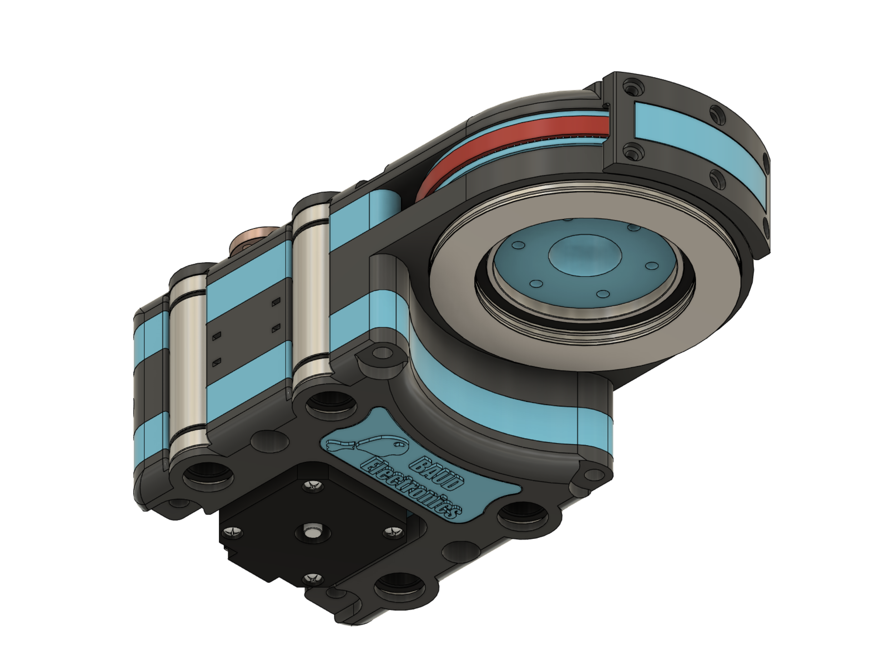
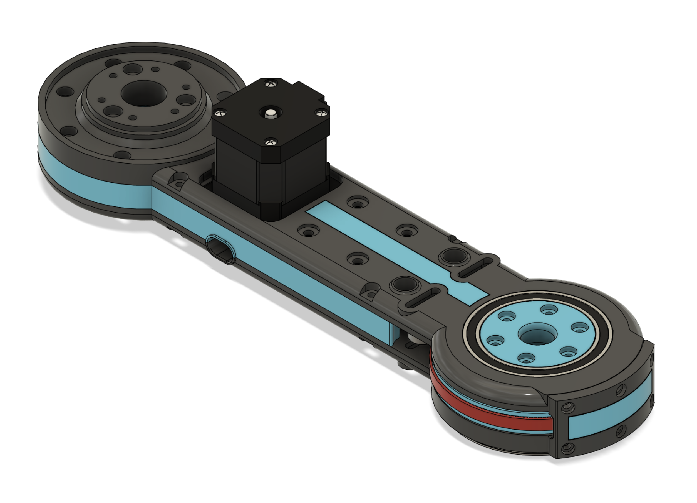
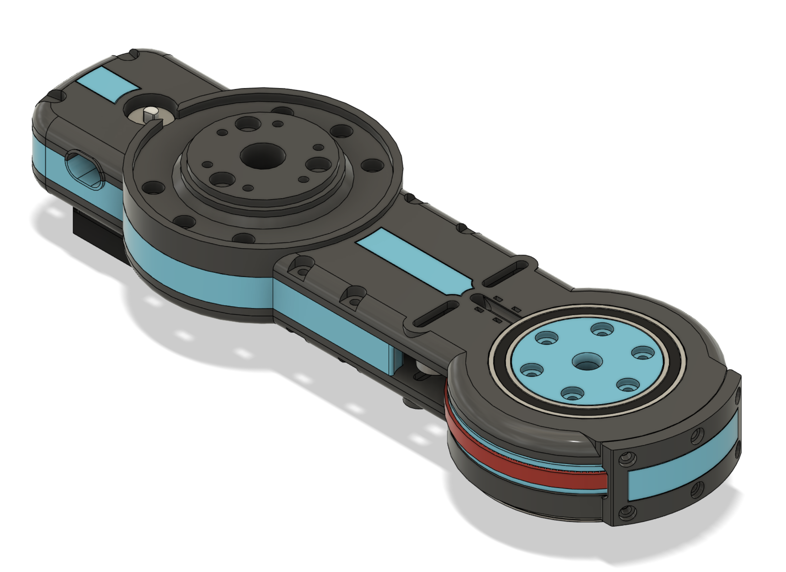

In dit onderdeel van het document staat de uitwerking van het model centraal. Zoals vermeld is het model onderverdeeld in vier segmenten. Per segment zal er besproken worden hoe het segment werkt en welke keuzes er gemaakt zijn tijdens de ontwikkeling van het segment.

## Segment 00 - Het frame

> TODO fix third

|||||
|:---:|:---:|:---:|:---:|
|  | | | |
|       **!afbeelding** - *S00 - Back left view*       |**!afbeelding** - *S00 - Back right view*       |**!afbeelding** - *S00 - Front right view*       |**!afbeelding** - *S00 - Front left view*       |

Het eerste segment van het model is het frame. Het frame verzorgt de structuur van de arm. Het is essentieel dat het frame stevig genoeg is om het gewicht en de inertie van de arm kan weerstaan. Het skelet van het frame is opgebouwd uit verschillende aluminium profielen (extrusion). De profielen zijn onderling verbonden met verschillende extrusion brackets dit levert een stevig geheel.

Het frame is onderverdeeld in twee onderdelen. Het onderdeel verantwoordelijk voor de lineaire beweging en het onderdeel dat verantwoordelijk is voor de elektronica. De onderverdeling van deze onderdelen is gedaan omdat het frame vrij klein is en sommige plekken in het frame zijn niet makkelijk te bereiken als het geheel met elkaar verbonden is.

Het onderdeel dat verantwoordelijk is voor de lineaire beweging is opgebouwd uit een deel van het frame, de lineaire geleiders, de leadscrews, motoren en de aandrijving. 

Er is gekozen voor vier lineaire geleiders ieder van twaalf millimeter dik. Deze keuze is gemaakt omdat het arm onderdeel van de robot redelijk zwaar is en de druk van al dit gewicht moet opgevangen worden over een vrij groot oppervlak (500 millimeter), door deze twaalf millimeter dikke geleider assen te gebruiken kun je met zekerheid zeggen dat de geleider assen niet zullen bezwijken onder het gewicht. De leadscrew is een acht millimeter trapezium-spindel met een *pitch* van acht millimeter. De pitch is gekozen omdat de arm redelijk snel omhoog en omlaag moet kunnen bewegen. Acht millimeter was de hoogst beschikbare leadscrew.

||||
|:---:|:---:|:---:|
||||
|**!afbeelding** - *Elektronica*|**!afbeelding** - *Controller*|**!afbeelding** - *Aandrijving*|

De motoren wegen ieder ongeveer 300 gram. Omdat een van de requirements was dat het zwaartepunt van het frame zo laag mogelijk zou moeten liggen om de stabiliteit van de robot te vergroten is er voor gekozen om de motoren op het laagste punt van het frame te monteren. Hierdoor kan ook de aandrijving aan de onderkant van de robot plaatsvinden (afbeelding *'Aandrijving'*).

Door een systeem op te zetten waardoor de gehele elektronica los van de rest van het frame in elkaar gezet kan worden heb je alle ruimte om te manoeuvreren (Bijlage 1 - bouwfoto 57 & 59). Op de afbeelding *'Elektronica'* is nogmaals een schematische weergaven te zien hoe het elektronica deel is opgebouwd.

Qua stroomvoorziening is er gekozen voor een model dat eigenlijk bedoelt is voor LED-strips, het is een langwerpig model dat precies tussen de extrusion palen past aan de achterkant van het frame. De verschillende stepper drivers direct boven de transformator gemonteerd met geprinte brackets. Verder zijn in dit onderdeel nog de buck-converter voor de stroomvoorziening van de controller en de controller (afbeelding *'Controller'*) zelf gemonteerd.

De controller is handmatig gesoldeerd op een BAUD - Bone lite *PCB*. Dit is een zelf ontworpen *permaboard*. In de bijlage zijn enkele foto's van het resultaat te zien (Bijlage 1 - Bouwfoto 48,49,50,51,53 & 55). op Bouwfoto 56 is de controller gemonteerd in het frame te zien.

## Segment 01 - De schouder

||||
|:---:|:---:|:---:|
||||
|**!afbeelding** - *S01 - Top view*|**!afbeelding** - *S01 - Bot view*|**!afbeelding** - *S01 - Inner view*|

Het eerste segment van de daadwerkelijke arm, ook wel de schouder genoemd. De schouder bevat de onderdelen die verantwoordelijk zijn voor het daadwerkelijk uitvoeren van de lineaire beweging. De twee roze gekleurde moeren in de eerste afbeelding (*'S01 - Top view'*), zijn de moeren die over de leadscrew heen bewegen die vier lineaire lagers geleiden over de lineaire assen heen. Er is gekozen voor de langere variant van de LM12, de LM12LUU. Deze lager is bijna twee keer zo lang dan de LM12UU, hierdoor is er meer contact oppervlak met de assen en kan de druk over een groter oppervlak verspreid worden.

De motor is achter in het segment verwerkt zodat het precies tussen de lineaire lagers past. De motor is gemonteerd op een kleine [motor bracket](https://www.tinytronics.nl/shop/en/tools-and-mounting/installation-and-mounting-material/brackets/bracket-for-stepper-motor-42mm-nema17-straight-small) gemaakt van aluminium, voor de warmte verspreiding. Verder is de locatie van de motor zo ingericht dat er altijd een langer model in zou kunnen mocht de torque voor een latere iteratie te weinig zijn.

De twee tensioners in dit systeem, te zien op de afbeelding *'S01 - Inner view'* zijn niet bereikbaar van buiten het systeem. Dit was niet mogelijk in verband met de lineaire lagers. De spanning op de tandriem moet voorafgaand aan de montage van het bovenste grijze onderdeel gezet worden.

Omdat de pulley van dit segment dezelfde diameter heeft als de buitenste delen van het segment konden de uiterste van het segment, dus de delen die de lagers bevatten, niet verzekerd worden op het uiterste punt. Om deze reden is er gekozen om een 'bumper' te introduceren. De bumper, het laatste grijze onderdeel, zorgt voor de spreiding van beide segmenten en levert ook wat extra structuur aan het systeem.

In de requirements was vermeld dat de verschillende axiale actuatoren gebruik moesten maken van een holle as. Dit segment maakt dus gebruik van een holle as, de bekabeling van de latere segmenten kan door deze holle as heen waardoor er een minimale druk op de kabels wordt uitgeoefend wanneer de robot beweegt. De bekabeling kan bij dit segment niet door het model heen omdat hier de lineaire lagers geplaatst zijn. De bekabeling gaat buiten langs waar het met tyrips gemonteerd wordt aan het model (Bijlage 1 - Bouwfoto 66).

### Axiale beweging

De axiale beweging van dit segment en segment 02 & 03 zijn op dezelfde manier gerealiseerd. Elk onderdeel heeft een reductie van 1:7.2 de pulley op de motor heeft twintig tanden en de pulley op de as heeft er 144. Elk segment is verbonden met het volgende segment door middel van een combinatie van axiale en radiale lagers. De eerste lager (bovenste) zorgt ervoor dat het contact punt gelimiteerd wordt in beweging op de verticale as. Daaronder volgt de grote pulley, deze pulley heeft een inkeping aan de binnenkant waar een axiale lager deels in past. Deze axiale lager rust op het tweede grijze onderdeel waardoor de druk op de pulley opgevangen kan worden. In het grijze onderdeel is vervolgens weer een radiale lager verwerkt. Deze lager is ook deels verantwoordelijk voor het limiteren van de verticale beweging. Aan de onderkant van het grijze onderdeel is nogmaals een axiale lager geplaatst die de druk tussen het huidige segment en het volgende segment opvangt. Een voorbeeld van deze 'lager sandwich' hiervan is te vinden in de bijlage (Bouwfoto 6).

### Specificaties

|Index|Specificatie|Waarde|
|:---:|:---|:---|
|**SP-01**|maximale positie|437 millimeter|
|**SP-02**|minimale positie|0 millimeter|
|**SP-03**|maximale snelheid|18000 stappen per seconden (337.5 RPM)|

**!tabel** - *Specificaties segment 01*

## Segment 02 - De elleboog

||||
|:---:|:---:|:---:|
||||
|**!afbeelding** - *S02 - Top view*|**!afbeelding** - *S02 - Bot view*|**!afbeelding** - *S02 - Inner view*|

Het tweede segment, of elleboog, is het langste onderdeel van de robot. De twee grijze onderdelen kunnen niet op een oppervlak van 210x210 geprint worden, hoewel dit in toekomstige iteraties verbeterd kan worden. De axiale beweging wordt op dezelfde manier gerealiseerd als verteld in onderdeel Segment 01 - Axiale beweging. 

In afbeelding *'S02 - Top view'*, aan de linker kant is het ontvangende deel te zien waar de besproken axiale lager van het voorgaande segment in verwerkt kan worden.

De stepper motor voor dit segment is geplaatst aan de bovenkant van het model. Dit is gedaan omdat het volgende segment (zie Segment 03 - De pols) onder dit segment langs moet bewegen, deze beweging zou niet mogelijk zijn als de motor aan de onderkant van het model geplaatst zou zijn. Deze uitwerking van dit probleem maakt de montage van dit segment vrij lastig gezien de pulley op segment 03 gemonteerd moet worden voordat de tandriem aan de motor gemonteerd kan worden. Dit is een onderdeel wat in toekomstige iteraties verbeterd zou kunnen worden. De motor is gemonteerd op een [stepper bracket](https://www.tinytronics.nl/shop/en/tools-and-mounting/installation-and-mounting-material/brackets/bracket-for-stepper-motor-42mm-nema17-straight), deze bracket is langer dan de bracket gebruikt in bij segment 01. Ook is deze bracket gemaakt staal waardoor het een stuk sterker is.

In de derde afbeelding (*'S02 - Inner view'*) zijn in het blauwde deel gleuven te zien. Deze gleuven worden gebruik voor het geleiden en monteren van de kabels zodat ze niet tegen de tandriem of de motor aankomen. De kabels gaan vervolgens achter de motor langs, door de holle as, naar segment 01.

De tensioners van dit segment zijn te zien op de derde afbeelding (*'S02 - Inner view'*), in tegenstelling tot segment 01 zijn deze tensioners wel bereikbaar vanaf buiten de robot.

### Specificaties

|Index|Specificatie|Waarde|
|:---:|:---|:---|
|**SP-01**|maximale positie|90 graden|
|**SP-02**|minimale positie|-90 graden|
|**SP-03**|maximale snelheid|15000 stappen per seconden (281.25 RPM)|
|**SP-04**|Lengte segment|240 millimeter|

**!tabel** - *Specificaties segment 02*

## Segment 03 - De pols

||||
|:---:|:---:|:---:|
||||
|**!afbeelding** - *S03 - Top view*|**!afbeelding** - *S03 - Bot view*|**!afbeelding** - *S03 - Inner view*|

De pols van de robot, segment 03, heeft een stepper motor geplaatst achter het draaipunt van het vorige segment. Dit heeft twee redenen. De eerste reden is omdat bij snelle bewegingen de inertie van de robot erg hoog is. Door het segment meer in evenwicht te brengen, door een zwaar gewicht achter het draaipunt te plaatsen, kan deze inertie enigszins verlaagd worden. De tweede reden is dat er geen passende tandriem gevonden kon worden voor de afstand voor het draaipunt ([timing_belt_calculator](https://github.com/LukevLuijn/timing_belt_calculator/blob/10324f55a1fdbd799eec97158a6e682fbe9118f9/belt_calc/README.md)). De tandriem die uiteindelijk gebruikt is heeft meerdere verlenging-idlers nodig gehad om tot een passend geheel te komen. 

De pols van de robot gebruikt net zoals de andere segmenten van de arm hetzelfde systeem voor de axiale beweging ('Segment 01 - Axiale beweging'), Net zoals het tweede segment, de elleboog, zijn de tensioners van dit segment bereikbaar van buiten het model.

De pols is zo ingericht dat het complete segment onder het voorgaande segment langs kan. De lengte van dit segment is afgestemd samen het segment 02 zodat hoe dit segment ook georiënteerd is het zal nooit het frame raken.

### Specificaties

|Index|Specificatie|Waarde|
|:---:|:---|:---|
|**SP-01**|maximale positie|360 graden|
|**SP-02**|minimale positie|-360 graden|
|**SP-03**|maximale snelheid|15000 stappen per seconden (281.25 RPM)|
|**SP-04**|Lengte segment|150 millimeter|

**!tabel** - *Specificaties segment 03*
