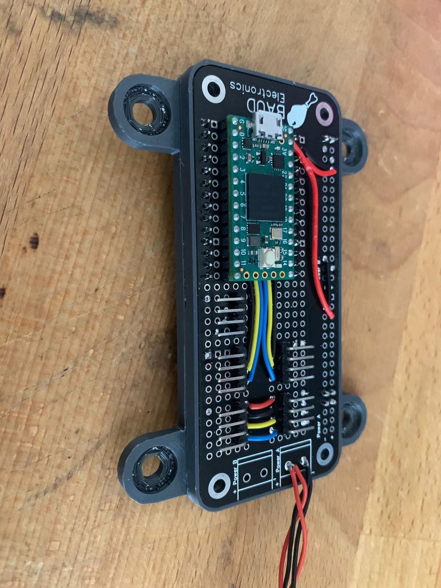

 
 

    <h1 style="font-size:50px;"> 
        ROBOX - Hardware  
    </h1>
    <h2 style="font-size:30px;">
        Model design document
    <h2>
    

 
 

|                    |                                     |                      |                                 |
| :----------------- | :---------------------------------- | -------------------- | ------------------------------- |
| **Auteur**         | Luke van Luijn                      | **Minor**            | Digital Media Productions (DMP) |
| **Student nummer** | 587478                              | **Docentbegeleider** | Mario de Vries                  |
| **Opleiding**      | HBO-ICT                             | **Plaats**           | Nijmegen                        |
| **Profiel**        | Embedded Software Development (ESD) | **Datum**            | 31-05-2022                      |
| **Studiejaar**     | Jaar 3                              | **Versie**           | 1.0                             |

# Inhoudsopgaven

- 1 [Termen](#chapter0)
- 2 [Introductie](#chapter1)
	- 2.1 [Doelgroep](#chapter2)
	- 2.2 [Beperkingen](#chapter3)
- 3 [Requirements](#chapter4)
	- 3.1 [Requirements](#chapter5)
	- 3.2 [Argumentatie](#chapter6)
- 4 [Model overzicht](#chapter7)
- 5 [Detailed description](#chapter8)
	- 5.1 [Segment 00 - Het frame](#chapter9)
	- 5.2 [Segment 01 - De schouder](#chapter10)
		- 5.2.1 [Axiale beweging](#chapter11)
		- 5.2.2 [Specificaties](#chapter12)
	- 5.3 [Segment 02 - De elleboog](#chapter13)
		- 5.3.1 [Specificaties](#chapter14)
	- 5.4 [Segment 03 - De pols](#chapter15)
		- 5.4.1 [Specificaties](#chapter16)
- 6 [Literatuurlijst](#chapter17)
- 7 [Bijlage](#chapter18)
	- 7.1 [bijlage 1 - Fotoboek](#chapter19)

# 1. Termen 

| Index | Term                      | Beschrijving                                                                                                                            |
| :---: | :------------------------ | :-------------------------------------------------------------------------------------------------------------------------------------- |
|  00   | **ROBOX/Robot**           | Met deze term wordt het uiteindelijke apparaat bedoelt, het eindresultaat.                                                              |
|  01   | **model**                 | Het ontworpen deel, een 3D gemoduleerd component.                                                                                       |
|  02   | **MoSCoW**                | Prioriteiten lijst, Must, Should, Could, Wont.                                                                                          |
|  03   | **softening temperature** | De temperatuur dat het plastic zijn structuur verliest, wanneer het zacht wordt.                                                        |
|  04   | **tensioners**            | Lagers die tegen de tandriem aan staan waardoor de tandriem gespannen kan worden.                                                       |
|  05   | **leadscrew**             | Een speciaal soort schroef die ontwikkeld is voor lineaire beweging.                                                                    |
|  06   | **CAN-interface**         | Een communicatie-interface voor microcontrollers.                                                                                       |
|  07   | **PCB**                   | *Printed circuit board*, een printplaatje.                                                                                              |
|  08   | **SMD**                   | *Surface mount component* wordt op een PCB gesoldeerd in plaats van door een PCB heen.                                                  |
|  09   | **4-DOF**                 | 4 *Degrees of freedom*, dit houdt in hoeveel bewegende assen de robot heeft.                                                            |
|  10   | **sag**                   | Hiermee wordt, bedoelt hoeveel de robot afwijkt van de gemodelleerde positie, bijvoorbeeld door overtollig gewicht.                      |
|  11   | **noise**                 | Ofwel ruis, sommige elektrische componenten, bijvoorbeeld motoren, genereren ruis. Sommige signalen zijn hier gevoelig voor.            |
|  12   | **backdriven**            | Met deze term wordt, bedoelt dat een gebruiker de robot met zijn handen kan verplaatsen zonder dat het interne drive-systeem kapot gaat. |
|  13   | **pitch**                 | In het geval van een leadscrew betekend de pitch de hoeveel millimeter een moer beweegt over de leadscrew per rotatie van de leadscrew. |
|  14   | **permaboard**            | Een breadboard waarop gesoldeerd kan worden.                                                                                            |

**Tabel 1** - *Termen*

# 2. Introductie 

Dit document is het Model design document. In dit document zal verteld worden welke eisen (requirements) er aan het model gesteld zijn, Elke requirement krijgt een prioritering volgens de MoSCoW methode, gevolgd door een beschrijving en een markering of deze eis is toegepast in het uiteindelijke model. Elke eis zal tevens voorzien worden van een argumentatie waarom deze eis is opgesteld.

Het uiteindelijke model van de robot wordt ook besproken in dit document. Per onderdeel van de robot, de vier segmenten, zal besproken worden hoe het segment werkt, hoe het is ontstaan en welke keuzes er gemaakt zijn tijdens de ontwikkeling van het onderdeel.

## 2.1. Doelgroep 

Dit document is geschreven voor de projectbegeleiding en andere belangstellende. In dit document wordt aangenomen dat de lezer enige kennis heeft van het project, ROBOX. 

## 2.2. Beperkingen 

Het complete model zal ontworpen en ontwikkeld worden in de applicatie [Autodesk - Fusion 360](https://www.autodesk.eu/products/fusion-360/overview?term=1-YEAR&tab=subscription). Verder zal het project ontwikkeld worden voor een 3D-printer met een oppervlak van 210x210x250 millimeter. Alle 3D geprinte onderdelen zullen geprint worden in [PLA plastic](https://en.wikipedia.org/wiki/Polylactic_acid).

# 3. Requirements 

In dit hoofdstuk zullen de verschillende requirements voor het model beschreven worden. De argumenten zijn afkomstig uit gesprekken met de productowner. In het onderdeel 'Requirements' zullen de verschillende requirements gesorteerd volgens de *MoSCoW*-methode weergegeven worden, per requirement staat tevens weergegeven of deze behaald is in het uiteindelijke product. In het onderdeel 'Argumentatie' worden deze requirements onderbouwd.

## 3.1. Requirements 

|Index|Prioriteit|Requirement|Voldaan|
|:---:|:---:|:---:|:---:|
|**FR-00**|
Must
|Het model moet 3D geprint worden met uitzondering van bouten, moeren, lagers en frame onderdelen.|:heavy_check_mark:|
|**FR-01**|
Must
|Het model moet een lineaire as hebben.|:heavy_check_mark:|
|**FR-02**|
Must
|Het model moet minimaal drie axiale assen hebben.|:heavy_check_mark:|
|**FR-03**|
Must
|Het model moet zo ontworpen worden dat de verschillende segmenten niet met elkaar kunnen botsen.|:heavy_check_mark:|
|**FR-04**|
Must
|Het model moet gebruik maken van holle assen voor de bekabeling.|:heavy_check_mark:|
|**FR-05**|
Must
|Het model moet gebruik maken van stappen motoren.|:heavy_check_mark:|
|**FR-06**|
Must
|Het model mag geen externe onderdelen bevatten voor bijvoorbeeld elektronica.|:heavy_check_mark:|
|**FR-07**|
Must
|Het model moet voor axiale actuatoren gebruik maken van tandriem reductie.|:heavy_check_mark:|
|**FR-08**|
Must
|Het model moet per reductie systeem voorzien zijn van instelbare *tensioners*.|:heavy_check_mark:|
|**FR-09**|
Must
|Het model moet gebruik maken van bouten en moeren die off-the-shelf beschikbaar zijn.|:heavy_check_mark:|
|**FR-10**|
Must
|Het model moet gebruik maken van onderdelen die off-the-shelf beschikbaar zijn.|:heavy_check_mark:|
|**FR-11**|
Must
|Het model moet met maximaal twee verschillende kleuren PLA te printen zijn.|:heavy_multiplication_x:|
|**FR-12**|
Must
|Het model moet passen op een print oppervlak van 210x210x250 (Ender 3).|:heavy_multiplication_x:|
|**FR-13**|
Must
|Het model moet minder dan 400 watt aan stroom gebruiken.|:heavy_check_mark:|
|**FR-14**|
Must
|Het model moet alle motoren buiten het model verwerken zodat deze toegang hebben tot 'frisse lucht'.|:heavy_check_mark:|
|**FR-15**|
Must
|Het model moet alle motoren altijd monteren op een medium dat geen geprint PLA plastic is.|:heavy_check_mark:|
|**FR-16**|
Must
|De hoofdcontroller van het model moet bestaan uit componenten die handmatig te solderen zijn, geen *SMD* componenten.|:heavy_check_mark:|
|**FR-17**|
Must
|De lineaire as van het model moet een snelheid kunnen weerstaan van minimaal 50 millimeter per seconden.|:heavy_check_mark:|
|**FR-18**|
Must
|De axiale assen van het model moeten een snelheid kunnen weerstaan van minimaal 90 graden per seconden.|:heavy_check_mark:|
|**FR-19**|
Should
|Het model moet het mogelijk maken dat de laatste twee assen onder de eerste axiale as door kunnen.|:heavy_check_mark:|
|**FR-20**|
Should
|Het model moet het gebruik van externe bekabeling minimaliseren.|:heavy_check_mark:|
|**FR-21**|
Should
|Het model moet voor axiale actuatoren een reductie implementeren in plaats van directe aansturing.|:heavy_check_mark:|
|**FR-22**|
Should
|Het model moet voor de lineaire as gebruik maken van een *leadscrew* reductie.|:heavy_check_mark:|
|**FR-23**|
Should
|Het model moet alle componenten waar stroom op staat verbergen voor de eindgebruiker.|:heavy_multiplication_x:|
|**FR-24**|
Should
|Het model moet ondersteuning bieden voor encoders op de motoren.|:heavy_multiplication_x:|
|**FR-25**|
Should
|Het model moet per actuator een losse controller hebben.|:heavy_multiplication_x:|
|**FR-26**|
Should
|Het model moet elke controller voorzien van een *CAN-interface* waardoor enkel twee stroom en twee can-bus kabels per segment nodig zijn.|:heavy_multiplication_x:|
|**FR-27**|
Should
|Het model moet een reikwijdte van 500 millimeter hebben.|:heavy_multiplication_x:|
|**FR-28**|
Should
|Het model moet een verticale bewegingsruimte hebben van 500 millimeter.|:heavy_multiplication_x:|
|**FR-29**|
Should
|Het model zal nooit een reductie toepassen van meer dan tien. |:heavy_check_mark:|
|**FR-30**|
Should
|Het model moet zo ontworpen zijn dat het de warmte van motoren (60 graden) voor 30 minuten kan weerstaan.|:heavy_check_mark:|
|**FR-31**|
Could
|Het model moet het gewicht in latere segmenten minimaliseren.|:heavy_check_mark:|
|**FR-32**|
Could
|Het model moet een zo laag mogelijk zwaarte punt realiseren.|:heavy_check_mark:|
|**FR-33**|
Could
|Het model moet waar mogelijk gebruik maken van *GX-style* connectors voor het verbinden van bekabeling.|:heavy_check_mark:|
|**FR-34**|
Could
|Het model moet alle tandriemen binnen het model verwerken.|:heavy_multiplication_x:|

**Tabel 2** - *Requirements*

## 3.2. Argumentatie 

|Requirement|Argument(en)|
|:---:|:---|
|**FR-00**|Door alle onderdelen 3D te printen blijven de kosten laag en is het model toegankelijker voor gebruikers.|
|**FR-01**|Gezien de robot ontwikkeld zal worden als een *SCARA* variant moet er een lineaire as verwerkt worden in het model voor de Z-as.|
|**FR-02**|Het doel van ROBOX is om een vier dimensionale (*4-DOF*) robot te maken. Er moet een lineaire in zitten, dus minimaal drie axiale assen.|
|**FR-03**|Als de verschillende segmenten fysiek niet in contact kunnen komen met elkaar maakt dat de softwareontwikkeling vele malen makkelijker.|
|**FR-04**|Als het model meer assen bevat die meer dan 360 graden kunnen draaien zijn holle assen noodzakelijk omdat de bekabeling anders in de weg zit.|
|**FR-05**|Tijdens de experimenten is er gekozen voor het gebruik van stappen motoren, de beredenering is daar terug te vinden (zie [Experiment 01](https://github.com/LukevLuijn/robox_docs/blob/06efc12c7d1f006f6b29dcf17404ff0cd0511f50/experiment/experiment_01/experiment_01.pdf)).|
|**FR-06**|ROBOX moet een strakke module zijn die astatisch er mooi uit ziet. Een extra externe doos voor de elektronica valt niet binnen dit plaatje.|
|**FR-07**|Reductie systemen gemaakt van tandwielen zijn op drie punten minder geschikt dan tandriem reductie: De tandwielen kunnen door de gebrekkige tolerantie van een 3D-printer voor veel *backlash* zorgen. 3D geprinte tandwielen zijn imperfect, deze imperfectie zorgt voor veel slijtage wanneer twee imperfectie tandwielen langs elkaar heen wrijven. Doordat het twee plastic componenten zijn die tegen elkaar wrijven ontstaat er veel warmte, plastic en warmte gaan niet goed samen en kunnen zorgen voor verzachting van het materiaal. Tandriem reductie heeft deze gebreken niet.|
|**FR-08**|Tandriemen kunnen over een langere periode 'uitrekken' waardoor ze hun tensie verliezen, door van buiten af bereikbare tensioners te gebruiken kan deze slack verholpen worden.|
|**FR-09/10**|ROBOX moet beschikbaar zijn voor iedereen die er interesse in heeft. Als er onderdelen gebruikt worden die iemand zelf of door een bedrijf moet laten maken verhoogd dat de drempel waarde om een ROBOX te maken.|
|**FR-11**|Door het kleurgebruik te maximaliseren op twee scheelt dat in de PLA kosten die een gebruiker hoeft te maken.|
|**FR-12**|Door alle onderdelen printbaar te maken op de een van de meest populaire budget printers (Cass, 2022) verzeker je het project van een grotere compatibiliteit.|
|**FR-13**|Power supplies tot en met 400 watt zijn meestal zonder actieve koeling te koop. Een luide ventilator is niet gewenst.|
|**FR-14**|Stepper motoren kunnen en worden vrij warm tijdens gebruik, Hiervoor zijn ze ontwikkeld. Door alle motoren buiten het plastic frame te plaatsen wordt er voor gezorgd dat ze ook weer snel afkoelen.|
|**FR-15**|Zoals verteld worden stepper motoren vrij warm. tijdens gebruik kunnen ze makkelijk boven de 60 graden komen. PLA plastic heeft een softening temperature van ongeveer 50 graden (Rogers, z.d.) en zal dan ook zijn vorm verliezen. Door een medium van bijvoorbeeld staal of aluminium te gebruiken kan veel warmte opgevangen worden.|
|**FR-16**|Omdat de controller handmatig in elkaar gezet moet worden voor iedere gebruiker van ROBOX is het niet handig als er allerlei minuscule SMD-componenten verwerkt zijn op de *PCB*.|
|**FR-17**|Bij een verticale bewegingsruimte van 500 millimeter zou een snelheid van 50 millimeter per seconden betekenen dat de gehele robot binnen twintig seconden op en neer kan.|
|**FR-18**|Bij een horizontale bewegingshoek van 180 graden zou een snelheid van 90 graden per seconden betekenen dat dat segment binnen vier seconden heen en weer kan.|
|**FR-19**|Dit is een extensie op FR-03, door de segmenten onder elkaar door te laten gaan geeft dit meer mogelijkheden in de software.|
|**FR-20**|Externe bekabeling is niet altijd even mooi en ziet er niet professioneel uit. Door de bekabeling te verwerken in de arm zelf kan dit verholpen worden.|
|**FR-21**|Directe aansturing van de assen zou kunnen als de motoren genoeg torque zouden hebben, echter voor een robot als deze zou dit betekenen dat er grotere motoren gebruikt moeten worden. Grotere motoren betekend meer gewicht en meer gewicht betekend meer *sag*|
|**FR-22**|Gezien er erg veel gewicht aan de verticale as hangt, is het gebruik van een tandriem transmissie niet mogelijk. Zoals vermeld rekken randriemen uit over tijd op de verticale as zou dit voor grote problemen kunnen zorgen. Tandriemen hebben ook een veer effect dat versterkt wordt hoe langer de tandriem is bij verticale beweging kan dit voor een wiebelende robot zorgen. Het gebruik van een leadscrew heeft deze problemen niet.|
|**FR-23**|Een eindgebruiker mag geen mogelijkheid hebben om met zijn of haar vingers aan connecties zoals netstroom te zitten.|
|**FR-24**|Het gebruik van encoders levert veel mogelijkheden in de software. Door middel van een encoder kan de arm bijvoorbeeld handmatig getraind worden en kan de software voorzien worden van fout detectie.|
|**FR-25**|Door elk segment te voorzien van een eigen (slave) controller kan de bekabeling door de robot heen sterk verminderd worden. Verder levert het de mogelijkheid om meer functionaliteiten per segment te implementeren. Er zou bijvoorbeeld een temperatuur sensor geïmplementeerd kunnen worden.|
|**FR-26**|CAN is ontwikkeld voor de auto-industrie en is bestand tegen veel *noise*, ideaal voor de robot. |
|**FR-27**|De robot moet een degelijke omvang hebben, maar niet te groot worden.|
|**FR-28**|De robot moet een degelijke omvang hebben, maar niet te groot worden.|
|**FR-29**|Een hoge reductie kan zorgen voor meer weerstand in de actuatoren. Een (quasi-direct) drive (minder dan tien) levert de mogelijkheid tot het *backdriven* van de robot.|
|**FR-30**|Dit is een minimale eis.|
|**FR-31**|Door het gewicht verder in de robot te minimaliseren blijft de structuur sterk en is het mogelijk om snellere bewegingen te maken.|
|**FR-32**|ROBOX is van zichzelf een vrij instabiel ontwerp. Door zware componenten laag in het systeem te verwerken kan deze stabiliteit gemaximaliseerd worden.|
|**FR-33**|GX-style connectors zien er mooi en professioneel uit.|
|**FR-34**|Tandriemen kunnen dingen als haren of vingers grijpen, de robot heeft hier geen idee van en zal dan ook gewoon lekker door draaien. Door de tandriemen binnen het model te verwerken wordt dit scenario geminimaliseerd|

**Tabel 3** - *Argumentatie*

# 4. Model overzicht 

Het model is onderverdeeld in vier segmenten. Het eerste segment, segment 00, is het frame. In het frame zit de lineaire beweging en de controlerende elektronica verwerkt. De andere drie segmenten; 01,02 en 03 representeren de verschillende segmenten van het 'arm' onderdeel van de robot.

|||
|:---:|:---:|
|  |  |
|       **Afbeelding 1** - *Vooraanzicht*       |**Afbeelding 2** - *Zijaanzicht*       |

|                                                                         |
| :---------------------------------------------------------------------: |
|  |
|       **Diagram 1** - *Dimensies*       |

# 5. Detailed description 

In dit onderdeel van het document staat de uitwerking van het model centraal. Zoals vermeld is het model onderverdeeld in vier segmenten. Per segment zal er besproken worden hoe het segment werkt en welke keuzes er gemaakt zijn tijdens de ontwikkeling van het segment.

## 5.1. Segment 00 - Het frame 

> TODO fix third

|||||
|:---:|:---:|:---:|:---:|
|  | | | |
|       **Afbeelding 3** - *S00 - Back left view*       |**Afbeelding 4** - *S00 - Back right view*       |**Afbeelding 5** - *S00 - Front right view*       |**Afbeelding 6** - *S00 - Front left view*       |

Het eerste segment van het model is het frame. Het frame verzorgt de structuur van de arm. Het is essentieel dat het frame stevig genoeg is om het gewicht en de inertie van de arm kan weerstaan. Het skelet van het frame is opgebouwd uit verschillende aluminium profielen (extrusion). De profielen zijn onderling verbonden met verschillende extrusion brackets dit levert een stevig geheel.

Het frame is onderverdeeld in twee onderdelen. Het onderdeel verantwoordelijk voor de lineaire beweging en het onderdeel dat verantwoordelijk is voor de elektronica. De onderverdeling van deze onderdelen is gedaan omdat het frame vrij klein is en sommige plekken in het frame zijn niet makkelijk te bereiken als het geheel met elkaar verbonden is.

Het onderdeel dat verantwoordelijk is voor de lineaire beweging is opgebouwd uit een deel van het frame, de lineaire geleiders, de leadscrews, motoren en de aandrijving. 

Er is gekozen voor vier lineaire geleiders ieder van twaalf millimeter dik. Deze keuze is gemaakt omdat het arm onderdeel van de robot redelijk zwaar is en de druk van al dit gewicht moet opgevangen worden over een vrij groot oppervlak (500 millimeter), door deze twaalf millimeter dikke geleider assen te gebruiken kun je met zekerheid zeggen dat de geleider assen niet zullen bezwijken onder het gewicht. De leadscrew is een acht millimeter trapezium-spindel met een *pitch* van acht millimeter. De pitch is gekozen omdat de arm redelijk snel omhoog en omlaag moet kunnen bewegen. Acht millimeter was de hoogst beschikbare leadscrew.

||||
|:---:|:---:|:---:|
||||
|**Afbeelding 7** - *Elektronica*|**Afbeelding 8** - *Controller*|**Afbeelding 9** - *Aandrijving*|

De motoren wegen ieder ongeveer 300 gram. Omdat een van de requirements was dat het zwaartepunt van het frame zo laag mogelijk zou moeten liggen om de stabiliteit van de robot te vergroten is er voor gekozen om de motoren op het laagste punt van het frame te monteren. Hierdoor kan ook de aandrijving aan de onderkant van de robot plaatsvinden (afbeelding *'Aandrijving'*).

Door een systeem op te zetten waardoor de gehele elektronica los van de rest van het frame in elkaar gezet kan worden heb je alle ruimte om te manoeuvreren (Bijlage 1 - bouwfoto 57 & 59). Op de afbeelding *'Elektronica'* is nogmaals een schematische weergaven te zien hoe het elektronica deel is opgebouwd.

Qua stroomvoorziening is er gekozen voor een model dat eigenlijk bedoelt is voor LED-strips, het is een langwerpig model dat precies tussen de extrusion palen past aan de achterkant van het frame. De verschillende stepper drivers direct boven de transformator gemonteerd met geprinte brackets. Verder zijn in dit onderdeel nog de buck-converter voor de stroomvoorziening van de controller en de controller (afbeelding *'Controller'*) zelf gemonteerd.

De controller is handmatig gesoldeerd op een BAUD - Bone lite *PCB*. Dit is een zelf ontworpen *permaboard*. In de bijlage zijn enkele foto's van het resultaat te zien (Bijlage 1 - Bouwfoto 48,49,50,51,53 & 55). op Bouwfoto 56 is de controller gemonteerd in het frame te zien.

## 5.2. Segment 01 - De schouder 

||||
|:---:|:---:|:---:|
||||
|**Afbeelding 10** - *S01 - Top view*|**Afbeelding 11** - *S01 - Bot view*|**Afbeelding 12** - *S01 - Inner view*|

Het eerste segment van de daadwerkelijke arm, ook wel de schouder genoemd. De schouder bevat de onderdelen die verantwoordelijk zijn voor het daadwerkelijk uitvoeren van de lineaire beweging. De twee roze gekleurde moeren in de eerste afbeelding (*'S01 - Top view'*), zijn de moeren die over de leadscrew heen bewegen die vier lineaire lagers geleiden over de lineaire assen heen. Er is gekozen voor de langere variant van de LM12, de LM12LUU. Deze lager is bijna twee keer zo lang dan de LM12UU, hierdoor is er meer contact oppervlak met de assen en kan de druk over een groter oppervlak verspreid worden.

De motor is achter in het segment verwerkt zodat het precies tussen de lineaire lagers past. De motor is gemonteerd op een kleine [motor bracket](https://www.tinytronics.nl/shop/en/tools-and-mounting/installation-and-mounting-material/brackets/bracket-for-stepper-motor-42mm-nema17-straight-small) gemaakt van aluminium, voor de warmte verspreiding. Verder is de locatie van de motor zo ingericht dat er altijd een langer model in zou kunnen mocht de torque voor een latere iteratie te weinig zijn.

De twee tensioners in dit systeem, te zien op de afbeelding *'S01 - Inner view'* zijn niet bereikbaar van buiten het systeem. Dit was niet mogelijk in verband met de lineaire lagers. De spanning op de tandriem moet voorafgaand aan de montage van het bovenste grijze onderdeel gezet worden.

Omdat de pulley van dit segment dezelfde diameter heeft als de buitenste delen van het segment konden de uiterste van het segment, dus de delen die de lagers bevatten, niet verzekerd worden op het uiterste punt. Om deze reden is er gekozen om een 'bumper' te introduceren. De bumper, het laatste grijze onderdeel, zorgt voor de spreiding van beide segmenten en levert ook wat extra structuur aan het systeem.

In de requirements was vermeld dat de verschillende axiale actuatoren gebruik moesten maken van een holle as. Dit segment maakt dus gebruik van een holle as, de bekabeling van de latere segmenten kan door deze holle as heen waardoor er een minimale druk op de kabels wordt uitgeoefend wanneer de robot beweegt. De bekabeling kan bij dit segment niet door het model heen omdat hier de lineaire lagers geplaatst zijn. De bekabeling gaat buiten langs waar het met tyrips gemonteerd wordt aan het model (Bijlage 1 - Bouwfoto 66).

### 5.2.1. Axiale beweging 

De axiale beweging van dit segment en segment 02 & 03 zijn op dezelfde manier gerealiseerd. Elk onderdeel heeft een reductie van 1:7.2 de pulley op de motor heeft twintig tanden en de pulley op de as heeft er 144. Elk segment is verbonden met het volgende segment door middel van een combinatie van axiale en radiale lagers. De eerste lager (bovenste) zorgt ervoor dat het contact punt gelimiteerd wordt in beweging op de verticale as. Daaronder volgt de grote pulley, deze pulley heeft een inkeping aan de binnenkant waar een axiale lager deels in past. Deze axiale lager rust op het tweede grijze onderdeel waardoor de druk op de pulley opgevangen kan worden. In het grijze onderdeel is vervolgens weer een radiale lager verwerkt. Deze lager is ook deels verantwoordelijk voor het limiteren van de verticale beweging. Aan de onderkant van het grijze onderdeel is nogmaals een axiale lager geplaatst die de druk tussen het huidige segment en het volgende segment opvangt. Een voorbeeld van deze 'lager sandwich' hiervan is te vinden in de bijlage (Bouwfoto 6).

### 5.2.2. Specificaties 

|Index|Specificatie|Waarde|
|:---:|:---|:---|
|**SP-01**|maximale positie|437 millimeter|
|**SP-02**|minimale positie|0 millimeter|
|**SP-03**|maximale snelheid|18000 stappen per seconden (337.5 RPM)|

**Tabel 4** - *Specificaties segment 01*

## 5.3. Segment 02 - De elleboog 

||||
|:---:|:---:|:---:|
||||
|**Afbeelding 13** - *S02 - Top view*|**Afbeelding 14** - *S02 - Bot view*|**Afbeelding 15** - *S02 - Inner view*|

Het tweede segment, of elleboog, is het langste onderdeel van de robot. De twee grijze onderdelen kunnen niet op een oppervlak van 210x210 geprint worden, hoewel dit in toekomstige iteraties verbeterd kan worden. De axiale beweging wordt op dezelfde manier gerealiseerd als verteld in onderdeel Segment 01 - Axiale beweging. 

In afbeelding *'S02 - Top view'*, aan de linker kant is het ontvangende deel te zien waar de besproken axiale lager van het voorgaande segment in verwerkt kan worden.

De stepper motor voor dit segment is geplaatst aan de bovenkant van het model. Dit is gedaan omdat het volgende segment (zie Segment 03 - De pols) onder dit segment langs moet bewegen, deze beweging zou niet mogelijk zijn als de motor aan de onderkant van het model geplaatst zou zijn. Deze uitwerking van dit probleem maakt de montage van dit segment vrij lastig gezien de pulley op segment 03 gemonteerd moet worden voordat de tandriem aan de motor gemonteerd kan worden. Dit is een onderdeel wat in toekomstige iteraties verbeterd zou kunnen worden. De motor is gemonteerd op een [stepper bracket](https://www.tinytronics.nl/shop/en/tools-and-mounting/installation-and-mounting-material/brackets/bracket-for-stepper-motor-42mm-nema17-straight), deze bracket is langer dan de bracket gebruikt in bij segment 01. Ook is deze bracket gemaakt staal waardoor het een stuk sterker is.

In de derde afbeelding (*'S02 - Inner view'*) zijn in het blauwde deel gleuven te zien. Deze gleuven worden gebruik voor het geleiden en monteren van de kabels zodat ze niet tegen de tandriem of de motor aankomen. De kabels gaan vervolgens achter de motor langs, door de holle as, naar segment 01.

De tensioners van dit segment zijn te zien op de derde afbeelding (*'S02 - Inner view'*), in tegenstelling tot segment 01 zijn deze tensioners wel bereikbaar vanaf buiten de robot.

### 5.3.1. Specificaties 

|Index|Specificatie|Waarde|
|:---:|:---|:---|
|**SP-01**|maximale positie|90 graden|
|**SP-02**|minimale positie|-90 graden|
|**SP-03**|maximale snelheid|15000 stappen per seconden (281.25 RPM)|
|**SP-04**|Lengte segment|240 millimeter|

**Tabel 5** - *Specificaties segment 02*

## 5.4. Segment 03 - De pols 

||||
|:---:|:---:|:---:|
||||
|**Afbeelding 16** - *S03 - Top view*|**Afbeelding 17** - *S03 - Bot view*|**Afbeelding 18** - *S03 - Inner view*|

De pols van de robot, segment 03, heeft een stepper motor geplaatst achter het draaipunt van het vorige segment. Dit heeft twee redenen. De eerste reden is omdat bij snelle bewegingen de inertie van de robot erg hoog is. Door het segment meer in evenwicht te brengen, door een zwaar gewicht achter het draaipunt te plaatsen, kan deze inertie enigszins verlaagd worden. De tweede reden is dat er geen passende tandriem gevonden kon worden voor de afstand voor het draaipunt ([timing_belt_calculator](https://github.com/LukevLuijn/timing_belt_calculator/blob/10324f55a1fdbd799eec97158a6e682fbe9118f9/belt_calc/README.md)). De tandriem die uiteindelijk gebruikt is heeft meerdere verlenging-idlers nodig gehad om tot een passend geheel te komen. 

De pols van de robot gebruikt net zoals de andere segmenten van de arm hetzelfde systeem voor de axiale beweging ('Segment 01 - Axiale beweging'), Net zoals het tweede segment, de elleboog, zijn de tensioners van dit segment bereikbaar van buiten het model.

De pols is zo ingericht dat het complete segment onder het voorgaande segment langs kan. De lengte van dit segment is afgestemd samen het segment 02 zodat hoe dit segment ook georiënteerd is het zal nooit het frame raken.

### 5.4.1. Specificaties 

|Index|Specificatie|Waarde|
|:---:|:---|:---|
|**SP-01**|maximale positie|360 graden|
|**SP-02**|minimale positie|-360 graden|
|**SP-03**|maximale snelheid|15000 stappen per seconden (281.25 RPM)|
|**SP-04**|Lengte segment|150 millimeter|

**Tabel 6** - *Specificaties segment 03*

# 6. Literatuurlijst 

| Index | Source                                                                                                                                                                                                                                                                                     | 
| :---: | :---                                                                                                                                                                                                                                                                                       | 
| 1     | Autodesk. (2022, 13 januari). Fusion 360                                                                                                                                                                                                                                                   |  Autodesk. Fusion 360. Geraadpleegd op 31 mei 2022, van [https://www.autodesk.eu/products/fusion-360/overview?term=1-YEAR&tab=subscription](https://www.autodesk.eu/products/fusion-360/overview?term=1-YEAR&tab=subscription)                                                                                                                                                                                                                                                                                                                                                                                                                                                                                                                                                                                                                                                                                                                                                                                                                                                                                                                                                                                                                                                                                                                                                                                                                                                                                                                                                                                                                                                                                                                                                                                                                                                                                                                                                                                                                                                                                                                                                                                                                                                                                                                                                                                                                                                                                                                                                                                                                                                                                                                                                                                                                                                                                                                                                                                                                                                                                                                                                                                                                                                                                                                                                                                                                                                                                                                                                                                                                                                                                                                                                                                                                                                                                                                                                                                                                                                                                                                                                                                                                                                                                                                                                                                                                                                                                                                                                                                                                                                                                                                                                                                                                                                                                                                                                                                                                                                                                                                                                                                                                                                                                                                                                                                                                                                                                                                                                                                                                                                                                                                                                                                                                                                                                                                                                                                                                                                                                                                                                                                                                                                                                                                                                                                                                                                                                                                                                                                                                                                                                                                                                                                                                                                                                                                                                                                                                                                                                                                                                                                                                                                                                                                                                                                                                                                                                                                                                                                                                                                                                                                                                                                                                                                                                                                                                                                                                                                                                                                                                                                                                                                                                                                                                                                                                                                                                                                                                                                                                                                                                                                                                                                                                                                                                                                                                                                                                                                                                                                                                                                                                                                                                                                                                                                                                                                                                                                                                                                                                                                                                                                                                                                                                                                                                                                                                                                                                                                                                                                                                                                                                                                                                                                                                                                                                                                                                                                                                                                                                                                                                                                                                                                                                                                                                                                                                                                                                                                                                                                                                                                                                                                                                                                                                                                                                                                                                                                                                                                                                                                                                                                                                                                                                                                                                                                                                                                                                                                                                                                                                                                                                                                                                                                                                                                                                                                                                                                                                                                                                                                                                                                                                                                                                                                                                                                                                                                                                                                                                                                                                                                                                                                                                                                                                                                                                                                                                                                                                                                                                                                                                                                                                                                                                                                                                                                                                                                                                                                                                                                                                                                                                                                                                                                                                                                                                                                                                                                                                                                                                                                                                                                                                                                                                                                                                                                                                                                                                                                                                                                                                                                                                                                                                                                                                                                                                                                                                                                                                                                                                                                                                                                                                                                                                                                                                                                                                                                                                                                                                                                                                                                                                                                                                                                                                                                                                                                                                                                                                                                                                                                                                                                                                                                                                                                                                                                                                                                                                                                                                                                                                                                                                                                                                                                                                                                                                                                                                                                                                                                                                                                                                                                                                                                                                                                                                                                                                                                                                                                                                                                                                                                                                                                                                                                                                                                                                                                                                                                                                                                                                                                                                                                                                                                                                                                                                                                                                                                                                                                                                                                                                                                                                                                                                                                                                                                                                                                                                                                                                                                                                                                                                                                                                                                                                                                                                                                                                                                                                                                                                                                                                                                                                                                                                                                                                                                                                                                                                                                                                                                                                                                                                                                                                                                                                                                                                                                                                                                                                                                                                                                                                                                                                                                                                                                                                                                                                                                                                                                                                                                                                                                                                                                                                                                                                                                                                                                                                                                                                                                                                                                                                                                                                                                                                                                                                                                                                                                                                                                                                                                                                                                                                                                                                                                                                                                                                                                                                             | 
| 2     | Wikipedia contributors. (2022, 23 mei). Polylactic acid. Wikipedia. Geraadpleegd op 31 mei 2022, van [https://en.wikipedia.org/wiki/Polylactic_acid](https://en.wikipedia.org/wiki/Polylactic_acid)                                                                                        | 
| 3     | Cass, J. (2022, 25 mei). Best Budget 3D Printers for Creatives in 2022. JUSTTM Creative. Geraadpleegd op 31 mei 2022, van [https://justcreative.com/best-budget-3d-printers/](https://justcreative.com/best-budget-3d-printers/)                                                           | 
| 4     | Rogers, T. (z.d.). Everything You Need To Know About Polylactic Acid (PLA). PLA. Geraadpleegd op 31 mei 2022, van [https://www.creativemechanisms.com/blog/learn-about-polylactic-acid-pla-prototypes](https://www.creativemechanisms.com/blog/learn-about-polylactic-acid-pla-prototypes) | 

# 7. Bijlage  

## 7.1. bijlage 1 - Fotoboek 

|||||
|:---:|:---:|:---:|:---:|
|||||
|**Bouwfoto 1**|**Bouwfoto 2**|**Bouwfoto 3**|**Bouwfoto 4**|
|||||
|**Bouwfoto 5**|**Bouwfoto 6**|**Bouwfoto 7**|**Bouwfoto 8**|
|||||
|**Bouwfoto 9**|**Bouwfoto 10**|**Bouwfoto 11**|**Bouwfoto 12**|
|||||
|**Bouwfoto 13**|**Bouwfoto 14**|**Bouwfoto 15**|**Bouwfoto 16**|
|||||
|**Bouwfoto 17**|**Bouwfoto 18**|**Bouwfoto 19**|**Bouwfoto 20**|
|||||
|**Bouwfoto 21**|**Bouwfoto 22**|**Bouwfoto 23**|**Bouwfoto 24**|
|||||
|**Bouwfoto 25**|**Bouwfoto 26**|**Bouwfoto 27**|**Bouwfoto 28**|
|||||
|**Bouwfoto 29**|**Bouwfoto 30**|**Bouwfoto 31**|**Bouwfoto 32**|
|||||
|**Bouwfoto 33**|**Bouwfoto 34**|**Bouwfoto 35**|**Bouwfoto 36**|
|||||
|**Bouwfoto 37**|**Bouwfoto 38**|**Bouwfoto 39**|**Bouwfoto 40**|
|||||
|**Bouwfoto 41**|**Bouwfoto 42**|**Bouwfoto 43**|**Bouwfoto 44**|
|||||
|**Bouwfoto 45**|**Bouwfoto 46**|**Bouwfoto 47**|**Bouwfoto 48**|
|||||
|**Bouwfoto 49**|**Bouwfoto 50**|**Bouwfoto 51**|**Bouwfoto 52**|
|||||
|**Bouwfoto 53**|**Bouwfoto 54**|**Bouwfoto 55**|**Bouwfoto 56**|
|||||
|**Bouwfoto 57**|**Bouwfoto 58**|**Bouwfoto 59**|**Bouwfoto 60**|
|||||
|**Bouwfoto 61**|**Bouwfoto 62**|**Bouwfoto 63**|**Bouwfoto 64**|
|||
|**Bouwfoto 65**|**Bouwfoto 66**|||

