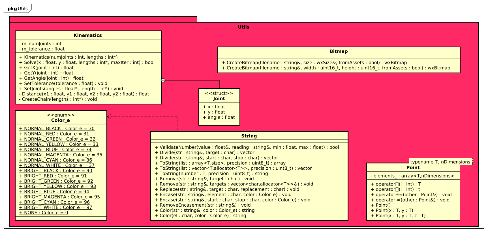

<style>
span.error       {color:#FF0000; background-color:#000000; border-radius:3px}
span.warning     {color:#FFFF00; background-color:#000000; border-radius:3px}
span.info        {color:#00FF00; background-color:#000000; border-radius:3px}
span.debug       {color:#FF00FF; background-color:#000000; border-radius:3px}
</style>

In dit hoofdstuk worden de verschillende packages en de beoogde functionaliteit dieper toegelicht. Voor elke package zal er een beschrijving zijn voor de verschillende klasse en de werking. Bovendien zal elke package voorzien zijn van een beschrijving welke keuzes er gemaakt zijn tijdens de implementatie van dat onderdeel.


## Package - Driver

|                                                                        |
| :--------------------------------------------------------------------: |
|  |
|      **!diagram** - *Class diagram - Driver package*       |

De package [**Driver**](https://github.com/LukevLuijn/robox/tree/main/robox_control_ui/include/driver) heeft als doel het realiseren van een stabiele connectie met de robot over de *seriële bus*. Deze connectie wordt gebruikt voor het versturen en ontvangen van berichten. Door middel van deze connectie is het mogelijk om commando's te versturen en het opvragen van data.

De klasse [**SerialDriver**](https://github.com/LukevLuijn/robox/blob/main/robox_control_ui/include/driver/SerialDriver.h) is verantwoordelijk voor het daadwerkelijk opstarten, uitlezen en afsluiten van de seriële connectie. De SerialDriver klasse maakt gebruik van de lokale library [**AsyncSerial**](https://github.com/LukevLuijn/robox/blob/main/robox_control_ui/lib/serial/AsyncSerial.h). Deze library is geschreven door [*Terraneo Federico*](https://github.com/fedetft). De library heeft als doel het asynchroon schrijven en lezen naar en van de seriële bus. De SerialDriver klasse maakt gebruik van een thread, [**Writer**](https://github.com/LukevLuijn/robox/blob/88d80302f87f6680e2e28818b87288ddea27a006/robox_control_ui/include/driver/SerialDriver.h#L20-L38), die continue een queue naar de seriële bus probeert te schrijven. Deze queue kan van buiten de thread gevuld worden zodat de communicatie, indien actief, altijd aanstaat. Het uitlezen van de seriële bus gebeurt door middel van een callback, zodra er nieuwe data beschikbaar is zal de callback aangeroepen worden en kan deze data ge-*parsed* en verwerkt worden in de applicatie.

Doordat de SerialDriver klasse een losse klasse is kan er een nieuwe driver voor bijvoorbeeld een extra microcontroller geschreven worden zodat de applicatie gebruik kan maken van meerdere externe microcontrollers.

> TODO linkje

De klasse [**RobotDriver**](https://github.com/LukevLuijn/robox/blob/main/robox_control_ui/include/driver/RobotDriver.h) is verantwoordelijk voor het uitwerken van alle mogelijke functionaliteiten die de [firmware]() te bieden heeft. Zoals te zien in de afbeelding zijn alle methodes beschreven in het [message protocol]() ondersteund. De hoofdfunctionaliteit van de RobotDriver klasse is het uitlezen en versturen van commando's over de seriële bus, het is dan ook om die reden dan de RobotDriver erft van de SerialDriver klasse. De eerder genoemde callback voor het verwerken van binnenkomende berichten is ook verwerkt in de RobotDriver.
De RobotDriver heeft een statische instantie van de klasse [**DataManager**](https://github.com/LukevLuijn/robox/blob/main/robox_control_ui/include/driver/DataManager.h). De DataManager is verantwoordelijk voor het parsen van de binnenkomende berichten en het bijhouden van de verschillende datavelden (zie [message protocol]()). Op het moment van schrijven zijn er drie data request commando's GET_STATIC_DATA, GET_DYNAMIC_DATA & GET_RUNTIME_DATA. De verschillende velden verkregen uit deze drie commando's zijn verwerkt in de DataManager klasse.

De klasse [**RobotController**](https://github.com/LukevLuijn/robox/blob/main/robox_control_ui/include/driver/RobotController.h) is het aanspreekpunt voor de applicatie qua communicatie met de robot. Deze klasse is geïmplementeerd volgens het [singleton pattern](https://sourcemaking.com/design_patterns/singleton). Dit houdt in dat er altijd maar een enkele instantie van deze klasse in de applicatie aanwezig is. Door dit design pattern kun je zeker zijn dat de resources die deze klasse bevat altijd maar door een instantie aangesproken wordt. Gezien het niet handig is als de robot meerdere commando's binnenkrijgt als dat niet de bedoeling is is een singleton pattern voor deze klasse een geschikte keus.

De RobotController klasse fungeert ook als een [facade pattern](https://sourcemaking.com/design_patterns/facade), het verbergt de complexe functionaliteit van de SerialDriver en RobotDriver.

De RobotController implementeert de functionaliteiten van de firmware die nodig zijn voor de werking van de applicatie. Het levert de mogelijkheid om verschillende posities van de robot op te slaan en op een later tijdstip samen te voegen en te versturen naar de robot. Ook is het mogelijk om een nieuwe positie direct te versturen als hier vraag naar is.


### Ontwerp keuzes

|#|Probleem|Besluit|Argumenten|
|:---:|:---|:---|:---|
|**OK-01**|Het parsen van de data moet op een centrale locatie plaatsvinden en toegankelijk zijn voor de gehele applicatie.|Het opzetten van een statische data container die zelf de berichten parsed.|Door dat de DataManager een statische instantie is is er altijd, maar een in de applicatie, doordat de DataManager zelf verantwoordelijk is voor het parsen van de berichten weet je zeker dat op dezelfde plek gebeurt.|
|**OK-02**|In toekomstige iteraties van de applicatie is het misschien noodzakelijk om meerdere seriële apparaten aan te sluiten.|Het loskoppelen van de functionaliteit van het uitlezen van de seriële bus.|Door de functionaliteit los te koppelen van de RobotDriver is het mogelijk om meerdere drivers op te zetten die gebruik maken van de seriële bus.|
|**OK-03**|Hoe verzeker je dat de applicatie niet meerdere keren (foutieve) berichten naar de robot stuurt.|Het opzetten van een combinatie van een facade en singleton pattern.|Het facade pattern verstopt de achterliggende functionaliteit van de drivers. Het singleton pattern verzekert dat er altijd maar een locatie gebruik maakt van de RobotController.|

**!tabel** - *Ontwerp keuzes - Driver*

<div style="page-break-after: always;"></div>


## Package - Logger

|                                                                        |
| :--------------------------------------------------------------------: |
|  |
|      **!diagram** - *Class diagram - Logger package*       |

De package [**Logger**](https://github.com/LukevLuijn/robox/tree/main/robox_control_ui/include/logger) is verantwoordelijk voor het loggen van berichten vanuit de applicatie en log berichten ontvangen van de externe microcontroller. De logger is *thread-safe* zodat er altijd vanaf overal in de applicatie gebruik gemaakt kan worden van de logger.

In de huidige applicatie bestaan log berichten niet enkel uit tekst, de struct [**LogMessage**](https://github.com/LukevLuijn/robox/blob/main/robox_control_ui/include/logger/LogMessage.h) is de container die de verschillende onderdelen van een log bericht bewaart.

Een log bericht bestaat uit vier onderdelen. Het eerste onderdeel is de tijd dat het log bericht is aangeroepen. Het tweede onderdeel is de *severity* van het bericht, ERROR, WARNING, INFO of DEBUG. Het derde onderdeel is het daadwerkelijke log bericht inclusief optionele variabelen. Tot slot de regelnummer, bestands- en functienaam van de methode die het log bericht heeft aangeroepen. 

De interface [**ILogger**](https://github.com/LukevLuijn/robox/blob/main/robox_control_ui/include/logger/LoggerInterface.h) is de basis van de [strategy pattern](https://sourcemaking.com/design_patterns/strategy) gebruikt in de Logger package. Door gebruik te maken van een interface kun je verschillende uitwerkingen van dezelfde basis klasse gebruikten.

De [**LogToConsole**](https://github.com/LukevLuijn/robox/blob/main/robox_control_ui/include/logger/LogToConsole.h) klasse is de eerste van twee daadwerkelijke log strategieën. Deze Klasse Schrijft log berichten naar de console. De eerder genoemde onderdelen worden ieder voorzien van een kleur, de tijd en de locatie van de aanroeper worden grijs gemaakt, het bericht zelf wit en de severity van het bericht krijgt een kleur die correspondeert met de severity (<span class=error>[ERROR]</span>, <span class=warning>[WARNING]</span>, <span class=info>[INFO]</span> & <span class=debug>[DEBUG]</span>). De onderstaande afbeelding geeft een voorbeeld van een log bericht die deze aspecten implementeert.

|                                                                        |
| :--------------------------------------------------------------------: |
|  |
|      **!afbeelding** - *Voorbeeld van een console-log*       |

De [**LogToWidget**](https://github.com/LukevLuijn/robox/blob/main/robox_control_ui/include/logger/LogToWidget.h) klasse is de tweede strategie voor het loggen van berichten. Deze strategie schrijft log berichten naar een speciaal daarvoor ontworpen paneel (zie 'Package - Widget'). De eerder genoemde onderdelen van een log bericht worden ook in deze strategie uitgewerkt. Er wordt een paneel aangemaakt in de kleur die correspondeert met de severity van het bericht, zie bovenstaand. Verder wordt er een afbeelding toegevoegd, deze afbeeldingen zijn hieronder weergegeven.

|<span class=error>[ERROR]</span>|<span class=warning>[WARNING]</span>|<span class=info>[INFO]</span>|<span class=debug>[DEBUG]</span>|
|:---:|:---:|:---:|:---:|
| || | |
|**!afbeelding** - *Error*|**!afbeelding** - *Warning*|**!afbeelding** - *Info*|**!afbeelding** - *Debug*|

Het daadwerkelijke log bericht wordt weergegeven op het paneel zelf. De andere aspecten zoals variabelen, tijd en locatie wordt in een *tooltip* verwerkt zodat het overzichtelijk blijft. In de onderstaande afbeelding zijn enkele voorbeelden te zien.

|                                                                        |
| :--------------------------------------------------------------------: |
|  |
|      **!afbeelding** - *Voorbeeld van een widget-log*       |


De klasse [**Logger**](https://github.com/LukevLuijn/robox/blob/main/robox_control_ui/include/logger/Logger.h) is verantwoordelijk voor het daadwerkelijk verwerken van de log berichten. Omdat er vanaf allerlei plekken in de applicatie gelogd kan of moet worden, ook vanaf andere threads, is het noodzakelijk dat de logger een thread-safe, singleton klasse is. Dit houdt in dat de logger van welke thread dan ook aangesproken kan worden en nooit log berichten door elkaar naar de console of naar een widget schrijft. De Logger klasse implementeert drie verschillende design patterns; singleton, facade en strategy.

Eerder is al vermeld dat een log bericht uit meerdere elementen bestaat, het aanroepen van een log bericht, zeker tijdens het testen, is dan een moeizame actie. Om dit proces te versimpelen is er gebruik gemaakt van verschillende [macro's](https://github.com/LukevLuijn/robox/blob/88d80302f87f6680e2e28818b87288ddea27a006/robox_control_ui/include/logger/Logger.h#L18-L35). Deze macro's kunnen aangeroepen worden met een std::string waarde of een std::string waarde en een vector van een onbepaald type. De macro's roepen vervolgens de correcte methode aan het de bijhorende elementen.

|||
|:---|:---|
|Zonder macro|```Logger::Logger::GetInstance().Error("message",vec,__func__,__FILE__,__LINE__);```|
|Met macro|```ERROR("message", vars);```|

De Logger klasse levert ook ondersteuning om verschillende berichten te filteren, een gebruiker kan bijvoorbeeld <span class=debug>DEBUG</span> berichten uitzetten wanneer de applicatie gereed is voor gebruik. Op deze manier hoeven niet alle debug *calls* weggehaald worden en is debuggen in een later stadium des te makkelijker.

### Ontwerp keuzes

|#|Probleem|Besluit|Argumenten|
|:---:|:---|:---|:---|
|**OK-01**|Hoe kun je betrouwbaar loggen in een *multithreaded* applicatie?|Door een thread-safe singleton logger klasse te maken.|Het besluit zegt het al, een thread-safe singleton heeft als doel betrouwbaar gebruik in een multithreaded applicatie.|
|**OK-02**|Hoe kun je makkelijk wisselen tussen loggen naar de console en loggen naar bijvoorbeeld een bestand?|Door een logger op te zetten volgens een strategy pattern.|Door middel van een strategy pattern kan er makkelijk, zelfs run time, gewisseld worden van strategy.|
|**OK-03**|Hoe laat je duidelijk zien hoe belangrijk een bericht is voor de gebruiker?|Het toepassen van afbeeldingen en kleur.|Door opvallende afbeeldingen en kleuren te gebruiken die gebruikers makkelijk herkennen is het snel duidelijk hoe een bericht geïnterpreteerd moet worden.|
|**OK-04**|Hoe kun je de focus op een onderdeel van een bericht leggen zonder informatie weg te laten?|Door de 'onbelangrijke' data in een donkere kleur af te beelden, de belangrijke data kan vervolgens in een contrasterende kleur afgebeeld worden.|Door bijvoorbeeld de tijd en locatie onderdelen van een log bericht in het grijs af te beelden en de severity in kleur en het bericht in het wit is het meteen duidelijk wat de essentie van het bericht is.|
|**OK-05**|Hoe kun je makkelijk gebruik maken van een logger, maar toch de verschillende data velden vullen?|Door gebruik te maken van verschillende macro's.|Door gebruik te maken van macro's kunnen de data velden gevuld worden zonder dat de gebruiker de complete aanroep hoeft uit te typen.|

**!tabel** - *Ontwerp keuzes - Logger*

## Package - Widget

|                                                                        |
| :--------------------------------------------------------------------: |
|  |
|      **!diagram** - *Class diagram - Widget package*       |

De [**Widget**](https://github.com/LukevLuijn/robox/tree/main/robox_control_ui/include/widgets) package is een verzameling van verschillende klasse die fungeren als [wxWidgets](https://www.wxwidgets.org/) *scherm onderdeel*. 

De klasse [**LogMessagePanel**](https://github.com/LukevLuijn/robox/blob/main/robox_control_ui/include/widgets/LogMessagePanel.h) is de basis klasse voor een log message, de klassen [**PanelError**](https://github.com/LukevLuijn/robox/blob/88d80302f87f6680e2e28818b87288ddea27a006/robox_control_ui/include/widgets/ConcreteMessagePanels.h#L18-L37), [**PanelWarning**](https://github.com/LukevLuijn/robox/blob/88d80302f87f6680e2e28818b87288ddea27a006/robox_control_ui/include/widgets/ConcreteMessagePanels.h#L38-L58), [**PanelInfo**](https://github.com/LukevLuijn/robox/blob/88d80302f87f6680e2e28818b87288ddea27a006/robox_control_ui/include/widgets/ConcreteMessagePanels.h#L59-L78), [**PanelDebug**](https://github.com/LukevLuijn/robox/blob/88d80302f87f6680e2e28818b87288ddea27a006/robox_control_ui/include/widgets/ConcreteMessagePanels.h#L79-L98) en [**PanelTransition**](https://github.com/LukevLuijn/robox/blob/88d80302f87f6680e2e28818b87288ddea27a006/robox_control_ui/include/widgets/ConcreteMessagePanels.h#L99-L118) zijn de daadwerkelijke implementaties van de log panels. Deze implementaties zetten de kleur, afbeelding en tooltip corresponderend met het log bericht.
De klasse [**ScrolledLogWindow**](https://github.com/LukevLuijn/robox/blob/main/robox_control_ui/include/widgets/ScrolledLogWindow.h) is de container die de verschillende log panels bevat. Deze klasse houdt een lijst met log berichten bij, wanneer er bijvoorbeeld gefilterd moet worden op een bepaald soort bericht kan deze klasse enkel de berichten laten zien die gevraagd zijn door de gebruiker. De klasse [**LogPanel**](https://github.com/LukevLuijn/robox/blob/main/robox_control_ui/include/widgets/LogPanel.h) is het onderdeel dat uiteindelijk op het scherm terecht komt. De klasse bevat een ScrolledLogWindow die weer de log panels bevat. De LogPanel klasse bevat enkele knoppen, in de onderstaande afbeelding en tabel worden deze onderdelen dieper toegelicht.

<div style="page-break-after: always;"></div>


|                                                                        |
| :--------------------------------------------------------------------: |
|  |
|      **!afbeelding** - *Log panel*       |

|||
|:---|:---|
|'App'-knop|Waneer de gebruiker op deze toggle knop drukt zullen all berichten afkomstig uit de applicatie uit de lijst met log berichten gefilterd worden.|
|'Robot'-knop|Wanneer de gebruiker op deze toggle knop druk zullen alle berichten afkomstig van een externe applicatie, de robot, uit de lijst met log berichten gefilterd worden.|
|'Clear'-knop|Door op deze knop te drukken zullen alle log berichten permanent verwijderd worden.|
||De error toggle knop filtert alle error berichten uit de lijst. Bij het nogmaals klikken van deze knop komen de berichten weer terug.|
||De warning toggle knop filtert alle warning berichten uit de lijst. Bij het nogmaals klikken van deze knop komen de berichten weer terug.|
||De info toggle knop filtert alle info berichten uit de lijst. Bij het nogmaals klikken van deze knop komen de berichten weer terug.|
||De debug toggle knop filtert alle debug berichten uit de lijst. Bij het nogmaals klikken van deze knop komen de berichten weer terug.|

De klasse [**DrawPanel**](https://github.com/LukevLuijn/robox/blob/main/robox_control_ui/include/widgets/DrawPanel.h) is een variant van de door wxWidgets aangeleverde ['BasicDrawPane'](https://wiki.wxwidgets.org/Drawing_on_a_panel_with_a_DC), deze klasse levert de mogelijkheid om op een paneel te tekenen met simpele vormen. Dit paneel wordt automatisch geüpdatet door de wxWidgets pipeline, waardoor het uitermate geschikt is voor bijvoorbeeld een simulatie.

### Ontwerp keuzes

|#|Probleem|Besluit|Argumenten|
|:---:|:---|:---|:---|
|**OK-01**|Hoe zorg je dat er meerdere panelen weergegeven kunnen worden zonder de applicatie te schalen?|Door gebruik te maken van een scrolledWindow.|Een scrolled window is een wxWidgets klasse die wanneer de onderdelen in het window groter zijn dan het daadwerkelijke window er een scroll balk ontstaat.|
|**OK-02**|Hoe kun je een dynamische afbeelding weergeven in een wxWidgets paneel?|Door een klasse op te zetten die gebruik maakt van wxDC, bijvoorbeeld een variant van de BasicDrawPane.|Door een DrawPanel te implementeren is het mogelijk om een dynamische tekening, bijvoorbeeld een simulatie, weer te geven die automatisch geüpdatet wordt door de wxWidgets pipeline.|
|**OK-03**|Hoe kun je duidelijk onderscheid maken tussen interne en externe log berichten?|Door kleur codering te gebruiken bij het weergeven van log berichten|Door de kleur van interne berichten donkerder te zetten, maar wel dezelfde ondertoon is er een duidelijk verschil te zien tussen berichten van de applicatie en berichten van de externe machine.|
|**OK-04**|Hoe zorg je ervoor dat er geen overflow situatie ontstaat door alle log berichten?|Door een limit in te stellen voor het maximum aantal actieve berichten in de buffer.|Door een limit in te stellen, in dit geval 25, worden oudere minder belangrijke berichten niet meer weergegeven en is het dus niet mogelijk om een overflow situatie te creëren.|

**!tabel** - *Ontwerp keuzes - Widget*

<div style="page-break-after: always;"></div>


## Package - Frame

|                                                                        |
| :--------------------------------------------------------------------: |
|  |
|      **!diagram** - *Class diagram - Frame package*       |

De [**Frame**](https://github.com/LukevLuijn/robox/tree/main/robox_control_ui/include/frame) package is verantwoordelijk voor het daadwerkelijk weergeven van de functionaliteiten van de applicatie. De klasse [**MainFrame**](https://github.com/LukevLuijn/robox/blob/main/robox_control_ui/include/frame/MainFrame.h) bevat het hoofdscherm. Hoewel deze klasse alle visuele componenten van het hoofdscherm bevat is deze klasse enkel verantwoordelijk voor de initiële weergaven. De klasse Controller (zie 'Package - Base') is verantwoordelijk voor de daadwerkelijke functionaliteit.

In de onderstaande afbeelding is onder andere het onderdeel dat geïmplementeerd is door de klasse MainFrame. Alles links van de verticale streep valt onder de klasse MainFrame. Links boven zijn de drie onderdelen 'Manual', 'Keyboard', 'BKE-ctrl', 'Settings' en 'About' te zien, deze onderdelen zijn de eerste vijf onderdelen van de strategy pattern die hieronder dieper toegelicht zal worden.

> TODO linkje

Verder bestaat dit onderdeel uit enkele knoppen die dus ongeacht de gekozen control method altijd zichtbaar zijn in de applicatie. De 'Connect'-knop start en stopt de seriële connectie met de robot. De 'Activate'-knop stuurt het 'start'-commando naar de robot (zie [message protocol]()), als de robot gestart is zal de tekst op de knop veranderen naar 'Deactivate' en fungeert het als een 'Stop'-knop. De 'Run'-knop kan gebruikt worden om de robot te bewegen naar de gekozen positie in de control method, hierover later meer. De knop met het stop-icoon stuurt een stop commando naar de robot en de knop met het noodstop icoontje stuurt een noodstop commando naar de robot.

De interface [**IFrame**](https://github.com/LukevLuijn/robox/blob/main/robox_control_ui/include/frame/FrameInterface.h) is de opzet van een strategy pattern voor het weergeven van de control method binnen de applicatie. De enumeratie [**FrameTypes_e**](https://github.com/LukevLuijn/robox/blob/88d80302f87f6680e2e28818b87288ddea27a006/robox_control_ui/include/frame/FrameInterface.h#L40-L47) bepaald welke onderdelen mogelijk weergegeven zullen worden binnen de applicatie. Hoewel in de huidige staat van de applicatie maar een enkele strategy geïmplementeerd is is dit systeem opgezet met het idee dat in latere iteraties meer strategies toegevoegd zullen worden zonder dat dit al te veel aanpassing van de applicatie vergt. Als er een nieuwe control method gebruikt moet worden kan de gebruiker een klasse aanmaken die erft van de IFrame interface en kan de nieuwe control method direct gebruikt worden in de applicatie.

De klasse [**ManualCtrl**](https://github.com/LukevLuijn/robox/blob/main/robox_control_ui/include/frame/ManualCtrl.h) is de enige geïmplementeerde strategy, op het moment van schrijven. Deze klasse is verantwoordelijk voor het weergeven van de huidige control method. Voor de control method 'manual' is het belangrijk dat de gebruiker met de muis en toetsenbord de gehele robot kan aansturen. In de onderstaande afbeelding is een schermafbeelding te zien van de ManualCtrl output.

|                                                                        |
| :--------------------------------------------------------------------: |
|  |
|      **!afbeelding** - *Manual control screenshot*       |

Zoals te zien in de afbeelding bevat deze uitwerking van de control method veel sliders, tekstvelden, knoppen en een simulatie. De onderdelen 'Speed' en 'Accel' zijn verantwoordelijk voor het weergeven en aanpassen van de huidige snelheid van de robot. Deze velden zijn werken volgens een percentage van het maximum aangegeven door de robot. Zodra de slider bewogen worden zal het tekstveld actief geüpdatet worden. Zodra in het tekstveld een nieuwe waarde wordt ingevoerd wordt de slider geüpdatet op het moment dat er op 'enter' gedrukt wordt.

De knoppen 'Gripper 01' en 'Gripper 02' zijn verantwoordelijk voor het aan en uit zetten van de gripper signaal pinnen. Hoewel de gripper een PWM-signaal ondersteund is er voor de uitwerking van manualCtrl gekozen voor een alles-of-niets uitwerking (aan/uit). De knop 'Automatic run' kan gebruikt worden als overschrijving van de eerder besproken 'Run'-knop. Als deze knop actief is hoeft de gebruiker niet telkens op run te drukken als de positie van de robot veranderd wordt. Als er nu een slider of tekstveld aangepast wordt zal er direct een bericht naar de robot gestuurd worden waardoor de robot direct naar de nieuwe positie verplaatst.

De onderdelen met de titels; 'Z', 'A1', 'A2' en 'A3' controleren de positie van de respectievelijke assen. Deze velden werken op dezelfde manier als de 'Speed' en 'Accel' velden. Het enige verschil is dat deze velden werken op basis van de daadwerkelijk door de robot opgegeven minimums en maximums. De minimums en maximums worden ingesteld op basis van de dynamische data verkregen van de robot (Zie Package - Driver). 

|                                                                        |
| :--------------------------------------------------------------------: |
|  |
|      **!afbeelding** - *Simulation screenshot*       |

Het grijze blok onderin het scherm van de simulatie. De simulatie is opgezet door de klasse [**RobotDrawPanel**](https://github.com/LukevLuijn/robox/blob/main/robox_control_ui/include/frame/RobotDrawPanel.h). De RobotDrawlPanel klasse erft van de DrawPanel klasse (zie Package - Widgets) en heeft daarom de mogelijkheid om een dynamische tekening weer te geven, in dit geval het bovenaanzicht van de robot. In de simulatie staan de cirkels voor de verschillende joints van de robot en de lijnen representeren de links tussen de joints. De tekening is een geschaalde variant van de robot. Door op de laatste joint te klikken met de muis (de onderste joint), kan deze geselecteerd worden. Wanneer dit gebeurt, zal er een rode rand om deze joint verschijnen en beweegt de joint met de muis mee. De rest van de joints en links wordt vervolgens geüpdatet volgens inverse kinematica (zie Package - Utils). Wanneer de robot bewogen wordt in de simulatie zullen de eerder genoemde velden 'A1' en 'A2' ook realtime geüpdatet worden, voor het updaten van hoeken op basis van een cartesiaanse positie wordt gebruik gemaakt van forwards kinematica. Zodra de joint in de simulatie losgelaten wordt zal de positie opgeslagen worden net zoals het zou gebeuren voor de velden 'A1' en 'A2'.

De grijze variant van de robot representeert de huidige positie van de daadwerkelijke robot. Deze simulatie wordt geüpdatet aan de hand van de runtime data verstuurd door de robot (zie Package - Driver). Zodra de witte robot verplaatst worden of door middel van de sliders/tekstvelden of door de simulatie en er wordt op run gedrukt zal de grijze robot naar de posities van de witte robot verplaatsen en zichzelf 'verstoppen' onder de witte robot. Hierdoor is het snel duidelijk wat de robot precies uitvoert zonder naar de fysieke robot te kijken. Links onderin het grijze blok zijn twee velden te zien; 'X' en 'Y'. Deze velden representeren de huidige positie van de gripper (de laatste joint) in cartesiaanse coördinaten. Ook deze velden worden realtime geüpdatet. Deze velden zijn onderdeel van de klasse [**Overlay**](https://github.com/LukevLuijn/robox/blob/88d80302f87f6680e2e28818b87288ddea27a006/robox_control_ui/include/frame/RobotDrawPanel.h#L18-L55).

### Ontwerp keuzes

|#|Probleem|Besluit|Argumenten|
|:---:|:---|:---|:---|
|**OK-01**|Hoe kun je zonder te veel aanpassingen in de applicatie wisselen van control method?|Door een strategy pattern te gebruiken|Door de control method te implementeren aan de hand van een strategy pattern kun je altijd meer control methods toevoegen zonder dat dit veel aanpassingen vergt van in de applicatie.|
|**OK-02**|Hoe zorg je ervoor dat ongeacht de huidige control method de essentiële knoppen zoals bijvoorbeeld de noodstop altijd zichtbaar zijn?|Door de control method in een los paneel te plaatsen|Door de control method in een los paneel te plaatsen is het makkelijk om van control method te wisselen en verzeker je dat de onderdelen in het MainFrame altijd zichtbaar zijn voor de gebruiker.|
|**OK-03**|Hoe kun je de robot besturen door middel van cartesiaanse coördinaten en hoeken, tegelijkertijd?|Door het gebruik van tekstvelden, sliders en een simulatie te combineren en er voor te zorgen dat alle onderdelen onderling gelinkt zijn.|Door deze twee aspecten (inverse en forwards kinematica) te combineren is het mogelijk om beide aspecten feilloos samen te laten werken waardoor er een overzichtelijk en duidelijk besturingsmethode ontstaat.|
|**OK-04**|Hoe maak je een interactieve simulatie die het mogelijk maakt de robot te besturen?|Door de gebruiker met de muis de simulatie te laten bewegen|Door dat de gebruiker direct met de muis de simulatie kan besturen en de posities actief te berekenen is het mogelijk om een interactieve simulatie te realiseren.|
|**OK-05**|Hoe combineer je een interactieve simulatie met de daadwerkelijke posities van de robot?|Door een 'schaduw' simulatie te implementeren.|Door middel van een 'schaduw' simulatie is de daadwerkelijke positie van de robot te zien, deze simulatie wordt realtime geüpdatet met de bewegingen van de robot.|
|**OK-06**|Hoe verzeker je dat de robot nooit een start commando krijgt als deze al gestart is?|Door een toggle knop te gebruiken die zijn waarde (true/false) gebruikt om de robot of te starten of te stoppen.|Door een toggle knop te gebruiken kan er intern nooit iets fout gaan. De waarde van de knop is altijd gelijk aan de situatie van de robot.|
|**OK-07**|Hoe verzeker je dat de robot nooit een beweegcommando krijgt als deze niet gestart is?|Door all componenten omtrent beweging gedeactiveerd zijn tot het start commando verstuurd is|Door alle componenten te deactiveren is het voor de gebruiker niet mogelijk om (per ongeluk) een bewegingscommando naar de robot te versturen.|
|**OK-08**|Hoe verzeker je dat er nooit instellingen aangepast worden in de robot zonder dat er een seriële connectie is?|Door alles omtrent de communicatie met de robot te deactiveren totdat er een seriële connectie gerealiseerd is met de robot ('Connect'-knop)|Alle onderdelen van de applicatie zijn inactief tot er een seriële connectie is met de robot. Hierdoor kan een gebruiker nooit een commando versturen naar de robot zonder dat er een connectie is.|
|**OK-09**|Hoe geef je aan dat onderdelen niet geïmplementeerd zijn maar fungeren als placeholders?|Door een log bericht te genereren wanneer de gebruiker toch probeert deze placeholders te activeren.|Alle componenten die momenteel niet geïmplementeerd zijn in de applicatie zijn voorzien van een waarschuwing die aangeeft dat deze componenten nog niet geïmplementeerd zijn|
|**OK-10**|Hoe verzeker je dat met gebruik van meerdere input methodes voor dezelfde data velden elk veld altijd up-to-date is?|Door elke input methode via dezelfde pipeline te updaten.|De verschillende input methodes volgen dezelfde pipeline waarin alle methodes gesynct worden, hierdoor is het mogelijk om meerdere input methodes te gebruiken die altijd dezelfde waardes weergegeven.|

**!tabel** - *Ontwerp keuzes - Frame*

## Package - Base

|                                                                        |
| :--------------------------------------------------------------------: |
|  |
|      **!diagram** - *Class diagram - Base package*       |

De package [**Base**](https://github.com/LukevLuijn/robox/tree/main/robox_control_ui/include/base) is het centrale punt van de applicatie. De klasse [**Controller**](https://github.com/LukevLuijn/robox/blob/main/robox_control_ui/include/base/Controller.h) erft van de klasse MainFrame (zie Package - Frame) en implementeert all functionaliteiten van de verschillende onderdelen verwerkt in de MainFrame klasse. Verder implementeert de Controller klasse ook de interactie tussen de driver (zie Package - Driver) en de control method. De klasse [**FrameBuilder**](https://github.com/LukevLuijn/robox/blob/main/robox_control_ui/include/base/FrameBuilder.h) is verantwoordelijk voor het aanmaken van de correcte control method. De Controller klasse kan aangeven dat het bijvoorbeeld een instantie van de KeyboardCtrl control method wil (momenteel niet geïmplementeerd), de FrameBuilder klasse maakt vervolgens een instantie aan en geeft deze weer in de applicatie. De klasse [**MainApplication**](https://github.com/LukevLuijn/robox/blob/main/robox_control_ui/include/base/MainApplication.h) initialiseert de applicatie, verder heeft het geen functionaliteit.

Het onderdeel GLOBAL, en hiermee de methode [TheApp](https://github.com/LukevLuijn/robox/blob/88d80302f87f6680e2e28818b87288ddea27a006/robox_control_ui/include/base/MainApplication.h#L32) levert de mogelijkheid om een referentie naar de applicatie te krijgen. De LogToWidget klasse (zie Package - Logger) maakt hier bijvoorbeeld gebruik van. Door een 'externe' klasse toegang te bieden tot de applicatie kan er bijvoorbeeld van een andere thread geschreven worden naar het scherm, dat is wat deze methode doet.

<div style="page-break-after: always;"></div>

|#|Probleem|Besluit|Argumenten|
|:---:|:---|:---|:---|
|**OK-01**|Hoe verzeker je dat de seriële connectie is afgesloten voordat de applicatie wordt gestopt?|Door de applicatie een pop-up te laten weergeven voorafgaand aan het afsluiten.|Door een pop-up weer te geven kan de applicatie de tijd nemen voor het afsluiten van de seriële connectie. De applicatie stuurt eerst een noodstop bericht naar de robot, sluit de connectie en als dat allemaal klaar is sluit het de applicatie af.|
|**OK-02**|Hoe laat je de RobotController updates maken binnen de applicatie?|Door gebruik te maken van een callback die een update event aanroept binnen de Controller klasse.|Door gebruik te maken van een callback is het mogelijk om een wxWidgets event binnen de controller te triggeren, dat event zorgt er dan voor dat de applicatie en update uitvoert.|
|**OK-03**|Hoe laat je de Logger log berichten sturen naar frame elementen binnen de applicatie?|Door een methode te maken die een referentie naar de huidige applicatie weergeeft, aan de hand van die referentie kan er een log event getriggerd worden.|In essentie hetzelfde probleem als de voorgaande rij maar dan anders opgelost. Door een referentie te geven aan een externe instantie is het mogelijk de applicatie direct aan te spreken, Door deze interne link kan er dus een event getriggerd worden van buiten de applicatie.|

**!tabel** - *Ontwerp keuzes - Base*

## Package - Utils

|                                                                        |
| :--------------------------------------------------------------------: |
|  |
|      **!diagram** - *Class diagram - Utils package*       |

De [**Utils**](https://github.com/LukevLuijn/robox/tree/main/robox_control_ui/include/utils) package is een verzameling klasse die verschillende functionaliteiten uitvoeren. De klasse [**Point**](https://github.com/LukevLuijn/robox/blob/main/robox_control_ui/include/utils/Point.h) is een template klasse die het mogelijk maakt om een n-dimensionale coördinaat, van elk standaard data type, op te zetten. De klasse is geschreven en getest voor coördinaten tot drie dimensies, maar in theorie is er geen restrictie. De klasse [**Bitmap**](https://github.com/LukevLuijn/robox/blob/main/robox_control_ui/include/utils/Bitmap.h) levert de mogelijkheid om een geschaalde bitmap te krijgen. Binnen wxWidgets is het niet mogelijk om een bitmap te schalen. De bitmap moet eerst omgezet worden naar een image, deze kan vervolgens geschaald worden en tot slot moet deze image weer terug geconverteerd worden naar een bitmap. De applicatie maakt veel gebruik van bitmaps waardoor deze klasse uitermate handig is om de leesbaarheid op pijl te houden. De [**String**](https://github.com/LukevLuijn/robox/blob/main/robox_control_ui/include/utils/String.h) klasse is een verzameling van verschillende string gerelateerde functionaliteiten. De methode [ToString](https://github.com/LukevLuijn/robox/blob/88d80302f87f6680e2e28818b87288ddea27a006/robox_control_ui/include/utils/String.h#L121-L165) kan een standaard datatype converteren naar een string met een bepaalde precisie, erg handig tijdens het opstellen van een bericht voor de robot. de methodes [Divide](https://github.com/LukevLuijn/robox/blob/88d80302f87f6680e2e28818b87288ddea27a006/robox_control_ui/include/utils/String.h#L82-L110), [Encase](https://github.com/LukevLuijn/robox/blob/88d80302f87f6680e2e28818b87288ddea27a006/robox_control_ui/include/utils/String.h#L207-L222) en [RemoveEncasement](https://github.com/LukevLuijn/robox/blob/88d80302f87f6680e2e28818b87288ddea27a006/robox_control_ui/include/utils/String.h#L228-L231) worden allemaal gebruikt tijdens het parsen en het opstellen van berichten.

Tot slot de klasse [**Kinematics**](https://github.com/LukevLuijn/robox/blob/main/robox_control_ui/include/utils/Kinematics.h), De klasse is een voor C++ omgeschreven variant van de Arduino library [Fabrik2D](https://github.com/henriksod/Fabrik2DArduino), geschreven door Henrik Söderlund. Deze Klasse wordt gebruikt voor de inverse en forwards kinematica gebruikt tijdens de simulatie (zie 'Package - Frame').


!url Sourcemaking. (z.d.). Design Patterns and Refactoring. Singleton. Geraadpleegd op 30 mei 2022, van [https://sourcemaking.com/design_patterns/singleton](https://sourcemaking.com/design_patterns/singleton)
!url Sourcemaking. (z.d.-b). Design Patterns and Refactoring. Facade. Geraadpleegd op 30 mei 2022, van [https://sourcemaking.com/design_patterns/facade](https://sourcemaking.com/design_patterns/facade)
!url Sourcemaking. (z.d.-c). Design Patterns and Refactoring. Strategy. Geraadpleegd op 30 mei 2022, van [https://sourcemaking.com/design_patterns/strategy](https://sourcemaking.com/design_patterns/strategy)
!url Söderlund, H. (z.d.). GitHub - henriksod/Fabrik2DArduino: A FABRIK 2D inverse kinematics solver for Arduino. Fabrik2D. Geraadpleegd op 30 mei 2022, van [https://github.com/henriksod/Fabrik2DArduino](https://github.com/henriksod/Fabrik2DArduino)

