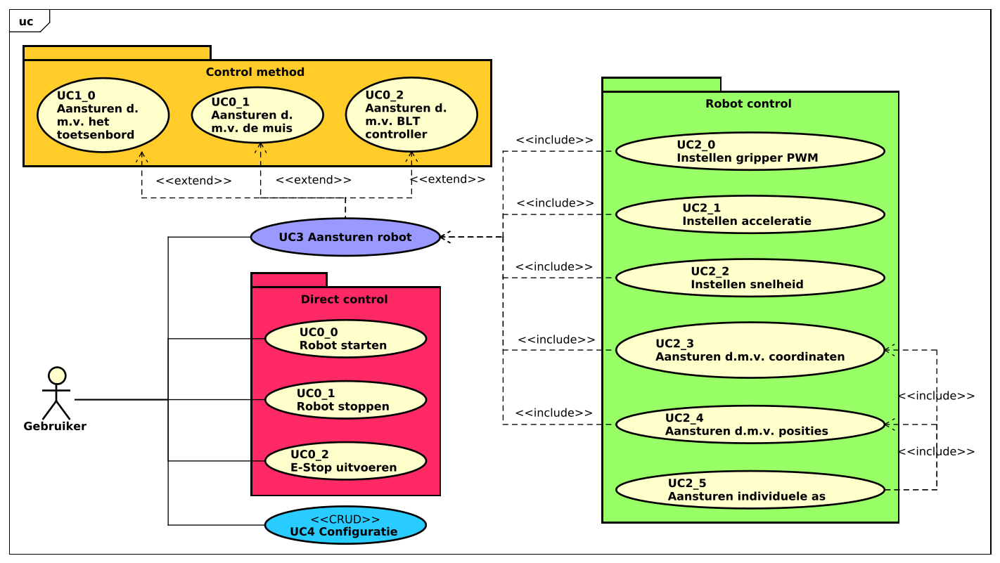

In het onderstaande diagram is te zien dat een gebruiker vijf hoofd functionaliteiten tot zijn of haar beschikking heeft. Het aansturen van de robot, dit kan op verschillende manieren, zo kan een gebruiker de robot aansturen door middel van het toetsenbord of met de muis. Het daadwerkelijk aansturen van de robot bevat meerdere sub onderdelen, deze verschillende onderdelen zijn terug te vinden in de package 'Robot Control'.
De gebruiker kan de robot ook nog direct aanspreken met de onderdelen vermeld in de package 'Direct control'. Tot slot het aanpassen van de configuratie, de gebruiker zal de mogelijkheid krijgen om de verschillende configuratie velden van de robot aan het passen via de user interface.

|                                                                         |
| :---------------------------------------------------------------------: |
|  |
|       **!diagram** - *Use case diagram - Control UI*       |

