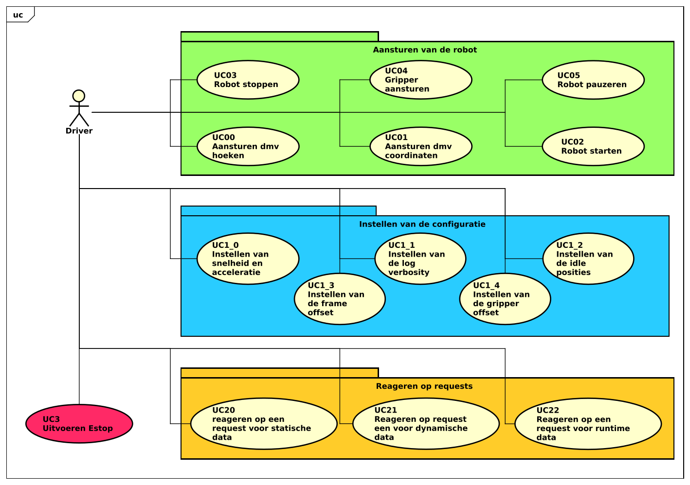

In het onderstaande diagram zijn de verschillende use cases te vinden omtrent de firmware. In dit diagram is (schematische) samenhang weergegeven van de verschillende onderdelen van het systeem en hoe de gebruiker (de driver) gebruik kan maken van het systeem.

||
|:---:|
||
|**!diagram** - *Use case diagram Firmware*|

In het diagram is te zien dat de verschillende use cases opgedeeld zijn in vier verschillende segmenten.

Het eerste segment 'Aansturen van de robot' is verantwoordelijk voor alle use cases die betrekking hebben tot het bewegen van de robot. Denk hierbij aan het bewegen naar een bepaalde positie of het pauzeren van de robot.

Het tweede segment, 'Instellen van de configuratie', regelt het instellen van de robot. Bijvoorbeeld het instellen van de snelheid en acceleratie.

Het derde segment 'Reageren op requests' is verantwoordelijk voor het opsturen van de data naar de driver. Het opsturen van de huidige positie is een voorbeeld hiervan.

Tot slot het vierde onderdeel; 'Uitvoeren Estop'. Het uitvoeren van een noodstop zal een andere uitvoering krijgen dan de onderdelen vewerkt in 'Aansturen van de robot', en heeft hierdoor ook een appart segment.

## UC0 - Aansturen van de robot

In dit onderdeel zullen de verschillende use cases uit het onderdeel 'Aansturen van de robot' dieper toegelicht worden.

### UC0_0 - Aansturen door middel van hoeken

|||
|:---|:---|
|Primary actor:|Driver|
|Brief description:|Het systeem reageert op een inkomend bericht omtrent het aansturen door middel van hoeken en stuurt de robot vervolgens adequaat aan. |
|Preconditions:|De robot heeft een 'start'-bericht ontvangen en verwerkt (bevind zich in een bekende positie).|
|Postconditions:|De robot zal zich bevinden in de ontvangen positie.|

||Actor action||System resposibility|
|:---:|:---|:---:|:---|
|1.|Geeft een nieuwe positie op.|2.|Verwerkt het ontvangen bericht.|
|||3.|Kijkt of de posities binnen de uiterste waardes vallen.|
|||4.|Kijkt of de robot klaar is om een beweging te maken.|
|||5.|Beweegt de verschillende assen naar de gewenste hoeken.|
||**Alternative flow 01:**|||
||||*De waardes vallen niet binnen de uiterste waardes.*|
|||4a.|Het systeem zal een log bericht versturen waarin vermeld wordt dat de positie niet uitgevoerd kan worden.|
||**Alternative flow 02:**|||
||||*De robot is niet klaar om een nieuwe beweging uit te voeren.*|
|||5a.|Het bericht wordt toegevoegd een een queue en op een later moment uitgevoerd worden.|
|||||

**!usecase** - *Fully dressed usecase description - UC00*

### UC0_1 - Aansturen door middel van coordinaten

|||
|:---|:---|
|Primary actor:|Driver|
|Brief description:|Het systeem reageert op een inkomend bericht omtrent het aansturen door middel van hoeken en stuurt de robot vervolgens adequaat aan. |
|Preconditions:|De robot heeft een 'start'-bericht ontvangen en verwerkt (bevind zich in een bekende positie).|
|Postconditions:|De robot zal zich bevinden in de ontvangen positie.|

||Actor action||System resposibility|
|:---:|:---|:---:|:---|
|1.|Geeft een nieuwe positie op.|2.|Verwerkt het ontvangen bericht.|
|||3.|Berekent de hoeken op basis van de ontvangen coordinaten.|
|||4.|Kijkt of de posities binnen de uiterste waardes vallen.|
|||5.|Kijkt of de robot klaar is om een beweging te maken.|
|||6.|Beweegt de verschillende assen naar de berekende hoeken.|
||**Alternative flow 01:**|||
||||*De waardes vallen niet binnen de uiterste waardes.*|
|||5a.|Het systeem zal een log bericht versturen waarin vermeld wordt dat de positie niet uitgevoerd kan worden.|
||**Alternative flow 02:**|||
||||*De robot is niet klaar om een nieuwe beweging uit te voeren.*|
|||6a.|Het bericht wordt toegevoegd een een queue en op een later moment uitgevoerd worden.|
|||||

**!usecase** - *Fully dressed usecase description - UC01*

### UC0_2 - Robot starten

|||
|:---|:---|
|Primary actor:|Driver|
|Brief description:|Het systeem reageert op een inkomend bericht omtrent het starten van de robot, vervolgens zal het systeem de stappen ondernemen om de robot te starten.|
|Preconditions:|Er is een serieele verbinding met de driver en de robot bevind zich in een onbekende positie, of net opgestart, of gestopt.|
|Postconditions:|De robot bevind zich in een bekende positie.|

||Actor action||System resposibility|
|:---:|:---|:---:|:---|
|1.|Stuurt een start commando.|2.|Verwerkt het ontvangen bericht.|
|||3.|Voert de homing sequence uit voor de verschillende actuatoren in de robot.|
|||4.|Update alle data, omtrent positioneering van de robot, naar de nieuwe waardes.|
|||5.|Suurt een bericht naar de driver omtrent het voltooien van de homing sequence.|

**!usecase** - *Fully dressed usecase description - UC02*

### UC0_3 - Robot stoppen

|||
|:---|:---|
|Primary actor:|Driver|
|Brief description:|Het systeem reageert op een inkomend bericht omtrent het stoppen van de robot, vervolgens zal het systeem de stappen ondernemen om de robot te stoppen.|
|Preconditions:|De robot heeft een 'start'-bericht ontvangen en verwerkt (bevind zich in een bekende positie).|
|Postconditions:|De robot bevind zich in de 'idle'-positie en de motoren zijn uitgeschakeld.|

||Actor action||System resposibility|
|:---:|:---|:---:|:---|
|1.|Stuurt een stop commando.|2.|Verwerkt het ontvangen bericht.|
|||3.|Kijkt of de robot klaar is om een beweging te maken.|
|||4.|Beweeft de assen naar de verschillende 'idle'-posities.|
|||5.|Deactiveerd de verschillende motoren in de robot.|
|||6.|Verwijderd alle ge-queuede bewegings commando's uit het systeem.|
||**Alternative flow 01:**|||
||||*De robot is niet klaar om een nieuwe beweging uit te voeren.*|
|||4a.|Het bericht wordt toegevoegd een een queue en op een later moment uitgevoerd worden.|
||||Zodra het bericht uitgevoerd wordt zal er gestart worden bij stap 4.|

**!usecase** - *Fully dressed usecase description - UC03*

### UC0_4 - Aansturen van de gripper

|||
|:---|:---|
|Primary actor:|Driver|
|Brief description:|Het systeem reageert op een inkomend beircht omtrent het aansturen van de gripper.|
|Preconditions:|De robot heeft een 'start'-bericht ontvangen en verwerkt (bevind zich in een bekende positie).|
|Postconditions:|De gripper is aangestuurd met de gevraagde PWM waarde.|

||Actor action||System resposibility|
|:---:|:---|:---:|:---|
|1.|Stuurt een nieuwe gripper waarde.|2.|Verwerkt het ontvangen bericht.|
|||3.|Kijkt of de waarde binnen de uiterste vallen.|
|||4.|Kijkt of de robot klaar is om een beweging te maken.|
|||5.|Activeerdt de gripper met de opgegeven PWM waarde.|
||**Alternative flow 01:**|||
||||*De waarde valt niet binnen de uiterste.*|
|||4a.|Er zal een bericht naar de driver gestuurd worden waarin vermeld wordt dat de opgegeven waardes niet uitgevoerd kunnen worden.|
||**Alternative flow 02:**|||
||||*De robot is niet klaar om een beweging te maken.*|
|||5a.|Het bericht wordt toegevoegd aan een queue en zal op een later moment uitgevoerd worden.|

**!usecase** - *Fully dressed usecase description - UC04*

### UC0_5 - Robot pauzeren

|||
|:---|:---|
|Primary actor:|Driver|
|Brief description:|Het systeem reageert op een inkoment bericht omtrent het pauzeren van de robot. Het systeem zal de robot pauzeren voor de aangegeven tijd.|
|Preconditions:|De robot heeft een 'start'-bericht ontvangen en verwerkt (bevind zich in een bekende positie).|
|Postconditions:|De robot heeft gepauzeerd voor de aangegeven tijd.|

||Actor action||System resposibility|
|:---:|:---|:---:|:---|
|1.|Stuurt een 'pauzeer'-bericht|2.|Verwerkt het ontvangen bericht|
|||3.|Kijkt of de robot klaar is om een beweging te maken.|
|||4.|Pauzeert de robot voor het aangeven aantal milliseconden.|
||**Alternative flow 01:**|||
||||*De robot is niet klaar om een nieuwe beweging te maken.*|
|||4a.|Het bericht wordt toegevoegd aan een queue en op een later moment zal het bericht uitgevoerd worden.|

**!usecase** - *Fully dressed usecase description - UC05*

## UC1 - Instellen van de configuratie

De usecases die vallen onder dit onderdeel zijn allemaal soortgelijk in uitvoering. Door deze gelijksoortigheid is er gekozen om een enkele 'fully dressed' uitwerking te maken.

|||
|:---|:---|
|Primary actor:|Driver|
|Brief description:|Het systeem verwerkt een configuratie bericht.|
|Preconditions:|Er is een serieele verbinding met de driver.|
|Postconditions:|De configuratie is verwerkt in het systeem.|

||Actor action||System resposibility|
|:---:|:---|:---:|:---|
|1.|Stuurt een configuratie bericht.|2.|Verwerkt het bericht.|
|||3.|De bijhorende waarde in het systeem wordt aangepast naar de waarde vermeld in het ontvangen bericht.|

**!usecase** - *Fully dressed usecase description - Instellen van configuratie*

## UC2 - Reageren op requests

De usecases die vallen onder dit onderdeel zijn allemaal soortgelijk in uitvoering. Door deze gelijksoortigheid is er gekozen om een enkele 'fully dressed' uitwerking te maken.

|||
|:---|:---|
|Primary actor:|Driver|
|Brief description:|Het systeem reageert op een inkomend data request bericht. Het systeem zal een reponse opzetten en terug sturen naar de driver.|
|Preconditions:|Er is een serieele verbinding met de driver.|
|Postconditions:|Een response met de corresponderende data is verstuurd naar de driver.|

||Actor action||System resposibility|
|:---:|:---|:---:|:---|
|1.|Stuurt een data request bericht|2.|Verwerkt het bericht.|
|||3.|Stelt een bericht samen met de bijhorende waardes.|
|||4.|Verstuurd het bericht naar de driver.|

**!usecase** - *Fully dressed usecase description - Reageren op requests*

## UC3 - Uitvoeren Noodstop

|||
|:---|:---|
|Primary actor:|Driver|
|Brief description:|Het systeem ontvant een noodstop bericht en zal vervolgens direct alle beweging van de robot staken.|
|Preconditions:|Er is een serieele verbinding met de driver.|
|Postconditions:|De robot is direct gestopt en alle motoren zijn uitgeschakeld.|

||Actor action||System resposibility|
|:---:|:---|:---:|:---|
|1.|Stuurt een 'noodstop'-bericht.|2.|Identificeert het bericht als 'noodstop'.|
|||3.|Schakeld direct alle motoren uit.|
|||4.|Verwijderd alle opgeslagen bewegingsberichten uit de queue.|

**!usecase** - *Fully dressed usecase description - UC*

