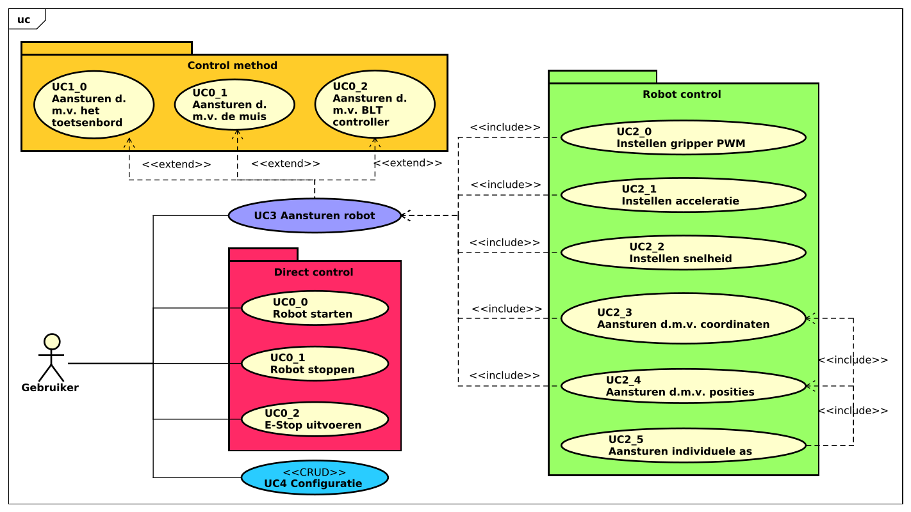

<style>
span.rob   {color:#000000; border-radius:3px}
span.o     {color:#787878; border-radius:3px}
span.x     {color:#79C6E2; border-radius:3px}
</style>

<br>
<br>

<div align="center">
    <h1 style="font-size:50px;"> 
        <span class=rob>ROB</span><span class=o>O</span><span class=x>X</span> - Software  
    </h1>
    <h2 style="font-size:30px;">
        Software requirements specification
    <h2>
    

</div>


<br>
<br>


|                    |                                     |                      |                                 |
| :----------------- | :---------------------------------- | -------------------- | ------------------------------- |
| **Auteur**         | Luke van Luijn                      | **Minor**            | Digital Media Productions (DMP) |
| **Student nummer** | 587478                              | **Docentbegeleider** | Mario de Vries                  |
| **Opleiding**      | HBO-ICT                             | **Plaats**           | Nijmegen                        |
| **Profiel**        | Embedded Software Development (ESD) | **Datum**            | 28-05-2022                      |
| **Studiejaar**     | Jaar 3                              | **Versie**           | 1.0                             |

<div style="page-break-after: always;"></div>

<div style="page-break-after: always;"></div>

# Inhoudsopgaven

- 1 [Termen](#chapter0)
- 2 [Introductie](#chapter1)
	- 2.1 [Gebruikers, klasse en karakteristieken](#chapter2)
	- 2.2 [Ontwikkelomgeving](#chapter3)
	- 2.3 [Ontwerp en implementatie beperkingen](#chapter4)
- 3 [Product functionaliteiten](#chapter5)
- 4 [Usecase beschrijvingen](#chapter6)
- 5 [Fully dressed usecases](#chapter7)
	- 5.1 [Robot starten](#chapter8)
	- 5.2 [Robot stoppen](#chapter9)
	- 5.3 [Aansturen met cartesiaanse coördinaten](#chapter10)
	- 5.4 [Aansturen met hoeken via sliders](#chapter11)
	- 5.5 [Aansturen met hoeken via tekst velden](#chapter12)
	- 5.6 [Instellen snelheid met een slider](#chapter13)
	- 5.7 [Instellen snelheid met een tekst veld](#chapter14)
- 6 [Requirements](#chapter15)
	- 6.1 [Functionele requirements](#chapter16)
	- 6.2 [Niet functionele requirements](#chapter17)
		- 6.2.1 [QoS - Usability](#chapter18)
		- 6.2.2 [QoS - Reliability](#chapter19)
		- 6.2.3 [QoS - Performance](#chapter20)
	- 6.3 [QoS - Supportability](#chapter21)
- 7 [Literatuurlijst](#chapter22)

<div style="page-break-after: always;"></div>

# 1. Termen <a name="chapter0"></a>


|Index|Term|Beschrijving|
|:---:|:---|:---|
|00|**Applicatie/systeem**|Met deze term wordt de software bedoelt, Het onderdeel waar dit document over gaat.|
|01|**Computer/PC**|Met een computer wordt een 'normale' computer bedoelt, desktop of laptop.|
|02|**Robot/Firmware**|Met deze term wordt het daadwerkelijke apparaat bedoelt, inclusief de firmware die op het apparaat draait.|
|03|**GUI/UI**|(Grafische) user interface. Dit is het onderdeel dat op het scherm verschijnt wanneer de applicatie gestart wordt.|

<div style="page-break-after: always;"></div>

# 2. Introductie <a name="chapter1"></a>


Dit is het software requirements specification document voor het UI onderdeel van het ROBOX project. De *applicatie* zal draaien op de computer van de gebruiker. De applicatie is fungeert als een vertaalslag tussen wat de gebruiker van de *robot* wil en wat de robot begrijpt, kortom een *user interface*. Deze applicatie zal de verschillende functionaliteiten van de *firmware* applicatie implementeren en op een overzichtelijke manier weergegeven aan de gebruiker. De applicatie zal verder nog mogelijkheden bieden om te verschillende manieren van besturing te gebruiken, denk bijvoorbeeld aan een bluetooth controller of met de pijltjes toetsen op een toetsenbord. Ook de configuratie van de firmware zal aanpasbaar worden gemaakt in deze applicatie.

## 2.1. Gebruikers, klasse en karakteristieken <a name="chapter2"></a>

Deze applicatie zal ontwikkeld worden voor een enkele actor, de gebruiker. Een gebruiker is iemand die deze software heeft geïnstalleerd en beschikt over een (soortgelijke) robot.

## 2.2. Ontwikkelomgeving <a name="chapter3"></a>

De applicatie zal ontwikkeld worden voor Windows 10, MacOS 12 (Monterey) & Ubuntu Focal Fossa (20.04). De applicatie zal enkel getest worden voor Ubuntu Focal Fossa 20.04. Verdere systeem eisen zijn niet van toepassing.

## 2.3. Ontwerp en implementatie beperkingen <a name="chapter4"></a>

De gehele applicatie zal geschreven worden in C++. Er zal geen gebruik gemaakt worden van externe libraries met uitzondering van [Boost](https://www.boost.org/), voor de communicatie met de robot, en [wxWidgets](https://www.wxwidgets.org/), voor het weergeven van de *GUI*.


<div style="page-break-after: always;"></div>

# 3. Product functionaliteiten <a name="chapter5"></a>


In het onderstaande diagram is te zien dat een gebruiker vijf hoofd functionaliteiten tot zijn of haar beschikking heeft. Het aansturen van de robot, dit kan op verschillende manieren, zo kan een gebruiker de robot aansturen door middel van het toetsenbord of met de muis. Het daadwerkelijk aansturen van de robot bevat meerdere sub onderdelen, deze verschillende onderdelen zijn terug te vinden in de package 'Robot Control'.
De gebruiker kan de robot ook nog direct aanspreken met de onderdelen vermeld in de package 'Direct control'. Tot slot het aanpassen van de configuratie, de gebruiker zal de mogelijkheid krijgen om de verschillende configuratie velden van de robot aan het passen via de user interface.

|                                                                         |
| :---------------------------------------------------------------------: |
|  |
|       **Diagram 1** - *Use case diagram - Control UI*       |


<div style="page-break-after: always;"></div>

# 4. Usecase beschrijvingen <a name="chapter6"></a>


|Index|Use case|Beschrijving|
|:---:|:---|:---|
|**UC0_0**|Robot starten|Een gebruiker kan via de GUI de robot starten. De robot zal vervolgens de start sequence uitvoeren en gereed zijn voor gebruik.|
|**UC0_1**|Robot stoppen|Een gebruiker van via de GUI de robot stoppen. De robot zal vervolgens de stop sequence uitvoeren en gedeactiveerd zijn.|
|**UC0_2**|E-Stop uitvoeren|Een gebruiker kan via de GUI een noodstop uitvoeren. De robot zal vervolgens direct alle beweging staken en de motoren deactiveren.|
|**UC1_0**|Aansturen d.m.v. het toetsenbord|De gebruiker kan ervoor kiezen om de robot aan te sturen via het toetsenbord.|
|**UC1_1**|Aansturen d.m.v. de muis|De gebruiker kan ervoor kiezen om de robot aan te sturen via door middel van de muis.|
|**UC1_2**|Aansturen d.m.v. BLT controller|De gebruiker kan ervoor kiezen om de robot aan te sturen door middel van een externe bluetooth controller, bijvoorbeeld de [PS4 Controller](https://www.playstation.com/nl-nl/accessories/dualshock-4-wireless-controller/).|
|**UC2_0**|Instellen gripper PWM|De gebruiker kan het PWM signaal voor de gripper instellen, de methodiek is afhankelijk van de gekozen 'control method'.|
|**UC2_1**|Instellen acceleratie|De gebruiker kan de acceleratie van de verschillende motoren aanpassen. De methodiek is afhankelijk van de gekozen 'control method'.|
|**UC2_2**|Instellen snelheid|De gebruiker kan de snelheid van de verschillende motoren aanpassen. De methodiek is afhankelijk van de gekozen 'control method'.|
|**UC2_3**|Aansturen d.m.v. coordinaten|De gebruiker kan een nieuwe positie voor de robot instellen aan de hand van cartesiaanse coordinaten, de methodiek is afhankelijk van de gekozen 'control method'.|
|**UC2_4**|Aansturen d.m.v. positities|De gebruiker kan een nieuwe positie voor de robot instellen aan de hand van hoeken per as. de methodiek is afhankelijk van de gekozen 'control method'.|
|**UC2_5**|Aansturen individuele as|De gebruiker kan de individueele assen van de robot aansturen. De methodiek is afhankelijk van de gekozen 'control method' en de manier van aansturen (zie UC2_3 & UC2_4).|
|**UC3**|Aansturen robot|De gebruiker kan de robot aansturen door middel van verschillende methodieken die de gebruiker zelf kan selecteren.|
|**UC4**|```<<CRUD>>``` Configuratie|De gebruiker kan de configuratie van de robot aanpassen.|


# 5. Fully dressed usecases <a name="chapter7"></a>


In dit onderdeel zullen enkele essentiële usecases in fully-dressed formaat uitgewerkt worden. De uitgewerkte usecases zijn gekozen op basis van systeem complexiteit en prioriteit.


## 5.1. Robot starten <a name="chapter8"></a>

|||
|:---|:---|
|**Primary actor**|Gebruiker|
|**Brief description**|De gebruiker wil de robot starten.|
|**Pre conditions**|De robot is gedeactiveerd.|
|**Post conditions**|De robot is geactiveerd.|

||Actor action||System resposibility|
|:---:|:---|:---:|:---|
|1.|De gebruiker drukt op de 'Connect'-toggleknop.|2.|Het systeem veranderd de tekst van de 'Connect'-knop naar 'Disconnect'.|
|||3.|Het systeem kijkt of de robot beschikbaar is voor een seriële connectie.|
|||4.|Het systeem maakt een seriële connectie met de robot.|
|||5.|Het systeem start de data uitwisseling met de robot.|
|||6.|Het systeem activeert de 'Activate'-toggleknop.|
|7.|De gebruiker drukt op de 'Activate'-toggleknop.|8.|Het systeem stuurt een 'start'-bericht naar de robot.|
|||9.|Het systeem veranderd de tekst op de 'Activate'-toggleknop naar 'Deactivate'.|
|||10.|Het systeem activeert de 'Stop'-knop.|
|||11.|Het systeem activeert de 'E-Stop'-knop.|
|||10.|Zodra het systeem een 'homing-complete'-bericht ontvangt van de robot activeert het systeem het controle paneel.|
||**Alternative flow 01:**|3.|*De robot is niet beschikbaar voor een seriële connectie.*|
|||4a.|Het systeem zal een error-log bericht naar de gebruiker versturen waarin vermeld wordt dat de robot niet beschikbaar is.|
|||5a.|Het systeem veranderd de tekst van de 'Connect'-knop terug naar 'Connect'.|

**Usecase 1** - *Fully dressed usecase description - Robot starten*

## 5.2. Robot stoppen <a name="chapter9"></a>

|||
|:---|:---|
|**Primary actor**|Gebruiker|
|**Brief description**|De gebruiker wil de robot stoppen.|
|**Pre conditions**|UC0_0 is succesvol uitgevoerd, de robot is gestart.|
|**Post conditions**|De robot is gedeactiveerd.|

||Actor action||System responsibility|
|:---:|:---|:---:|:---|
|1.|De gebruiker drukt op de 'Stop'-knop.|2.|Het systeem stuurt een 'Stop'-bericht naar de robot.|
|||3.|Het systeem deactiveert het controle paneel.|
|||4.|Het systeem deactiveert de 'Stop'-knop.|
|||5.|Het systeem deactiveert de 'E-Stop'-knop.|
|||6.|Het systeem deactiveert de 'Activate'-knop.|
|||7.|Het systeem veranderd de tekst van de 'Activate'-knop naar 'Activate'.|
||**Alternative flow 01:**|1.|*De gebruiker drukt op de 'Deactivate'-knop*|
||||Het systeem gaat verder bij stap 2.|
||**Alternative flow 02:**|1.|*De gebruiker drukt op de 'Disconnect'-knop*|
|||2a.|Het systeem zet de waarde van de 'Disconnect'-knop op ```false```.|
|||3a.|Het systeem veranderd de tekst van de 'Disconnect'-knop naar 'Connect'.|
|||4a.|Het systeem stopt de seriële connectie met de robot.|
||||Het systeem gaat verder bij stap 2.|
||**Alternative flow 03:**|1.|*De gebruiker drukt op de 'E-Stop'-knop*|
|||2b.|Het systeem stuurt een 'E-Stop'-bericht naar de robot.|
||||Het systeem gaat verder bij stap 3.|
||**Alternative flow 04:**|1.|*De gebruiker sluit de applicatie af.*|
|||2c.|Het systeem stuurt een 'E-Stop'-bericht naar de robot.|
|||3c.|Het systeem stopt de seriële connectie met de robot.|
|||4c.|Het systeem opent een pop-up met daarin de tekst 'Bye'.|
|5c.|De gebruiker drukt op de 'Ok'-knop|6c.|Het systeem sluit de applicatie af.|

**Usecase 2** - *Fully dressed usecase description - Robot stoppen*

## 5.3. Aansturen met cartesiaanse coördinaten <a name="chapter10"></a>

|||
|:---|:---|
|**Primary actor**|Gebruiker|
|**Brief description**|De gebruiker wil de robot bewegen aan de hand van cartesiaanse coördinaten.|
|**Pre conditions**|UC0_0 is successvol uitgevoerd, de robot is gestart.|
|**Post conditions**|De gripper van de robot bevindt zich op de door de gebruiker opgegeven locatie.|

||Actor action||System responsibility|
|:---:|:---|:---:|:---|
|1.|De gebruiker geeft aan de robot aan te willen sturen door middel van de muis.|2.|Het systeem geeft het scherm weer waar de gebruiker de robot kan besturen met de muis.|
|3.|De gebruiker selecteert de gripper in de simulatie.|4.|Het systeem geeft aan dat de gripper geselecteerd is.|
|5.|De gebruiker verplaatst de gripper naar de gewenste locatie|6.|Het systeem geeft de huidige locatie weer.|
|7.|De gebruiker laat de linker muisknop los.|8.|Het systeem geeft aan dat de gripper niet meer geselecteerd is.|
|||9.|Het systeem berekend de de hoeken die resulteren in de opgegeven locatie.|
|||10.|Het systeem veranderd de waardes weergegeven in de text velden naar de berekende waardes.|
|||11.|Het systeem veranderd de waardes weergegeven op de sliders naar de berekende waardes.|
|12.|De gebruiker drukt op de 'Run'-knop|13.|Het systeem maakt een bericht aan voor de robot met de nieuwe waardes.|
|||14.|Het systeem verstuurd het nieuwe bericht naar de robot.|

**Usecase 3** - *Fully dressed usecase description - Aansturen met cartesiaanse coördinaten*

## 5.4. Aansturen met hoeken via sliders <a name="chapter11"></a>

|||
|:---|:---|
|**Primary actor**|Gebruiker|
|**Brief description**|De gebruiker wil de robot bewegen aan de hand van verschillende hoeken, gekozen met sliders.|
|**Pre conditions**|UC0_0 is succesvol uitgevoerd, de robot is gestart.|
|**Post conditions**|De gripper van de robot bevindt zich op de door de gebruiker opgegeven locatie.|

||Actor action||System responsibility|
|:---:|:---|:---:|:---|
|1.|De gebruiker geeft aan de robot aan te willen sturen door middel van de muis.|2.|Het systeem geeft het scherm weer waar de gebruiker de robot kan besturen met de muis.|
|2.|De gebruiker selecteert de slider met de titel 'A1'.|||
|3.|De gebruiker beweegt de geselecteerde slider naar de gewenste positie.|4.|Het systeem update het bijhorende text veld naar de gekozen positie.|
|||5.|Het systeem update de simulatie zodat de gesimuleerde robot dezelfde hoek representeert als de gekozen waarde.|
|6.|De gebruiker laat de linker muisknop los.|7.|Het systeem slaat de positie op.|
|8.|De gebruiker selecteert de slider Met de titel 'A2'|||
|9.|De gebruiker beweegt de geselecteerde slider naar de gewenste positie.|10.|Het systeem update het bijhorende text veld naar de gekozen positie.|
|||11.|Hey systeem update de simulatie zodat de gesimuleerde robot dezelfde hoek representeert als de gekozen waarde.|
|12.|De gebruiker laat de linker muisknop los.|13.|Hey systeem slaat de positie op.|
|14.|De gebruiker drukt op de 'Run'-knop.|15.|Het systeem maakt een bericht aan voor de robot met de nieuwe waardes.|
|||16.|Het systeem verstuurd het nieuwe bericht naar de robot.|

**Usecase 4** - *Fully dressed usecase description - Aansturen met hoeken via sliders*

## 5.5. Aansturen met hoeken via tekst velden <a name="chapter12"></a>

|||
|:---|:---|
|**Primary actor**|Gebruiker|
|**Brief description**|De gebruiker wil de robot bewegen aan de hand van verschillende hoeken, gekozen met tekst velden.|
|**Pre conditions**|UC0_0 is succesvol uitgevoerd, de robot is gestart.|
|**Post conditions**|De gripper van de robot bevindt zich op de door de gebruiker opgegeven locatie.|

||Actor action||System responsibility|
|:---:|:---|:---:|:---|
|1.|De gebruiker geeft aan de robot te willen besturen door middel van de muis.|2.|Het systeem geeft het scherm weer waar de gebruiker de robot kan besturen door middel van de muis.|
|3.|De gebruiker selecteert het tekst veld met de titel 'A1'.|||
|4.|De gebruiker typt een getal.|||
|5.|De gebruiker drukt op de 'enter'-toets.|6.|Het systeem controleert de opgegeven waarde.|
|||7.|Het systeem update de bijhorende slider naar de gekozen waarde.|
|||8.|Het systeem update de simulatie zodat de gesimuleerde robot dezelfde hoek representeert als de gekozen waarde.|
|9.|De gebruiker selecteert het text veld met de titel 'A2'.|||
|10.|De gebruiker typt een getal.|||
|11.|De gebruiker drukt op de 'enter'-toets.|12.|Het systeem controleert de opgegeven waarde.|
|||13.|Het systeem update de bijhorende slider naar de gekozen waarde.|
|||14.|Het systeem update de simulatie zodat de gesimuleerde robot dezelfde hoek representeert als de gekozen waarde.|
|15.|De gebruiker drukt op de 'Run'-knop|16.|Het systeem maakt een bericht aan voor de robot met de nieuwe waardes.|
|||17.|Het systeem verstuurd het nieuwe bericht naar de robot.|
||**Alternative flow 01:**|4.|*De gebruiker probeert meer dan 7 karakters te typen.*|
|||5a.|Het systeem verstuurd een warning-log bericht met daarin de vermelding dat een waarde niet langer mag zijn dan 7 karakters.|
||||Het systeem gaat verder bij stap 3.|
||**Alternative flow 02:**|6.|*De opgegeven waarde is geen getal.*|
|||7a.|Het systeem kleurt de ingevoerde waarde in het tekst veld rood.|
||||Het systeem gaat verder bij stap 3.|
||**Alternative flow 03:**|6.|*De opgegeven waarde is hoger dan het maximum.*|
|||7a.|Het systeem veranderd de opgegeven waarde in het maximum.|
||||Het systeem gaat verder bij stap 7.|
||**Alternative flow 04:**|6.|*De opgegeven waarde is lager dan het minimum.*|
|||7a.|Het systeem veranderd de opgegeven waarde in het minimum.|
||||Het systeem gaat verder bij stap 7.|

**Usecase 5** - *Fully dressed usecase description - Aansturen met hoeken via tekst velden*

## 5.6. Instellen snelheid met een slider <a name="chapter13"></a>

|||
|:---|:---|
|**Primary actor**|Gebruiker|
|**Brief description**|De gebruiker wil de bewegingssnelheid van de robot aanpassen, gekozen met een slider.|
|**Pre conditions**|UC0_0 is succesvol uitgevoerd, de robot is gestart.|
|**Post conditions**|De snelheid van de robot is aangepast naar de gewenste snelheid.|

||Actor action||System responsibility|
|:---:|:---|:---:|:---|
|1.|De gebruiker geeft aan de robot aan te willen sturen door middel van de muis.|2.|Het systeem geeft het scherm weer waar de gebruiker de robot kan besturen met de muis.|
|3.|De gebruiker selecteert de slider met de titel 'Speed'|||
|4.|De gebruiker beweegt de geselecteerde slider naar de gewenste positie.|5.|Het systeem update het bijhorende text veld naar de gekozen waarde.|
|6.|De gebruiker laat e linker muisknop los.|7.|Het systeem slaat de nieuwe waarde op.|
|7.|De gebruiker drukt op de 'Run'-knop.|8.|Het systeem maakt een nieuw bericht aan voor de robot met de nieuwe waardes.|
|||9.|Het systeem verstuurd het nieuwe bericht naar de robot.|


**Usecase 6** - *Fully dressed usecase description - Instellen snelheid met een slider*

## 5.7. Instellen snelheid met een tekst veld <a name="chapter14"></a>

|||
|:---|:---|
|**Primary actor**|Gebruiker|
|**Brief description**|De gebruiker wil de bewegingssnelheid van de robot aanpassen, gekozen met een tekst veld.|
|**Pre conditions**|UC0_0 is succesvol uitgevoerd, de robot is gestart.|
|**Post conditions**|De snelheid van de robot is aangepast naar de gewenste snelheid.|

||Actor action||System responsibility|
|:---:|:---|:---:|:---|
|1.|De gebruiker geeft aan de robot te willen besturen door middel van de muis.|2.|Het systeem geeft het scherm weer waar de gebruiker de robot kan besturen door middel van de muis.|
|3.|De gebruiker selecteert het tekst veld met de titel 'Speed'|||
|4.|De gebruiker typt een getal.|||
|5.|De gebruiker drukt op de 'Enter'-toets.|6.|Het systeem controleert de opgegeven waarde.|
|||7.|Het systeem update de bijhorende slider naar de gekozen waarde.|
|8.|De gebruiker drukt op de 'Run'-knop.|9.|Het systeem maakt een nieuw bericht aan voor de robot met daarin de nieuwe waardes.|
|||10.|Het systeem stuurt het nieuwe bericht naar de robot.|
||**Alternative flow 01:**|4.|*De gebruiker probeert meer dan 6 karakters te typen.*|
|||5a.|Het systeem verstuurd een warning-log bericht met daarin de vermelding dat een waarde niet langer mag zijn dan 7 karakters.|
||||Het systeem gaat verder bij stap 3.|
||**Alternative flow 02:**|6.|*De opgegeven waarde is geen getal.*|
|||7b.|Het systeem kleurt de ingevoerde waarde in het tekst veld rood.|
||||Het systeem gaat verder bij stap 3.|
||**Alternative flow 03:**|6.|*De opgegeven waarde is hoger dan het maximum.*|
|||7c.|Het systeem veranderd de opgegeven waarde in het maximum.|
||||Het systeem gaat verder bij stap 7.|
||**Alternative flow 04:**|6.|*De opgegeven waarde is lager dan het minimum.*|
|||7d.|Het systeem veranderd de opgegeven waarde in het minimum.|
||||Het systeem gaat verder bij stap 7.|

**Usecase 7** - *Fully dressed usecase description - Instellen snelheid met een tekst veld*

# 6. Requirements <a name="chapter15"></a>

<style>
span.error       {color:#FF0000; background-color:#000000; border-radius:3px}
span.warning     {color:#FFFF00; background-color:#000000; border-radius:3px}
span.info        {color:#00FF00; background-color:#000000; border-radius:3px}
span.debug       {color:#FF00FF; background-color:#000000; border-radius:3px}
p.must           {margin-left:auto; margin-right:auto; text-align:center; width:60px;} 
p.should         {margin-left:auto; margin-right:auto; text-align:center; width:60px;} 
p.could          {margin-left:auto; margin-right:auto; text-align:center; width:60px;} 
p.wont           {margin-left:auto; margin-right:auto; text-align:center; width:60px;} 
p.must           {border:3px; border-style:solid; border-color:#00FF00; border-radius:10px; background-color:#000000; font-weight:bold; color:#FFFFFF;}
p.should         {border:3px; border-style:solid; border-color:#FFA500; border-radius:10px; background-color:#000000; font-weight:bold; color:#FFFFFF;}
p.could          {border:3px; border-style:solid; border-color:#0000FF; border-radius:10px; background-color:#000000; font-weight:bold; color:#FFFFFF;}
p.wont           {border:3px; border-style:solid; border-color:#DDDDDD; border-radius:10px; background-color:#000000; font-weight:bold; color:#FFFFFF;}
</style>

## 6.1. Functionele requirements <a name="chapter16"></a>

|Index|Prioriteit|Requirement|Voldaan|
|:---:|:---:|:---|:---:|
|**FR-00**|<p class=must>Must</p>|De gebruiker moet de huidige methodiek van aansturing kunnen selecteren.|:heavy_check_mark:|
|**FR-01**|<p class=must>Must</p>|De gebruiker moet een individuele as kunnen aansturen door middel van het invoeren van een bepaalde hoek.|:heavy_check_mark:|
|**FR-02**|<p class=must>Must</p>|Het systeem moet de mogelijkheid bieden tot het aanpassen van de snelheid van de robot door middel van een slider.|:heavy_check_mark:|
|**FR-03**|<p class=must>Must</p>|Het systeem moet de mogelijkheid bieden tot het aanpassen van de snelheid van de robot door middel van een text veld.|:heavy_check_mark:|
|**FR-04**|<p class=must>Must</p>|Het systeem moet de mogelijkheid bieden tot het aanpassen van de acceleratie van de robot door middel van een slider.|:heavy_check_mark:|
|**FR-05**|<p class=must>Must</p>|Het systeem moet de mogelijkheid bieden tot het aanpassen van de acceleratie van de robot door middel van een text veld.|:heavy_check_mark:|
|**FR-06**|<p class=must>Must</p>|Het systeem moet de mogelijkheid bieden tot het aanpassen van de positie van een segment door middel van een slider.|:heavy_check_mark:|
|**FR-07**|<p class=must>Must</p>|Het systeem moet de mogelijkheid bieden tot het aanpassen van de positie van een segment door middel van een text veld.|:heavy_check_mark:|
|**FR-08**|<p class=must>Must</p>|Het systeem moet de minimale waarde van de sliders gelijkstellen op basis van de waardes verkregen van de robot.|:heavy_check_mark:|
|**FR-09**|<p class=must>Must</p>|Het systeem moet de maximale waarde van de sliders gelijkstellen op basis van de waardes verkregen van de robot.|:heavy_check_mark:|
|**FR-10**|<p class=must>Must</p>|Het systeem moet de minimale waarde van de text velden gelijkstellen op basis van de waardes verkregen van de robot.|:heavy_check_mark:|
|**FR-11**|<p class=must>Must</p>|Het systeem moet de maximale waarde van de text velden gelijkstellen op basis van de waardes verkregen van de robot.|:heavy_check_mark:|
|**FR-12**|<p class=must>Must</p>|Het systeem moet de simulatie updaten met de huidige posities verkregen van de robot.|:heavy_check_mark:|
|**FR-13**|<p class=must>Must</p>|De simulatie moet de huidige positie in cartesiaanse coördinaten weergeven.|:heavy_check_mark:|
|**FR-14**|<p class=must>Must</p>|De gebruiker moet de huidige positie van de gripper kunnen aanpassen aan de hand van cartesiaanse coördinaten.|:heavy_check_mark:|
|**FR-15**|<p class=must>Must</p>|De gebruiker moet de bewegingssnelheid kunnen aanpassen.|:heavy_check_mark:|
|**FR-16**|<p class=must>Must</p>|De gebruiker moet de acceleratie kunnen aanpassen.|:heavy_check_mark:|
|**FR-17**|<p class=must>Must</p>|De applicatie moet een tekst veld valideren op basis van invoer lengte.|:heavy_check_mark:|
|**FR-18**|<p class=must>Must</p>|De applicatie moet een melding geven wanneer een ingevoerde string in een tekst veld te lang is.|:heavy_check_mark:|
|**FR-19**|<p class=must>Must</p>|De applicatie moet een tekst veld valideren op basis van karakter keuze.|:heavy_check_mark:|
|**FR-20**|<p class=must>Must</p>|De applicatie moet een melding geven wanneer een ingevoerd karakter niet toegestaan is.|:heavy_check_mark:|
|**FR-21**|<p class=must>Must</p>|De applicatie moet een gevalideerde waarde in een tekst veld checken op basis van minimum waarde.|:heavy_check_mark:|
|**FR-22**|<p class=must>Must</p>|De applicatie moet een gevalideerde waarde in een tekst veld checken op basis van maximum waarde.|:heavy_check_mark:|
|**FR-23**|<p class=must>Must</p>|De applicatie moet alle onderdelen die dezelfde variable weergegeven tegelijkertijd updaten.|:heavy_check_mark:|
|**FR-24**|<p class=must>Must</p>|De applicatie moet de mogelijkheid bieden tot het filteren van een bepaalde log gradatie.|:heavy_check_mark:|
|**FR-25**|<p class=must>Must</p>|De applicatie moet de log berichten kunnen onderverdelen in vier verschillende gradaties; <span class=error>ERROR</span>, <span class=warning>WARNING</span>, <span class=info>INFO</span>, <span class=debug>DEBUG</span>.|:heavy_check_mark:|
|**FR-26**|<p class=must>Must</p>|De applicatie moet ondersteuning bieden voor het loggen naar de console.|:heavy_check_mark:|
|**FR-27**|<p class=must>Must</p>|Er moet een simulatie zijn die de huidige oriëntatie van de robot weergeeft.|:heavy_check_mark:|
|**FR-28**|<p class=must>Must</p>|Er moet een simulatie zijn die de een voorbeeld geeft van de nieuwe positie van de robot.|:heavy_check_mark:|
|**FR-29**|<p class=must>Must</p>|Er moet een simulatie zijn waarbij als de gripper verplaatst word deze positie wordt opgeslagen en afgespeeld kan worden.|:heavy_check_mark:|
|**FR-30**|<p class=must>Must</p>|De applicatie moet de mogelijkheid bieden tot het instellen van de PWM waarde voor de gripper.|:heavy_check_mark:|
|**FR-31**|<p class=must>Must</p>|De applicatie moet de mogelijkheid bieden tot het automatisch afspelen van een ingevoerde positie.|:heavy_check_mark:|
|**FR-32**|<p class=must>Must</p>|Het systeem moet de mogelijkheid bieden tot het stoppen van de robot door middel van een knop.|:heavy_check_mark:|
|**FR-33**|<p class=must>Must</p>|Het systeem moet de mogelijkheid bieden tot het uitvoeren van een noodstop door middel van een knop.|:heavy_check_mark:|
|**FR-34**|<p class=must>Must</p>|Het systeem moet de mogelijkheid bieden tot het starten van een seriële verbinding met de robot.|:heavy_check_mark:|
|**FR-35**|<p class=must>Must</p>|Het systeem moet de mogelijkheid bieden tot het stoppen van een seriële verbinding met de robot.|:heavy_check_mark:|
|**FR-36**|<p class=must>Must</p>|Het systeem moet de mogelijkheid bieden tot het 'activeren' van de robot.|:heavy_check_mark:|
|**FR-37**|<p class=must>Must</p>|Het systeem moet de mogelijkheid bieden tot het 'deactiveren' van de robot.|:heavy_check_mark:|
|**FR-38**|<p class=should>Should</p>|De gebruiker moet de robot kunnen aansturen door middel van de pijltjes toetsen.|:heavy_multiplication_x:|
|**FR-39**|<p class=should>Should</p>|De gebruiker moet de robot kunnen aansturen door middel van de WASD-toetsen.|:heavy_multiplication_x:|
|**FR-40**|<p class=should>Should</p>|De gebruiker moet de snelheid van de robot kunnen aanpassen door middel van de toetsen [```+```/```-```].|:heavy_multiplication_x:|
|**FR-41**|<p class=should>Should</p>|De gebruiker moet de stapgrootte van de robot kunnen aanpassen door middel van de toetsen [```page-up```/```page-down```]|:heavy_multiplication_x:|
|**FR-42**|<p class=should>Should</p>|De gebruiker moet de hoogte van de robot kunnen aanpassen door middel van het ```scroll-wheel```.|:heavy_multiplication_x:|
|**FR-43**|<p class=should>Should</p>|De applicatie moet voorzien zijn van een log-venster waar de verschillende log berichten te zien zijn.|:heavy_check_mark:|
|**FR-44**|<p class=should>Should</p>|De applicatie moet ondersteuning bieden voor het weergeven van interne logs.|:heavy_check_mark:|
|**FR-45**|<p class=should>Should</p>|De applicatie moet de mogelijkheid bieden tot het filteren van interne log berichten.|:heavy_check_mark:|
|**FR-46**|<p class=should>Should</p>|De applicatie moet de mogelijkheid bieden tot het filteren van externe log berichten.|:heavy_check_mark:|
|**FR-47**|<p class=should>Should</p>|Het systeem moet de mogelijkheid bieden tot het aanpassen van de **frame height* waarde van de robot.|:heavy_multiplication_x:|
|**FR-48**|<p class=should>Should</p>|Het systeem moet de mogelijkheid bieden tot het aanpassen van de **gripper height* waarde van de robot.|:heavy_multiplication_x:|
|**FR-49**|<p class=should>Should</p>|Het systeem moet de mogelijkheid bieden tot het aanpassen van de **idle positions* van de robot.|:heavy_multiplication_x:|
|**FR-50**|<p class=should>Should</p>|Het systeem moet de mogelijkheid bieden tot het aanpassen van de status van <span class=error>ERROR</span> berichten van de robot.|:heavy_multiplication_x:|
|**FR-51**|<p class=should>Should</p>|Het systeem moet de mogelijkheid bieden tot het aanpassen van de status van <span class=warning>WARNING</span> berichten van de robot.|:heavy_multiplication_x:|
|**FR-52**|<p class=should>Should</p>|Het systeem moet de mogelijkheid bieden tot het aanpassen van de status van <span class=info>INFO</span> berichten van de robot.|:heavy_multiplication_x:|
|**FR-53**|<p class=should>Should</p>|Het systeem moet de mogelijkheid bieden tot het aanpassen van de status van <span class=debug>DEBUG</span> berichten van de robot.|:heavy_multiplication_x:|
|**FR-54**|<p class=could>Could</p>|De gebruiker moet een bepaalde positie kunnen opslaan.|:heavy_multiplication_x:|
|**FR-55**|<p class=could>Could</p>|De gebruiker moet een opgeslagen positie kunnen aanpassen.|:heavy_multiplication_x:|
|**FR-56**|<p class=could>Could</p>|De gebruiker moet een opgeslagen positie kunnen verwijderen.|:heavy_multiplication_x:|
|**FR-57**|<p class=could>Could</p>|De gebruiker moet een opgeslagen positie kunnen opslaan in een sequence.|:heavy_multiplication_x:|
|**FR-58**|<p class=could>Could</p>|De gebruiker moet een sequence kunnen aanpassen.|:heavy_multiplication_x:|
|**FR-59**|<p class=could>Could</p>|De gebruiker moet een sequence kunnen verwijderen.|:heavy_multiplication_x:|
|**FR-60**|<p class=could>Could</p>|De gebruiker moet een nieuwe sequence kunnen aanmaken.|:heavy_multiplication_x:|
|**FR-61**|<p class=could>Could</p>|De gebruiker moet een sequence kunnen afspelen.|:heavy_multiplication_x:|
|**FR-62**|<p class=could>Could</p>|De gebruiker moet een sequence herhaaldelijk kunnen afspelen.|:heavy_multiplication_x:|
|**FR-63**|<p class=could>Could</p>|De gebruiker moet de bewegingsvolgorde van een sequence kunnen aanpassen.|:heavy_multiplication_x:|
|**FR-64**|<p class=could>Could</p>|De gebruiker moet de robot kunnen aansturen door middel van de joysticks op een BLT controller.|:heavy_multiplication_x:|
|**FR-65**|<p class=could>Could</p>|De gebruiker moet de robot kunnen aansturen door middel van de pijltjestoetsen op een BLT controller.|:heavy_multiplication_x:|
|**FR-66**|<p class=could>Could</p>|De gebruiker moet de snelheid van de robot kunnen aanpassen door middel van de 'driehoek' & 'kruis' knoppen op een BLT controller.|:heavy_multiplication_x:|
|**FR-67**|<p class=could>Could</p>|De gebruiker moet de stapgrootte van de robot kunnen aanpassen door middel van de 'vierkant' & 'cirkel' knoppen op een BLT controller.|:heavy_multiplication_x:|
|**FR-68**|<p class=could>Could</p>|De gebruiker moet de hoogte van de robot kunnen aanpassen door middel van de 'R1' & 'R2' knoppen op een BLT controller.|:heavy_multiplication_x:|
|**FR-69**|<p class=could>Could</p>|De applicatie moet ondersteuning bieden voor het weergeven van externe logs (vanaf de robot).|:heavy_check_mark:|
|**FR-70**|<p class=could>Could</p>|De applicatie moet ondersteuning bieden voor het loggen naar het venster.|:heavy_check_mark:|
|**FR-71**|<p class=could>Could</p>|De applicatie moet ondersteuning bieden voor het loggen naar een document.|:heavy_multiplication_x:|
|**FR-72**|<p class=could>Could</p>|De applicatie moet de mogelijkheid bieden om de huidige logs te verwijderen.|:heavy_check_mark:|
|**FR-73**|<p class=could>Could</p>|Het systeem moet de maximale positie per segment kunnen weergeven.|:heavy_check_mark:|
|**FR-74**|<p class=could>Could</p>|Het systeem moet de minimale positie per segment kunnen weergeven.|:heavy_check_mark:|
|**FR-75**|<p class=could>Could</p>|Het systeem moet de maximale snelheid van een segment kunnen weergeven.|:heavy_multiplication_x:|
|**FR-77**|<p class=could>Could</p>|Het systeem moet de huidige pin configuratie van de robot kunnen weergeven.|:heavy_multiplication_x:|
|**FR-78**|<p class=could>Could</p>|Het systeem moet de huidige microstepping configuratie per segment kunnen weergeven.|:heavy_multiplication_x:|
|**FR-79**|<p class=could>Could</p>|Het systeem moet de huidige **steps per millimeter* waarde kunnen weergeven voor segment 0.|:heavy_multiplication_x:|
|**FR-80**|<p class=could>Could</p>|Het systeem moet de huidige **steps per degree* waarde kunnen weergeven voor segment 1,2 & 3.|:heavy_multiplication_x:|
|**FR-81**|<p class=could>Could</p>|Het systeem moet de huidige snelheid per segment kunnen weergeven.|:heavy_multiplication_x:|
|**FR-82**|<p class=could>Could</p>|Het systeem moet de huidige acceleratie per segment kunnen weergeven.|:heavy_multiplication_x:|
|**FR-83**|<p class=could>Could</p>|Het systeem moet de huidige status van <span class=error>ERROR</span> berichten kunnen weergeven, beide voor de robot en de applicatie.|:heavy_multiplication_x:|
|**FR-84**|<p class=could>Could</p>|Het systeem moet de huidige status van <span class=warning>WARNING</span> berichten kunnen weergeven, beide voor de robot en de applicatie.|:heavy_multiplication_x:|
|**FR-85**|<p class=could>Could</p>|Het systeem moet de huidige status van <span class=info>INFO</span> berichten kunnen weergeven, beide voor de robot en de applicatie.|:heavy_multiplication_x:|
|**FR-86**|<p class=could>Could</p>|Het systeem moet de huidige status van <span class=debug>DEBUG</span> berichten kunnen weergeven, beide voor de robot en de applicatie.|:heavy_check_mark:|

**Tabel 1** - *Functionele requirements* 

## 6.2. Niet functionele requirements <a name="chapter17"></a>

In dit onderdeel worden de niet functionele requirements verder toegelicht. De niet functionele
requirements zijn onderverdeeld op basis van quality of service (QoS). De verschillende QoS elementen;
usability, reliability, performance en supportability, zijn in de onderstaande tabel uitgewerkt.

### 6.2.1. QoS - Usability <a name="chapter18"></a>

|Index|Prioriteit|Onderdeel|Requirement|Voldaan|
|:---:|:---:|:---:|:---|:---:|
|**NFR-00**|<p class=must>Must</p>|*Safety*|Het systeem moet de interne log berichten met een prioriteit ERROR naar de gebruiker sturen indien deze niet specifiek zijn uitgeschakeld.|:heavy_check_mark:|
|**NFR-01**|<p class=must>Must</p>|*Safety*|Het systeem moet de interne log berichten met een prioriteit WARNING naar de gebruiker sturen indien deze niet specifiek zijn uitgeschakeld.|:heavy_check_mark:|
|**NFR-02**|<p class=must>Must</p>|*Safety*|Het systeem moet de interne log berichten met een prioriteit INFO naar de gebruiker sturen indien deze niet specifiek zijn uitgeschakeld.|:heavy_check_mark:|
|**NFR-03**|<p class=must>Must</p>|*Safety*|Het systeem moet de interne log berichten met een prioriteit DEBUG naar de gebruiker sturen indien deze niet specifiek zijn uitgeschakeld.|:heavy_check_mark:|
|**NFR-04**|<p class=must>Must</p>|*Safety*|Het systeem moet de externe log berichten met een prioriteit ERROR naar de gebruiker sturen indien deze niet specifiek zijn uitgeschakeld.|:heavy_check_mark:|
|**NFR-05**|<p class=must>Must</p>|*Safety*|Het systeem moet de externe log berichten met een prioriteit WARNING naar de gebruiker sturen indien deze niet specifiek zijn uitgeschakeld.|:heavy_check_mark:|
|**NFR-06**|<p class=must>Must</p>|*Safety*|Het systeem moet de externe log berichten met een prioriteit INFO naar de gebruiker sturen indien deze niet specifiek zijn uitgeschakeld.|:heavy_check_mark:|
|**NFR-07**|<p class=must>Must</p>|*Safety*|Het systeem moet de externe log berichten met een prioriteit DEBUG naar de gebruiker sturen indien deze niet specifiek zijn uitgeschakeld.|:heavy_check_mark:|
|**NFR-08**|<p class=must>Must</p>|*Quality*|Alle publieke methodes in het systeem zullen voorzien zijn van beschrijvend [Doxygen](https://www.doxygen.nl/manual/docblocks.html) commentaar.|:heavy_check_mark:|
|**NFR-09**|<p class=must>Must</p>|*Quality*|Alle bestanden met betrekking tot de code zullen voorzien van een header met daarin de datum van aanmaak en de naam van de schrijver.|:heavy_check_mark:|
|**NFR-10**|<p class=must>Must</p>|*Quality*|Al het commentaar verwerkt in de code zal geschreven worden met de voertaal; Engels.|:heavy_check_mark:|
|**NFR-11**|<p class=must>Must</p>|*Quality*|De verschillende onderdelen in het systeem die een gelijksoortig doel nastreven zullen worden gegroepeerd in een namespace.|:heavy_check_mark:|
|**NFR-12**|<p class=must>Must</p>|*Quality*|De verschillende header bestanden (*.h) zullen worden onderverdeeld in mappen op basis van namespace.|:heavy_check_mark:|
|**NFR-13**|<p class=should>Should</p>|*Quality*|De applicatie zal worden voorzien van een installatie handleiding.|:heavy_multiplication_x:|
|**NFR-14**|<p class=should>Should</p>|*Quality*|De installatie handleiding zal geschreven worden in de voertaal; Engels|:heavy_multiplication_x:|
|**NFR-15**|<p class=should>Should</p>|*Quality*|De applicatie zal worden voorzien van een gebruikershandleiding.|:heavy_multiplication_x:|
|**NFR-16**|<p class=should>Should</p>|*Quality*|De gebruikershandleiding zal geschreven worden in de voertaal; Engels.|:heavy_multiplication_x:|

### 6.2.2. QoS - Reliability <a name="chapter19"></a>

|Index|Prioriteit|Onderdeel|Requirement|Voldaan|
|:---:|:---:|:---:|:---|:---:|
|**NFR-17**|<p class=must>Must</p>|*Safety*|Het systeem zal ervoor zorgen dat een gebruiker geen commando's direct naar de robot kan sturen.|:heavy_check_mark:|
|**NFR-18**|<p class=must>Must</p>|*Safety*|Het systeem zal ervoor zorgen dat wanneer de robot niet ge-'homed' is er geen bewegingscommando's verstuurd worden.|:heavy_check_mark:|
|**NFR-19**|<p class=must>Must</p>|*Safety*|Het systeem zal ervoor zorgen dat er geen snelheid waardes hoger dan het maximum verstuurd zullen worden.|:heavy_check_mark:|
|**NFR-20**|<p class=must>Must</p>|*Safety*|Het systeem zal ervoor zorgen dat er geen acceleratie waardes hoger dan het maximum verstuurd zullen worden.|:heavy_check_mark:|
|**NFR-21**|<p class=must>Must</p>|*Safety*|Het systeem zal ervoor zorgen dat er geen posities verstuurd worden die hoger dan het maximum voor dat segment zijn.|:heavy_check_mark:|
|**NFR-22**|<p class=must>Must</p>|*Safety*|Het systeem zal ervoor zorgen dat er geen posities verstuurd worden die lager dan het minimum voor dat segment zijn.|:heavy_check_mark:|
|**NFR-23**|<p class=must>Must</p>|*Safety*|Het systeem zal ervoor zorgen dat de 'E-Stop'-knop altijd zichtbaar is in de applicatie.|:heavy_check_mark:|
|**NFR-24**|<p class=must>Must</p>|*Safety*|Het systeem zal ervoor zorgen dat wanneer de robot aan het bewegen is de E-Stop knop actief is.|:heavy_check_mark:|
|**NFR-25**|<p class=must>Must</p>|*Safety*|Het systeem zal ervoor zorgen dat een 'E-Stop'-knop trigger altijd direct naar de robot verstuurd wordt.|:heavy_check_mark:|
|**NFR-26**|<p class=must>Must</p>|*Safety*|Het systeem zal ervoor zorgen dat wanneer de applicatie wordt afgesloten de robot gedeactiveerd word.|:heavy_check_mark:|
|**NFR-27**|<p class=must>Must</p>|*Safety*|Het systeem zal ervoor zorgen dat wanneer de applicatie wordt afgesloten de seriële connectie afgesloten wordt.|:heavy_check_mark:|
|**NFR-28**|<p class=should>Should</p>|*Reliability*|Het systeem zal na 5 minuten inactiviteit de robot automatisch deactiveren.|:heavy_multiplication_x:|
|**NFR-29**|<p class=should>Should</p>|*Reliability*|Het systeem zal na 5 minuten inactiviteit de seriële connectie automatisch afsluiten.|:heavy_multiplication_x:|

### 6.2.3. QoS - Performance <a name="chapter20"></a>

|Index|Prioriteit|Onderdeel|Requirement|Voldaan|
|:---:|:---:|:---:|:---|:---:|
|**NFR-30**|<p class=must>Must</p>|*Timeliness*|Het systeem zal losse 'update'-threads vertragen tot maximaal 1000x per seconden.|:heavy_check_mark:|
|**NFR-31**|<p class=must>Must</p>|*Timeliness*|Het systeem zal binnen 100 milliseconden een bewegingscommando versturen naar de robot.|:heavy_check_mark:|
|**NFR-32**|<p class=must>Must</p>|*Timeliness*|Het systeem zal binnen 20 milliseconden na het ontvangen van een data response dit response hebben verwerkt in de applicatie.|:heavy_check_mark:|

## 6.3. QoS - Supportability <a name="chapter21"></a>

|Index|Prioriteit|Onderdeel|Requirement|Voldaan|
|:---:|:---:|:---:|:---|:---:|
|**NFR-33**|<p class=must>Must</p>|*Quality*|Het product zal ontwikkeld worden in Jetbrains - CLion.|:heavy_check_mark:|
|**NFR-34**|<p class=must>Must</p>|*Quality*|Het product zal voorzien worden van omschrijvende documentatie.|:heavy_check_mark:|
|**NFR-35**|<p class=should>Should</p>|*Quality*|Het product zal voorzien worden van een document waarin beschreven staat welke eventuele bugs of fouten er aanwezig zijn.|:heavy_multiplication_x:|
|**NFR-36**|<p class=should>Should</p>|*Quality*|Het product zal voorzien worden van een document waarin beschreven staat welke toekomstige verbeterpunten er zijn.|:heavy_multiplication_x:|


<div style="page-break-after: always;"></div>

# 7. Literatuurlijst <a name="chapter22"></a>

| Index | Source                                                                                                                                                       | 
| :---: | :---                                                                                                                                                         | 
| 1     | Boost. (z.d.). Boost C++ Libraries. Geraadpleegd op 28 mei 2022, van [https://www.boost.org/](https://www.boost.org/)                                        | 
| 2     | wxWidgets. (2022, 4 april). wxWidgets: Cross-Platform GUI Library. Geraadpleegd op 28 mei 2022, van [https://www.wxwidgets.org/](https://www.wxwidgets.org/) | 
| 3     | PlayStation. (z.d.). DualSense draadloze controller                                                                                                          |  De innovatieve nieuwe PS5-controller. Geraadpleegd op 28 mei 2022, van [https://www.playstation.com/nl-nl/accessories/dualshock-4-wireless-controller/](https://www.playstation.com/nl-nl/accessories/dualshock-4-wireless-controller/)                                                                                                                                                                                                                                                                                                                                                                                                                                                                                                                                                                                                                                                                                                                                                                                                                                                                                                                                                                                                                                                                                                                                                                                                                                                                                                                                                                                                                                                                                                                                                                                                                                                                                                                                                                                                                                                                                                                                                                                                                                                                                                                                                                                                                                                                                                                                                                                                                                                                                                                                                                                                                                                                                                                                                                                                                                                                                                                                                                                                                                                                                                                                                                                                                                                                                                                                                                                                                                                                                                                                                                                                                                                                                                                                                                                                                                                                                                                                                                                                                                                                                                                                                                                                                                                                                                                                                                                                                                                                                                                                                                                                                                                                                                                                                                                                                                                                                                                                                                                                                                                                                                                                                                                                                                                                                                                                                                                                                                                                                                                                                                                                                                                                                                                                                                                                                                                                                                                                                                                                                                                                                                                                                                                                                                                                                                                                                                                                                                                                                                                                                                                                                                                                                                                                                                                                                                                                                                                                                                                                                                                                                                                                                                                                                                                                                                                                                                                                                                                                                                                                                                                                                                                                                                                                                                                                                                                                                                                                                                                                                                                                                                                                                                                                                                                                                                                                                                                                                                                                                                                                                                                                                                                                                                                                                                                                                                                                                                                                                                                                                                                                                                                                                                                                                                                                                                                                                                                                                                                                                                                                                                                                                                                                                                                                                                                                                                                                                                                                                                                                                                                                                                                                                                                                                                                                                                                                                                                                                                                                                                                                                                                                                                                                                                                                                                                                                                                                                                                                                                                                                                                                                                                                                                                                                                                                                                                                                                                                                                                                                                                                                                                                                                                                                                                                                                                                                                                                                                                                                                                                                                                                                                                                                                                                                                                                                                                                                                                                                                                                                                                                                                                                                                                                                                                                                                                                                                                                                                                                                                                                                                                                                                                                                                                                                                                                                                                                                                                                                                                                                                                                                                                                                                                                                                                                                                                                                                                                                                                                                                                                                                                                                                                                                                                                                                                                                                                                                                                                                                                                                                                                                                                                                                                                                                                                                                                                                                                                                                                                                                                                                                                                                                                                                                                                                                                                                                                                                                                                                                                                                                                                                                                                                                                                                                                                                                                                                                                                                                                                                                                                                                                                                                                                                                                                                                                                                                                                                                                                                                                                                                                                                                                                                                                                                                                                                                                                                                                                                                                                                                                                                                                                                                                                                                                                                                                                                                                                                                                                                                                                                                                                                                                                                                                                                                                                                                                                                                                                                                                                                                                                                                                                                                                                                                                                                                                                                                                                                                                                                                                                                                                                                                                                                                                                                                                                                                                                                                                                                                                                                                                                                                                                                                                                                                                                                                                                                                                                                                                                                                                                                                                                                                                                                                                                                                                                                                                                                                                                                                                                                                                                                                                                                                                                                                                                                                                                                                                                                                                                                                                                                                                                                                                                                                                                                                                                                                                                                                                                                                                                                                                                                                                                                                                                                                                                                                                                                                                                                                                                                                                                                                                                                                                                                                                                                                                                                                                                                                                                                                                                                                                                                                                                                                                                                                                                                                                                                                                                                                                                                                                                                                                                                                                                        | 
| 4     | https://www.doxygen.nl/manual/docblocks.html                                                                                                                 | 


