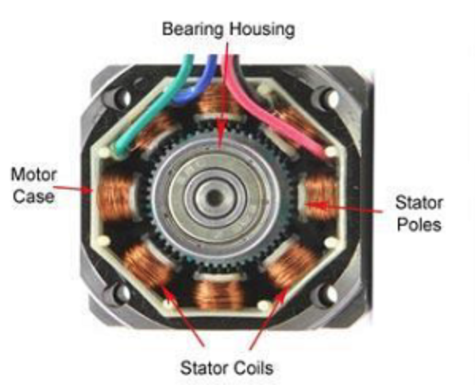
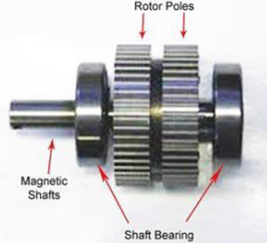

// Geef de aanleiding (waarom doen we dit onderzoek eigenlijk?) en vertel wat het onderzoek inhoudt.

In dit experiment zal worden onderzocht wat het torque verlies is van verschillende klasse stepper drivers over een range van verschillende microstepping configuraties. Het resultaat van dit onderzoek is noodzakelijk voor het bepalen welke driver in de uiteindelijke robot gebruikt zal worden.  
In dit onderzoek zal ik voor de verschillende microstepping configuraties een torque test uitvoeren, hier later meer over, op basis van deze resultaten wordt vervolgens bepaald wat het torque verlies is van die motor met die configuratie. Door alle resultaten te vergelijken kan vervolgens geconcludeerd worden welke driver het meest geschikt is voor dit project.

## Stepper motor

Een stepper motor, of stappen motor, is een motor speciaal ontworpen voor het maken van precieze en voorspelbare bewegingen. In de onderstaande afbeelding (Stepper motor - **stator**) is te zien dat de motor meerdere coils heeft, in de afbeelding 'Stator coils'. Deze polen zijn om en om onderverdeeld in twee groepen, de zogenaamde 'coils'. Een coil bestaat uit koperen draad gewikkeld rondom een ferromagnetisch materiaal, meestal ijzer. Door stroom door deze koperen draad te sturen ontstaat er een magnetisch veld, door de richting van de stroom te veranderen kan de polariteit van de elektromagneet worden omgedraaid.  
In de afbeelding 'Stepper motor - **stator**' is het onderdeel 'Rotor Poles' te zien, dit zijn kleine magneetjes, de hoeveelheid van deze magneetjes bepaald de stap resolutie van de stepper. Over het algemeen zijn er twee soorten resoluties, 1.8 graden per stap (200 stappen per revolutie) en 0.9 graden per stap (400 stappen per revolutie). De resoluties worden bepaald door de twee 'Rotor poles', beide deze ringen bevatten hetzelfde aantal magneten, maar een van de ringen heeft een offset van de resolutie van de stepper motor. In de afbeelding is te zien dat de rechter rotor pole net een stukje verder is gedraaid dan de linker. Een stepper motor maakt zijn bewegingen door de polariteit van de coils telkens te veranderen van polariteit, door de helft van de coils een polariteit 'noord' te geven en de andere helft een polariteit van 'zuid' trekt het een set magneten aan op de rotor poles, en zet de motor een 'stap'. Door vervolgens deze polariteit weer om te draaien kan de motor nog een stap zetten, deze handeling kan herhaald worden voor het gewenst aantal stappen.

|||
|:---:|:---:|
|||
|**!afbeelding** - *Stepper motor - **Stator***|**!afbeelding** - *Stepper motor - **Rotor***|

## Stepper driver

Om een stepper motor aan te sturen door middel van een microcontroller moet er gebruik gemaakt worden van een stepper driver. Zoals in het voorgaande hoofdstuk verteld maakt een stepper motor zijn stappen door de polariteit van de coils te veranderen, het veranderen van deze polariteit wordt geregeld door een stepper driver.  
Een stepper driver kan aan de hand van puls signalen de stepper motor laten roteren. De richting van deze stappen wordt bepaald aan de hand van een 'directional pulse' en de snelheid, de hoeveelheid stappen per seconde  (Steps Per Second (SPS)) wordt bepaald aan de hand van de frequentie van de puls signalen.  
Het gebruik van een stepper driver levert ook de mogelijkheid om de stappen van de motor te verkleinen, dit wordt microstepping genoemd. Microstepping wordt gerealiseerd door het de coils niet voor elke stap 100 procent van het vermogen te geven maar een deel daarvan hierdoor kan de rotor locaties innemen buiten de voorbepaalde resolutie en is microstepping mogelijk. Microstepping heeft als resultaat dat de beweging van de motor meer 'smooth' is, dit gaat wel ten koste van de maximale torque van de motor.

// |||
// |:---:|:---:|
// |||
// |**!afbeelding** - *Stepper driver - **DM542T***|**!afbeelding** - *Stepper driver - **DM332T***|

