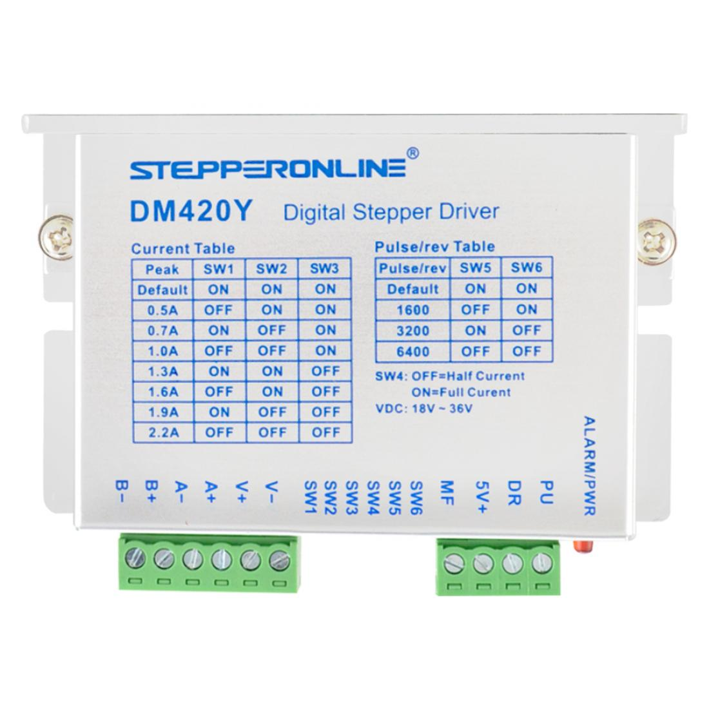

Voor het beantwoorden van deze deelvraag zal er gekeken moeten worden naar de eisen van de scara robot. In de onderstaande tabel staan de verschillende eisen weergegeven, voorzien van een beschrijving waarom deze eis bestaat. In dit hoofdstuk is er gebruik gemaakt van de 'Available product analysis' methode.

|   #   | Eis                | Beredenering                                                                                                                                                                                                                                                                                                                                                                |
| :---: | :----------------- | :--------------------------------------------------------------------------------------------------------------------------------------------------------------------------------------------------------------------------------------------------------------------------------------------------------------------------------------------------------------------------- |
|   1   | Enable/disable     | Bij het voorgaande robot arm project is ondervonden dat stepper motoren vrij warm kunnen worden, warm genoeg om het 3D geprinte plastic te doen smelten. Om deze reden moet er een mogelijkheid zijn om de stepper motoren te kunnen activeren en deactiveren wanneer deze niet actief in gebruik zijn waardoor de temperatuur van de motor in bedwang gehouden kan worden. |
|   2   | Current limiting   | Met 'current limiting' wordt bedoeld dat waneer de stepper motor niet actief aangestuurd wordt door de microcontroller de driver dit zelf detecteert en de stepper motor een verminderde stroom toevoer levert waardoor en minder warmteontwikkeling ontstaat. Deze eis is opgesteld om dezelfde reden als de voorgaande eis.                                               |
|   3   | Microstepping      | Omdat precisie een belangrijk aspect is van een robot arm is het maximaliseren van de precisie van de stepper motoren cruciaal. Microstepping levert deze mogelijkheid. De robot arm zal waarschijnlijk gebruik maken van een microstepping configuratie van 1600 stappen per revolutie (1/8), dit is het streven.                                                           |
|   4   | Drive voltage      | De scara robot zal gebruik maken van een systeem voltage van 12 of 24 volt (met de reden dat voor deze voltages relatief goedkope converters beschikbaar zijn). De stepper driver zal deze voltages minimaal moeten ondersteunen.                                                                                                                                            |
|   5   | Logic voltage      | De scara robot zal bestuurd worden door of een ESP32 of een Teensy microcontroller, beide deze controllers en vergelijkbare controllers hebben een logic voltage van 3.3 volt in tegenstelling tot de gebruikelijke 5.0 volt. De stepper driver zal de mogelijkheid moeten bieden tot het gebruiken van een 3.3 volt controller zonder extra conversie.                       |
|   6   | Max current rating | De stepper motoren die gebruikt zullen worden in de scara robot zullen tussen de twee en drie ampère gebruiken. De stepper driver zal deze ampèrages moeten ondersteunen.                                                                                                                                                                                                    |
|   7   | Prijs              | Een van de eisen van dit project is het zo goedkoop mogelijk ontwikkelen van de robot. De prijs per driver is daarom een relevante statistiek.                                                                                                                                                                                                                               |
|   8   | Fysieke omvang     | De controlerende hardware zal verwerkt moeten worden in het frame van de robot. Een (te) grote driver leidt tot een (te) groot frame. Hoe kleiner de driver, hoe meer ruimte over blijft voor andere componenten.                                                                                                                                                       |

**!tabel** - *Relevanten aspecten*

## Mogelijke stepper drivers

In de onderstaande tabel zijn een zes-tal stepper drivers weergegeven, voor elke stepper driver staat tevens of ze voldoen aan de gestelde eisen. 

|Driver| A4988 | DRV8825 | TMC5160 | DM332T | DM542T | DM420Y |
|:---| :---: | :-----: | :-----: | :----: | :----: | :----: |
|Afbeelding|||||||
|Enable/disable|✓|✓|✓|✓|✓|✓|
|Current limiting|X|X|X|✓  always|✓  optional|✓  optional|
|Microstepping|✓   1/16|✓   1/32|✓   1/256|✓   1/64|✓   1/128 |✓   1/32|
|Drive voltage|✓  8 - 35 volt|✓  8.2 - 45 volt|✓  10 - 35 volt|✓  18 - 30 volt|✓  20 - 50 volt|✓  18 - 36 volt|
|Logic voltage|✓   3.0 - 5.5 volt|✓   3.3/5 volt|✓   3.3 - 5 volt|✓   any|✓   any|✓   any|
|Max current rating (rated/peak)|X   1/2 amp|X   1.5/2.2 amp|✓   3.0/4.2 amp|✓   0.71/3.2 amp|✓   0.71/4.5 amp|X   0.5/2.2 amp|
|Prijs|€ 8,14|€ 17,22|€ 24,00|€ 15,23|€ 19,57|€ 18,78|
|Fysieke omvang|15.2mm x 20.3mm x 1.6mm|15.2mm x 20.3mmx 1.6mm|15.2mm x 20.3mmx 1.6mm|86mm x 55mm x 20mm|118mm x 75,5mm x 25.5mm|86mm x 55mm x 20mm|
|URL|[A4988](https://www.pololu.com/product/1182/faqs)|[DRV8825](https://www.pololu.com/product/2133)|[TMC5160](https://www.tinytronics.nl/shop/en/mechanics-and-actuators/motor-controllers-and-drivers/stepper-motor-controllers-and-drivers/tmc5160-motor-driver-module)|[DM332T](https://www.omc-stepperonline.com/stepper-motor-driver/digital-stepper-drive-1-0-3-2a-18-30vdc-for-nema-17-23-stepper-motor-dm332t)|[DM542T](https://www.omc-stepperonline.com/stepper-motor-driver/digital-stepper-driver-1-0-4-2a-20-50vdc-for-nema-17-23-24-stepper-motor-dm542t)|[DM420Y](https://www.omc-stepperonline.com/stepper-motor-driver/y-series-digital-stepper-driver-0-3-2-2a-dc18v-36v-for-nema-14-17-23-stepper-motor-dm420y)|

**!tabel** - *Mogelijke stepper drivers*

In de bovenstaande tabel is te zien dat er twee stepper drivers voldoen aan alle gestelde eisen, dit zijn de DM332T en de DM542T. Deze stepper drivers zullen in dit onderzoek gebruikt worden.

!url Pololu. (z.d.-a). Pololu - A4988 Stepper Motor Driver Carrier. A4988. Geraadpleegd op 11 maart 2022, van [https://www.pololu.com/product/1182/faqs](https://www.pololu.com/product/1182/faqs)
!url Pololu. (z.d.-b). Pololu - DRV8825 Stepper Motor Driver Carrier, High Current. DRV8825. Geraadpleegd op 11 maart 2022, van [https://www.pololu.com/product/2133](https://www.pololu.com/product/2133)
!url StepperOnline. (z.d.). Y Series Digital Stepper Driver - DM420Y. DM420Y. Geraadpleegd op 11 maart 2022, van [https://www.omc-stepperonline.com/stepper-motor-driver/y-series-digital-stepper-driver-0-3-2-2a-dc18v-36v-for-nema-14-17-23-stepper-motor-dm420y](https://www.omc-stepperonline.com/stepper-motor-driver/y-series-digital-stepper-driver-0-3-2-2a-dc18v-36v-for-nema-14-17-23-stepper-motor-dm420y)
!url StepperOnline. (2018, 7 december). Digital Stepper Driver - DM332T. DM332T. Geraadpleegd op 11 maart 2022, van [https://www.omc-stepperonline.com/stepper-motor-driver/digital-stepper-drive-1-0-3-2a-18-30vdc-for-nema-17-23-stepper-motor-dm332t](https://www.omc-stepperonline.com/stepper-motor-driver/digital-stepper-drive-1-0-3-2a-18-30vdc-for-nema-17-23-stepper-motor-dm332t)
!url StepperOnline. (2022, 17 februari). Digital Stepper Driver - DM542T. DM542T. Geraadpleegd op 11 maart 2022, van [https://www.omc-stepperonline.com/stepper-motor-driver/digital-stepper-driver-1-0-4-2a-20-50vdc-for-nema-17-23-24-stepper-motor-dm542t](https://www.omc-stepperonline.com/stepper-motor-driver/digital-stepper-driver-1-0-4-2a-20-50vdc-for-nema-17-23-24-stepper-motor-dm542t)
!url TinyTronics. (z.d.). TMC5160 Motor Driver Module. TMC5160. Geraadpleegd op 11 maart 2022, van [https://www.tinytronics.nl/shop/en/mechanics-and-actuators/motor-controllers-and-drivers/stepper-motor-controllers-and-drivers/tmc5160-motor-driver-module](https://www.tinytronics.nl/shop/en/mechanics-and-actuators/motor-controllers-and-drivers/stepper-motor-controllers-and-drivers/tmc5160-motor-driver-module)

