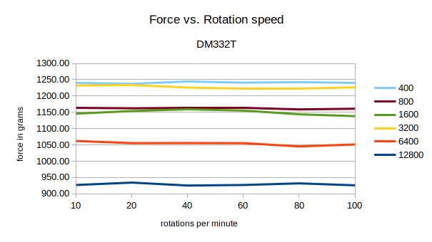
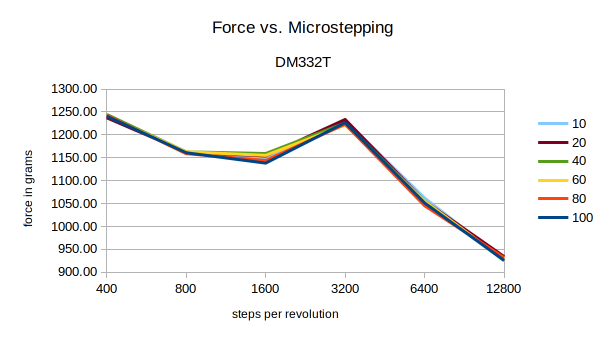
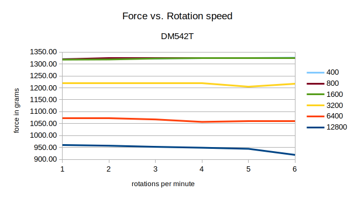
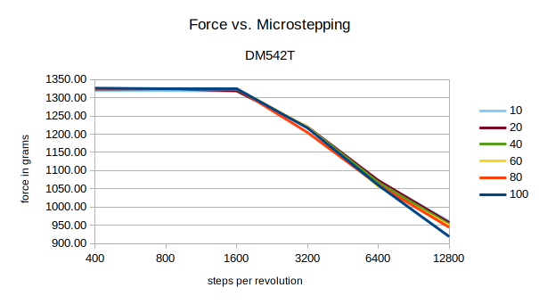

// Je gaat per criterium na wat de waarde voor dat criterium voor deze sensor is. De resultaten leg je vast in een grote tabel waarin voor elke sensor elk criterium met een korte omschrijving gevuld is. Soms kun je de hele waarde op het criterium invullen, maar soms zal je vanwege ruimtegebrek ook slechts een (korte) samenvatting kunnen geven. In dat laatste geval kun je na de tabel verder uitweiden. Geef ook aan wat de bron van de informatie is (in het geval van literatuuronderzoek met een referentie naar de bron, en in het geval van eigen werkplaats-/labonderzoek geef je aan in welk deel van je rapport de metingen verder beschreven staan).

// In het verslag verwachten we per soort meting de gemiddelde gemeten waarde, de standaarddeviatie binnen die metingen en eventueel een grafiekje met alle metingen. De ruwe data van je metingen voeg je als bijlage toe aan het verslag.

// Mocht de tabel te groot worden, dan mag je je resultaten uiteraard verdelen over meerdere tabellen. Zorg echter wel dat deze op zo’n manier zijn gerangschikt dat de lezer snel de juiste informatie kan vinden, en verdeel niet de sensoren, maar de criteria over tabellen, zodat de sensoren in elk geval gemakkelijk op dezelfde criteria vergeleken kunnen worden.

> De rauwe resultaten zijn terug te vinden in de bijlage (bijlage/results/exp_01_results.ods)

In de onderstaande grafieken zijn de verschillende resultaten weergegeven van de uitgevoerde tests. De 'force vs. rotation speed' grafieken laten het verlies in torque zien per microstepping configuratie. Opmerkelijk aan deze resultaten is dat er per microstepping configuratie een aanzienlijk verlies in torque terug te vinden is echter is dit verlies in torque niet gerelateerd aan de snelheid van motor. In de grafieken 'force vs. microstepping' is een duidelijkere weergaven van het torque verlies weergegeven. In de DM332T grafiek is te zien dat de torque afnamen meer geleidelijk plaatsvind* dan bij de DM542T. De DM542T blijft nagenoeg gelijk tot een microstepping configuratie van 1600, daarna ondervind deze driver een sterke daling.

De initiële torque van de DM542T is aanzienlijk hoger en blijft langere tijd gelijk. Echter bij een microstepping configuratie van 12800 zijn beide drivers op hetzelfde torque niveau. Dit laat zien dat na een configuratie van 1600 beide drivers identiek functioneren.

> ```*``` In de grafiek force vs. microstepping van de DM332T stepper driver is een piek te zien voor een microstepping configuratie van 3200. Dit volgt het patroon niet en er wordt aangenomen dat dit een fout is, opgelopen tijdens het afnemen van de tests.

|||
|:---:|:---:|
|||
|**!grafiek** - *DM332T - Force vs. rotation speed*|**!grafiek** - *DM332T - Force vs. microstepping*|

|||
|:---:|:---:|
|||
|**!grafiek** - *DM542T - Force vs. rotation speed*|**!grafiek** - *DM542T - Force vs. microstepping*|