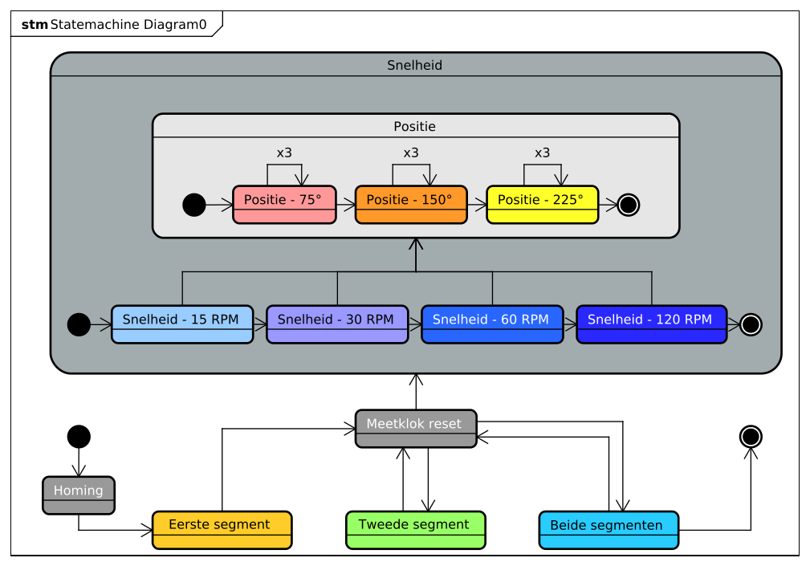

In dit hoofdstuk zullen de vier onderdelen aangekaart in het voorgaande hoofdstuk centraal staan. Er zal gekeken worden op welke manier deze aspecten het best getest kunnen worden.

## Meetklok

Voor het meten van de afwijking in micrometers is er gebruik gemaakt van een [meetklok](https://www.bol.com/nl/nl/p/meetklok-digitale-meetklok-0-001-mm-0-12-7mm/9300000021240080/?s2a=). Een meetklok is een klein apparaat met een pin die ingedrukt kan worden. Hoever de pin precies ingedrukt wordt wordt op het display weergegeven in milimeters, tot drie decimalen. Door middel van deze klok kan de afwijking van de arm tot de micrometer precies gemeten worden. De gebruikte meetklok is in de onderstaande afbeelding weergegeven.

|||
|:---:|:---:|
|||
|**!afbeelding** - *Meetklok*|**!afbeelding** - *Robot - **Trigger locatie***|

## Snelheid & Microstepping

Voor het testen van de invloed van de bewegingssnelheid worden er vier snelheden gehanteerd; 15, 30, 60, en  120 toeren per minuut. Qua microstepping wordt er gebruik gemaakt van 400, 800, 1600 en 3200 stappen per revolutie.

Voor de uiteindelijke implementatie zal er gebruik gemaakt worden van een maximale snelheid van 30 tot 60 toeren per minuut, deze snelheid is beide veilig voor de stepper motor en de robot arm zelf. Ook levert deze snelheid de meest ideale torque ([torque curve pdf](https://www.omc-stepperonline.com/download/17HS19-0406S_Torque_Curve.pdf)). Om beide uiterste te testen is er ook voor gekozen om 15 en 120 toeren per minuut te testen.

Het is nog niet geheel zeker wat de uiteindelijke microstepping resolutie zal worden voor de robot arm, daarom zal er gekeken moeten worden naar de juiste verhouding tussen noodzakelijke torque en resolutie. Door deze onzekerheid zijn er vier verschillende resoluties getest; 400, 800, 1600 en 3200. 

## Segmenten & afstand

Om de invloed van de verschillende segmenten en de afgelegde afstand te testen zijn de onderstaande posities bepaald. Zoals te zien in de onderstaande tabel is er onderscheid gemaakt tussen beide segment en afstand. In de eerste kolom is te zien dat het eerste segment op drie afstanden getest is; 75°, 150° en 225° graden, hetzelfde voor de tweede kolom. In de derde kolom staan de posities van weergegeven voor de tests waarbij beide segmenten bewegen naar de 'trigger locatie' (zie afbeelding 'trigger locatie'). De drie rijen geven de afgelegde afstand aan.

| |Eerste segment|Tweede segment|Beide segmenten|
|:---:|:---:|:---:|:---:|
|**75°** ||||
|**150**°||||
|**225°**||||

**!tabel** - Segmenten & afstand

## De tests

In het onderstaande diagram is de test sequence schematisch weergegeven, onder deze afbeelding worden de stappen van dit schema omschreven.

**!afbeelding** - *Test sequence*

Wanneer een test gestart wordt zal er ten eerste een homing sequence uitgevoerd worden. Omdat een stepper motor geen idee heeft hoe deze georiënteerd is zal hij bij aanvang van het programma eest naar een bekende staat moeten bewegen. Dit gebeurt aan de hand van twee magneten gemonteerd op de as met een bijhorende [hall effect sensor](https://www.tinytronics.nl/shop/en/sensors/magnetic-field/3144-hall-effect-switch). Door beide magneten 'op te zoeken' weet de motor waar hij is en is zijn staat bekend.

Vervolgens zal het programma de tests voor het eerste segment starten. Het programma beweegt de arm naar de 'trigger locatie' (zie de bovenstaande afbeelding 'trigger locatie') en zal daar vervolgens wachten tot de gebruiker de meetklok heeft gereset. Zodra de gebruiker op de knop drukt begint het programma met de tests.
Het programma zet eerst de snelheid, te beginnen bij 15 toeren per minuut. Voor deze snelheid zal het programma drie tests uitvoeren voor de 75° graden positie, drie voor de 150°, en drie voor de 225° graden positie. Deze sequence wordt herhaald voor de resterende snelheden.

Zodra alle snelheden en posities getest zijn zal het programma doorgaan naar het tweede segment. De meetklok wordt nogmaals gereset en het programma wacht weer op de gebruiker. Deze hele sequence, wordt ook herhaald voor het derde onderdeel: beide segmenten. 

Zodra dit alles is uitgevoerd zal de microstepping resolutie verhoogd worden en draait dit alles nogmaals voor elke resolutie.

Door elke positie op elke snelheid voor ieder segment drie maal uit te voeren kan er met meer zekerheid gezegd worden dat het resultaat het daadwerkelijke resultaat is een geen uitschieter.

> De daadwerkelijk uitgevoerde tests zijn terug te vinden in de bijlage (bijlage/clips/MS400, ../MS800, ../MS1600 & ../MS3200) 

!url Bol. (z.d.). Meetklok - Digitale meetklok. Bol.com. Geraadpleegd op 15 april 2022, van [https://www.bol.com/nl/nl/p/meetklok-digitale-meetklok-0-001-mm-0-12-7mm/9300000021240080/?s2a=](https://www.bol.com/nl/nl/p/meetklok-digitale-meetklok-0-001-mm-0-12-7mm/9300000021240080/?s2a=)

!url TinyTronics. (z.d.). 3144 Hall Effect Switch. Geraadpleegd op 15 april 2022, van [https://www.tinytronics.nl/shop/en/sensors/magnetic-field/3144-hall-effect-switch](https://www.tinytronics.nl/shop/en/sensors/magnetic-field/3144-hall-effect-switch)