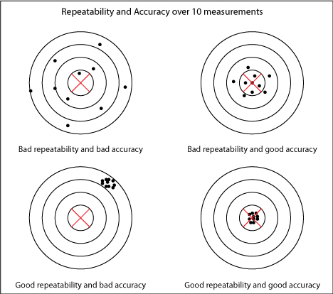

Dit experiment is gebaseerd op het uitzoeken hoe en het meten van de herhaalbaarheid (repeatability) van de robot arm. Repeatability is een statistiek gebruikt om aan te geven hoe betrouwbaar de bewegingen van de robot zijn. In de onderstaande afbeelding is een voorbeeld te zien van repeatability tegenover accuracy (precisie).

| | |
|:---:|:---:|
|||
|**!afbeelding** - *Repeatability & Accuracy*|**!afbeelding** - *Atlas - repeatability testing*|

Repeatability is een direct resultaat van de gebruikte componenten en het ontwerp van de robot zelf. De repeatability kan niet worden verbeterd zonder andere fysieke componenten te gebruiken, repeatability is dus een direct resultaat van de daadwerkelijke robot. Een robot met een hoge repeatability maar een lage accuracy (links onder in de afbeelding) is in essentie een slecht afgestelde machine, en kan altijd opnieuw gekalibreerd worden, accuracy is dus een direct resultaat van software of gebruik van de robot. 
In dit experiment zal onderzocht worden hoe de repeatability het beste getest kan worden. Het meten van repeatability is een proces dat zeer precies moet gebeuren gezien deze statistiek tot micrometer precies gemeten wordt. Naast een betrouwbare meetopstelling is een geschikte methodiek ook noodzakelijk. Over dit onderdeel is meer te lezen in het hoofdstuk Onderzoeksvraag en het hoofdstuk Betrouwbaar testen. 
Verder zal er gekeken worden naar de verschillende configuraties van de arm die betrekking hebben tot de repeatability van de arm. Verschillende aspecten van de arm zullen in meerdere maten betrekking hebben tot de resultaten, deze verschillende aspecten worden allemaal getest, de uitkomst van dit onderdeel zal een waardevolle bijdrage leveren voor het uiteindelijke product. Zo kunnen er bijvoorbeeld configuraties gemeden worden of juist niet omdat deze een bepaalde invloed hebben op de prestaties van de robot. Over deze onderdelen is wederom meer te lezen in de Onderzoeksvraag, ook in het hoofdstuk Robot configuraties staat dit onderdeel centraal. 
In het verdere document zal er nog gesproken worden over het resultaat van de deelvraag betrouwbaar testen, in het hoofdstuk Meetopstelling. In dit hoofdstuk zal in detail ingegaan worden op de verschillende aspecten van de meetopstelling, hoe de verschillende resultaten zijn verkregen en wat er gedaan is om zo betrouwbaar mogelijk te testen. 
Tot slot de hoofdstukken Resultaten & Conclusie. In het hoofdstuk Resultaten zal ingegaan worden op de verkregen resultaten en hoe deze geïnterpreteerd kunnen worden tot het uiteindelijke antwoord op de hoofdvraag. In het hoofdstuk conclusie zullen de antwoorden op de deelvragen gecombineerd met de verkregen resultaten samen tot een antwoord op de hoofdvraag komen. 

!url Bouchard, S. (z.d.). Robotic Gripper Repeatability Definition and Measurement. Robotiq. Geraadpleegd op 15 april 2022, van [https://blog.robotiq.com/bid/36551/Robotic-Gripper-Repeatability-Definition-and-Measurement](https://blog.robotiq.com/bid/36551/Robotic-Gripper-Repeatability-Definition-and-Measurement)

!url Lickindorf, D. (2019, 12 juli). Repeatability testing in progress. Hackaday. Geraadpleegd op 15 april 2022, van [https://hackaday.io/project/168259-atlas-6dof-3d-printed-universal-robot/log/171655-repeatability-testing-in-progress](https://hackaday.io/project/168259-atlas-6dof-3d-printed-universal-robot/log/171655-repeatability-testing-in-progress)