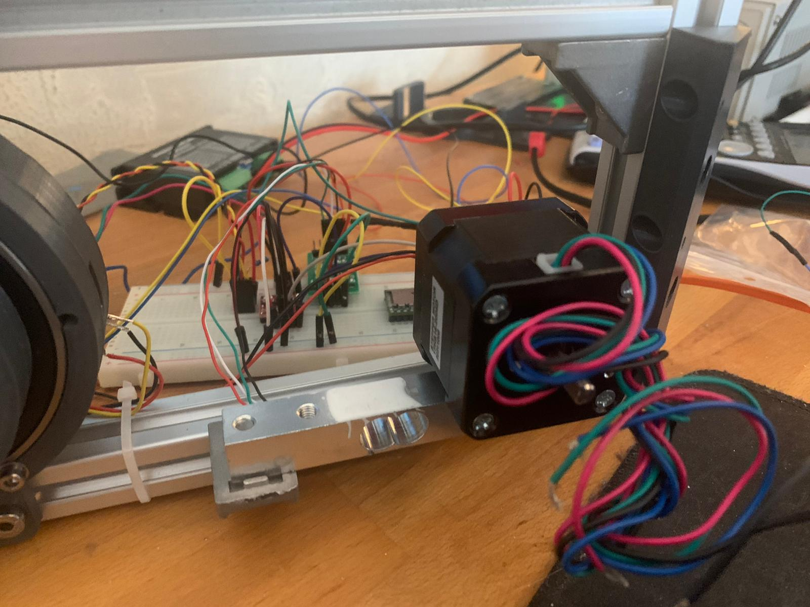
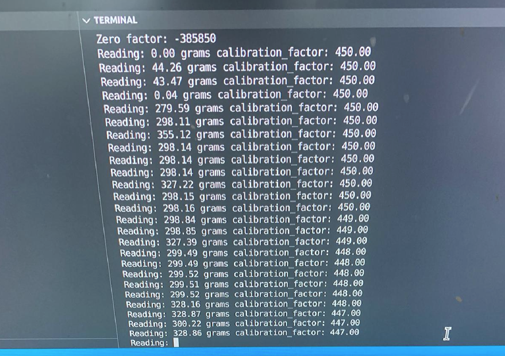

// Hoe kan het torque verlies van een stepper driver betrouwbaar getest worden?

Voor het betrouwbaar testen van het torque verlies zal ten eerste gekeken moeten worden naar hoe torque überhaupt gemeten wordt. Informatie over het meten van torque kan vrij makkelijk op internet gevonden worden, in [dit](https://www.youtube.com/watch?v=Emvo3bLT-Z4&t=477s&ab_channel=3DprintedLife) (3DPrintedLife, 2021) filmpje bijvoorbeeld, vanaf minuut 7:31 wordt er laten zien dat de torque van gemeten wordt aan de hand van een loadcell. Een ander voorbeeld is [dit](https://www.youtube.com/watch?v=smQJeg87ff8&ab_channel=Skyentific) (Skyentific, 2019) filmpje waar twee test methodes gebruikt worden. De eerste methode (vanaf 6:20) is voor het testen van de 'pull out torque', hierbij wordt gekeken hoeveel gewicht er aan de motor gehangen kan worden voordat deze zijn positie verliest. De andere methode (vanaf 13:00) laat het gebruik van een weegschaal zien om te meten hoeveel torque (in gram) de motor kan geven in normale operatie. Voor het beantwoorden van deze deelvraag is gebruik gemaakt van beide lab onderzoek methodes; 'Hardware validation' & 'Data analytics'. 

## Loadcell

De eerste methode die tijdens dit onderzoek is toegepast is de 'loadcell' methode. Het testplatform (zie Meetopstelling) heeft een theoretische torque output van ```+/-2.0 kg.cm``` daarom is er gebruik gemaakt van een [5 kg loadcell](https://www.tinytronics.nl/shop/en/sensors/weight-pressure-force/load-cells/load-cell-5kg) in combinatie met een [HX711 versterker](https://www.tinytronics.nl/shop/en/sensors/weight-pressure-force/load-cells/load-cell-amplifier-hx711). Het testplatform zou met verschillende microstepping configuraties tegen de loadcell aandrukken, de loadcell meet vervolgens de kracht in grammen en print deze naar het scherm. Onderstaand zijn enkele afbeeldingen te zien van het kalibratie proces van de loadcell.

|||
|:---:|:---:|
|||
|**!afbeelding** - *Loadcell opzet*|**!afbeelding** - *Loadcell calibratie*|

Voor het kalibreren van de loadcell moet er een bekend gewicht op de loadcell geplaatst worden. Vervolgens kan de 'calibratie-factor' aangepast worden zodat de loadcell het correcte gewicht meet. De motor op de loadcell is exact 300 gram, te zien in de rechter afbeelding is dat de loadcell te veel ruis met detecteert, soms wel 20 procent! Gezien de complexiteit die het zou kosten om de loadcell 'ruis-vrij' te maken is de keuze gemaakt om een andere methode toe te passen.

## Weegschaal

Zoals voorheen verteld kan de torque output ook gemeten worden met een weegschaal. Door de output van de meetopstelling (de arm) te laten drukken op een weegschaal kan de kracht in grammen worden afgelezen. Voor het uitvoeren van deze methode moest de meetopstelling lichtelijk aangepast worden zodat de weegschaal niet weggedrukt zou worden door de arm zelf. In het hoofdstuk ['Meetopstelling'](#chapter/meetopstelling) is hier meer over terug te vinden.


## Tests

Voor het valideren van de hardware is er een programma geschreven die aan de hand van een hall effect sensor, een sensor die een magnetisch veld kan detecteren, een 'homing sequence' opgezet. Hiermee wordt bedoeld dat de stepper motor beweegt tot de sensor een magneet detecteert, hierdoor weet de motor welke positie hij zich precies bevind. Aan de hand van dat stukje code kan gevalideerd worden of de motor, driver en sensor naar behoeven werkt. Verder wordt deze 'homing sequence' voor het starten van een test uitgevoerd, hierdoor kan met zekerheid gezegd worden dat de motor naar dezelfde exacte locatie beweegt voor elke test.<br>
Voor het uitvoeren van de daadwerkelijke tests is er een programma geschreven dat voor zes verschillende snelheden (10, 20, 40, 60, 80 & 100 RPM) drie keer contact maakt met de weegschaal. De motor beweegt net zo lang door tot het dreigt een stap te verliezen, dan zal de motor stoppen en wachten. De resultaten van deze tests zijn gefilmd met behulp van een webcam gemonteerd boven de weegschaal. De webcam neemt telkens de waarde van de weegschaal op waardoor deze later terug te vinden zijn. 

> De verschillende metingen zijn terug te vinden in de bijlage (bijlage/clips/DM332T & ../DM542T).

!url 3DPrintedLife. (2021, 2 mei). My 3D Printed Harmonic Drive Performs Surprisingly Well! YouTube. Geraadpleegd op 11 maart 2022, van [https://www.youtube.com/watch?v=Emvo3bLT-Z4&t=477s&ab_channel=3DprintedLife](https://www.youtube.com/watch?v=Emvo3bLT-Z4&t=477s&ab_channel=3DprintedLife)
!url Skyentific. (2019, 9 maart). Torque Test of Robot Actuator (Brushless Motor Robotic Joint). YouTube. Geraadpleegd op 11 maart 2022, van [https://www.youtube.com/watch?v=smQJeg87ff8&ab_channel=Skyentific](https://www.youtube.com/watch?v=smQJeg87ff8&ab_channel=Skyentific)
!url TinyTronics. (z.d.). Load Cell - 5kg. Geraadpleegd op 11 maart 2022, van [https://www.tinytronics.nl/shop/en/sensors/weight-pressure-force/load-cells/load-cell-5kg](https://www.tinytronics.nl/shop/en/sensors/weight-pressure-force/load-cells/load-cell-5kg)
!url TinyTronics. (2021, 17 mei). Load Cell Amplifier- HX711. Geraadpleegd op 11 maart 2022, van [https://www.tinytronics.nl/shop/en/sensors/weight-pressure-force/load-cells/load-cell-amplifier-hx711](https://www.tinytronics.nl/shop/en/sensors/weight-pressure-force/load-cells/load-cell-amplifier-hx711)