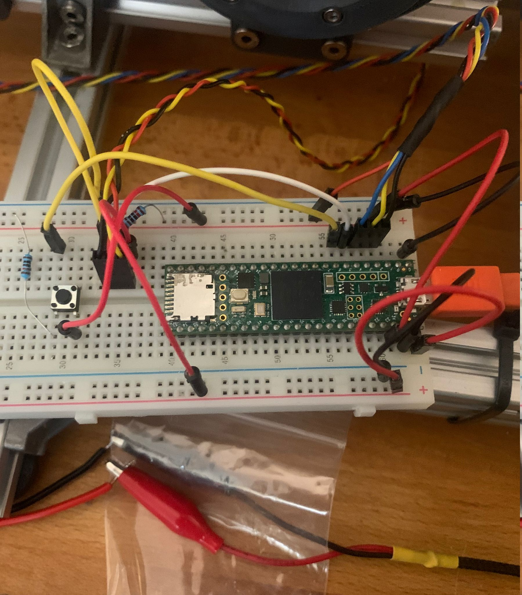
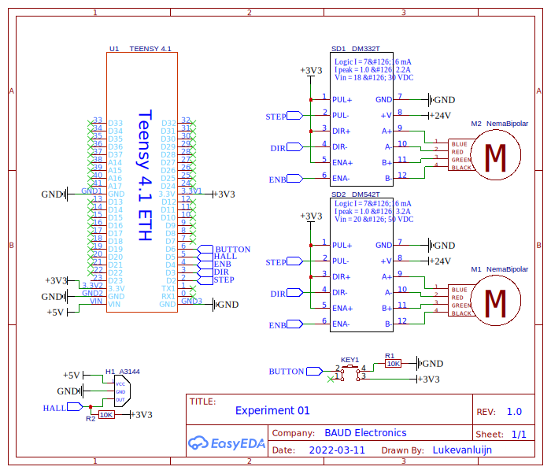
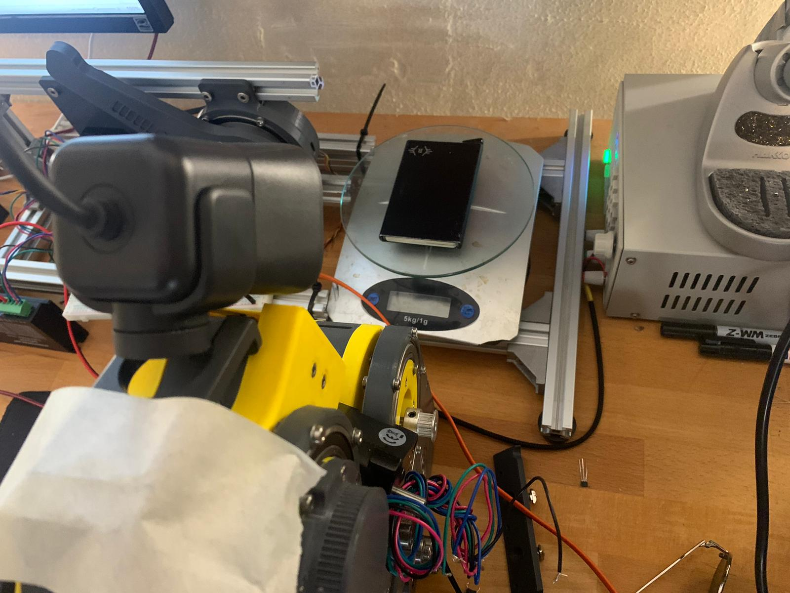
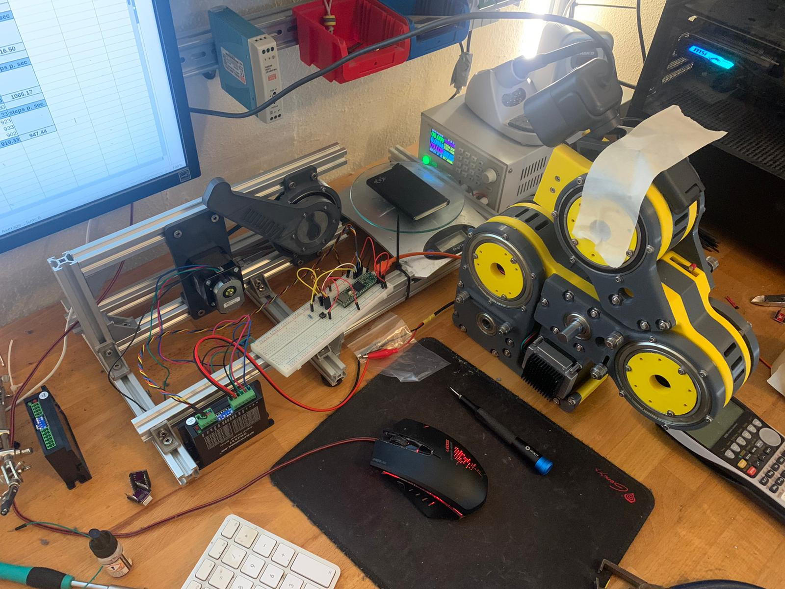

// Beschrijf de meetopstellingen van je werkplaats-/labonderzoek op een dergelijke manier dat het onderzoek eenvoudig te reproduceren is. Je geeft dus minimaal een aansluitschema, de gebruikte code (eventueel in een bijlage) en een of meerdere foto’s en/of schematische tekeningen per meetopstelling

De onderstaande afbeeldingen laten de aansluiting zien tussen de microcontroller en de verschillende componenten. In het schema zijn twee stepper drivers en twee motoren afgebeeld. Deze sets zijn tijdens het testen uitgewisseld en nooit tegelijkertijd aangesloten.

|||
|:---:|:---:|
|||
|**!afbeelding** - *Aansluiting*|**!diagram** - *Aansluitingsschema*|

<div style="page-break-after: always;"></div>

## Opzet

Zoals eerder vermeld is er gebruik gemaakt van een weegschaal voor het nemen van de verschillende metingen. Deze weegschaal en de 3D geprinte constructie zijn door middel van verschillende extrusion palen aan elkaar verbonden. Verder is er een webcam gemonteerd boven de weegschaal die de resultaten opneemt waardoor deze later terug te zien zijn. Op de onderstaande afbeeldingen is de daadwerkelijke opstelling weergegeven.

|||
|:---:|:---:|
|||
|**!afbeelding** - *Meetopstelling 1*|**!afbeelding** - *Meetopstelling 2*|

## Code

> De code is terug te vinden in de bijlage (bijlage/code/src/main.cpp)

In dit onderdeel zullen de verschillende onderdelen van de code dieper toegelicht worden. Te beginnende bij regel 16 t/m 21, dit is de microstepping configuratie. Op de stepper drivers zelf moet de daadwerkelijke configuratie aangeven worden, maar in de code wordt ook rekening gehouden met deze instellingen. Als de configuratie veranderd moet dat op deze locatie in de code ook veranderd worden.<br>
De methode ```HomeStepper()``` omvat de eerder besproken 'homing sequence'. De verantwoordelijkheid van deze methode is het accuraat (her)positioneren van de stepper motor door middel van de hall effect sensor. Het detecteren van de hall effect sensor gebeurt door middel van de ```LimitSwitchTrigger()``` methode (regel 162 t/m 184), dit is een lichtelijk aangepaste kopie van de ['debounce code'](https://www.arduino.cc/en/Tutorial/BuiltInExamples/Debounce) van Arduino.<br>
De methode ```TestCycle()``` is het hart van de applicatie. Deze methode wacht tot er op de knop gedrukt is (aan de van een interrupt service routine (ISR)), zodra er op de knop is gedrukt wordt de motor geactiveerd (regel 102), worden de tests uitgevoerd en wordt de motor vervolgens weer gedeactiveerd.<br>
De tests worden uitgevoerd in de methode ```ExecuteTest(uint8_t sampleSize, uint8_t index)``` (regel 108 t\m 142). De parameter 'sampleSize' staat voor het aantal metingen die genomen moeten worden. De parameter 'index' is de snelheidsindex welke van de zes snelheden er bij deze test gebruikt zal worden. Verder zijn er nog de methodes ```GetSpeedDelay(double RPM)``` (regel 218 t/m 225), deze rekent een bepaalde RPM (rotations per minute) om naar een vertraging in het aanroepen van de stepper driver, in deze berekening wordt rekening gehouden met de huidige microstepping configuratie. De methode ```MakeManySteps(uint32_t steps, uint32_t delay, bool forwards)``` & ```MakeSingleStep(uint32_t delay, bool forwards)``` (regel 144 t/m 161), verzorgen respectievelijk het uitvoeren van meerdere stappen en een enkele stap. Tot slot de methode ```Timer(uint32_t& time, uint32_t interval)``` (regel 227 t/m 235), dit is enkel een software timer gebruikt voor het uitvoeren van tijd gerelateerde onderdelen.


!url Arduino. (z.d.). Debounce. Geraadpleegd op 11 maart 2022, van [https://www.arduino.cc/en/Tutorial/BuiltInExamples/Debounce/](https://www.arduino.cc/en/Tutorial/BuiltInExamples/Debounce/)