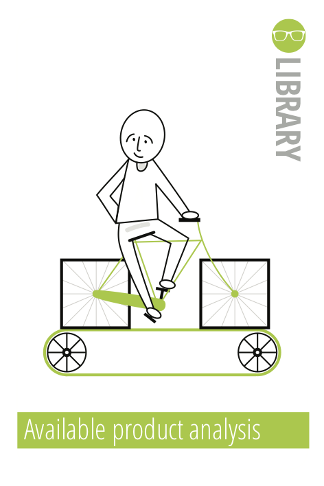

// Geef aan hoe je de onderzoeksvragen wil gaan beantwoorden en waarom je dat juist op die manier wil doen. Wees hier zo gedetailleerd mogelijk. Je kunt gebruik maken van de onderzoeksmethoden uit de HBO-iMethodenkaartenset (Bonestroo, et al., 2018), zie www.ictresearchmethods.nl.

In dit onderzoek zullen verschillende methodes aan bod komen. Het onderzoek zal beginnen met een klein web-onderzoek naar geschikte stepper drivers, de geschiktheid zal gewaardeerd worden op basis van prijs, fysieke omvang, klanten reviews en beschikbaarheid. Voor dit onderdeel is gebruik gemaakt van de methode: ["Available product analysis"](https://ictresearchmethods.nl/Available_product_analysis)

Het tweede onderdeel is het daadwerkelijk testen van de gekozen drivers, gezien de drivers een hardware component zijn met als resultaat een fysieke toestand zal er gebruik gemaakt worden van een lab onderzoek, waarbij twee methodes gebruikt zullen worden. Ten eerste de methode ["Hardware validation"](https://ictresearchmethods.nl/Hardware_validation) voor het verifiëren van de nieuwe hardware. Verder zal er gebruik gemaakt worden van de methode ["Data analytics"](https://ictresearchmethods.nl/Data_analytics), door middel van deze methode zal de daadwerkelijke data vergaard worden.

||||
|:---:|:---:|:---:|
||||
| **!afbeelding** - *Methode: **Available product analysis***| **!afbeelding** - *Methode: **Hardware validation***| **!afbeelding** - *Methode: **Data analytics***|

!url HAN-ICA. (z.d.-a). Available product analysis - ICT research methods. Available Product Analysis. Geraadpleegd op 11 maart 2022, van [https://ictresearchmethods.nl/Available_product_analysis](https://ictresearchmethods.nl/Available_product_analysis)
!url HAN-ICA. (z.d.-b). Data analytics - ICT research methods. Data Analytics. Geraadpleegd op 11 maart 2022, van [https://ictresearchmethods.nl/Data_analytics](https://ictresearchmethods.nl/Data_analytics)
!url HAN-ICA. (z.d.-c). Hardware validation - ICT research methods. Hardware Validation. Geraadpleegd op 11 maart 2022, van [https://ictresearchmethods.nl/Hardware_validation](https://ictresearchmethods.nl/Hardware_validation)

Gezien er eerst een keuze gemaakt moet worden over de daadwerkelijke hardware en de kosten die deze hardware met zich meebrengen is de methode "Available product analysis" een zeer geschikte keuze. Door een duidelijke analyse te maken van de verschillende mogelijkheden wordt de kans op een miskoop geminimaliseerd.

Omdat er nieuwe hardware aangeschaft wordt zal deze hardware geverifieerd moeten worden. Eerst kijken of de hardware überhaupt werkt en hoe deze hardware vervolgens aangestuurd moet worden. De methode "Hardware validation" past daarom goed bij dit onderdeel.

Dit onderzoek draait om het vergelijken van data. De data verkregen uit de verschillende tests moet op een correcte manier vergeleken worden om hier tastbare conclusies uit te kunnen halen. De methode "Data analytics" is om deze reden de juiste methodiek.