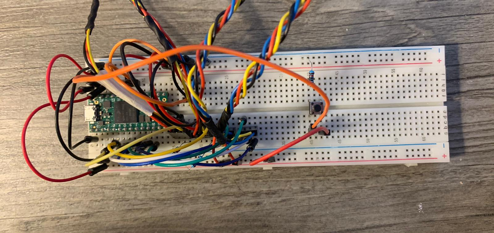
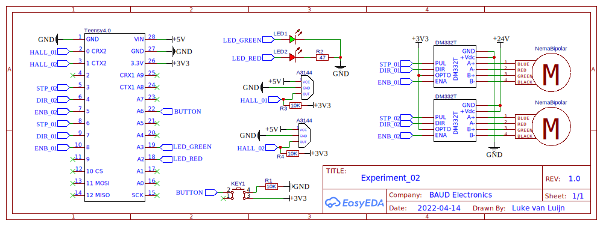
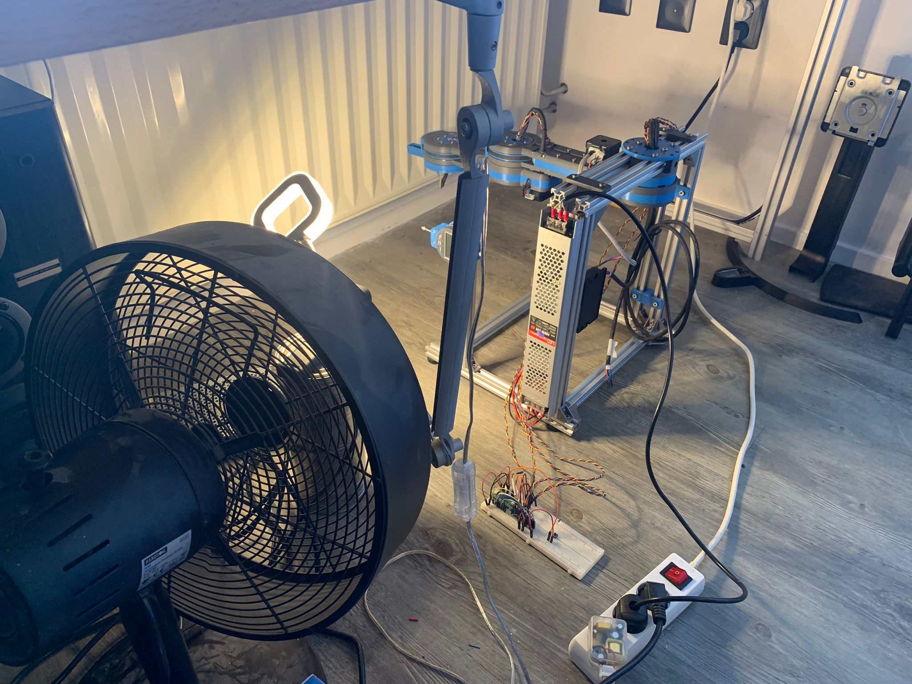
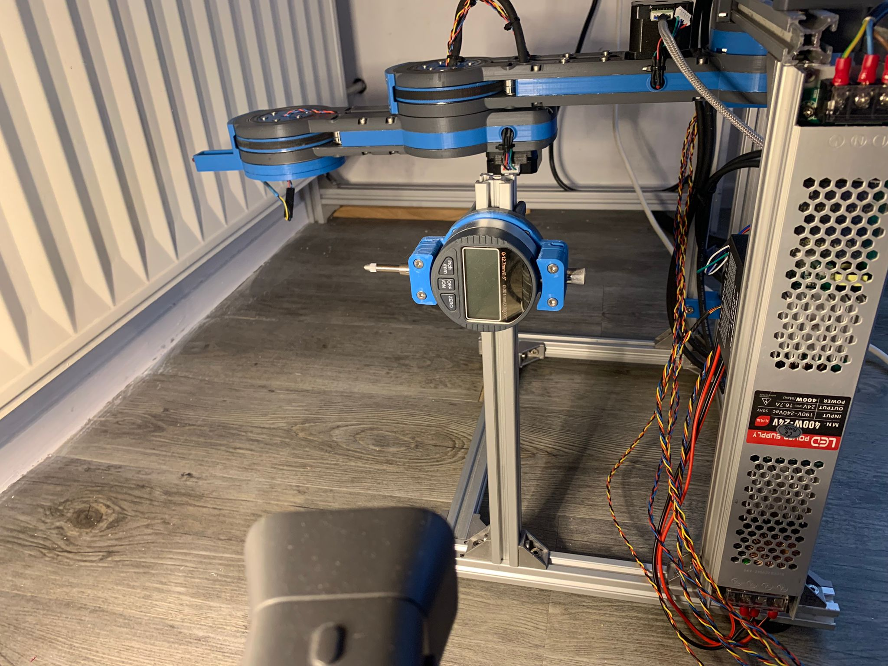
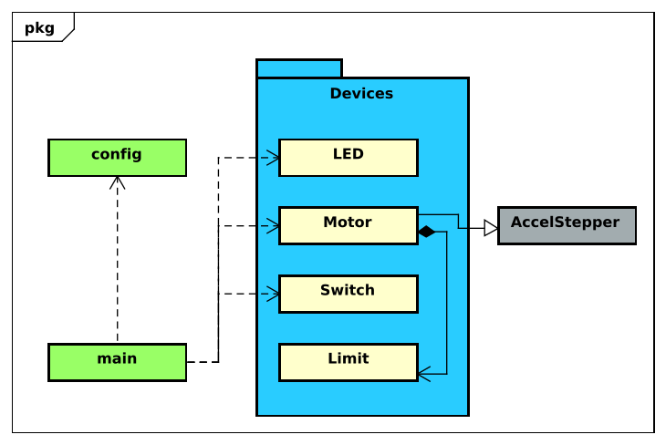

De onderstaande afbeeldingen laten de aansluiting zien tussen de microcontroller en de verschillende hardware componenten.

|||
|:---:|:---:|
||**!afbeelding** - *Aansluiting*|
||**!schema** - *Aansluitschema*|

## Opzet

Zoals in het voorgaande hoofdstuk vermeld zijn de laatste twee segmenten van de arm gebruikt voor deze tests. Verder is er nog een houder 3D-geprint voor beide de twee segmenten van de robot arm en de meetklok. Dit alles is gemonteerd op een aluminium extrusion frame. Ook de elektronica zoals de stepper drivers en de voeding zijn op dit frame gemonteerd. Een webcam is op twee verfbussen geplaatst zodat het direct op de meetklok gericht kan worden. Ook is er nog een lamp gericht op de meetklok en een ventilator voor extra light en koeling. In de onderstaande afbeeldingen staat de gebruikte opstelling weergegeven.

|||
|:---:|:---:|
|||
|**!afbeelding** - *Meetopstelling 01*|**!afbeelding** - *Meetopstelling 02*|

## Code

In het onderstaande klasse diagram is een schematische weergaven van de code te zien.

> De daadwerkelijke code is terug te vinden in de bijlage (bijlage/code/src voor de *.cpp bestanden & bijlage/code/include voor de *.h bestanden.)



In de header(*.h) 'config.h' staan alle pin configuraties en tevens configuraties zoals microstepping. De klasse LED is verantwoordelijk voor het besturen van de verschillende LEDs gebruikt in dit experiment. De methodes ```On, Off en Blink``` zijn hiervan de voornaamste (LED.cpp regel 35 - 58). In de klasse Motor wordt de besturing van de motoren geregeld. Deze klasse erft  van de externe library ['AccelStepper'](https://www.airspayce.com/mikem/arduino/AccelStepper/). Deze library regelt onder andere accel- en deceleratie van de stepper motors voor een meer gestroomlijnde beweging. De klasse Motor levert nog enkele toevoegingen op deze library met de methodes ```MoveDegrees, MoveToAngle, RunDegrees, RunToAngle``` (Motor.cpp regel 34 - 53). Deze methodes regelen beweging op basis van een opgegeven hoek in plaats van een bepaald aantal stappen. Verder is in deze klasse ook de homing sequence verwerkt, deze is terug te vinden op regel 78 - 131. De klasse Switch is een kopie van de klasse Limit beide klasse regelen het 'debouncen' van een hardware switch, dit is een lichtelijk aangepaste versie van de ['debounce code'](https://www.arduino.cc/en/Tutorial/BuiltInExamples/Debounce) van Arduino. De belangrijke methodes zijn in dit onderdeel de methode ```Triggered``` deze methode retourneert 'true' wanneer de switch daadwerkelijk getriggerd word. In het bestand main.cpp worden al deze losse klasse's aan elkaar geknoopt dit bestand bevat onderandere de code voor het uitvoeren van een experiment, dit is terug te vinden in de methode ```RunExperiment``` regel 131 - 200. In deze methode is de eerder besproken 'test sequence' uitgewerkt.

!url AccelStepper: AccelStepper library for Arduino. (z.d.). AccelStepper. Geraadpleegd op 15 april 2022, van [https://www.airspayce.com/mikem/arduino/AccelStepper/](https://www.airspayce.com/mikem/arduino/AccelStepper/)

!url Arduino. (z.d.). Debounce. Geraadpleegd op 15 april 2022, van [https://www.arduino.cc/en/Tutorial/BuiltInExamples/Debounce/](https://www.arduino.cc/en/Tutorial/BuiltInExamples/Debounce/)