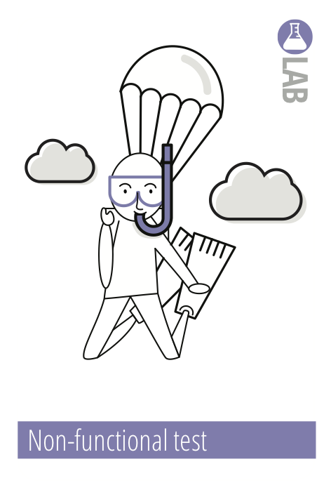

Dit onderzoek is onderverdeeld in drie delen, het uitzoeken hoe de hoofdvraag onderzocht kan worden, het uitvoeren van de verschillende tests en tot slot het analyseren van de verkregen resultaten. Voor deze drie verschillende onderdelen zijn drie verschillende methodes gebruikt.

||||
|:---:|:---:|:---:|
||||
|**!afbeelding** - *Methode: **Community research***|**!afbeelding** - *Methode: **Non-functional test***|**!afbeelding** - *Methode: **Data analytics***|

Het eerste onderdeel, Het uitzoeken van de manier van testen, zal gedaan worden door middel van de [Community research](https://ictresearchmethods.nl/Community_research) methode. Aangezien het testen van de repeatability is al bekend is in de robot arm industrie, is er voor dit onderdeel gekozen voor 'Community research'.

Het tweede onderdeel, het uitvoeren van de daadwerkelijke tests, zal gebeuren volgens de [Non-functional test](https://ictresearchmethods.nl/Non-functional_test) methode. Het weten van de repeatability van de robot is belangrijk, maar een niet-functioneel onderdeel van het project. De repeatability statistiek valt tussen de 'reliability' en 'performance' requirements.

Tot slot het derde onderdeel, het analyseren van de verkregen resultaten. Voor dit onderdeel is gekozen voor de methode [Data analytics](https://ictresearchmethods.nl/Data_analytics). Deze methode sluit perfect aan op de taak. Uit de verschillende tests zal een omvangrijke dataset komen. Deze dataset zal vervolgens geanalyseerd moeten worden om tot een concrete conclusie te komen.

!url Community research - ICT research methods. (z.d.). ICT Research Methods. Geraadpleegd op 15 april 2022, van [https://ictresearchmethods.nl/Community_research](https://ictresearchmethods.nl/Community_research)

!url Data analytics - ICT research methods. (z.d.). ICT Research Methods. Geraadpleegd op 15 april 2022, van [https://ictresearchmethods.nl/Data_analytics](https://ictresearchmethods.nl/Data_analytics)

!url Non-functional test - ICT research methods. (z.d.). ICT Research Methods. Geraadpleegd op 15 april 2022, van [https://ictresearchmethods.nl/Non-functional_test](https://ictresearchmethods.nl/Non-functional_test)