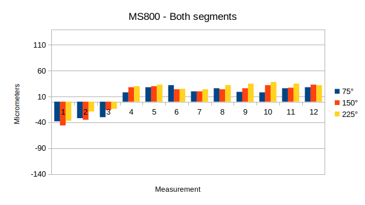
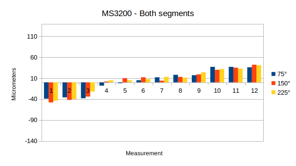

> De rauwe resultaten zijn terug te vinden in de bijlage (bijlage/results/exp_02_results.ods), de grafieken zijn terug te vinden op sheet 'spread' & 'segment' in hetzelfde doucment.

In de onderstaande tabel zijn de verschillende resultaten weergegeven, de kolommen zijn onderverdeeld in de verschillende bewegende segmenten en de rijen zijn de verschillende microstepping configuraties. Alle grafieken hebben dezelfde schaling.

||Eerste segment|Tweede segment|Beide segmenten|
|:---:|:---:|:---:|:---:|
|MS400 | | ||
|MS800 | | ||
|MS1600||||
|MS3200||||

**!tabel** - *Resultaten - **afwijking per microstepping configuratie, per segment in micrometers***

Naar verwachting is te zien naarmate de microstepping configuratie hoger wordt de afwijking van het nul-punt lager. Verder is ook te zien dat met name bij de kolom 'Tweede segment' de afwijking aanzienlijk hoger wordt naarmate de snelheid omhoog* gaat. Dit zal een direct resultaat zijn van het hogere gewicht van dat segment. De afwijking van het eerste segment is namelijk nagenoeg gelijk.

Opmerkelijke resultaten zijn dat het erop lijkt dat als beide segmenten tegelijk bewegen dat de afwijking minder wordt. Naar verwachting zou de afwijking van beide losse segmenten opgeteld moeten worden voor de resultaten van de beweging van beide segmenten. Een ander opmerkelijk resultaat zijn de grafieken van MS400 voor het tweede en beide segmenten. Bij deze grafieken zijn opmerkelijke dallen te zien bij een snelheid van 30 en 120 toeren per minuut. Dit is waarschijnlijk het resultaat van het raken van de van de natuurlijke 'resonance' van de stepper motor. Dit kan leiden tot een hogere vibratie van de motor en eventueel torque verlies. In dit geval dus een hogere afwijking in de metingen. Deze theorie wordt verder bevestigd door [dit](https://www.linearmotiontips.com/what-is-stepper-motor-resonance-and-how-can-it-be-avoided/) (Collins, 2020) artikel. Hierin wordt vermeld dat deze 'resonance' vermeden kan worden door een andere snelheid of een andere microstepping resolutie aan te nemen. Te zien in de grafieken van de andere microstepping resoluties (800,1600 & 3200) dat deze resonance verdwenen is.

> ```*``` De snelheid wordt elke drie metingen verhoogd.

||||
|:---:|:---:|:---:|
| | | |
|**!grafiek** - *Eerste segment 225°*|**!grafiek** - *Tweede segment - 225°*|**!grafiek** - *Beide segmenten - 225°*|

Wanneer de afwijking per microstepping resolutie vergeleken wordt per segment voor de 225° graden positie is te zien dat er zoals eerder vermeld naar verwachting nauwelijks verschil in afwijking te zien is voor de verschillende snelheden voor het eerste segment. Bij de tweede en beide segmenten is te zien dat de afwijking geleidelijk hoger wordt naarmate de snelheid toeneemt. Dit verloopt dus volgens verwachting.

!url Collins, D. (2020, 12 november). What is stepper motor resonance and how can it be avoided? Linear Motion Tips. Geraadpleegd op 15 april 2022, van [https://www.linearmotiontips.com/what-is-stepper-motor-resonance-and-how-can-it-be-avoided/](https://www.linearmotiontips.com/what-is-stepper-motor-resonance-and-how-can-it-be-avoided/)
