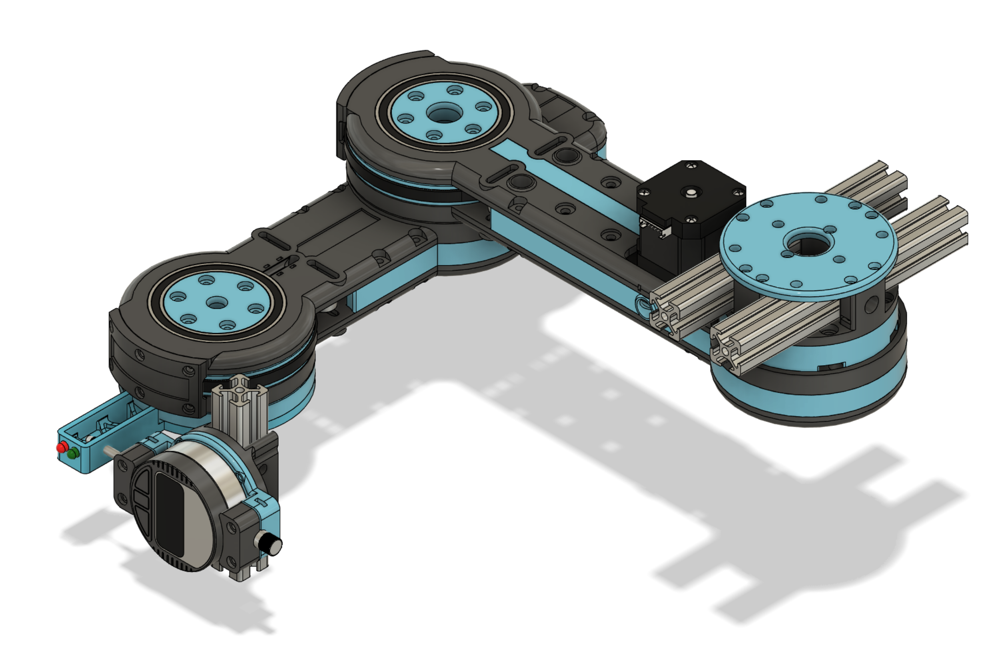

Voor het beantwoorden van deze deelvraag zal gekeken worden naar de verschillende configuraties van de robot die betrekking hebben tot de repeatability. In de onderstaande vier onderdelen is te lezen welke onderdelen gekozen zijn en waarom.

Deze aspecten zijn onder andere op [dit](https://www.youtube.com/watch?v=OU80pkbl-KM&t=8s&ab_channel=Skyentific) (Skyentific, 2018) filmpje gebaseerd  vanaf minuut twee (02:00 - 03:45) beginnen de tests, in deze tests wordt onderscheid gemaakt tussen beide afstand, snelheid en bewegende segmenten. Verder wordt er in [dit](https://www.youtube.com/watch?v=CCgI4R1TEzI&t=862s&ab_channel=ChrisAnnin) (Annin, 2017) filmpje nog een demonstratie gegeven van verschillende methodes voor het testen van repeatability (00:00 - 04:38).

|Onderdeel|Beschrijving|
|:---|:---|
|**Afstand**|Dit onderdeel is toegevoegd aan de test omdat als er een verschil in repeatability is in de test dit verschil proportioneel zou moeten zijn aan de afgelegde afstand. Als een segment van de arm bijvoorbeeld 90 graden beweegt en een afwijking heeft van tien procent dan zou de arm over een afstand van 180 graden een afwijking van 20% moeten hebben. Of deze theorie daadwerkelijk toepasbaar is op de robot zal met deze configuratie onderzocht worden.|
|**Microstepping**|Microstepping staat voor het opdelen van de basis resolutie van een stepper motor (meestal 200 stappen per revolutie) naar een hoger aantal stappen per revolutie ten koste van een bepaalde hoeveelheid torque, in [dit](https://www.linearmotiontips.com/microstepping-basics/) artikel is hier meer over te lezen. Ook is er een diepere uitleg van gegeven in het eerste experiment. In theorie zou een hogere stepper resolutie (microstepping) een positieve invloed moeten hebben op de repeatability van de arm. Een hogere resolutie betekend dat de stepper motor meer precies kan bepalen welke positie het precies moet aannemen om de beoogde positie aan te nemen.|
|**Snelheid**|Het aspect snelheid is toegevoegd aan dit experiment omdat het logischerwijs invloed heeft op de repeatability van een stepper motor. Een hogere snelheid verhoogd de kans op een gemiste stap en verlaagd de capaciteit van de motor om 'op tijd' te stoppen.|
|**Segmenten**|Het gebruik van meerdere segmenten van de robot zal ook invloed hebben op de repeatability van de robot. De huidige robot bestaat uit twee beweegbare onderdelen (zie onderstaande afbeeldingen). Het eerste onderdeel, het onderdeel dat de meetklok raakt, heeft bijvoorbeeld geen extra gewicht (load) aan het motor hangen en kan hierdoor zonder weerstand bewegen. Het tweede onderdeel is van zichzelf een stuk zwaarder en zal door dit extra gewicht ook anders presteren in de repeatability tests.|

| | |
|:---:|:---:|
|||
|**!afbeelding** - *Robot - **basis locatie***|**!afbeelding** - *Robot - **trigger locatie***|

!url Collins, D. (2019, 24 november). Microstepping for Stepper Motors. Linear Motion Tips. Geraadpleegd op 15 april 2022, van [https://www.linearmotiontips.com/microstepping-basics/](https://www.linearmotiontips.com/microstepping-basics/) 

!url Skyentific. (2018, 1 september). Is it the best DIY 3D printed robotic arm? Precision, speed and payload test. YouTube. Geraadpleegd op 15 april 2022, van [https://www.youtube.com/watch?v=OU80pkbl-KM&t=8s&ab_channel=Skyentific](https://www.youtube.com/watch?v=OU80pkbl-KM&t=8s&ab_channel=Skyentific)

!url Annin, C. (2017, 23 september). AR2 6 axis stepper motor robot. YouTube. Geraadpleegd op 15 april 2022, van [https://www.youtube.com/watch?v=CCgI4R1TEzI&t=862s&ab_channel=ChrisAnnin](https://www.youtube.com/watch?v=CCgI4R1TEzI&t=862s&ab_channel=ChrisAnnin)