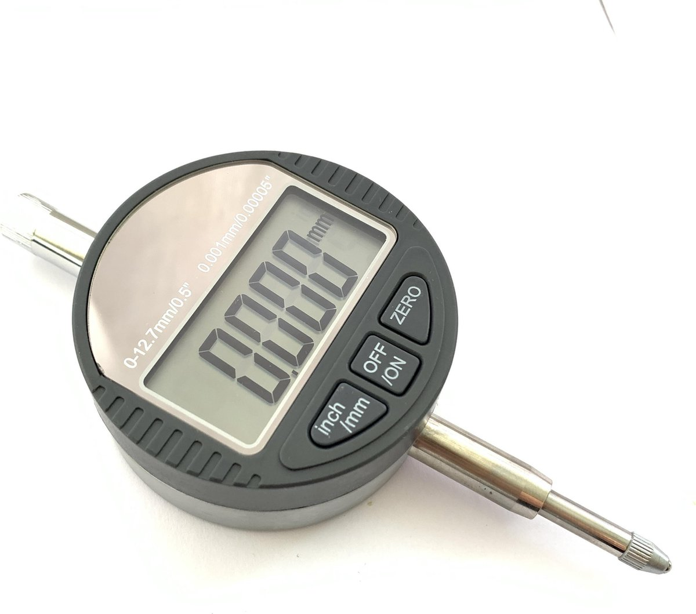

 
 

    <h1 style="font-size:50px;"> 
        DMP - Experiment 02 
    </h1>
    <h2 style="font-size:30px;">
        Repeatability testing
    <h2>
    

 
 

|                    |                                     |                      |                                 |
| :----------------- | :---------------------------------- | -------------------- | ------------------------------- |
| **Auteur**         | Luke van Luijn                      | **Minor**            | Digital Media Productions (DMP) |
| **Student nummer** | 587478                              | **Docentbegeleider** | Mario de Vries                  |
| **Opleiding**      | HBO-ICT                             | **Plaats**           | Nijmegen                        |
| **Profiel**        | Embedded Software Development (ESD) | **Datum**            | 15-04-2022                      |
| **Studiejaar**     | Jaar 3                              | **Versie**           | 1.0                             |

