<!-- 
// Aanpak
// Verwoord hier je aanpak.
// Welke onderzoeksgebieden zoals bieb, veld, werkplaats, lab en showroom uit de CMD
// Methodekaart heb je gebruikt? En welke technieken uit die onderzoeksgebieden heb je
// gebruikt? Waarom? En hoe heb je die ingezet?
// Iemand die het onderzoek niet kent zou op basis van deze informatie je onderzoek
// moeten kunnen nabootsen en bij gebruik van datageoriënteerde methodes
// vergelijkbare resultaten moeten krijgen.
// Vergeet bij de aanpak per techniek en methode die je toepast niet te vermelden -wie,
// wat, waar, waarom, wanneer, waarvoor en hoe- te vermelden. Leg uit (met) wie (je) de
// methode of techniek uitvoert, wat de bedoeling van de exercitie is en wat je verwacht,
// waar je de methode of techniek toepast (welke fysieke of online ruimte), waarom je het
// laat plaatsvinden (wat wil je te weten komen?), wanneer het plaatvindt, waarvoor het uit-
// eindelijk dient (het doel ervan), waardoor (wat is de aanleiding, waarom wil je dit weten)
// en hoe je exact de methode afneemt. 
-->
<style>
.rotate90 {
    -webkit-transform: rotate(270deg);
    -moz-transform: rotate(270deg);
    -o-transform: rotate(270deg);
    -ms-transform: rotate(270deg);
    transform: rotate(270deg);
}
</style>

<!-- 
// Empathize
// Het beeld dat je hebt geschetst van je onderwerp / vraagstuk/ wens / kernprobleem en (de wensen en
// behoeften) van de eindgebruiker en/of stakeholders laat zien dat je je voldoende hebt verdiept in het
// onderwerp.  
-->

Het eerste onderdeel van het project was bepalen wat er precies gemaakt ging worden. Wat voor robot ging er gemaakt worden, welke functionaliteiten moest deze robot bevatten. Wat voor componenten zouden er gebruikt worden om deze functionaliteiten te verwezenlijken.

## Het begin

Het project is begonnen met literatuur studies (ICA, z.d.). De eerste vraag die beantwoord moest worden was wat voor soort robot er gebouwd zou worden. Hierbij is vooral gekeken naar de volgende aspecten:

- Complexiteit van het ontwerp.
- Complexiteit van de besturingssoftware. 
- Gebruiksrichting.
- Bewegingssnelheid. 
- Persoonlijke interesse. 

Persoonlijk ben ik het meest geïnteresseerd in robots die een groot werk oppervlak hebben en snel kunnen bewegen. Gezien de doelgroep soortgelijk is aan mijzelf zijn deze onderdelen opgenomen. De complexiteit van beide het ontwerp en software zijn opgenomen in de lijst omdat het project in een half jaar voltooid moet zijn en een overmatig complexe robot is dan niet haalbaar. Tot slot de persoonlijke interesse, het is een groot project dat erg veel tijd zal gaan kosten. Als mijn persoonlijke interesse niet aansluit bij de gemaakte keuze zal het voltooien van het project lastig worden. Op basis van deze vereisten zijn er enkele ontwerpen overwogen (ICA, z.d.-a):

- Cartesiaanse Robot (link)
- Cylindrical Robot (link)
- SCARA (Selective Compliance Assembly Robot Arm) Robot (link)

Een Cartesiaanse robot is een robot die door middel van drie assen (X,Y,Z) de end effector (het uiteinde van de robot) naar specifieke posities kan verplaatsen. Dit type robot wordt veel gebruikt bij bijvoorbeeld 3D printers, CNC machines en soortgelijke applicaties. De complexiteit van het ontwerp is minimaal en er is veel informatie over te vinden gezien de 3D printen de laatste tijd erg gestegen is in populariteit waarmee ook het aantal zelf gemaakte 3D printers, hetzelfde geld voor de complexiteit van de besturingssoftware. De bewegingssnelheid van een cartesiaanse robot kan heel erg snel zijn afhankelijk van het model.

Dit type robot is echter afgevallen op gebied van persoonlijke interesse, het ontwerp miste de 'wow'-factor waar naar gezocht werd. Ik heb al eerder een 3D printer gemaakt en heb nu ook enkele 3D printers, hoewel het ontwerp van de aandrijving leuk is denk ik dat er niet voldoende uitdaging zou zitten in een dergelijk ontwerp.

Een Cylindrical robot is een robot die een uitschuifbare arm over een draaiende Z-as heen beweegt. Het is een ouder ontwerp en vrij gelimiteerd op basis van bewegingsvrijheid. De complexiteit van het model is vrij laag omdat het een vrij simpel ontwerp is. Door de simpliciteit van het ontwerp is de complexiteit van de besturingssoftware ook niet heel hoog. Door de gelimiteerde bewegingsvrijheid wordt de gebruiksrichting beperkt. Door het sterke en stabiele ontwerp is de robot precies en accuraat. 

Echter net zoals de cartesiaanse robot valt dit type robot af op basis van persoonlijke interesse. De uitdaging in ontwerp die bij dit type robot hoort is vrij hoog en daarmee erg interessant. echter dit type robot heeft een soortgelijk werkoppervlak als dat van bijvoorbeeld een SCARA robot.

Een SCARA robot is opgebouwd volgens hetzelfde principe als de Cylindrical robot echter in plaats van een uitschuifbare arm bevat de SCARA robot een drie-DOF axiale arm waardoor er meer complexe beweging mogelijk is. Dit maakt de complexiteit van het ontwerp en software een stuk hoger dan een cylindrical robot, het verhoogd ook de gebruiksrichting, maar verlaagd de bewegingssnelheid. 

De uiteindelijke keuze is gevallen op de SCARA robot. Het is een complex type robot die veel uitdagingen met zich meebrengt op gebied van ontwerp en software.

<!-- 
Define
Je hebt ontwerp- en / of onderzoeksvragen gesteld passend bij het doel, de
doelgroep of de probleemstelling, waarbij je in de formulering rekening hebt gehouden met de juiste
begrippen, richting, focus en de begrenzing.
Je hebt alle informatie uit je onderzoek helder geanalyseerd en hebt het onderwerp / vraagstuk / wens
/ kernprobleem duidelijk gemaakt en de ontwerpvraag / ontwerpvragen gedefinieerd. 
-->

## De functionaliteiten

Toen de richting van het project duidelijk was is er gekeken naar de functionaliteiten van de robot. Hoe groot moet de robot worden, wat moet de robot allemaal kunnen, hoe zal de robot opgebouwd worden en welke onderdelen zijn nodig voor de realisatie van deze functionaliteiten (ICA, z.d.-c).

De verschillende functionaliteiten van de robot zijn opgenomen en verdeeld over drie documenten. De functionaliteiten met betrekking tot het daadwerkelijke model van de robot zijn opgenomen in het [Model Design document - 3. Requirements](https://github.com/LukevLuijn/robox_docs/blob/bf2946f76c06f7e81c7152024e87009c6a20ca56/design/hardware/mdd/mdd_hardware.pdf) (bijlage X - mdd_hardware.pdf) In dit hoofdstuk worden alle functionaliteiten met betrekking tot de hardware gespecificeerd. In dit document wordt onder andere de snelheid en de omvang van de robot vastgesteld. 

Op gebied van firmware zijn de functionaliteiten van de applicatie gedocumenteerd in het [Software requirements specification](https://github.com/LukevLuijn/robox_docs/blob/f1926df7065f7596bd7ae3ef2e1dc76c82e2e259/design/firmware/srs/srs_firmware.pdf) (SRS) document (bijlage X - srs_firmware.pdf). Voor de GUI (grafische user interface) is er gelijknamig document opgesteld deze is terug te vinden in bijlage X - srs_software.pdf ([SRS](https://github.com/LukevLuijn/robox_docs/blob/f1926df7065f7596bd7ae3ef2e1dc76c82e2e259/design/software/srs/srs_software.pdf)).

In de SRS documenten van beide de firmware en de GUI zijn aan de hand van verschillende use cases requirements opgesteld. Deze requirements zijn later in de applicatie(s) verwerkt.

> misschien aanvullen?

<!-- 
// Ideate 1
// Je hebt aantoonbaar diverse ideeën en concepten gegenereerd, hebt zichtbaar uitgeprobeerd en hebt
// een afgewogen keuze voor verdere uitwerkingen gemaakt. 
-->

<div style="page-break-after: always;"></div>


## Het model

### iteratie 01 - Master & slave

||||
|:---:|:---:|:---:|
|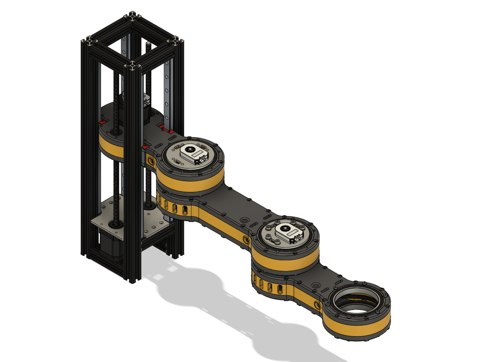|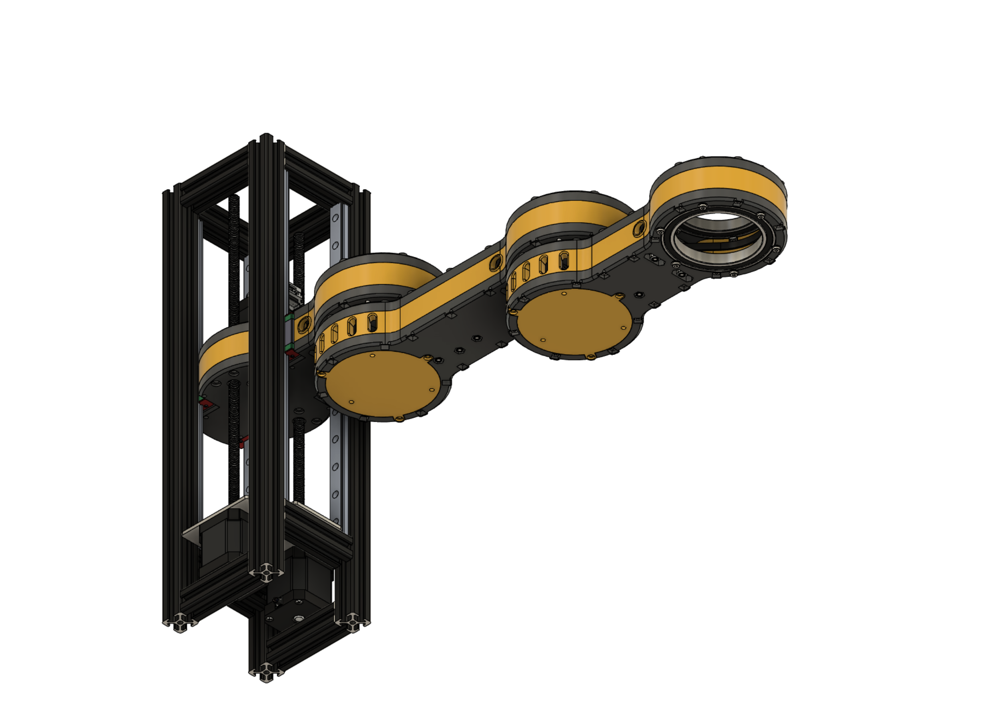|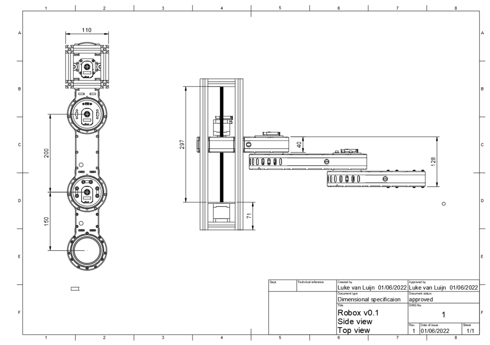|
|**!afbeelding** - *v01 - Top view*|**!afbeelding** - *v01 - Bottom view*|**!afbeelding** - *v01 - Dimensies*|

De eerste iteratie van het model was ontworpen met het idee dat elk segment van de robot een eigen 'slave' controller zou bevatten zodat elk segment draadloos met de andere slave controllers/hoofdcontroller zou kunnen communiceren zodat de robot vrijwel geen interne bedrading zou bevatten. in de afbeelding *'v01 - Bottom view'* zijn die gele cirkels te zien aan de onderkant, hier zouden deze slave controllers terecht komen.

Bij deze iteratie was de lineaire beweging gerealiseerd door middel van lineaire rails. Deze rails hebben als voordeel dat ze erg sterk zijn, weinig speling hebben en makkelijk zijn in gebruik, ze bevatten namelijk schroefgaten op beide de rails en de geleider. De rails zouden aan de binnenkant van het frame gemonteerd worden zodat de gehele arm binnen het frame langs zou bewegen. De electronica zou vervolgens aan de buitenkant van het frame gemonteerd worden. Dit was mogelijk omdat elk segment zijn eigen controller zou bevatten en de hoofdcontroller daarom een stuk minder componenten zou bevatten.

Per segment was de motor verantwoordelijk voor de beweging van het volgende segment gemonteerd in de as zelf. Dit had als resultaat dat er een strak ontwerp zonder zichtbare motoren gerealiseerd was maar dat een holle as onmogelijk was, daar zat de motor namelijk. Per motor montage locatie was er ook een op maat gemaakt aluminum plaat ontworpen. Deze platen zouden gebruikt worden voor het efficient verspreiden van de hitte die de motoren genereren.

Tot slot was deze iteratie voorzien van [incremental encoders](https://www.cuidevices.com/product/motion/rotary-encoders/incremental/modular/amt10-series), deze encoders zijn te zien in de afbeelding *'v01 - Top view'*. Deze encoders konden gebruikt worden voor het detecteren van botsingen, stap verlies en het uitvoeren van handmatige training van de robot.

Toen deze elementen uiteindelijk verwerkt waren in het ontwerp was er een evaluatie van het ontwerp gedaan (ICA, z.d.-c). De slave/master opzet voor de controllers was niet haalbaar. Per slave controller zou het ongeveer 40 euro kosten aan onderdelen omdat elke controller voorzien moest worden van of een microcontroller met wifi, een stroom converter die 24v naar 5v kon omzettenen en de PCB moest geprint worden door een extern bedrijf.

Omdat de losse controllers niet meer mogelijk waren was het ook niet meer mogelijk om de lineaire beweging binnen het frame te laten plaatsvinden. Deze ruimte was namelijk nu nodig voor het monteren van de verschillende componenten. Aan de hand van deze keuze kwamen nog ander aanpassingen: De lineaire rail moet gemonteerd worden op een onderdeel zoals de aluminium profielen waar het frame van gemaakt is. Als de robot niet binnen het frame langs gaat zouden deze rails aan de voorkant van het frame gemonteerd moeten worden waardoor de contact velden tussen de robot en het frame veel kleiner werden. Hierdoor is de keuze voor lineaire rails ook komen te vervallen.

### iteratie 02 - The bigger the better

||||
|:---:|:---:|:---:|
|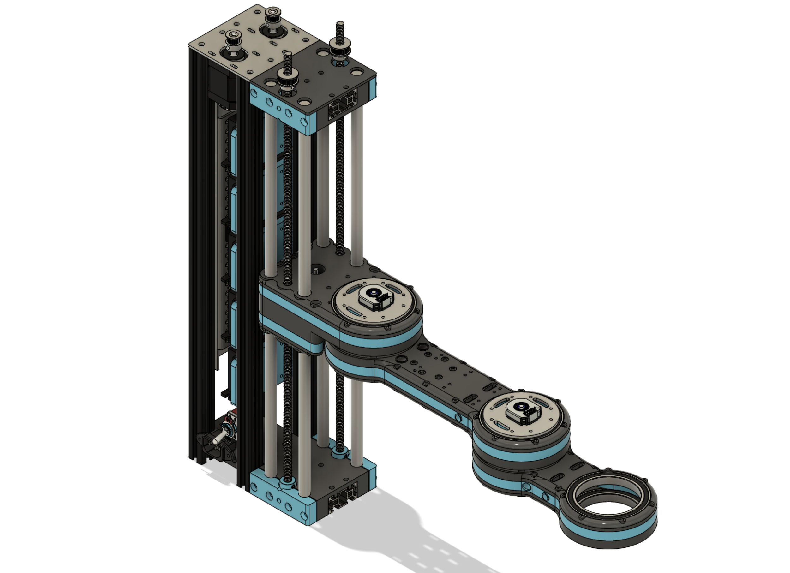|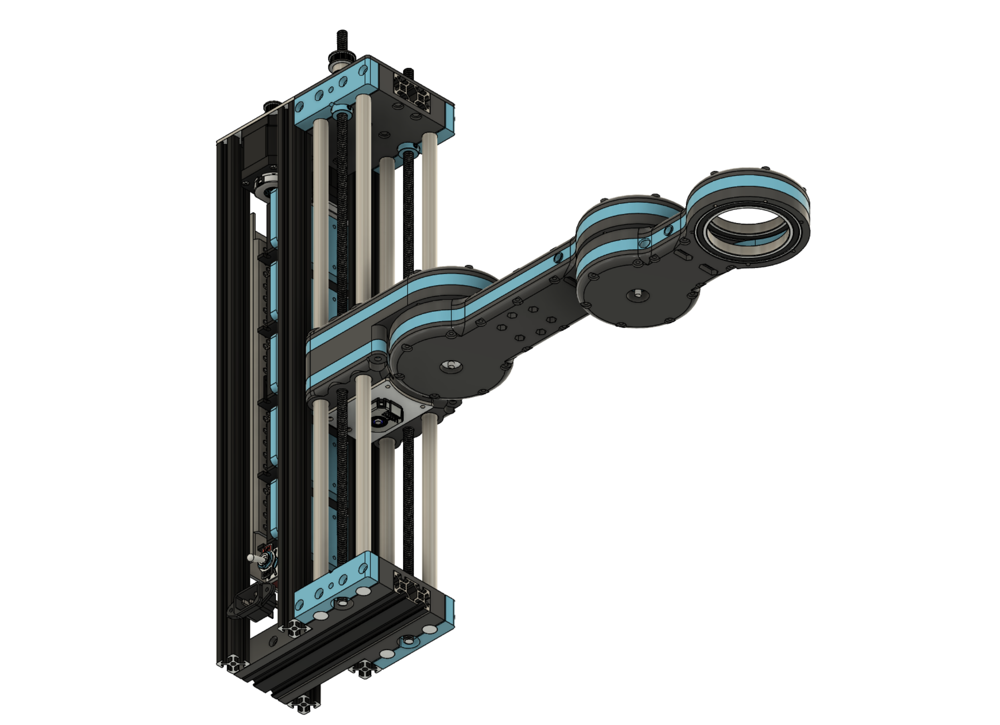|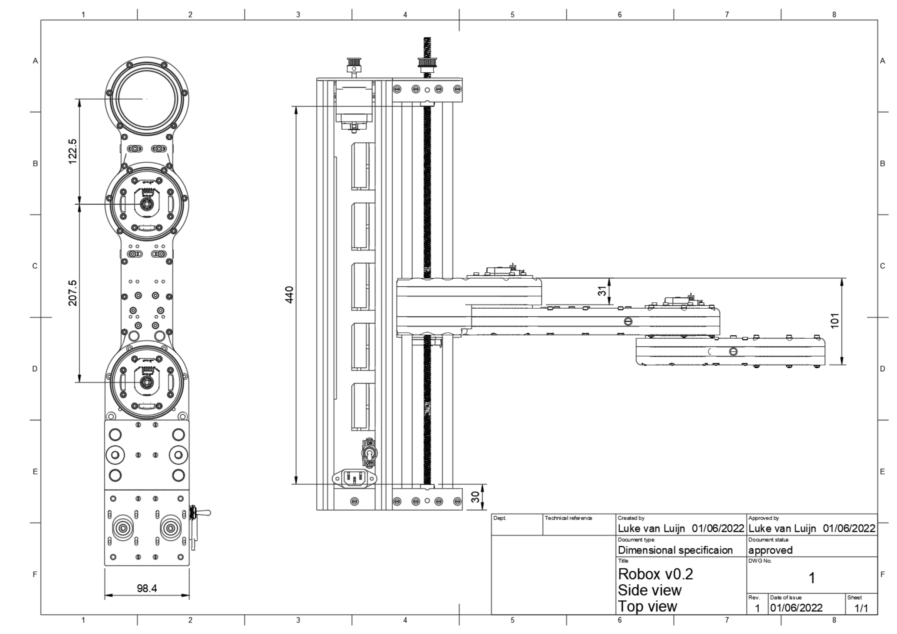|
|**!afbeelding** - *v02 - Top view*|**!afbeelding** - *v02 - Bottom view*|**!afbeelding** - *v02 - Dimensies*|

Bij de tweede iteratie is de focus gevallen op het vergroten van het gehele systeem. Doordat de keuzen bij de vorige iteratie is gevallen op een gecentraliseerde controller moest de lineaire beweging gerealiseerd worden buiten het frame. Dit resulteerde in een constructie te zien in afbeelding *'v02 - Top view'* & *'v02 - Bottom view'*. Het frame was bij deze iteratie verantwoordelijk voor de structuur van het apparaat en het huizen van de electronica. De lineaire beweging maakt nu gebruik van (veel goedkopere) lineaire assen. De assen hoeven enkel boven en onder aan het systeem gemonteerd te worden waardoor het frame losstaat van het geheel.

Op basis van deze keuzes moest het frame vergroot worden. De controller moest er nu in passen en door de goedkopere assen was dit geen probleem. De aandrijving van de lineaire beweging zijn bij deze iteratie aan de bovenkant van het frame gemonteerd. Hierdoor kon het arm onderdeel van de robot een stuk dieper zakken (41 millimeter). Maar nu was het niet meer mogelijk om de leadscrews direct op de motor te monteren omdat dit het frame nog een extra 80 millimeter zou verhogen. De oplossing was om een tandriem transmissie toe te passen met een 1:1 reductie zodat de motoren op dezelfde hoogt gemonteerd konden worden als de leadscrews zelf.

De verschillende segmenten konden door de gecentraliseerde controller ook aanzienlijk (9 millimeter) slanker gemaakt worden. Bij deze iteratie is er ook gekeken naar de bewegingsruimte van de arm. Het is de bedoeling dat het laatste segment van de arm meer dan 360 graden kan draaien op elk mogelijke positie van het middelste segment. Dit was niet mogelijk bij de eerste iteratie. Om deze eis te volbrengen is er gekozen voor het verlengen van het middelste segment en het inkorten van het laatste segment. Hierdoor kan de arm nu onder het middelste segment door zonder het frame te raken.

Na de afloop van het eerste experiment (bijlage X - experiment_01) werd er geconstateerd dat de axiale beweging van het eerder gebruikte systeem niet voldoende was. Er werd gebruik gemaakt van twee radiale lagers waarin het volgende segment gemonteerd zat. Echter hebben radiale lagers een capaciteit voor dynamische load (het kunnen weerstaan van beide axiale en radiale krachten) maar deze was niet voldoende voor het uiteindelijke systeem. 

Er is er toen voor gekozen om dit complete ontwerp te niet te stellen en eerst een paar kleine tests uit te voeren met axiale en radiale lagers gecombineerd (ICA, z.d.-b). Deze tests zijn in de onderstaande afbeeldingen te zien.

<div style="page-break-after: always;"></div>


||||
|:---:|:---:|:---:|
|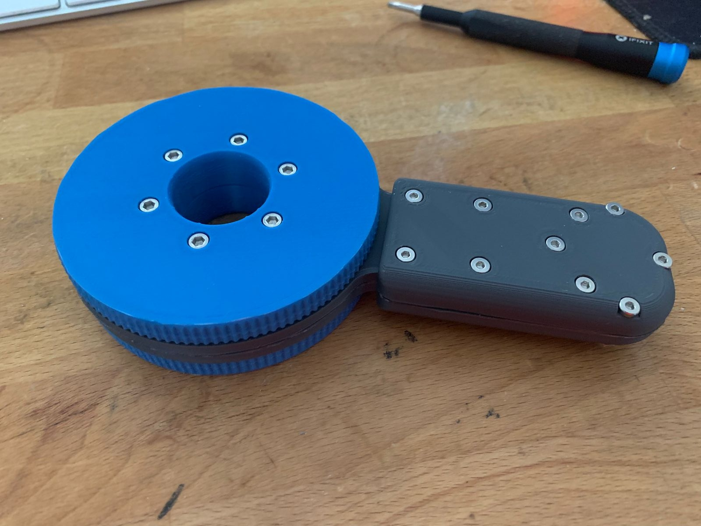|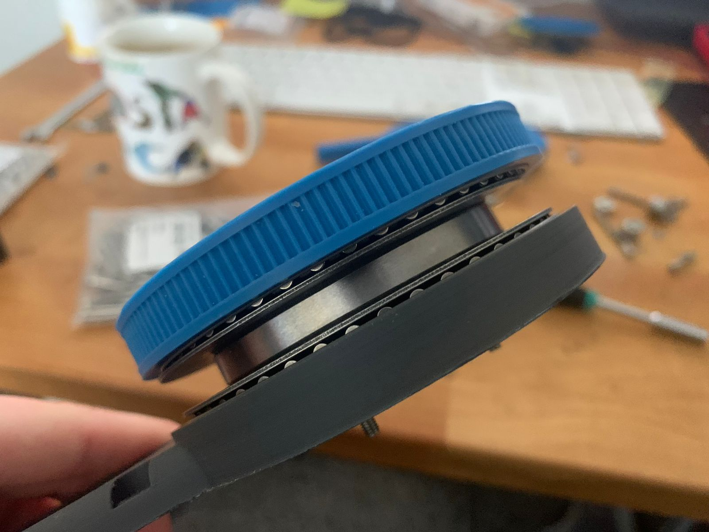|
|**!afbeelding** - *Lager test - 1*|**!afbeelding** - *Lager test - 2*|

Op de rechter afbeelding is de samenhang van de lagers te zien. Op de linker afbeelding te uitgewerkte test. Deze test heeft de inzichten geleverd is tolerantie voor de lagers en op welke punten er druk (van de bouten) gezet kan worden zonder dat de draai capaciteit gelimiteerd wordt.

Door deze verandering in ontwerp moest er een nieuwe iteratie komen, de laatste. Deze iteratie staat hieronder beschreven.

### iteratie 03 - Less is more

||||
|:---:|:---:|:---:|
|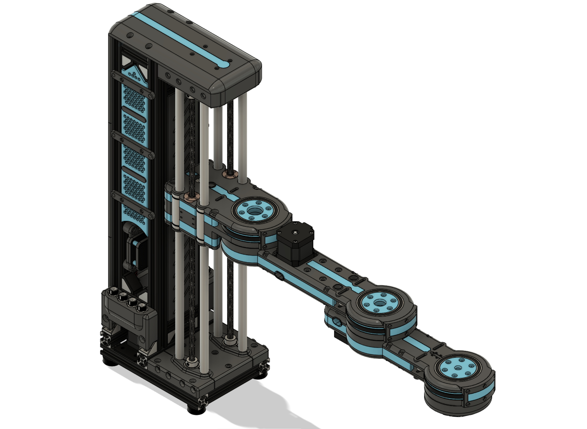|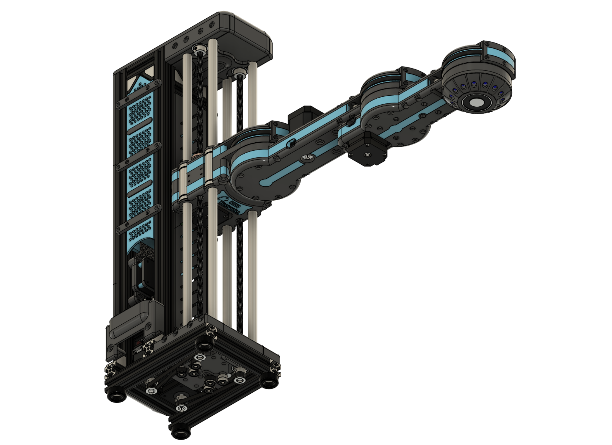|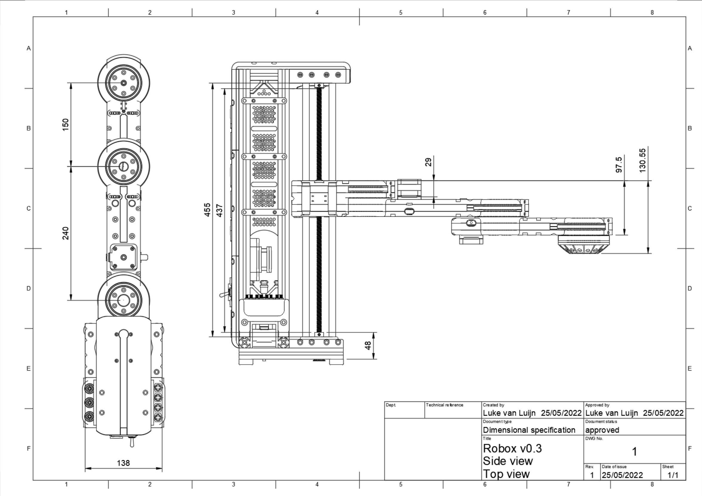|
|**!afbeelding** - *v03 - Top view*|**!afbeelding** - *v03 - Bottom view*|**!afbeelding** - *v03 - Dimensies*|

Voor de verwerking van de nieuwe lager combinatie waren een aantal zaken niet meer mogelijk die verwerkt waren in de voorgaande iteraties. De motoren konden niet meer in de assen gemonteerd worden gezien de ruimte in de assen nu nodig was als lager behuizing. Er is gekozen voor een motor montage aan de buitenkant van het frame, hierdoor worden de motoren beter gekoeld en is er minder kans op het smelten van de robot. Omdat er nu ook meer ruimte was voor de montage van de motoren is er gekeken naar een 'off-the-self'-oplossing voor het warme probleem. Na een klein onderzoek (ICA, z.d.-a) kwamen er twee standaard stepper brackets tevoorschijn die deze taak prima kon vervullen, deze nieuwe brackets kosten ongeveer 3,- euro per stuk wat ongeveer 43,- euro scheelt met de op maat gemaakte plaatjes die eerder in het ontwerp verwerkt waren.

Door de extra lagers is het arm onderdeel significant gestegen in gewicht, zo'n 200 gram per lager, twee lagers per as (extra) voor drie assen. Door al dit extra gewicht moest er opnieuw nagedacht worden over de constructie van het frame. De motoren van de lineaire beweging zijn nogmaals van locatie veranderd, weer aan de onderkant. Ook is het frame aan de onderkant verbreedt om ook aan de zijkanten extra stabiliteit te bieden.

Tijdens het eerste experiment is er ook gekeken naar de werking en effectiviteit van de eerder genoemde encoders. Hieruit is gebleken dat de encoders erg veel ruis opvangen van de motoren. Om efficient gebruik te maken van de encoders zou elke encoder voorzien moeten worden van een 'shielded cable' dit is een kabel met een faraday cage, dit is een behuizing van fijn gevlochten metaal waar een actief ground signaal doorheen loopt (Wikipedia contributors, 2022), dit type kabel kan de EMI (electro magnetic interference) uitgestoten door de motoren. Deze kabels zijn omvangrijk en duur. Naast alle essentiële onderdelen in de robot was er nagenoeg geen ruimte meer voor de dikke encoder kabels. De combinatie van dure kabels, dure encoder en weinig ruimte heeft ervoor gezorgd dat de encoders geschrapt zijn uit het ontwerp.

De verdere uitwerking van deze iteratie is terug te vinden in het [Model design document - hoofdstuk 4 & 5](https://github.com/LukevLuijn/robox_docs/blob/bf2946f76c06f7e81c7152024e87009c6a20ca56/design/hardware/mdd/mdd_hardware.pdf)

### De verwezelijking

Toen alle onderdelen van het model uitgewerkt waren is er begonnen aan het printen van de [75 modellen](https://github.com/LukevLuijn/robox/tree/main/robox_models), te beginnen bij de onderdelen van segment 03, de pols. 

||||
|:---:|:---:|:---:|
||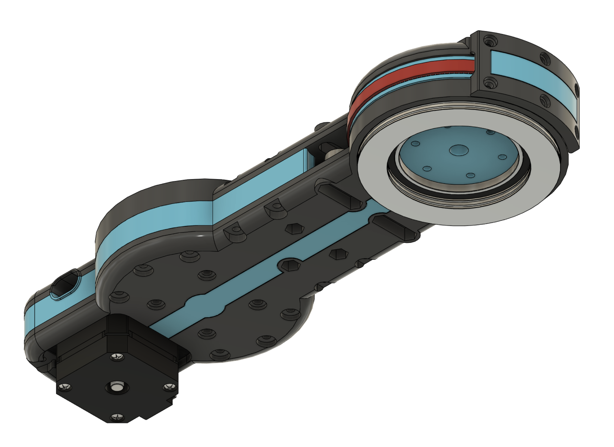|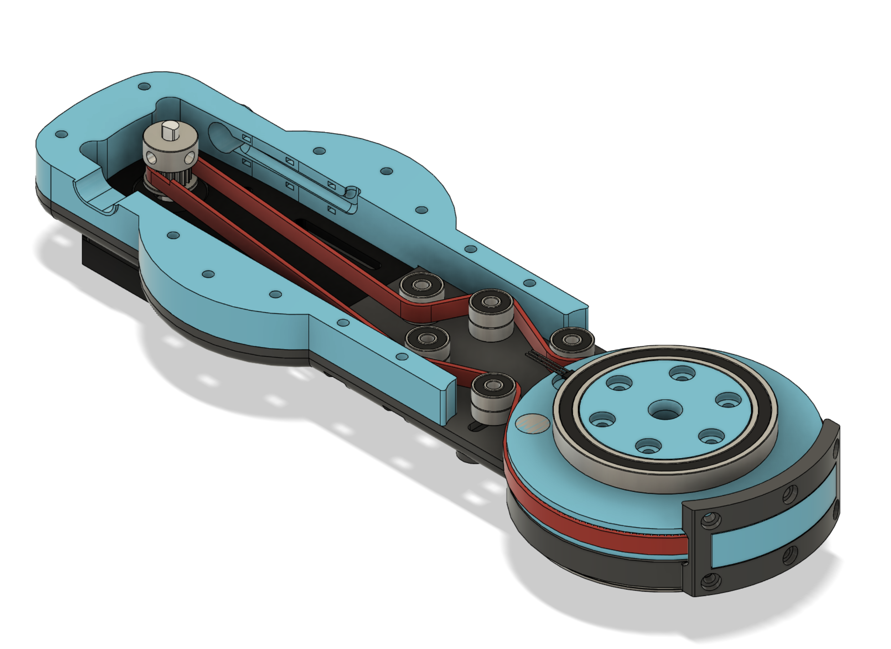|
|**!afbeelding** - *Pols - Top view*|**!afbeelding** - *Pols - Bottom view*|**!afbeelding** - *Pols - Inner view*|

Tijdens de constructie van de pols kwamen er enkele problemen naar boven. In het oorspronkelijke model waren de verschillende idlers (afbeelding: *Pols - Inner view*) door het model heen gemonteerd, daar wordt mee bedoelt dat ze aan de buitenkant vastgemaakt moesten worden. Hierdoor was het onmogelijk om de tandriem vast te maken (rood in de afbeeldingen). De oplossing was vrij simpel, maak de lagers aan de onderkant vast en maak ruimte voor de bouten in het bovenste deel. om dit te testen is het model eerst handmatig aangepast en later opnieuw geprint.

Tijdens het testen van het segment, door veel te draaien aan de pulley, kwam er nog een probleem aan het licht. De tandriem bewoog na meerdere rotaties van de pulley af. Als de pulley weer de andere kant op bewogen werd ging hij weer terug naar zijn originele plek. Dit probleem vond alleen plaats wanneer de pulley met de klok mee gedraaid werd.

Dit probleem kon meerdere oorzaken hebben; het kan komen omdat de grote pulley geen extra omheining heeft aan de boven en onderkant, het kan komen doordat de verschillende idlers hetzelfde gebrek hebben of dat de pulley gemonteerd op de motor op een andere hoogte is gemonteerd dan de grote pulley.

Uiteindelijk heb ik het probleem opgelost door een vorkje te printen met de exacte dikte als de gemodelleerde afstand tussen de pulley en de motor. 

<div style="page-break-after: always;"></div>

||||
|:---:|:---:|:---:|
|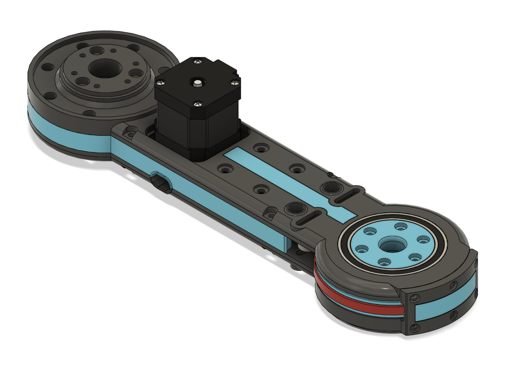|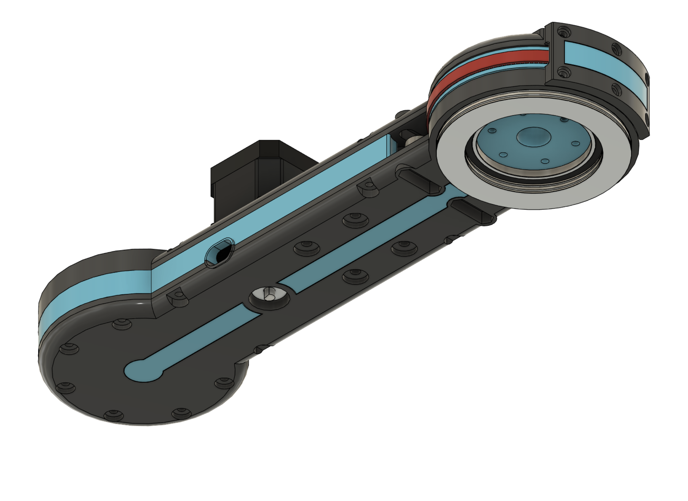|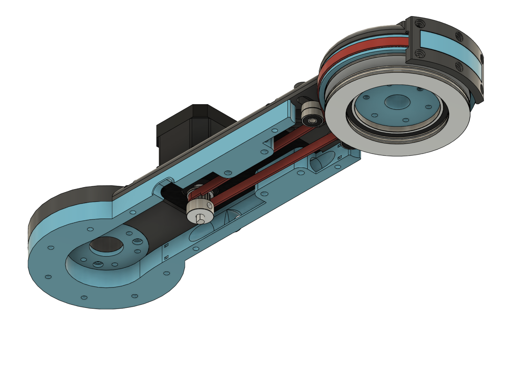|
|**!afbeelding** - *Elleboog - Top view*|**!afbeelding** - *Elleboog - Bottom view*|**!afbeelding** - *Elleboog - Inner view*|

Toen de onderdelen van de elleboog geprint waren begon de constructie. Om een nieuw segment (de elleboog) te monteren op het oude segment (de pols) moet de pulley met het onderste deel van het nieuwe segment eerst aan het oude segment gemonteerd worden (afbeelding *Elleboog - constructie 1*). Tijdens dit proces kwam er een probleem naar boven. In het oorspronkelijke ontwerp waren de moeren bedoelt voor de montage van het nieuwe segment niet in het model verwerkt, deze moesten achteraf vastgemaakt worden wat niet mogelijk was omdat de pols al gemonteerd was.

Om dit probleem op te lossen is er een inkeping gemaakt in de onderkant van het bovenste deel van het oude segment. In deze inkeping konden de moeren verwerkt worden. Vervolgens is er een plaatje overheen gemonteerd die deze moeren op hun plek houden.
De inkeping is te zien in de afbeelding *Elleboog - constructie 3*, het plaatje is te zien in de afbeelding *Elleboog - constructie 2* (het blauwe plaatje waar de kabels doorheen gaan). Deze oplossing is beide voor de pols en de elleboog toegepast gezien beide segmenten op dezelfde manier gemonteerd worden.

Omdat bij de elleboog de motor aan de 'verkeerde' kant van het segment gemonteerd zit was het vrij lastig om de tandriem aan de pulley te monteren. Zoals verteld word de pulley namelijk eerst aan de pols gemonteerd met de onderkant van het huidige segment

||||
|:---:|:---:|:---:|
|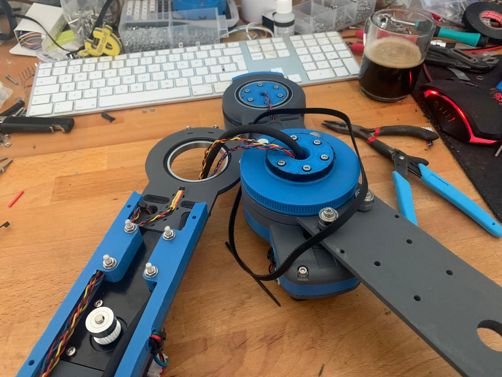|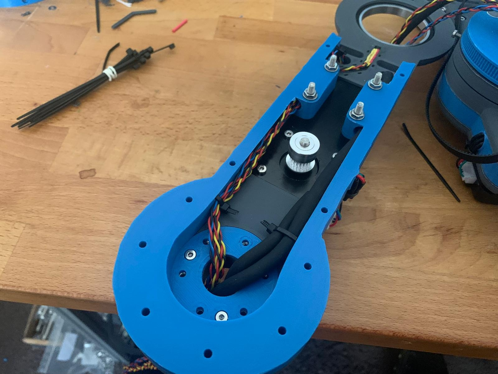|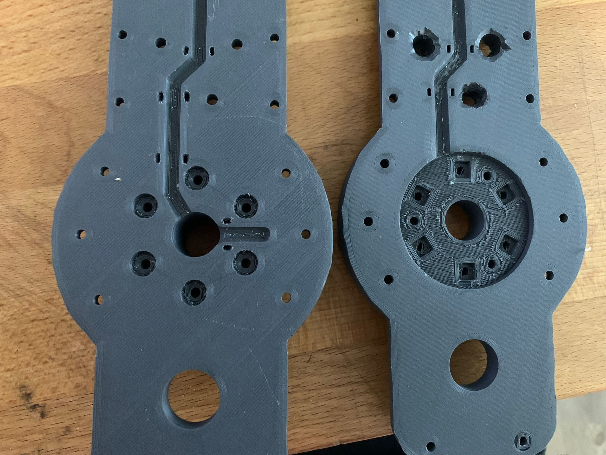|
|**!afbeelding** - *Elleboog - constructie 1*|**!afbeelding** - *Elleboog - constructie 2*|**!afbeelding** - *Elleboog - constructie 3*|

Het geheel moet vervolgens tegelijkertijd in elkaar geschroefd worden, dus de tandriem over de pullies heen en de verschillende onderdelen tegen elkaar aan. Verder trad hetzelfde probleem op als bij de pols, dat de tandriem van de pulley af gleed. Hiervoor is dezelfde oplossing gebruikt, een vorkje. 

Tijdens het [tweede experiment](https://github.com/LukevLuijn/robox_docs/blob/main/experiment/experiment_02/experiment_02.pdf) (bijlage X - experiment_02) is er een basis variant van de uiteindelijke homing sequence uitgewerkt. tijdens de implementatie van deze sequence was duidelijk geworden dat het oorspronkelijke idee om twee magneten te gebruiken voor het triggeren van de hall effect sensor geen slim idee was. Door het gebruik van twee magneten kan er onduidelijkheid ontstaan bij een segment dat meer dan 360 graden kan draaien over welke magneet nou precies is geraakt. Na afloop van het experiment zijn de pullies van beide de pols en de elleboog opnieuw gemaakt met een enkele magneet in plaats van twee.

||||
|:---:|:---:|:---:|
|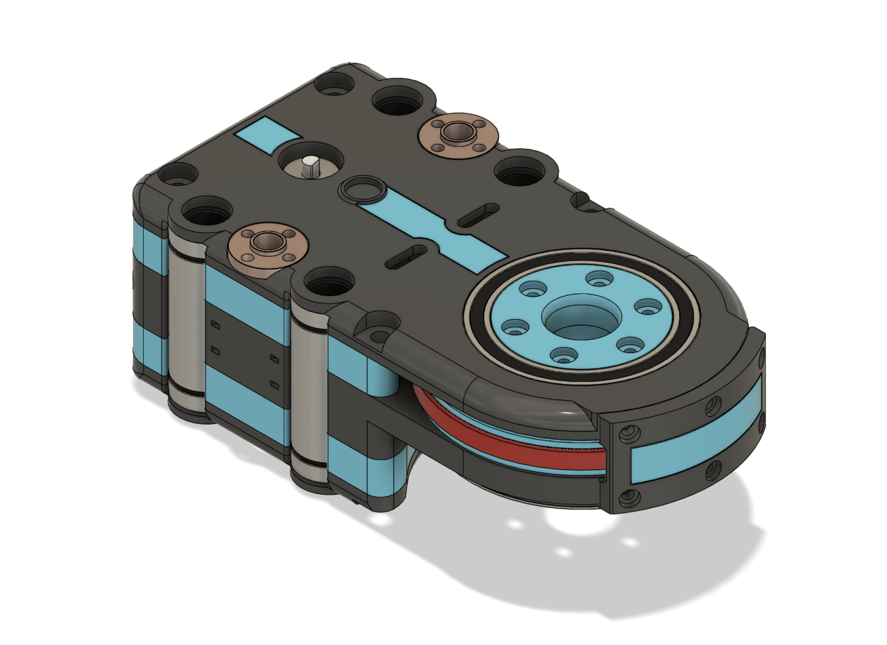|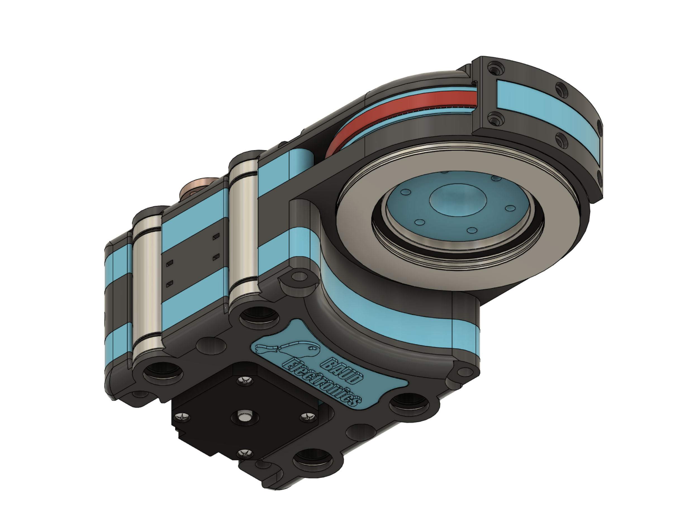|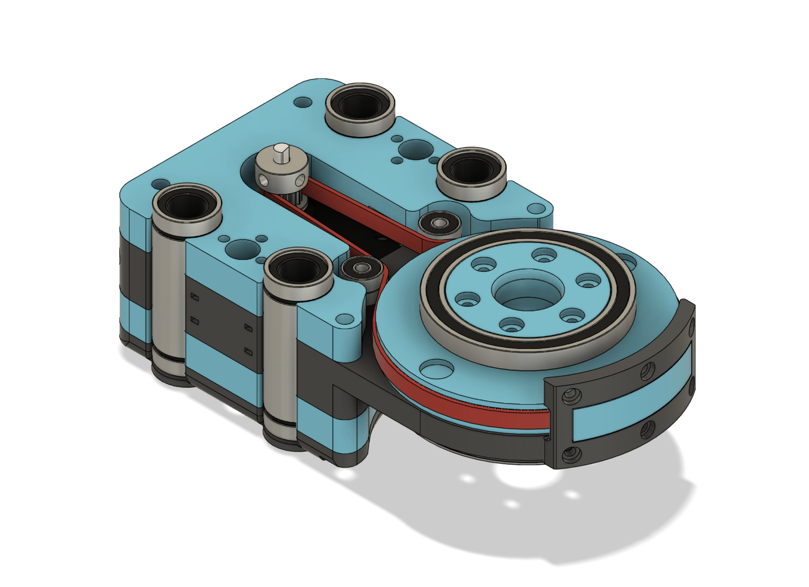|
|**!afbeelding** - *Schouder - Top view*|**!afbeelding** - *Schouder - Bottom view*|**!afbeelding** - *Schouder - Inner view*|

Bij de constructie van de schouder werd duidelijk dat het ontwerp meerdere fouten bevatten. De lineaire lagers die gebruikt zijn in dit ontwerp, de LM12LUU lagers, worden samen geperst door het bovenste en onderste onderdeel van de schouder, beide deze elementen hadden **support* nodig, dit resulteerde een extra millimeter aan beide kanten. hierdoor paste de lagers niet meer in het model. Toen dit probleem vervolgens was verholpen door de dikte van het onderste deel aan te passen kwam er nog een probleem aan het licht.
Het idee van dit model was om de verschillende lagen te klemmen met vier 60 millimeter M5 bouten. In het ontwerp was rekening gehouden met de tolerantie tussen de verschillende onderdelen maar in mindere maten met de vervorming van het PLA onder druk. Wanneer de bouten aangedraaid werden raakte het bovenste deel van het model de pulley (zie afbeelding *Schouder - constructie 2*). De enige oplossing was om de bouten minder strak aan de draaien waardoor de structuur van het model minder is. Hiervoor is geen oplossing gevonden en is momenteel nog steeds aanwezig in het uiteindelijke product (en zorgt een een aanzienlijke 'wiebel' in het systeem).

> ```*``` *Support* wordt gebruikt door 3D printers om onderdelen die 'in de lucht' hangen tijdens het printen te ondersteunen. Hierdoor ontstaat een ruw laag die vaak lelijk is en iets meer uitsteekt dan het oorspronkelijke model (Afbeelding: *Schouder - constructie 1*)

||||
|:---:|:---:|:---:|
|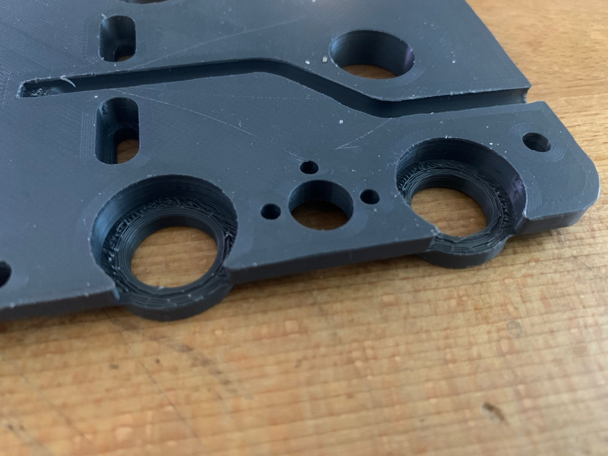|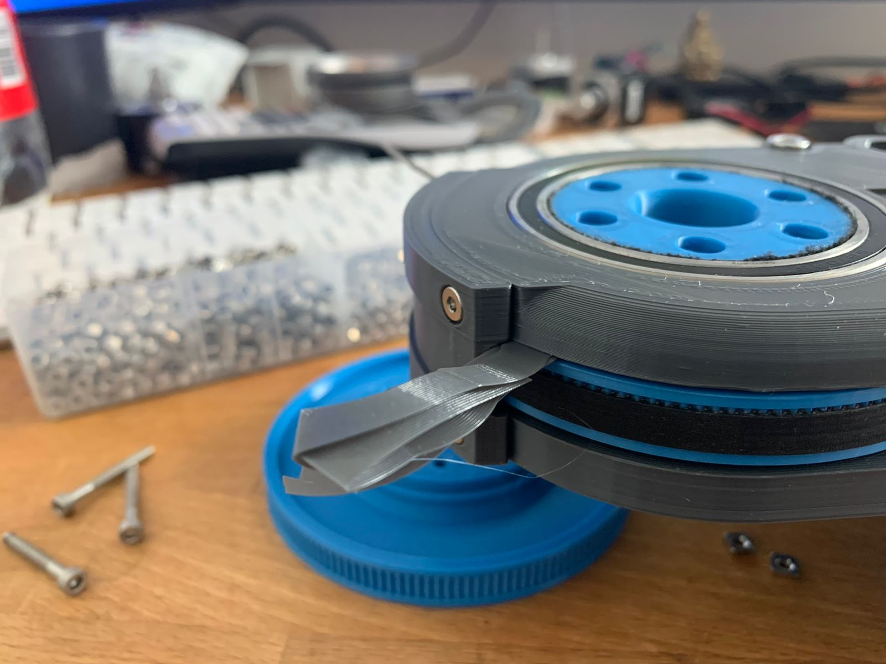|
|**!afbeelding** - *Elleboog - constructie 1*|**!afbeelding** - *Elleboog - constructie 2*|


<div style="page-break-after: always;"></div>


|||||
|:---:|:---:|:---:|:---:|
| 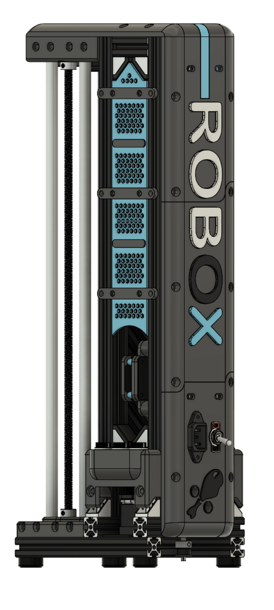 |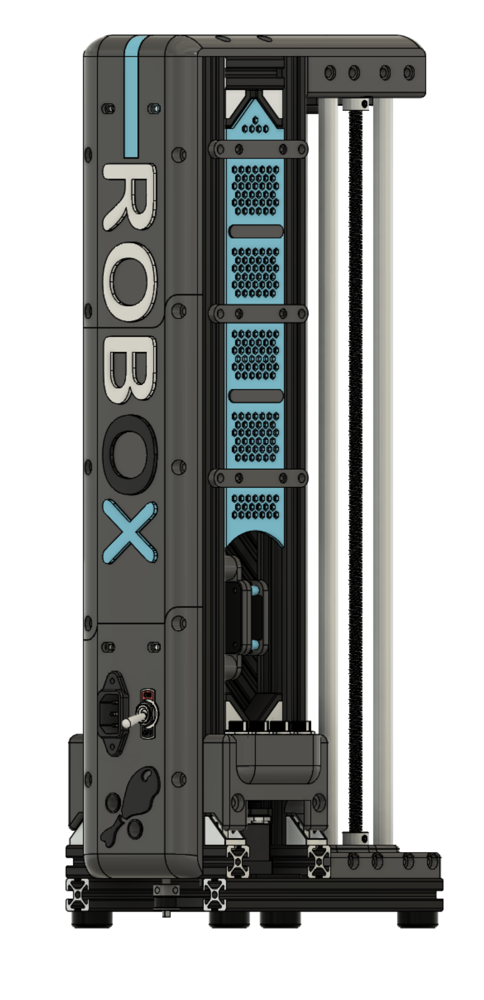 |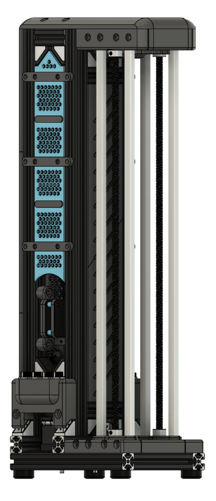 |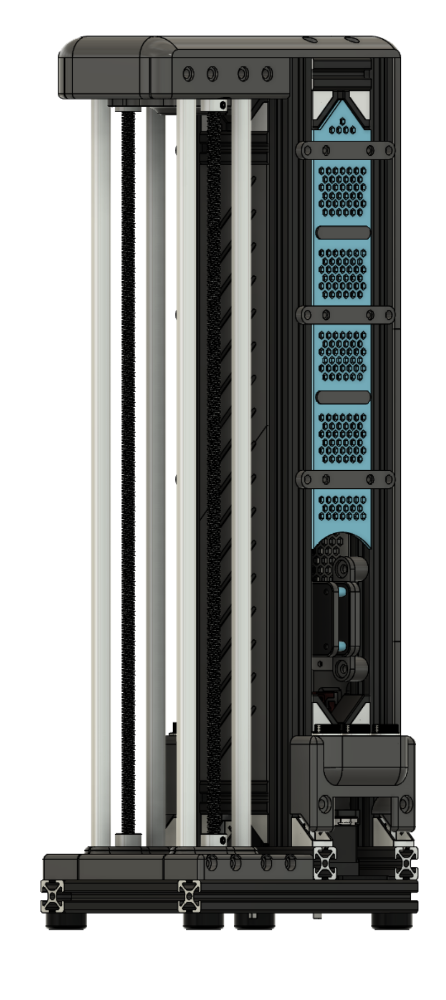 |
|       **!afbeelding** - *Frame - Back left view*       |**!afbeelding** - *Frame - Back right view*       |**!afbeelding** - *Frame - Front right view*       |**!afbeelding** - *Frame - Front left view*       |

De constructie van het frame verliep over het algemeen vrij vlekkeloos. Zoals in het [MDD document](https://github.com/LukevLuijn/robox_docs/blob/bf2946f76c06f7e81c7152024e87009c6a20ca56/design/hardware/mdd/mdd_hardware.pdf) (bijlage X - mdd_hardware.pdf) verteld is het frame opgebouwd uit een 'electronica'-deel en een 'lineaire beweging'-deel. Deze onderverdeling maakte het uiterst makkelijk om de electronica te monteren en te bedraden. Ook het opzetten van de lineaire beweging was erg makkelijk.

Pas wanneer alle sub constructies in elkaar gezet waren kwamen de problemen aan tevoorschijn. Er zat een aanzienlijke 'wiebel' in de leadscrews dit resulteerde een flinke vibratie, hierdoor kon de Z-as niet sneller manoeuvreren dan 3000 stappen per seconden (7,5 millimeter per seconden) dit zou betekenen dat de Z-as voor een beweging over de volledige hoogte bijna een minuut nodig heeft. 

Om dit probleem op te lossen zijn twee strategieën toegepast. De eerste was het dubbel ondersteunen van de leadscrew aan de onderkant van het systeem, in de voet van de robot, door middel van twee lagers. Dit hielp met de wiebel maar de vibratie was nog steeds duidelijk aanwezig. Door middel van een communitiy research (ICA, z.d.-b) ben ik erachter gekomen dan velen met een soortgelijk probleem de leadscrew niet voorzien van een lager aan het uiteinde, precies om deze reden, de vibratie. En ja hoor, toen de lager verwijdert was uit het systeem was de vibratie grotendeels weg en kon de Z-as een snelheid behalen van 18000 stappen per seconden of 45 millimeter per seconden.

Toen het arm onderdeel van de robot gemonteerd werd op de Z-as bleek dat het systeem niet uit zichzelf kon blijven staan. Het oppervlak van de voet van de robot was te klein waardoor deze omviel bij een gestrekte arm. Dit probleem was op twee manieren op te lossen. Of de robot wordt aan een tafel gemonteerd. Of er wordt een extra voet onder geplaatst. De laatste optie is gekozen omdat deze robot in de toekomst nog enkele keren verplaatst moet worden.

<div style="page-break-after: always;"></div>


<!-- 
// Ideate 2
// Je hebt aantoonbaar diverse ideeën en concepten gegenereerd, hebt zichtbaar uitgeprobeerd en hebt
// een afgewogen keuze voor verdere uitwerkingen gemaakt. 
-->

## De firmware

Voor de constructie van de firmware is zoals verteld eerst een [software requirements specification](https://github.com/LukevLuijn/robox_docs/blob/f1926df7065f7596bd7ae3ef2e1dc76c82e2e259/design/firmware/srs/srs_firmware.pdf) (Bijlage X - srs_firmware.pdf) document opgezet. In dit document zijn de verschillende functionaliteiten van de firmware opgezet aan de hand van brainstorm sessies met de opdrachtgever. Deze functionaliteiten zijn vervolgens verwerkt in een usecase diagram. Verschillende belangrijke usecases zijn uitgewerkt in fully-dressed formaat. 

Op basis van de verschillende usecases zijn ook de functionele en niet-functionele requirements opgezet. Deze zijn terug te vinden in hoofdstuk 4 van het eerder genoemde document. Op basis van deze usecases en requirements is vervolgens begonnen aan de ontwikkeling van het product.

Voor de ontwikkeling van de firmware is gekozen voor een prototyping methode. Door eerst verschillende losse functionaliteiten op te zetten door middel van een los prototype en deze verschillende gevalideerde prototypes uiteindelijk samen te voegen in het eindproduct.

Gezien de projecten vrij omvangrijk zijn op gebied van functionaliteit is het opzetten van verschillende losse functionaliteiten erg 
handig voor het behouden van overzicht. Uiteindelijk zijn er vier losse prototypes uitgewerkt die ieder een eigen functionaliteit omvatten. 

### Homing

Het eerste prototype was het opzetten van de [homing sequence](https://github.com/LukevLuijn/robox_docs/tree/main/prototypes/firmware/homing_test) (Bijlage X - prot_firmware_homing). Gezien de robot nooit weet waar de motoren gepositioneerd zijn moet er altijd eerst een homing sequence uitgevoerd worden zodat deze posities bekend zijn binnen de applicatie. Het resultaat van dit prototype is op [dit](https://github.com/LukevLuijn/robox_docs/blob/main/prototypes/firmware/homing_test/assets/homing_test_clip_00.mp4?raw=true) filmpje te zien.

### Message

In het tweede prototype stond het opzetten van het [message protocol](https://github.com/LukevLuijn/robox_docs/blob/5a576d66592b60c4cc0f502a02241a3a4e38defe/protocol/protocol_description.pdf) centraal. Het message protocol wordt gebruikt door beide de GUI en firmware en is dan ook de fundering van de communicatie tussen de twee onderdelen. De uitwerking van dit prototype is terug te vinden op [deze](https://github.com/LukevLuijn/robox_docs/tree/main/prototypes/firmware/message_test) (Bijlage X - prot_firmware_message) pagina.

### Serial

Opvolgend aan de uitwerking was het derde prototype, [Serial](https://github.com/LukevLuijn/robox_docs/tree/main/prototypes/firmware/serial_test). De communicatie tussen de twee onderdelen neemt plaats over seriële communicatie. Om dit te valideren is er eerst een component test (ICA, z.d.-c) uitgevoerd. In deze test is er een driver opgezet die tien berichten verstuurd over de seriële bus telkens met een bepaald interval. Vervolgens wordt het interval gehalveerd en worden er nogmaals tien berichten verstuurd.

Aan de firmware kant worden deze berichten uitgelezen en verwerkt in het systeem. Zodra de berichten verwerkt zijn worden ze geprint naar de console. Op deze manier kan bijgehouden worden of alle berichten op ontvangen worden door de firmware en dat er geen data verlies plaatsvind tussen de twee componenten. De geteste intervallen zijn 800,400,200,100,50,25,12,6,3 en 1 milliseconde. Het resultaat is te zien in [dit](https://raw.githubusercontent.com/LukevLuijn/robox_docs/main/prototypes/firmware/serial_test/assets/serial_speed_test_00.mp4) filmpje (Bijlage X - serial_speed_test_00.mp4). 

Zoals te zien in het filmpje is er geen dataverlies en worden alle intervallen netjes ontvangen. Voor het uiteindelijke product moest er minimaal een interval van 10 milliseconden gerealiseerd worden. De test was dus succesvol.

### State machine

Het vierde en laatste prototype is het [prototype - state machine](https://github.com/LukevLuijn/robox_docs/tree/main/prototypes/firmware/state_machine_test) (Bijlage X - prot_firmware_state_machine)

Om de verschillende functionaliteiten van de robot te implementeren is er gebruik gemaakt van een state machine. De state machine kan op een elegante manier op basis van input (de messages) verschillende functionaliteiten uitvoeren. Deze keuze is verder uitgevoerd in het [software design description](https://github.com/LukevLuijn/robox_docs/blob/f1926df7065f7596bd7ae3ef2e1dc76c82e2e259/design/firmware/sdd/sdd_firmware.pdf) document van de firmware (bijlage X - sdd_firmware.pdf) (hoofdstuk 4.2 & 4.5).

Voor het prototype is er een klein spel opgezet. Je gooit met twee dobbelstenen. Als het aantal ogen van deze dobbelstenen gelijk is aan twaalf win (Win state) je het spel, bij twee verlies (Lose state) je en bij elk ander getal moet je opnieuw gooien (Again state).

In [dit](https://github.com/LukevLuijn/robox_docs/blob/main/prototypes/firmware/state_machine_test/assets/state_machine_test_clip_00.mp4?raw=true) filmpje is het resultaat van dit prototype te zien. Voor het visuele aspect is er een blauw LEDje gekoppeld aan de 'Again state', een rood LEDje voor de 'Lose state' en een groen LEDje voor de 'Win state'. Het spel wordt geactiveerd door middel van een knop.

<div style="page-break-after: always;"></div>


## De software

Voor de ontwikkeling van de software (GUI) is er net zoals bij de firmware eerst een [software requirements specification](https://github.com/LukevLuijn/robox_docs/blob/f1926df7065f7596bd7ae3ef2e1dc76c82e2e259/design/software/srs/srs_software.pdf) (bijlage X - srs_software.pdf) document opgezet. In dit document zijn de verschillende functionaliteiten verkregen uit een brainstorm sessie met de opdrachtgever verwerkt. Eerst is er een usecase diagram opgezet (Hoofdstuk 3) die al deze functionaliteiten bevat. Vervolgens zijn er enkele belangrijke usecases uitgewerkt in fully-dressed formaat (Hoofdstuk 5). Op basis van de verschillende usecase zijn de functionele en niet-functionele requirements opzet. Deze zijn gesorteerd volgens de MoSCoW methode. Elke requirement is voorzien van een markering of deze in het uiteindelijke product verwezenlijkt is (Hoofdstuk 6.1 & 6.2).

### GUI schetsen 

Hoewel er pas later in het project begonnen is aan de ontwikkeling van de GUI zijn er in het verloop van het project meerdere UI schetsen gemaakt om een beeld te creëren van de te implementeren systemen. Onderstaand zijn enkele van deze schetsen te zien, op volgorde.

||||
|:---:|:---:|:---:|
|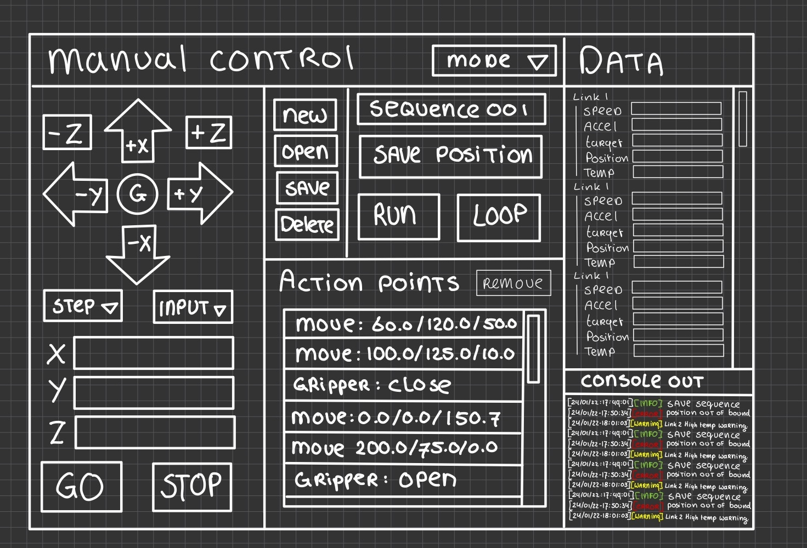|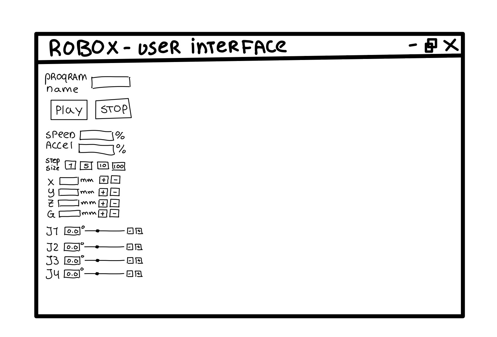|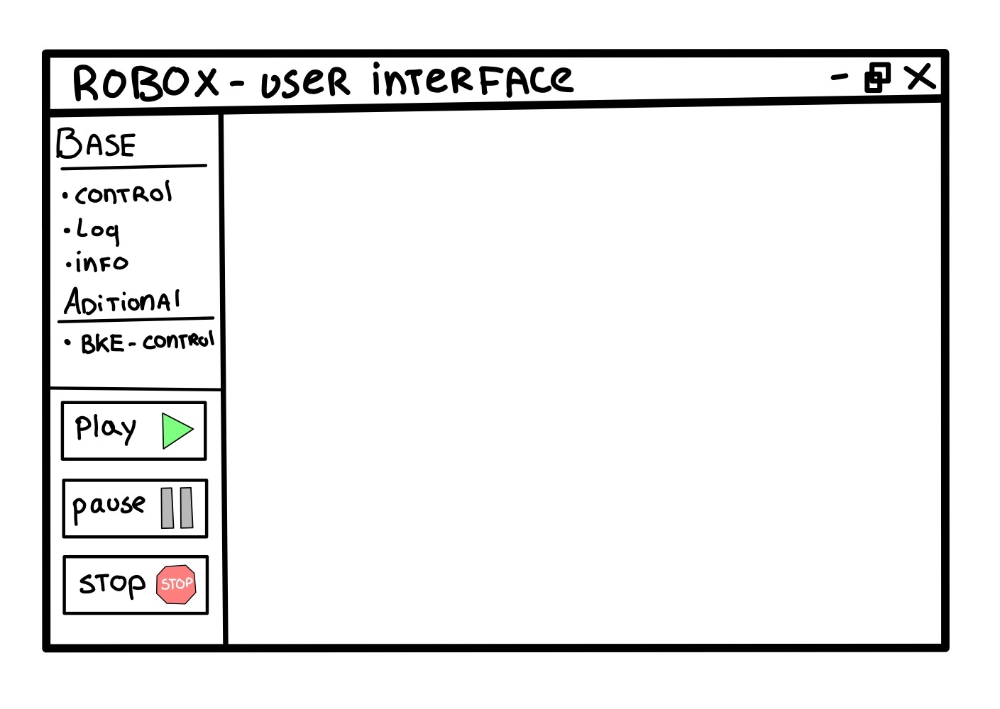|
|**!schets** - *GUI schets 1*|**!schets** - *GUI schets 2*|**!schets** - *GUI schets 3*|
|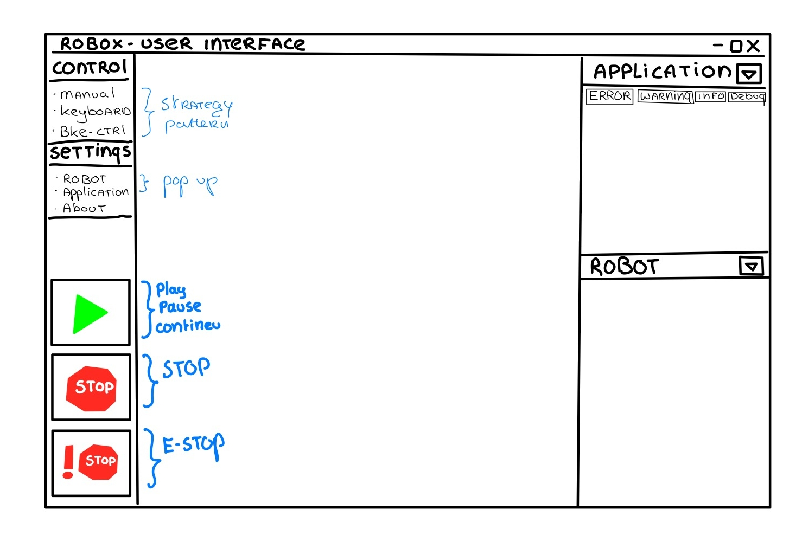|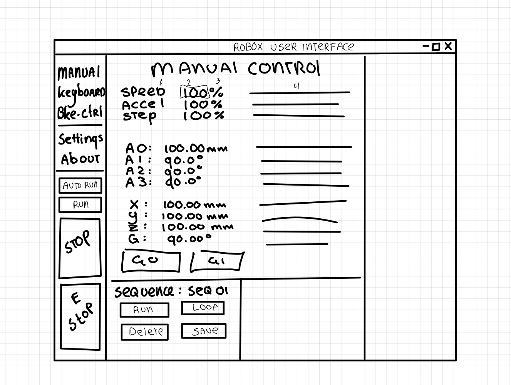||
|**!schets** - *GUI schets 4*|**!schets** - *GUI schets 5*||

### Rapid application development

Voor de ontwikkeling van de GUI wordt gebruik gemaakt van de library [wxWidgets](https://www.wxwidgets.org/). Deze library maakt het mogelijk om een cross-platform GUI te ontwikkelen, deze library is ook gebruikt tijdens de opleiding. Voor de ontwikkeling van de daadwerkelijke frames is gebruik gemaakt van de Rapid application development (RAD) tool [wxFromBuilder](https://github.com/wxFormBuilder/wxFormBuilder), deze tool maakt het mogelijk om relatief snel een frame te bouwen.

<div style="page-break-after: always;"></div>

### Iteratie 01 - Toetsenbord en muis

|||
|:---:|:---:|
|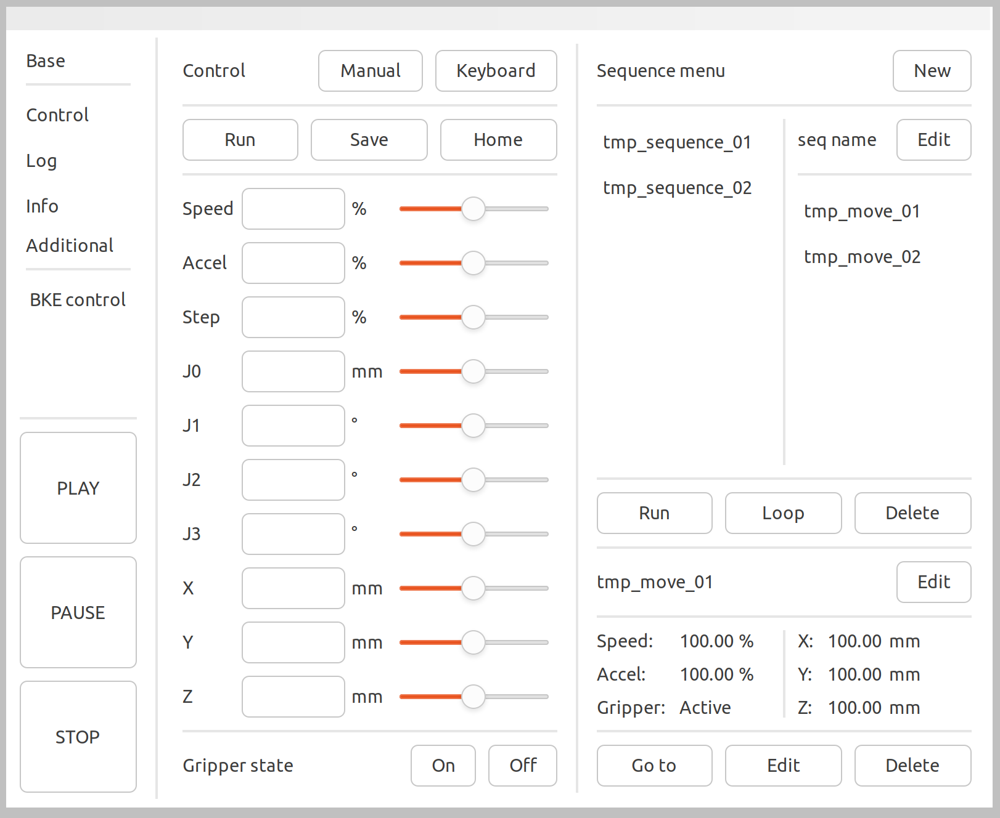|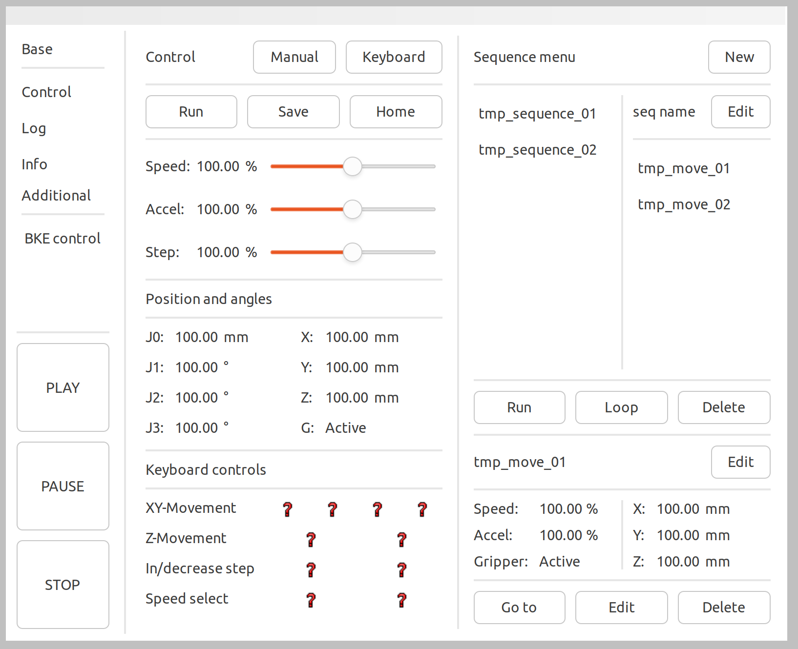|
|**!afbeelding** - *iteratie 01 - frame manual*|**!afbeelding** - *iteratie 01 - frame keyboard*|

> De vraagtekens in de afbeelding zijn placeholders voor uiteindelijke afbeeldingen.

De eerste iteratie van de GUI bevatte drie onderdelen. Het besturen van de robot door middel van sliders en tekstvelden, dit controle systeem is terug te zien in de afbeelding *iteratie 01 - frame manual*. Bij dit besturingssysteem was ht de bedoeling dat verschillende waardes aangepast zouden worden aan de hand van de eerder genoemde componenten. Vervolgens kon er op de 'Run'-knop gedrukt worden waardoor deze nieuwe waardes naar de robot gestuurd zouden worden volgens het [message protocol](https://github.com/LukevLuijn/robox_docs/blob/5a576d66592b60c4cc0f502a02241a3a4e38defe/protocol/protocol_description.pdf).

Het tweede onderdeel van deze iteratie is terug te zien in de afbeelding *iteratie 01 - frame keyboard*. Dit systeem kon geactiveerd worden door op de 'Keyboard'-knop te drukken boven in het frame. Deze controle methodiek was gebaseerd op dat de gebruiker verschillende toetsen op het toetsenbord indrukt, deze toetsen worden vervolgens direct vertaald naar bewegingscommando's en naar de robot verstuurd. De XY-positie van de robot kon worden bestuurd met de WASD-toetsen. De hoogte van de robot kon bestuurd worden met de pijltjes toetsen (pijltje omhoog voor omhoog, pijltje omlaag voor omlaag). De stap grote van de robot (hoeveel stappen per actie) kon worden ingesteld met de 1 t/m 0 toetsen, waarbij elke toets een percentage van de maximale stap grote zou zijn (1 = 10%, 0 = 100%). en tot slot de snelheid, deze kon ingesteld worden aan de hand van de '+' en '-' toetsen.

Het derde onderdeel in deze iteratie is het sequence paneel, deze is te zien in beide afbeeldingen (*iteratie 01 - frame manual*, *iteratie 01 - frame keyboard*) (rechts). Dit paneel was verantwoordelijk voor het aanmaken, opslaan, aanpassen, en verwijderen van sequences.

Een sequence is een verzameling van verschillende bewegingen die op volgorde afgespeeld konden worden. Wanneer er door middel van een control methodiek een bepaalde beweging is uitgevoerd kan deze opgeslagen worden in een sequence. Dit kan gedaan worden voor een aantal verschillende bewegingen (zo veel als je wilt). Deze sequence kan vervolgens afgespeeld worden zodat de robot alle bewegingen uitvoert die opgeslagen zijn in de sequence. Op deze manier kan de robot 'getraind' worden voor een bepaalde activiteit, en deze activiteit herhaaldelijk uitvoeren.

<div style="page-break-after: always;"></div>


### Iteratie 02 - Sequence paneel

Bij de tweede iteratie is er voor gekozen om in verband met de naderende deadline de onderdelen bij manual control en keyboard control los te koppelen waardoor deze separaat van elkaar ontwikkeld konden worden, te beginnen bij het manual control onderdeel.

Beide het sequence paneel en het manual control paneel moest significant gesimplificeerd worden, wederom in verband met de deadline. Het resultaat is te zien in de onderstaande afbeelding *Iteratie 02 - Main frame*

|||
|:---|:---|
|In deze afbeelding is te zien dat de sliders, voor het bepalen van de hoeken en de cartesiaanse coördinaten, weggehaald zijn. Het sequence paneel zoals verteld sterk gesimplificeerd. Een beweging (move) kan nu opgeslagen worden in een sequence. Een sequence kan niet meer aangepast worden enkel afgespeeld. Deze simplificatie bevat nog steeds de basis functionaliteit van het sequence paneel maar laat een groot complex onderdeel vallen waardoor de kans groter werd dat de applicatie voor de deadline gerealiseerd zou worden.|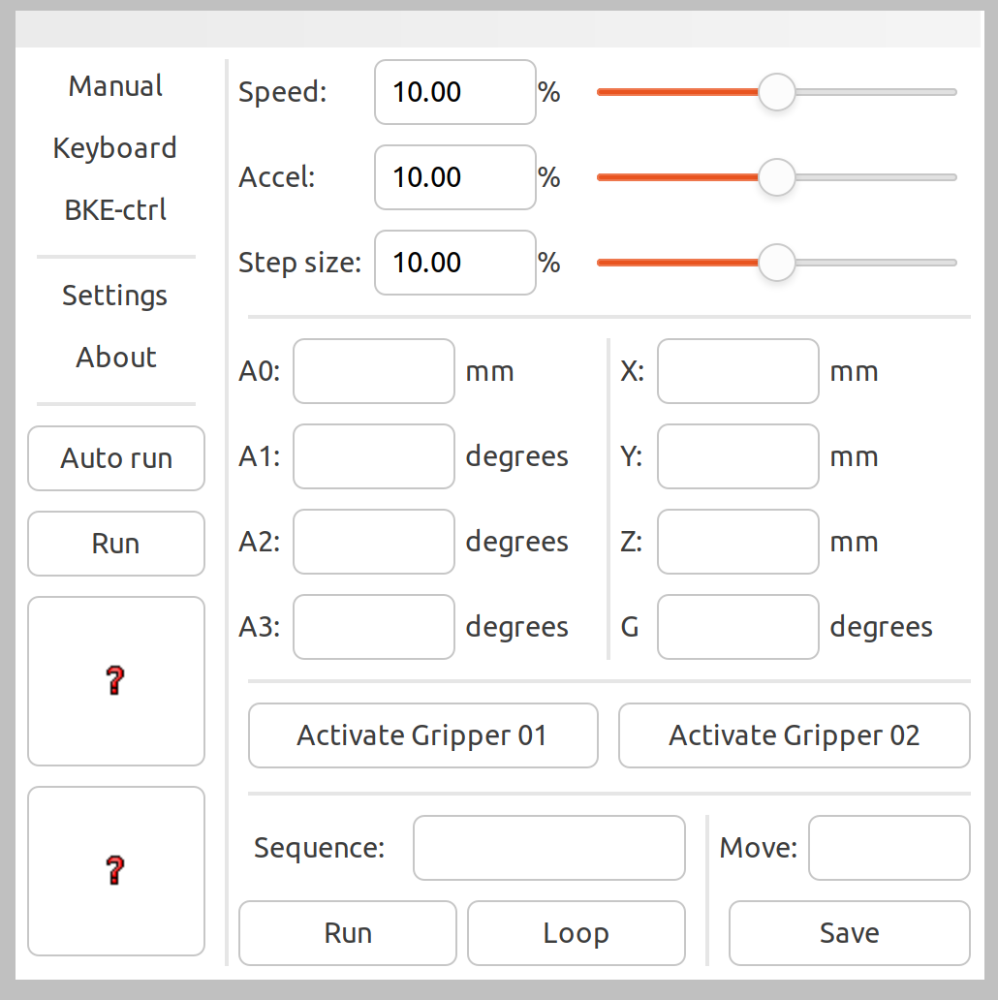|
||**!afbeelding** - *iteratie 02 - Main frame*|

### Iteratie 03 - Hoeken en coördinaten

De derde iteratie was de laatste iteratie voor de GUI. Omdat het sequence paneel erg veel complexiteit met zich meebracht is uiteindelijk toch voor gekozen dit onderdeel te laten vervallen voor het huidige project. De basis functionaliteit van het project is nog steeds haalbaar zonder het sequence paneel.

|||
|:---|:---|
|Omdat de sliders die weggehaald waren bij de vorige iteratie toch eigenlijk wel erg geschikt waren voor de besturing van de robot, zeker voor het testen, zijn ze in deze iteratie weer terug gekomen. Er is wel voor gekozen om de besturing door middel van cartesiaanse coördinaten en de besturing aan de hand van hoeken te splitsen in twee lossen panelen. Er kon onderling gewisseld worden tussen deze panelen door op de knop 'Angles' te drukken voor besturing met hoeken, en op de knop 'Cartesian' voor besturing met coördinaten. |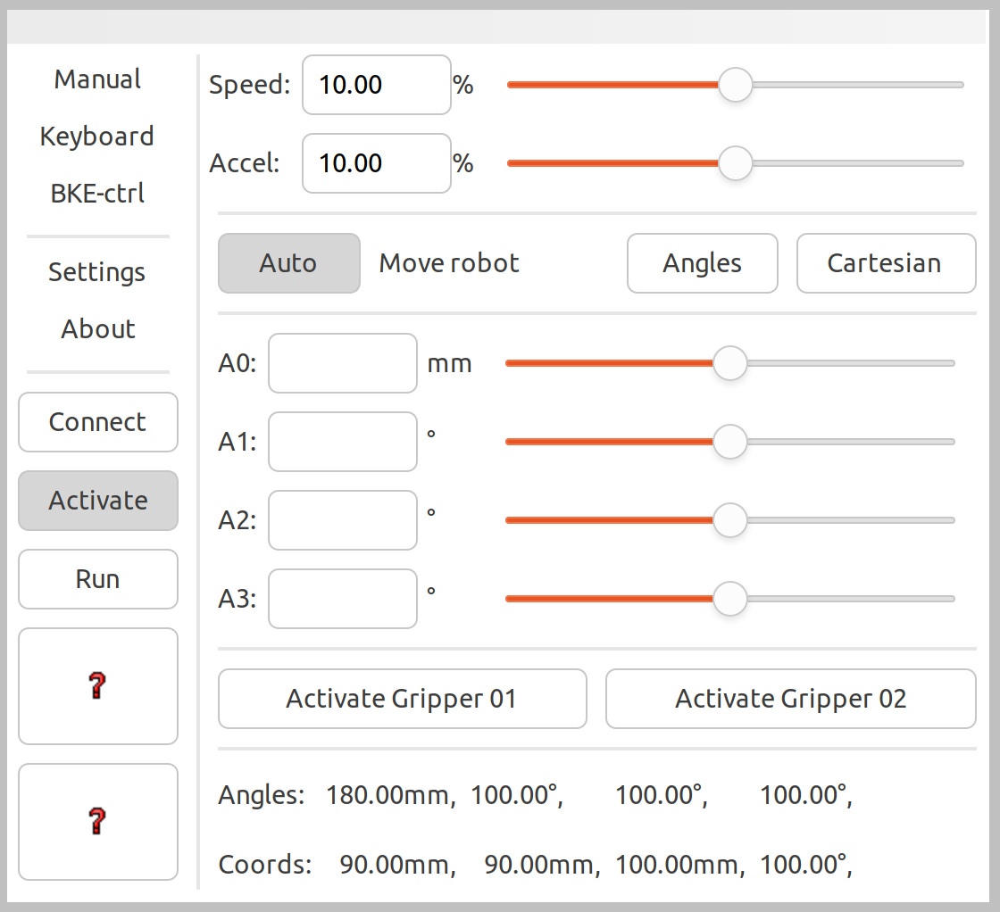|
||**!afbeelding** - *iteratie 03 - Main frame*|

De locatie waar het sequence paneel voorheen geplaatst was is tijdens deze iteratie gebruikt voor het weergeven van de huidige positie in hoeken en daar onder de positie in coördinaten. Deze positie werd tien keer per seconden ge-update. 

<div style="page-break-after: always;"></div>


### Iteratie 04 - Simulatie

Tijdens de implementatie van het cartesiaanse coördinaten systeem bleken de slider geen ideale besturingsmethode te zijn, voor de coördinaten. Voor bijvoorbeeld een bepaalde X locatie zijn er weer andere Y coördinaten en andersom. Hierdoor moet er erg veel berekend worden in de applicatie zelf, niet handig.

De oplossing die gekozen was was om de cartesiaanse besturing te realiseren door middel van een simulatie. De simulatie levert de gebruiker beide het inzicht in de huidige locatie van de robot en levert een visueel besturingselement wat het overzicht verhoogd.

### De implementatie

Tijdens de ontwikkeling van de GUI zijn er een drietal prototypes gemaakt. Het eerste prototype was de communicatie met de robot zelf, de [Driver](https://github.com/LukevLuijn/robox_docs/tree/main/prototypes/software/driver_test) (bijlage X - prot_software_driver). De driver is verantwoordelijk voor het interpreteren van de inkomende berichten van de robot. Het implementeren van de functionaliteiten van de firmware en het creëren van berichten voor de robot. De precizie werking van dit onderdeel van de GUI is terug te vinden in het [software design document](https://github.com/LukevLuijn/robox_docs/blob/f1926df7065f7596bd7ae3ef2e1dc76c82e2e259/design/software/sdd/sdd_software.pdf) (Hoofdstuk 4.1 *Package - Driver*) (Bijlage X - sdd_software.pdf).

Het tweede prototype was de [Logger](https://github.com/LukevLuijn/robox_docs/tree/main/prototypes/software/logger_test) (bijlage X - prot_software_logger). De logger is verantwoordelijk voor het weergeven van log berichten uit de applicatie (GUI) zelf (intern) en van de log berichten van de firmware (extern). Deze log berichten moesten per **severity* te sorteren zijn. Ook moesten de interne en externe berichten los van elkaar weergegeven worden. Het resultaat van dit prototype is te zien in de onderstaande afbeeldingen, De precieze werking van de logger en uitleg over de onderdelen is terug te vinden in het [SDD](https://github.com/LukevLuijn/robox_docs/blob/f1926df7065f7596bd7ae3ef2e1dc76c82e2e259/design/software/sdd/sdd_software.pdf) document (Hoofdstuk 4.2 *Package - Logger*) (bijlage X - sdd_software.pdf)

|||
|:---:|:---:|
|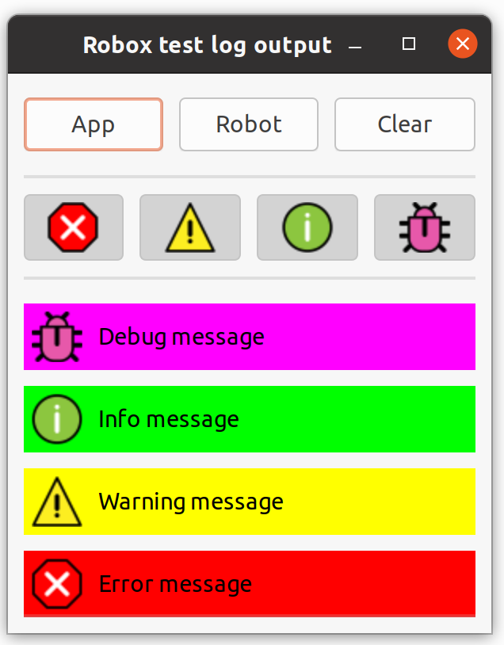|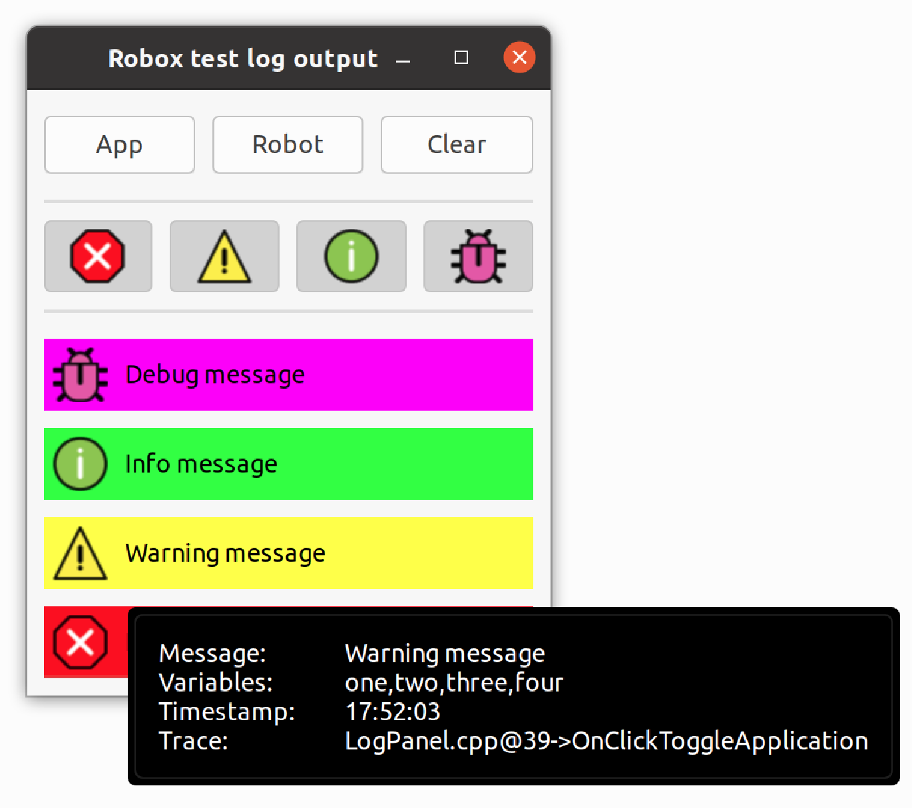|
|**!afbeelding** - *Logger 1*|**!afbeelding** - *Logger 2*|

> ```*``` *Severity* De log berichten zijn onderverdeeld in vier gradaties; ERROR, WARNING, INFO & DEBUG.

<div style="page-break-after: always;"></div>

Het derde prototype was de eerder genoemde [Simulatie](https://github.com/LukevLuijn/robox_docs/tree/main/prototypes/software/robot_visual_test) (bijlage X - prot_software_visual). Dit onderdeel is verantwoordelijk voor het weergeven van het in realtime weergeven van de huidige positie van het arm onderdeel van de robot. Verder is het verantwoordelijk voor het besturen van de arm in cartesiaanse coördinaten. Dit is mogelijk door de gripper in de simulatie te selecteren met de muis. De gripper kan vervolgens met de muis bewogen worden waardoor de andere assen mee bewegen.

Wanneer de robot met de muis bewogen wordt worden de bijhorende sliders en tekstvelden (A1 & A2) ook direct aangepast. Verder is de huidige positie van de gripper weergegeven in de simulatie. Hierdoor is het altijd duidelijk welke cartesiaanse coördinaten bij de huidige positie horen. In [dit](https://raw.githubusercontent.com/LukevLuijn/robox_docs/main/prototypes/software/robot_visual_test/clips/robox_visual_test_00.mp4) filmpje is de werking van de simulatie visueel weergegeven.

De uiteindelijke uitwerking van de simulatie in de applicatie is terug te vinden in het [SDD](https://github.com/LukevLuijn/robox_docs/blob/f1926df7065f7596bd7ae3ef2e1dc76c82e2e259/design/software/sdd/sdd_software.pdf) (hoofdstuk *4.4 Package - frame*) (Bijlage X - sdd_software.pdf).


<!-- |||
|:---:|:---:|
|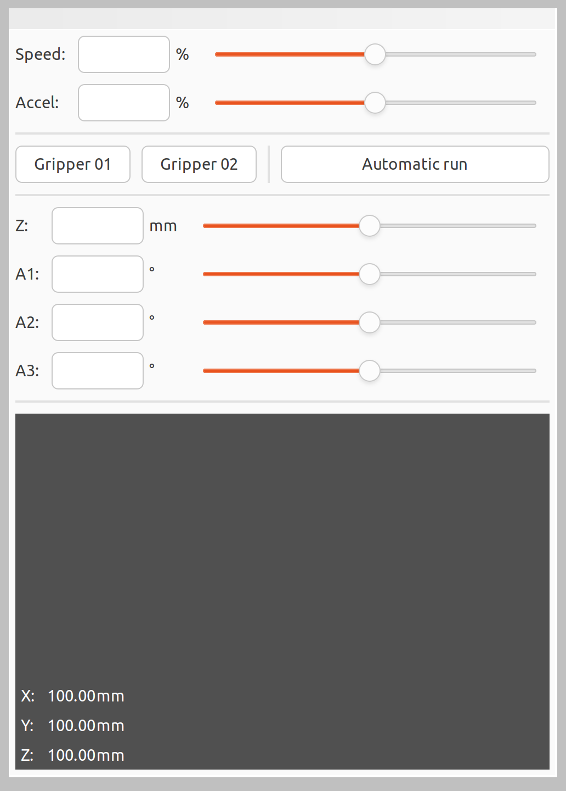|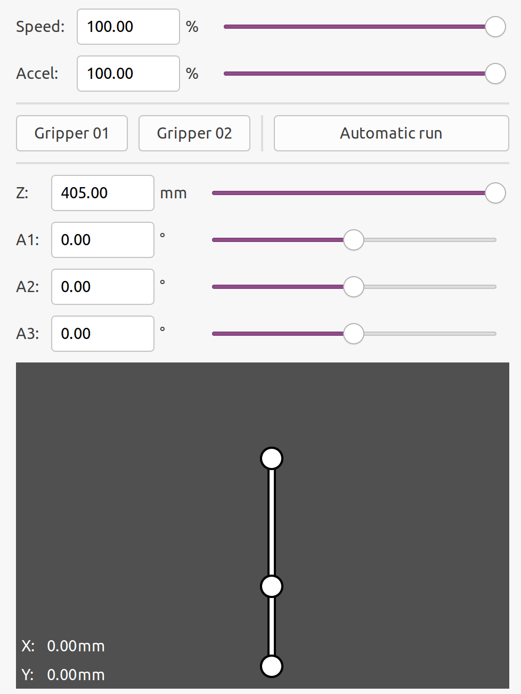|
|**!afbeelding** - *Simulatie ontwerp*|**!afbeelding** - *Simulatie uitwerking*| -->

### De grafische user interface

Toen de verschillende prototypes uitgewerkt en gevalideerd waren is het geheel geïntegreerd. In het eind resultaat zijn de verschillende onderdelen geschrapt voor dit project. Zoals eerder verteld is het sequence paneel en de werking daarvan niet meer geïmplementeerd. De besturing door middel van het toetsenbord is in verband met tijdgebrek ook niet meer geïmplementeerd. De uiteindelijke GUI is in de onderstaande afbeelding te zien.

||
|:---:|
||
|**!afbeelding** - *Grafische user interface*|


<!-- 
!url ICA. (z.d.-a). Available product analysis - ICT research methods. ICA Research Methods. Geraadpleegd op 1 juni 2022, van [https://ictresearchmethods.nl/Available_product_analysis](https://ictresearchmethods.nl/Available_product_analysis)

!url ICA. (z.d.-b). Literature study - ICT research methods. ICA Research Methods. Geraadpleegd op 1 juni 2022, van [https://ictresearchmethods.nl/Literature_study](https://ictresearchmethods.nl/Literature_study)

!url ICA. (z.d.-c). Model validation (ML) - ICT research methods. ICA Research Methods. Geraadpleegd op 1 juni 2022, van [https://ictresearchmethods.nl/Model_validation_(ML)](https://ictresearchmethods.nl/Model_validation_(ML))

!url ICA. (z.d.-d). Multi-criteria decision making - ICT research methods. ICA Research Methods. Geraadpleegd op 1 juni 2022, van [https://ictresearchmethods.nl/Multi-criteria_decision_making](https://ictresearchmethods.nl/Multi-criteria_decision_making)

!url ICA. (z.d.-e). Requirements prioritization - ICT research methods. ICA Reasearch Methods. Geraadpleegd op 1 juni 2022, van [https://ictresearchmethods.nl/Requirements_prioritization](https://ictresearchmethods.nl/Requirements_prioritization)

!url ICA. (z.d.-b). Community research - ICT research methods. ICA Research Methods. Geraadpleegd op 2 juni 2022, van https://ictresearchmethods.nl/Community_research

!url ICA. (z.d.-c). Component test - ICT research methods. ICA Research Methods. Geraadpleegd op 2 juni 2022, van https://ictresearchmethods.nl/Component_test

!url Wikipedia contributors. (2022, 17 februari). Faraday cage. Wikipedia. Geraadpleegd op 1 juni 2022, van [https://en.wikipedia.org/wiki/Faraday_cage](https://en.wikipedia.org/wiki/Faraday_cage)

!url https://www.howtorobot.com/expert-insight/cartesian-robots

!url https://www.cuidevices.com/product/motion/rotary-encoders/incremental/modular/amt10-series 
-->