<style>
span.rob   {color:#000000; border-radius:3px}
span.o     {color:#787878; border-radius:3px}
span.x     {color:#79C6E2; border-radius:3px}
</style>

<br>
<br>

<div align="center">
    <h1 style="font-size:50px;"> 
        <span class=rob>ROB</span><span class=o>O</span><span class=x>X</span>
    </h1>
    
    <br>
    <br>
    <br>
    <br>
    <br>
    <br>
    <br>
    <h2 style="font-size:30px;">
        Het proces
    <h2>
</div>

<div style="page-break-after: always;"></div>


|||
|:---|:---|
|**Auteur**|Luke van Luijn|
|**Nummer**|587478|
|**Opleiding**|HBO-ICT|
|**Profiel**|Embedded software development (ESD)|
|**Studiejaar**|Jaar 3|
|**Minor**|Digital media productions|
|**Docentbegeleider**|Mario de Vries|
|**Docenten team**|Bart Dijkman <br> Jacqueline Rijkmans <br> Jeff Cook <br> Main Hagens|
|**Plaats**|Nijmegen|
|**Datum**|03-06-2022|
|**Versie**|1.0|


<div style="page-break-after: always;"></div>

# 1. Samenvatting <a name="chapter0"></a>


In dit document wordt het proces besproken van het ROBOX project, ROBOX is een open-source 3D geprinte SCARA robot met vier bewegende assen. Iedereen, binnen de doelgroep student/hobbyist, zou een variant van dit project moeten kunnen maken zonder extra gereedschap. Het enige wat een maker nodig zou moeten hebben is goede zin en een 3D-printer. Het ontwerp van het model is ontstaan aan de hand van drie iteraties. 

De eerste iteratie was het idee om een master-slave communicatie op te zetten tussen de vier segmenten waardoor de bekabeling door de robot geminimaliseerd zou worden. De tweede iteratie is van start gegaan omdat de kosten van het master-slave concept te hoog zouden worden. De tweede iteratie is groter en beter. Meer beweging op de Z-as, grotere segmenten betere indeling. Na de uitvoering van het eerste experiment bleek dat de lager combinatie van deze iteratie niet ging werken. Er moest een nieuw idee komen. Iteratie drie, de derde en laatste iteratie voor het model. In deze iteratie stond kostenvermindering centraal. Het schrappen van onnodige elementen om beide de complexiteit en de kosten omlaag te halen. Tijdens de constructie van de arm zijn verschillende gebreken ontdekt en verholpen (waar mogelijk).

De implementatie van de firmware is gedaan aan de hand van vier losse prototypes, homing, message, serial en state machine. Deze vier prototypes omvatten ieder een eigen functionaliteit van het systeem. In het prototype *'Homing'* wordt de homing sequence gebruikt voor het home'en van de verschillende assen gerealiseerd. In het prototype *'Message'* wordt het protocol, gebruik voor de seriële communicatie, uitgewerkt en getest. Het prototype *'Serial'* heeft als doel het opzetten van de seriële communicatie functionaliteit en het testen van de maximale snelheid van dit onderdeel. Tot slot het prototype '*State machine*', realiseert een state machine design pattern voor een embedded device (microcontroller). Toen alle prototypes getest en gevalideerd waren zijn ze samengevoegd tot een geheel, de firmware.

De software of de GUI is opgesteld aan de hand van een viertal iteraties. Bij elke iteratie zijn er telkens delen geschrapt in verband met de naderende deadline van het project. De vierde en laatste iteratie bevat de basis functionaliteit die voorafgaand aan de implementatie is vastgesteld. Tijdens de implementatie van de GUI zijn er een drietal aan losse prototypes gemaakt die net als bij de firmware een deel van de applicatie omvatten. Het prototype *'Logger'* realiseert het log onderdeel van de applicatie. Het *'Driver'* prototype het driveronderdeel en het *'Visual'* prototype levert de simulatie voor de GUI.

Per onderdeel; hardware, software en firmware zijn er ontwerp documenten opgezet die alle functionaliteiten beschrijven waar elk onderdeel aan moet voldoen (SRS-software, SRS-firmware, MDD). Ook zijn de uiteindelijke resultaten van deze drie onderdelen beschreven in realisatie documenten (SDD-software, SDD-firmware, MDD).

Uiteindelijk is er geconcludeerd op basis van de verschillende hoofd- en deelvragen. De hoofdvraag *'Hoe maak je een robotarm die door iedereen (binnen de doelgroep) te bouwen is, goed presteert, en niet teveel kost?'* wordt beantwoord door middel van dit document. Het proces is het uiteindelijke antwoord.

Tot slot is alles op een publieke github repository gepubliceerd. Een losse repo voor het eind product (modellen, software & hardware) en een repo voor de ondersteunende documentatie. Deze repositories zijn voorzien alle informatie die een belangstellende nodig zou moeten hebben voor het maken van een eigen ROBOX robot.

<div style="page-break-after: always;"></div>

# Inhoudsopgaven

- 1 [Samenvatting](#chapter0)
- 2 [Inleiding](#chapter1)
- 3 [Aanpak](#chapter2)
	- 3.1 [Het begin](#chapter3)
	- 3.2 [De functionaliteiten](#chapter4)
	- 3.3 [Het model](#chapter5)
		- 3.3.1 [iteratie 01 - Master & slave](#chapter6)
		- 3.3.2 [iteratie 02 - The bigger the better](#chapter7)
		- 3.3.3 [iteratie 03 - Less is more](#chapter8)
		- 3.3.4 [De verwezenlijking](#chapter9)
	- 3.4 [De firmware](#chapter10)
		- 3.4.1 [Homing](#chapter11)
		- 3.4.2 [Message](#chapter12)
		- 3.4.3 [Serial](#chapter13)
		- 3.4.4 [State machine](#chapter14)
	- 3.5 [De software](#chapter15)
		- 3.5.1 [GUI schetsen](#chapter16)
		- 3.5.2 [Rapid application development](#chapter17)
		- 3.5.3 [Iteratie 01 - Toetsenbord en muis](#chapter18)
		- 3.5.4 [Iteratie 02 - Sequence paneel](#chapter19)
		- 3.5.5 [Iteratie 03 - Hoeken en coördinaten](#chapter20)
		- 3.5.6 [Iteratie 04 - Simulatie](#chapter21)
		- 3.5.7 [De implementatie](#chapter22)
- 4 [Resultaten](#chapter23)
- 5 [Conclusie](#chapter24)
	- 5.1 [Verbeterpunten](#chapter25)
- 6 [Reflectie](#chapter26)
	- 6.1 [Inleiding](#chapter27)
	- 6.2 [Kromme lagers](#chapter28)
	- 6.3 [Kapotte printer](#chapter29)
	- 6.4 [Ongeschikte library](#chapter30)
	- 6.5 [Wat heb ik geleerd](#chapter31)
- 7 [Literatuurlijst](#chapter32)
- 8 [Bijlage](#chapter33)

<div style="page-break-after: always;"></div>

# 2. Inleiding <a name="chapter1"></a>


Tijdens mijn studie carrière op de opleiding HBO-ICT met het profiel Embedded software development (ESD) heb ik veel geleerd op het gebied van aansturing van hardware door middel van high level software; het gebruik van dynamische design patterns, user interfaces en bijvoorbeeld beeldherkenning zijn onderdelen waar wij op de opleiding veel mee hebben gewerkt. Echter het ontwikkelen applicaties voor een apparaat met gelimiteerde capaciteiten, bijvoorbeeld microcontrollers, is een onderdeel wat niet vaak aan bod is gekomen. Dit is dan ook de reden dat ik naast de opleiding ook nog andere (kleine) hobby projectjes ben gaan ondernemen. De projecten variëren sterk, van een machine die automatisch een cocktail mixed tot een ['grand' piano](https://lottevanberkel10.wixsite.com/website-3/kopie-van-pre-master-tue) (Berkel, z.d.). 

Toen de tijd was aangebroken om een minor te kiezen kwam de minor Digital media productions (DMP) langs. Een minor waar je je eigen project kan kiezen, complete creatieve vrijheid. De maanden die volgde tot de aftrap van de minor ben ik gaan nadenken, wat voor project is geschikt voor de minor, welke skills wil ik verfijnen, kortom wat wil ik gaan doen. De zomer voorafgaand aan de minor ben ik bezig geweest met de ontwikkeling van een vijf-DOF (degrees of freedom) 'Articulated robot arm' (Fairchild, 2021). Hoewel dit project een goede leer ervaring was zat de robot en de firmware vol gebreken. Het is zoals de uitspraak: 

> *‘Bouw eerst een huis voor je vijand, daarna voor een vriend en dan pas voor jezelf.’*

Als minor project heb ik daarom gekozen om een robot arm te ontwerpen en te bouwen, compleet nieuw, compleet anders. Dit project is bedoelt voor iedereen. Tijdens al mijn voorgaande projecten heb ik altijd veel kennis getapt uit open-source projecten van andere. Nu is het tijd om iets terug te geven. De nieuwe robot, op gebied van model, firmware en software, dus het hele project, wordt open-source, voor iedereen toegankelijk, en door iedereen, die wil, te bouwen.

Met deze visie ontstond er een doelgroep die bestaat uit studenten zoals ik, die graag net iets meer uit hun studie willen halen, en andere hobbyisten die het leuk vinden om een project zoals deze uit te voeren. Met deze doelgroep ontstaat ook een restrictie, studenten, en hobbyisten zijn niet bereid grote hoeveelheden geld in een project te steken, het is een (leuk) project dat naast de dagbesteding uitgevoerd moet worden en dat moet gereflecteerd worden in de prijs van het project.

Nu het project en de doelgroep bekend was kon er een idee geformuleerd worden. Hoe maak je een robotarm die door iedereen (binnen de doelgroep) te bouwen is, goed presteert, en niet teveel kost?  Om deze vraag(en) te beantwoorden moesten er verschillende andere aspecten van het project definieert worden, wat voor robotarm zal er gebouwd worden? Welke functionaliteiten verwacht de doelgroep?, Wat is te duur en wat niet? Wat voor apparatuur kun je verwachten bij een gemiddelde hobbyist? Wat definieert een goede prestatie? 

De bovengenoemde aspecten zullen in dit document beantwoord worden aan de hand van verschillende resultaten en producten.


<div style="page-break-after: always;"></div>

# 3. Aanpak <a name="chapter2"></a>

<style>
.rotate90 {
    -webkit-transform: rotate(270deg);
    -moz-transform: rotate(270deg);
    -o-transform: rotate(270deg);
    -ms-transform: rotate(270deg);
    transform: rotate(270deg);
}
</style>


Het eerste onderdeel van het project was bepalen wat er precies gemaakt ging worden. Wat voor robot ging er gemaakt worden, welke functionaliteiten moest deze robot bevatten. Wat voor componenten zouden er gebruikt worden om deze functionaliteiten te verwezenlijken.

## 3.1. Het begin <a name="chapter3"></a>

Het project is begonnen met literatuur studies (ICA, z.d.). De eerste vraag die beantwoord moest worden was wat voor soort robot er gebouwd zou worden. Hierbij is vooral gekeken naar de volgende aspecten:

- Complexiteit van het ontwerp.
- Complexiteit van de besturingssoftware. 
- Gebruiksrichting.
- Bewegingssnelheid. 
- Persoonlijke interesse. 

Persoonlijk ben ik het meest geïnteresseerd in robots die een groot werk oppervlak hebben en snel kunnen bewegen. Gezien de doelgroep soortgelijk is aan mijzelf zijn deze onderdelen opgenomen. De complexiteit van beide het ontwerp en software zijn opgenomen in de lijst omdat het project in een half jaar voltooid moet zijn en een overmatig complexe robot is dan niet haalbaar. Tot slot de persoonlijke interesse, het is een groot project dat erg veel tijd zal gaan kosten. Als mijn persoonlijke interesse niet aansluit bij de gemaakte keuze zal het voltooien van het project lastig worden. Op basis van deze vereisten zijn er enkele ontwerpen overwogen (ICA, z.d.-a):

|||||
|:---:|:---:|:---:|:---:|
|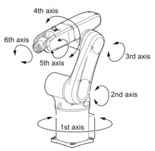|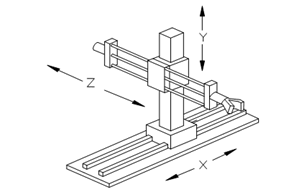|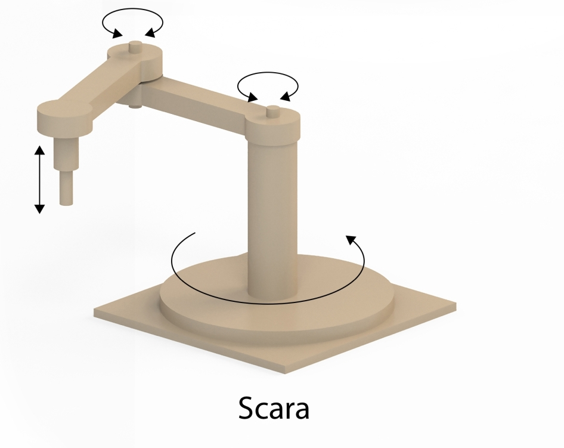|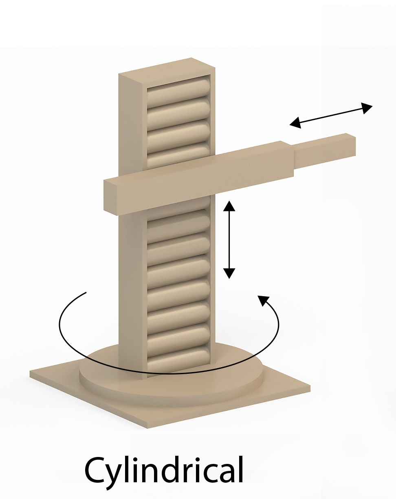|
|**Afbeelding 1** - *Articulated robot*|**Afbeelding 2** - *Cartesian robot*|**Afbeelding 3** - *SCARA robot*|**Afbeelding 4** - *Cylindrical robot*|

- Cartesiaanse Robot
- Cylindrical Robot 
- SCARA (Selective Compliance Assembly Robot Arm) Robot 

Een Cartesiaanse robot is een robot die door middel van drie assen (X,Y,Z) de endeffector (het uiteinde van de robot) naar specifieke posities kan verplaatsen. Dit type robot wordt veel gebruikt bij bijvoorbeeld 3D-printers, CNC-machines en soortgelijke applicaties. De complexiteit van het ontwerp is minimaal en er is veel informatie over te vinden gezien de 3D-printen de laatste tijd erg gestegen is in populariteit waarmee ook het aantal zelf gemaakte 3D-printers, hetzelfde geld voor de complexiteit van de besturingssoftware. De bewegingssnelheid van een cartesiaanse robot kan heel erg snel zijn afhankelijk van het model.

Dit type robot is echter afgevallen op gebied van persoonlijke interesse, het ontwerp miste de wow-factor waar naar gezocht werd. Ik heb al eerder een 3D-printer gemaakt en heb nu ook enkele 3D-printers, hoewel het ontwerp van de aandrijving leuk is denk ik dat er niet voldoende uitdaging zou zitten in een dergelijk ontwerp.

Een Cylindrical robot is een robot die een uitschuifbare arm over een draaiende Z-as heen beweegt. Het is een ouder ontwerp en vrij gelimiteerd op basis van bewegingsvrijheid. De complexiteit van het model is vrij laag omdat het een vrij simpel ontwerp is. Door de simpliciteit van het ontwerp is de complexiteit van de besturingssoftware ook niet heel hoog. Door de gelimiteerde bewegingsvrijheid wordt de gebruiksrichting beperkt. Door het sterke en stabiele ontwerp is de robot precies en accuraat. 

Echter net zoals de cartesiaanse robot valt dit type robot af op basis van persoonlijke interesse. De uitdaging in ontwerp die bij dit type robot hoort, is vrij hoog en daarmee erg interessant. Echter dit type robot heeft een soortgelijk werkoppervlak als dat van bijvoorbeeld een SCARA robot.

Een SCARA robot is opgebouwd volgens hetzelfde principe als de Cylindrical robot echter in plaats van een uitschuifbare arm bevat de SCARA robot een drie-DOF axiale arm waardoor er meer complexe beweging mogelijk is. Dit maakt de complexiteit van het ontwerp en software een stuk hoger dan een cylindrical robot, het verhoogd ook de gebruiksrichting, maar verlaagd de bewegingssnelheid. 

De uiteindelijke keuze is gevallen op de SCARA robot. Het is een complex type robot die veel uitdagingen met zich meebrengt op gebied van ontwerp en software.

## 3.2. De functionaliteiten <a name="chapter4"></a>

Toen de richting van het project duidelijk was is er gekeken naar de functionaliteiten van de robot. Hoe groot moet de robot worden, wat moet de robot allemaal kunnen, hoe zal de robot opgebouwd worden en welke onderdelen zijn nodig voor de realisatie van deze functionaliteiten (ICA, z.d.-c).

De verschillende functionaliteiten van de robot zijn opgenomen en verdeeld over drie documenten. De functionaliteiten met betrekking tot het daadwerkelijke model van de robot zijn opgenomen in het [Model Design document - 3. Requirements](bijlage/04_design_documents/03_mdd_hardware.pdf) (bijlage 18 - mdd_hardware.pdf) In dit hoofdstuk worden alle functionaliteiten met betrekking tot de hardware gespecificeerd. In dit document wordt onder andere de snelheid en de omvang van de robot vastgesteld. 

Op gebied van firmware zijn de functionaliteiten van de applicatie gedocumenteerd in het [Software requirements specification](bijlage/04_design_documents/01_srs_firmware.pdf) (SRS) document (bijlage 16 - srs_firmware.pdf). Voor de GUI (grafische user interface) is er gelijknamig document opgesteld deze is terug te vinden in bijlage 17 - srs_software.pdf ([SRS](bijlage/04_design_documents/02_srs_software.pdf)).

In de SRS-documenten van beide de firmware en de GUI zijn aan de hand van verschillende usecases requirements opgesteld. Deze requirements zijn later in de applicatie(s) verwerkt.

<div style="page-break-after: always;"></div>

## 3.3. Het model <a name="chapter5"></a>

### 3.3.1. iteratie 01 - Master & slave <a name="chapter6"></a>

||||
|:---:|:---:|:---:|
|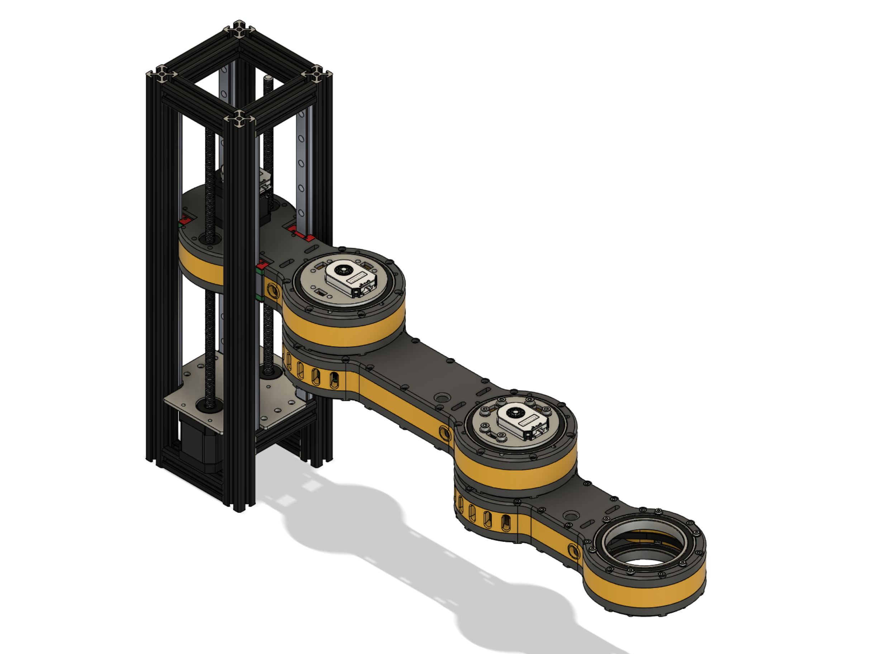|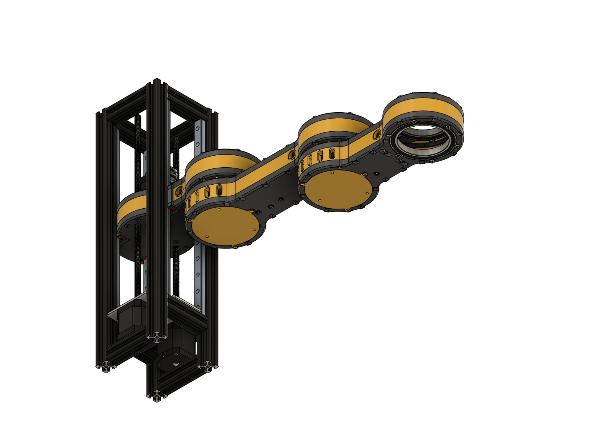||
|**Afbeelding 5** - *v01 - Top view*|**Afbeelding 6** - *v01 - Bottom view*|**Afbeelding 7** - *v01 - Dimensies*|

De eerste iteratie van het model was ontworpen met het idee dat elk segment van de robot een eigen 'slave' controller zou bevatten zodat elk segment draadloos met de andere slave controllers/hoofdcontroller zou kunnen communiceren zodat de robot vrijwel geen interne bedrading zou bevatten. in de afbeelding *'v01 - Bottom view'* zijn die gele cirkels te zien aan de onderkant, hier zouden deze slave controllers terecht komen.

Bij deze iteratie was de lineaire beweging gerealiseerd door middel van lineaire rails. Deze rails hebben als voordeel dat ze erg sterk zijn, weinig speling hebben en makkelijk zijn in gebruik, ze bevatten namelijk schroefgaten op beide de rails en de geleider. De rails zouden aan de binnenkant van het frame gemonteerd worden zodat de gehele arm binnen het frame langs zou bewegen. De elektronica zou vervolgens aan de buitenkant van het frame gemonteerd worden. Dit was mogelijk omdat elk segment zijn eigen controller zou bevatten en de hoofdcontroller daarom een stuk minder componenten zou bevatten.

Per segment was de motor verantwoordelijk voor de beweging van het volgende segment gemonteerd in de as zelf. Dit had als resultaat dat er een strak ontwerp zonder zichtbare motoren gerealiseerd was maar dat een holle as onmogelijk was, daar zat de motor namelijk. Per motor montage locatie was er ook een op maat gemaakt aluminium plaat ontworpen. Deze platen zouden gebruikt worden voor het efficiënt verspreiden van de hitte die de motoren genereren.

Tot slot was deze iteratie voorzien van [incremental encoders](https://www.cuidevices.com/product/motion/rotary-encoders/incremental/modular/amt10-series), deze encoders zijn te zien in de afbeelding *'v01 - Top view'*. Deze encoders konden gebruikt worden voor het detecteren van botsingen, stap verlies en het uitvoeren van handmatige training van de robot.

Toen deze elementen uiteindelijk verwerkt waren in het ontwerp was er een evaluatie van het ontwerp gedaan (ICA, z.d.-c). De slave/master opzet voor de controllers was niet haalbaar. Per slave controller zou het ongeveer 40 euro kosten aan onderdelen omdat elke controller voorzien moest worden van of een microcontroller met wifi, een stroom converter die 24v naar 5v kon omzetten en de PCB moest geprint worden door een extern bedrijf.

Omdat de losse controllers niet meer mogelijk waren was het ook niet meer mogelijk om de lineaire beweging binnen het frame te laten plaatsvinden. Deze ruimte was namelijk nu nodig voor het monteren van de verschillende componenten. Aan de hand van deze keuze kwamen nog ander aanpassingen: De lineaire rail moet gemonteerd worden op een onderdeel zoals de aluminium profielen waar het frame van gemaakt is. Als de robot niet binnen het frame langs gaat zouden deze rails aan de voorkant van het frame gemonteerd moeten worden waardoor de contactvelden tussen de robot en het frame veel kleiner werden. Hierdoor is de keuze voor lineaire rails ook komen te vervallen.

<div style="page-break-after: always;"></div>


### 3.3.2. iteratie 02 - The bigger the better <a name="chapter7"></a>

||||
|:---:|:---:|:---:|
|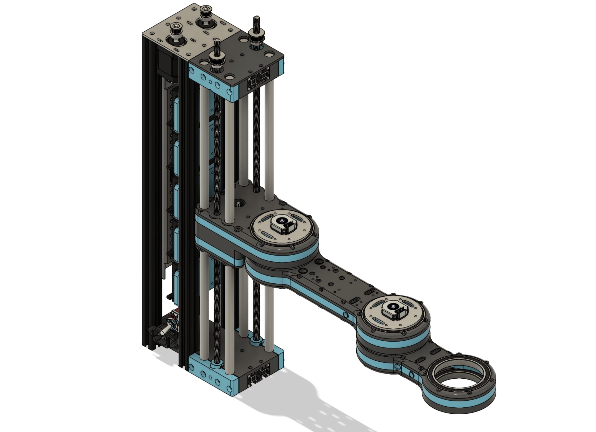|||
|**Afbeelding 8** - *v02 - Top view*|**Afbeelding 9** - *v02 - Bottom view*|**Afbeelding 10** - *v02 - Dimensies*|

Bij de tweede iteratie is de focus gevallen op het vergroten van het gehele systeem. Doordat de keuzen bij de vorige iteratie is gevallen op een gecentraliseerde controller moest de lineaire beweging gerealiseerd worden buiten het frame. Dit resulteerde in een constructie te zien in afbeelding *'v02 - Top view'* & *'v02 - Bottom view'*. Het frame was bij deze iteratie verantwoordelijk voor de structuur van het apparaat en het huizen van de elektronica. De lineaire beweging maakt nu gebruik van (veel goedkopere) lineaire assen. De assen hoeven enkel boven en onder aan het systeem gemonteerd te worden waardoor het frame losstaat van het geheel.

Op basis van deze keuzes moest het frame vergroot worden. De controller moest er nu in passen en door de goedkopere assen was dit geen probleem. De aandrijving van de lineaire beweging zijn bij deze iteratie aan de bovenkant van het frame gemonteerd. Hierdoor kon het arm onderdeel van de robot een stuk dieper zakken (41 millimeter). Maar nu was het niet meer mogelijk om de leadscrews direct op de motor te monteren omdat dit het frame nog een extra 80 millimeter zou verhogen. De oplossing was om een tandriem transmissie toe te passen met een 1:1 reductie zodat de motoren op dezelfde hoogt gemonteerd konden worden als de leadscrews zelf.

De verschillende segmenten konden door de gecentraliseerde controller ook aanzienlijk (9 millimeter) slanker gemaakt worden. Bij deze iteratie is er ook gekeken naar de bewegingsruimte van de arm. Het is de bedoeling dat het laatste segment van de arm meer dan 360 graden kan draaien op elk mogelijke positie van het middelste segment. Dit was niet mogelijk bij de eerste iteratie. Om deze eis te volbrengen is er gekozen voor het verlengen van het middelste segment en het inkorten van het laatste segment. Hierdoor kan de arm nu onder het middelste segment door zonder het frame te raken.

Na de afloop van het [eerste experiment](bijlage/02_experiment_01/experiment_01.pdf) (bijlage 02 - experiment_01) werd er geconstateerd dat de axiale beweging van het eerder gebruikte systeem niet voldoende was. Er werd gebruik gemaakt van twee radiale lagers waarin het volgende segment gemonteerd zat. Echter hebben radiale lagers een capaciteit voor dynamische load (het kunnen weerstaan van beide axiale en radiale krachten) maar deze was niet voldoende voor het uiteindelijke systeem. Er is er toen voor gekozen om dit complete ontwerp te niet te stellen en eerst een paar kleine tests uit te voeren met axiale en radiale lagers gecombineerd (ICA, z.d.-b). Deze tests zijn in de onderstaande afbeeldingen te zien.

<div style="page-break-after: always;"></div>


||||
|:---:|:---:|:---:|
|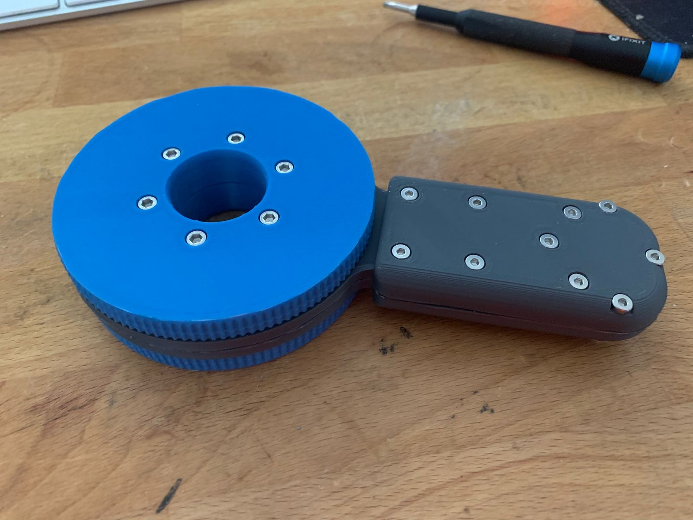||
|**Afbeelding 11** - *Lager test - 1*|**Afbeelding 12** - *Lager test - 2*|

Op de rechter afbeelding is de samenhang van de lagers te zien. Op de linker afbeelding te uitgewerkte test. Deze test heeft de inzichten geleverd is tolerantie voor de lagers en op welke punten er druk (van de bouten) gezet kan worden zonder dat de draai capaciteit gelimiteerd wordt.

Door deze verandering in ontwerp moest er een nieuwe iteratie komen, de laatste. Deze iteratie staat hieronder beschreven.

### 3.3.3. iteratie 03 - Less is more <a name="chapter8"></a>

||||
|:---:|:---:|:---:|
|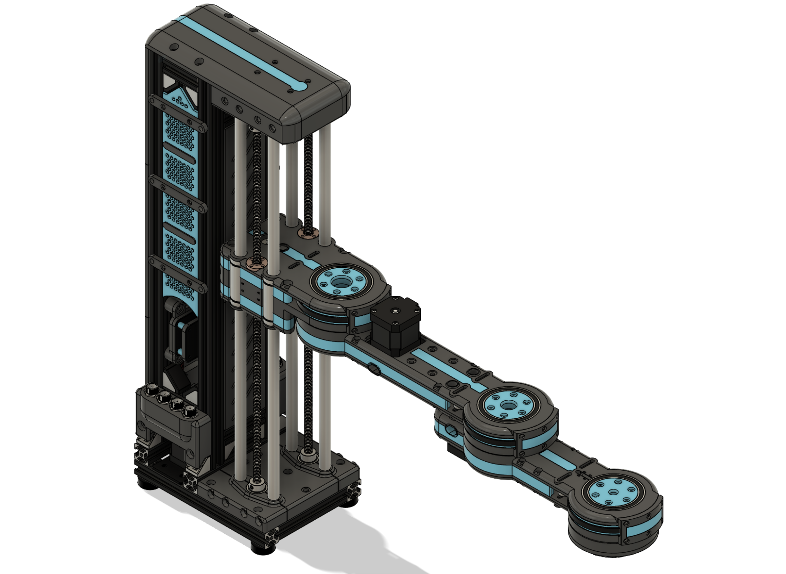|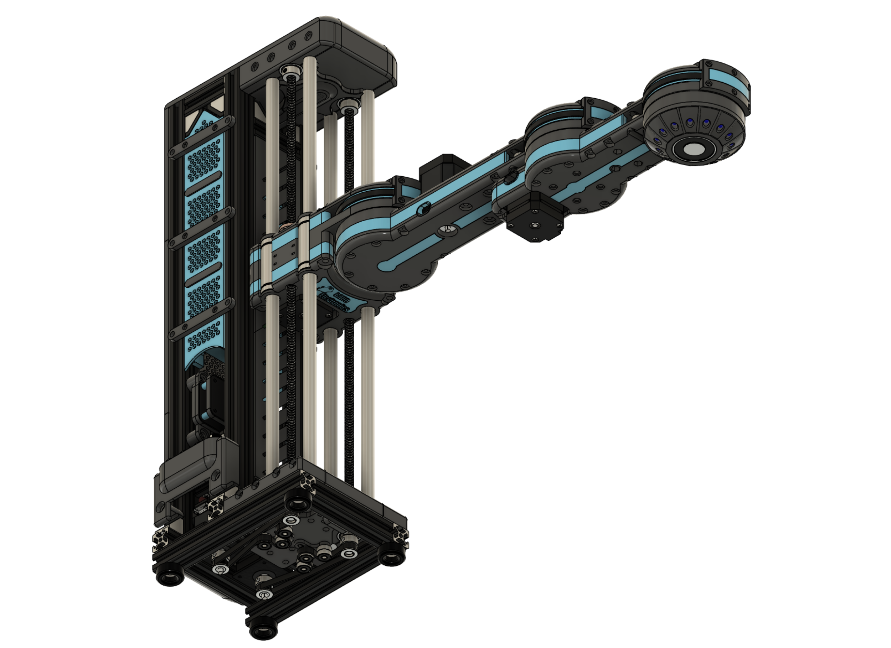|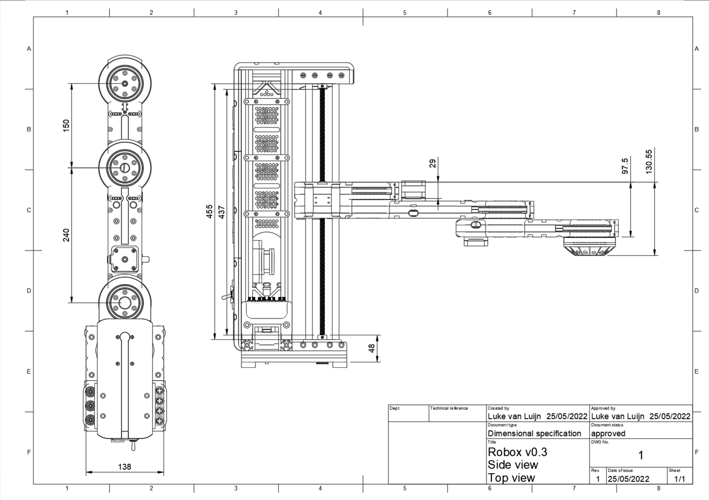|
|**Afbeelding 13** - *v03 - Top view*|**Afbeelding 14** - *v03 - Bottom view*|**Afbeelding 15** - *v03 - Dimensies*|

Voor de verwerking van de nieuwe lager combinatie waren een aantal zaken niet meer mogelijk die verwerkt waren in de voorgaande iteraties. De motoren konden niet meer in de assen gemonteerd worden gezien de ruimte in de assen nu nodig was als lager behuizing. Er is gekozen voor een motor montage aan de buitenkant van het frame, hierdoor worden de motoren beter gekoeld en is er minder kans op het smelten van de robot. Omdat er nu ook meer ruimte was voor de montage van de motoren is er gekeken naar een 'off-the-self'-oplossing voor het warme probleem. Na een klein onderzoek (ICA, z.d.-a) kwamen er twee standaard stepper brackets tevoorschijn die deze taak prima kon vervullen, deze nieuwe brackets kosten ongeveer 3,- euro per stuk wat ongeveer 43,- euro scheelt met de op maat gemaakte plaatjes die eerder in het ontwerp verwerkt waren.

Door de extra lagers is het arm onderdeel significant gestegen in gewicht, zo'n 200 gram per lager, twee lagers per as (extra) voor drie assen. Door al dit extra gewicht moest er opnieuw nagedacht worden over de constructie van het frame. De motoren van de lineaire beweging zijn nogmaals van locatie veranderd, weer aan de onderkant. Ook is het frame aan de onderkant verbreedt om ook aan de zijkanten extra stabiliteit te bieden.

Tijdens het eerste experiment is er ook gekeken naar de werking en effectiviteit van de eerder genoemde encoders. Hieruit is gebleken dat de encoders erg veel ruis opvangen van de motoren. Om efficiënt gebruik te maken van de encoders zou elke encoder voorzien moeten worden van een 'shielded cable' dit is een kabel met een Faraday-cage, dit is een behuizing van fijn gevlochten metaal waar een actief ground signaal doorheen loopt (Wikipedia contributors, 2022), dit type kabel kan de EMI (electro magnetic interference) uitgestoten door de motoren. Deze kabels zijn omvangrijk en duur. Naast alle essentiële onderdelen in de robot was er nagenoeg geen ruimte meer voor de dikke encoder kabels. De combinatie van dure kabels, dure encoder en weinig ruimte heeft ervoor gezorgd dat de encoders geschrapt zijn uit het ontwerp.

De verdere uitwerking van deze iteratie is terug te vinden in het [Model design document - hoofdstuk 4 & 5](bijlage/04_design_documents/03_mdd_hardware.pdf)

### 3.3.4. De verwezenlijking <a name="chapter9"></a>

Toen alle onderdelen van het model uitgewerkt waren is er begonnen aan het printen van de [75 modellen](https://github.com/LukevLuijn/robox/tree/main/robox_models), te beginnen bij de onderdelen van segment 03, de pols. 

||||
|:---:|:---:|:---:|
||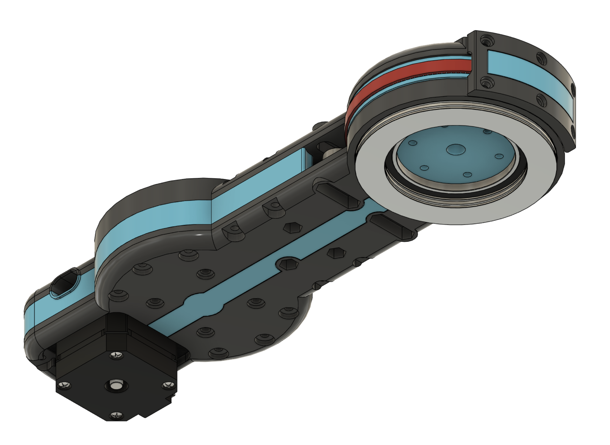|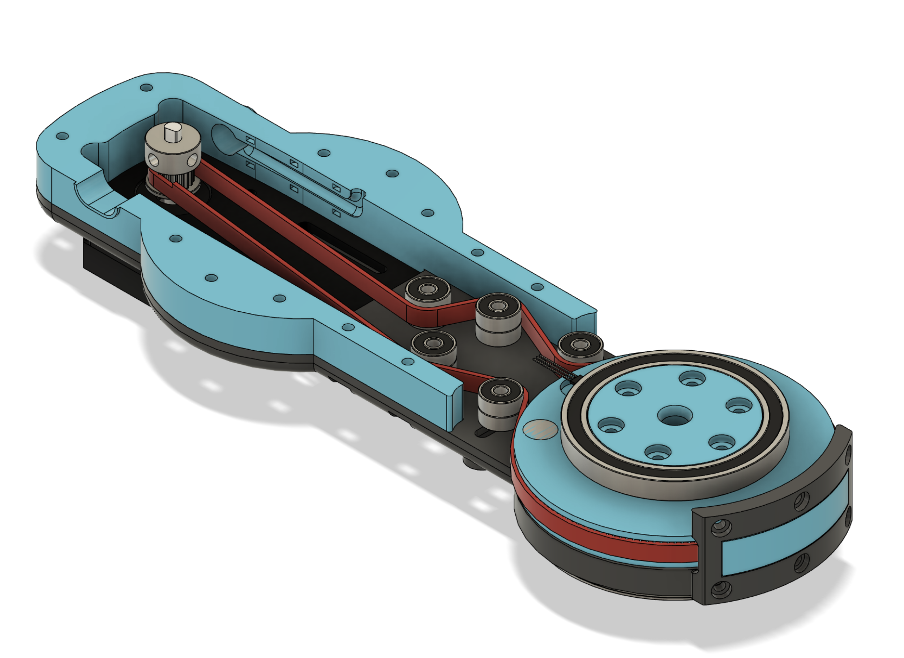|
|**Afbeelding 16** - *Pols - Top view*|**Afbeelding 17** - *Pols - Bottom view*|**Afbeelding 18** - *Pols - Inner view*|

Tijdens de constructie van de pols kwamen er enkele problemen naar boven. In het oorspronkelijke model waren de verschillende idlers (afbeelding: *Pols - Inner view*) door het model heen gemonteerd, daar wordt mee bedoeld dat ze aan de buitenkant vastgemaakt moesten worden. Hierdoor was het onmogelijk om de tandriem vast te maken (rood in de afbeeldingen). De oplossing was vrij simpel, maak de lagers aan de onderkant vast en maak ruimte voor de bouten in het bovenste deel. Om dit te testen is het model eerst handmatig aangepast en later opnieuw geprint.

Tijdens het testen van het segment, door veel te draaien aan de pulley, kwam er nog een probleem aan het licht. De tandriem bewoog na meerdere rotaties van de pulley af. Als de pulley weer de andere kant op bewogen werd, ging hij weer terug naar zijn originele plek. Dit probleem vond alleen plaats wanneer de pulley met de klok mee gedraaid werd.

Dit probleem kon meerdere oorzaken hebben; het kan komen omdat de grote pulley geen extra omheining heeft aan de boven en onderkant, het kan komen doordat de verschillende idlers hetzelfde gebrek hebben of dat de pulley gemonteerd op de motor op een andere hoogte is gemonteerd dan de grote pulley.

Uiteindelijk heb ik het probleem opgelost door een vorkje te printen met de exacte dikte als de gemodelleerde afstand tussen de pulley en de motor. 

<div style="page-break-after: always;"></div>

||||
|:---:|:---:|:---:|
||||
|**Afbeelding 19** - *Elleboog - Top view*|**Afbeelding 20** - *Elleboog - Bottom view*|**Afbeelding 21** - *Elleboog - Inner view*|

Toen de onderdelen van de elleboog geprint waren begon de constructie. Om een nieuw segment (de elleboog) te monteren op het oude segment (de pols) moet de pulley met het onderste deel van het nieuwe segment eerst aan het oude segment gemonteerd worden (afbeelding *Elleboog - constructie 1*). Tijdens dit proces kwam er een probleem naar boven. In het oorspronkelijke ontwerp waren de moeren bedoelt voor de montage van het nieuwe segment niet in het model verwerkt, deze moesten achteraf vastgemaakt worden wat niet mogelijk was omdat de pols al gemonteerd was.

Om dit probleem op te lossen is er een inkeping gemaakt in de onderkant van het bovenste deel van het oude segment. In deze inkeping konden de moeren verwerkt worden. Vervolgens is er een plaatje overheen gemonteerd die deze moeren op hun plek houden.
De inkeping is te zien in de afbeelding *Elleboog - constructie 3*, het plaatje is te zien in de afbeelding *Elleboog - constructie 2* (het blauwe plaatje waar de kabels doorheen gaan). Deze oplossing is beide voor de pols en de elleboog toegepast gezien beide segmenten op dezelfde manier gemonteerd worden.

Omdat bij de elleboog de motor aan de 'verkeerde' kant van het segment gemonteerd zit was het vrij lastig om de tandriem aan de pulley te monteren. Zoals verteld word de pulley namelijk eerst aan de pols gemonteerd met de onderkant van het huidige segment

||||
|:---:|:---:|:---:|
||||
|**Afbeelding 22** - *Elleboog - constructie 1*|**Afbeelding 23** - *Elleboog - constructie 2*|**Afbeelding 24** - *Elleboog - constructie 3*|

Het geheel moet vervolgens tegelijkertijd in elkaar geschroefd worden, dus de tandriem over de pullies heen en de verschillende onderdelen tegen elkaar aan. Verder trad hetzelfde probleem op als bij de pols, dat de tandriem van de pulley af gleed. Hiervoor is dezelfde oplossing gebruikt, een vorkje. 

Tijdens het [tweede experiment](bijlage/03_experiment_02/experiment_02.pdf) (bijlage 03 - experiment_02) is er een basis variant van de uiteindelijke homing sequence uitgewerkt. tijdens de implementatie van deze sequence was duidelijk geworden dat het oorspronkelijke idee om twee magneten te gebruiken voor het triggeren van de hall effect sensor geen slim idee was. Door het gebruik van twee magneten kan er onduidelijkheid ontstaan bij een segment dat meer dan 360 graden kan draaien over welke magneet nou precies is geraakt. Na afloop van het experiment zijn de pullies van beide de pols en de elleboog opnieuw gemaakt met een enkele magneet in plaats van twee.

||||
|:---:|:---:|:---:|
|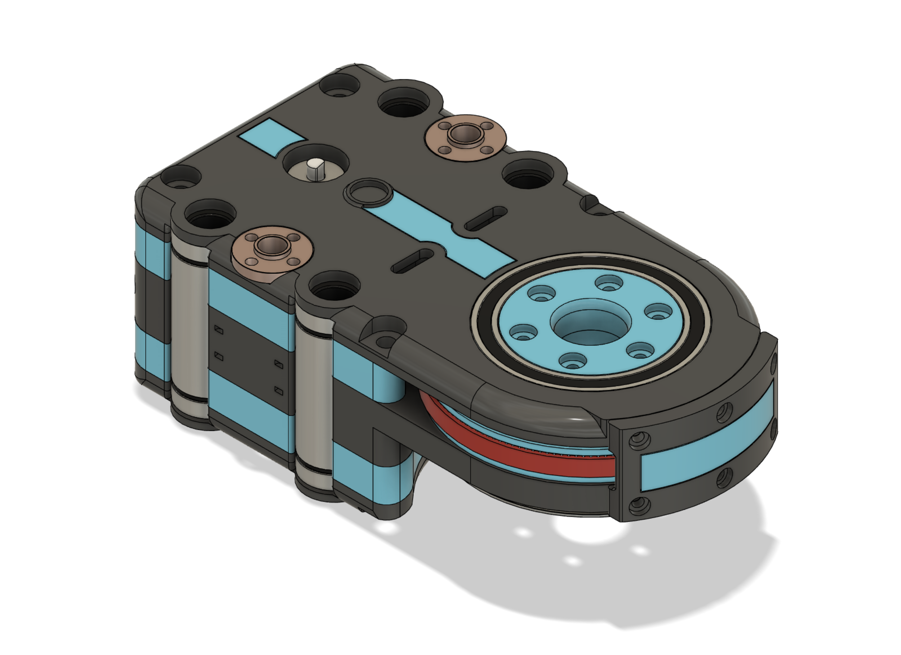|||
|**Afbeelding 25** - *Schouder - Top view*|**Afbeelding 26** - *Schouder - Bottom view*|**Afbeelding 27** - *Schouder - Inner view*|

Bij de constructie van de schouder werd duidelijk dat het ontwerp meerdere fouten bevatten. De lineaire lagers die gebruikt zijn in dit ontwerp, de LM12LUU lagers, worden samen geperst door het bovenste en onderste onderdeel van de schouder, beide deze elementen hadden **support* nodig, dit resulteerde een extra millimeter aan beide kanten. Hierdoor paste de lagers niet meer in het model. Toen dit probleem vervolgens was verholpen door de dikte van het onderste deel aan te passen kwam er nog een probleem aan het licht.
Het idee van dit model was om de verschillende lagen te klemmen met vier 60 millimeter M5 bouten. In het ontwerp was rekening gehouden met de tolerantie tussen de verschillende onderdelen, maar in mindere maten met de vervorming van het PLA onder druk. Wanneer de bouten aangedraaid werden raakte het bovenste deel van het model de pulley (zie afbeelding *Schouder - constructie 2*). De enige oplossing was om de bouten minder strak aan de draaien waardoor de structuur van het model minder is. Hiervoor is geen oplossing gevonden en is momenteel nog steeds aanwezig in het uiteindelijke product (en zorgt een aanzienlijke 'wiebel' in het systeem).

> ```*``` *Support* wordt gebruikt door 3D printers om onderdelen die 'in de lucht' hangen tijdens het printen te ondersteunen. Hierdoor ontstaat een ruw laag die vaak lelijk is en iets meer uitsteekt dan het oorspronkelijke model (Afbeelding: *Schouder - constructie 1*)

||||
|:---:|:---:|:---:|
||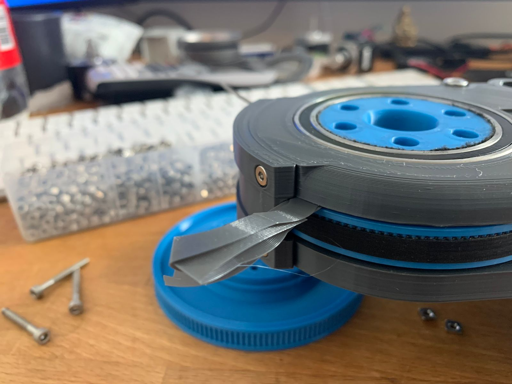|
|**Afbeelding 28** - *Elleboog - constructie 1*|**Afbeelding 29** - *Elleboog - constructie 2*|


<div style="page-break-after: always;"></div>

|||||
|:---:|:---:|:---:|:---:|
| 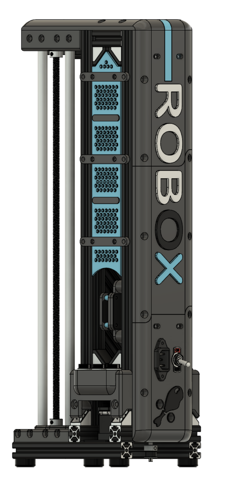 |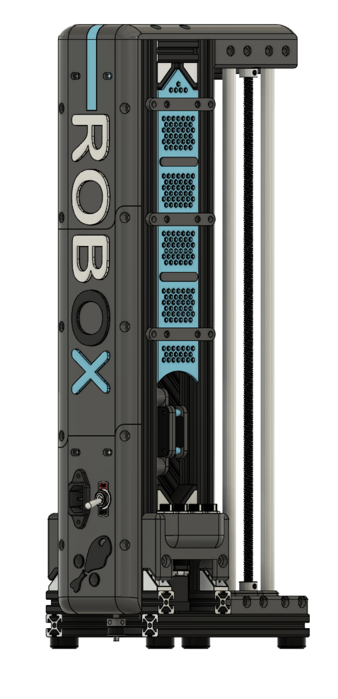 | |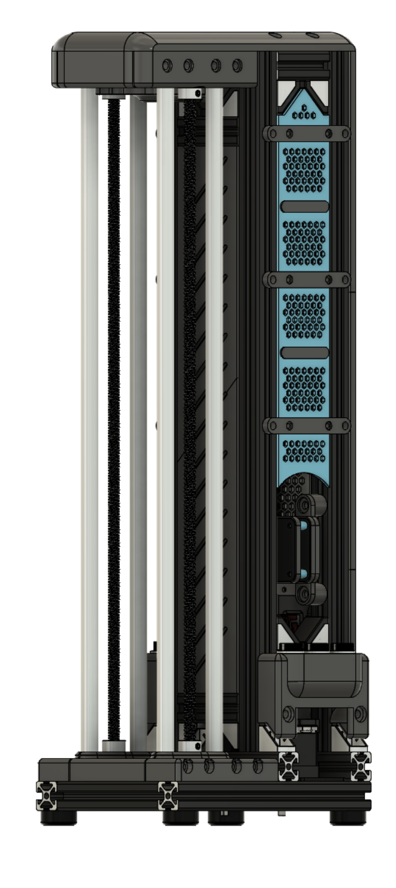 |
|       **Afbeelding 30** - *Frame - Back left view*       |**Afbeelding 31** - *Frame - Back right view*       |**Afbeelding 32** - *Frame - Front right view*       |**Afbeelding 33** - *Frame - Front left view*       |

De constructie van het frame verliep over het algemeen vrij vlekkeloos. Zoals in het [MDD document](bijlage/04_design_documents/03_mdd_hardware.pdf) (bijlage 18 - mdd_hardware.pdf) verteld is het frame opgebouwd uit een 'elektronica'-deel en een 'lineaire beweging'-deel. Deze onderverdeling maakte het uiterst makkelijk om de elektronica te monteren en te bedraden. Ook het opzetten van de lineaire beweging was erg makkelijk.

Pas wanneer alle sub constructies in elkaar gezet waren kwamen de problemen aan tevoorschijn. Er zat een aanzienlijke 'wiebel' in de leadscrews dit resulteerde een flinke vibratie, hierdoor kon de Z-as niet sneller manoeuvreren dan 3000 stappen per seconden (7,5 millimeter per seconden) dit zou betekenen dat de Z-as voor een beweging over de volledige hoogte bijna een minuut nodig heeft. 

Om dit probleem op te lossen zijn twee strategieën toegepast. De eerste was het dubbel ondersteunen van de leadscrew aan de onderkant van het systeem, in de voet van de robot, door middel van twee lagers. Dit hielp met de wiebel maar de vibratie was nog steeds duidelijk aanwezig. Door middel van een community research (ICA, z.d.-b) ben ik erachter gekomen dan velen met een soortgelijk probleem de leadscrew niet voorzien van een lager aan het uiteinde, precies om deze reden, de vibratie. En ja hoor, toen de lager verwijdert was uit het systeem was de vibratie grotendeels weg en kon de Z-as een snelheid behalen van 18000 stappen per seconden of 45 millimeter per seconden.

Toen het arm onderdeel van de robot gemonteerd werd op de Z-as bleek dat het systeem niet uit zichzelf kon blijven staan. Het oppervlak van de voet van de robot was te klein waardoor deze omviel bij een gestrekte arm. Dit probleem was op twee manieren op te lossen. Of de robot wordt aan een tafel gemonteerd. Of er wordt een extra voet onder geplaatst. De laatste optie is gekozen omdat deze robot in de toekomst nog enkele keren verplaatst moet worden.

<div style="page-break-after: always;"></div>

## 3.4. De firmware <a name="chapter10"></a>

Voor de constructie van de firmware is zoals verteld eerst een [software requirements specification](bijlage/04_design_documents/01_srs_firmware.pdf) (Bijlage 16 - srs_firmware.pdf) document opgezet. In dit document zijn de verschillende functionaliteiten van de firmware opgezet aan de hand van brainstorm sessies met de opdrachtgever. Deze functionaliteiten zijn vervolgens verwerkt in een usecase diagram. Verschillende belangrijke usecases zijn uitgewerkt in fully-dressed formaat. 

Op basis van de verschillende usecases zijn ook de functionele en niet-functionele requirements opgezet. Deze zijn terug te vinden in hoofdstuk 4 van het eerder genoemde document. Op basis van deze usecases en requirements is vervolgens begonnen aan de ontwikkeling van het product.

Voor de ontwikkeling van de firmware is gekozen voor een prototyping methode. Door eerst verschillende losse functionaliteiten op te zetten door middel van een los prototype en deze verschillende gevalideerde prototypes uiteindelijk samen te voegen in het eindproduct.

Gezien de projecten vrij omvangrijk zijn op gebied van functionaliteit is het opzetten van verschillende losse functionaliteiten erg 
handig voor het behouden van overzicht. Uiteindelijk zijn er vier losse prototypes uitgewerkt die ieder een eigen functionaliteit omvatten. 

### 3.4.1. Homing <a name="chapter11"></a>

Het eerste prototype was het opzetten van de [homing sequence](https://github.com/LukevLuijn/robox_docs/tree/main/prototypes/firmware/homing_test) (Bijlage 09 - homing_test). Gezien de robot nooit weet waar de motoren gepositioneerd zijn moet er altijd eerst een homing sequence uitgevoerd worden zodat deze posities bekend zijn binnen de applicatie. Het resultaat van dit prototype is op [dit](bijlage/05_clips/prototypes/homing_test_clip_00.mp4) filmpje (bijlage 23 - homing_test_clip_00.mp4)te zien.

### 3.4.2. Message <a name="chapter12"></a>

In het tweede prototype stond het opzetten van het [message protocol](bijlage/04_design_documents/07_protocol_description.pdf) centraal. Het messageprotocol wordt gebruikt door beide de GUI en firmware en is dan ook de fundering van de communicatie tussen de twee onderdelen. De uitwerking van dit prototype is terug te vinden op [deze](https://github.com/LukevLuijn/robox_docs/tree/main/prototypes/firmware/message_test) (Bijlage 10 - message_test) pagina.

### 3.4.3. Serial <a name="chapter13"></a>

Opvolgend aan de uitwerking was het derde prototype, [Serial](https://github.com/LukevLuijn/robox_docs/tree/main/prototypes/firmware/serial_test). De communicatie tussen de twee onderdelen neemt plaats over seriële communicatie. Om dit te valideren is er eerst een component test (ICA, z.d.-c) uitgevoerd. In deze test is er een driver opgezet die tien berichten verstuurd over de seriële bus telkens met een bepaald interval. Vervolgens wordt het interval gehalveerd en worden er nogmaals tien berichten verstuurd.

Aan de firmware kant worden deze berichten uitgelezen en verwerkt in het systeem. Zodra de berichten verwerkt zijn worden ze geprint naar de console. Op deze manier kan bijgehouden worden of alle berichten op ontvangen worden door de firmware en dat er geen data verlies plaatsvind tussen de twee componenten. De geteste intervallen zijn 800,400,200,100,50,25,12,6,3 en 1 milliseconde. Het resultaat is te zien in [dit](bijlage/05_clips/prototypes/serial_speed_test_00.mp4) filmpje (Bijlage 25 - serial_speed_test_00.mp4). 

Zoals te zien in het filmpje is er geen dataverlies en worden alle intervallen netjes ontvangen. Voor het uiteindelijke product moest er minimaal een interval van 10 milliseconden gerealiseerd worden. De test was dus succesvol.

### 3.4.4. State machine <a name="chapter14"></a>

Het vierde en laatste prototype is het [prototype - state machine](https://github.com/LukevLuijn/robox_docs/tree/main/prototypes/firmware/state_machine_test) (Bijlage 12 - State machine)

Om de verschillende functionaliteiten van de robot te implementeren is er gebruik gemaakt van een state machine. De state machine kan op een elegante manier op basis van input (de messages) verschillende functionaliteiten uitvoeren. Deze keuze is verder uitgevoerd in het [software design description](bijlage/04_design_documents/04_sdd_firmware.pdf) document van de firmware (bijlage 19 - sdd_firmware.pdf) (hoofdstuk 4.2 & 4.5).

Voor het prototype is er een klein spel opgezet. Je gooit met twee dobbelstenen. Als het aantal ogen van deze dobbelstenen gelijk is aan twaalf win (Win state) je het spel, bij twee verlies (Lose state) je en bij elk ander getal moet je opnieuw gooien (Again state).

In [dit](bijlage/05_clips/prototypes/state_machine_test_clip_00.mp4) filmpje is het resultaat van dit prototype te zien. Voor het visuele aspect is er een blauw LEDje gekoppeld aan de 'Again state', een rood LEDje voor de 'Lose state' en een groen LEDje voor de 'Win state'. Het spel wordt geactiveerd door middel van een knop.

<div style="page-break-after: always;"></div>

## 3.5. De software <a name="chapter15"></a>

Voor de ontwikkeling van de software (GUI) is er net zoals bij de firmware eerst een [software requirements specification](bijlage/04_design_documents/02_srs_software.pdf) (17 - srs_software.pdf) document opgezet. In dit document zijn de verschillende functionaliteiten verkregen uit een brainstorm sessie met de opdrachtgever verwerkt. Eerst is er een usecase diagram opgezet (Hoofdstuk 3) die al deze functionaliteiten bevat. Vervolgens zijn er enkele belangrijke usecases uitgewerkt in fully-dressed formaat (Hoofdstuk 5). Op basis van de verschillende usecase zijn de functionele en niet-functionele requirements opzet. Deze zijn gesorteerd volgens de MoSCoW methode. Elke requirement is voorzien van een markering of deze in het uiteindelijke product verwezenlijkt is (Hoofdstuk 6.1 & 6.2).

### 3.5.1. GUI schetsen  <a name="chapter16"></a>

Hoewel er pas later in het project begonnen is aan de ontwikkeling van de GUI zijn er in het verloop van het project meerdere UI schetsen gemaakt om een beeld te creëren van de te implementeren systemen. Onderstaand zijn enkele van deze schetsen te zien, op volgorde.

||||
|:---:|:---:|:---:|
|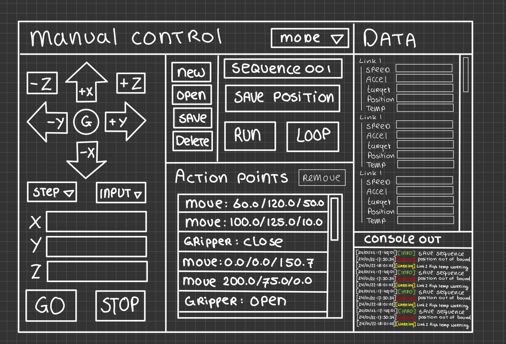|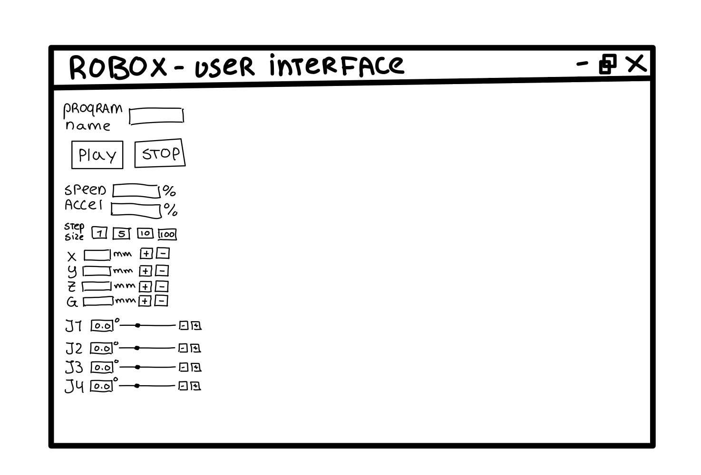|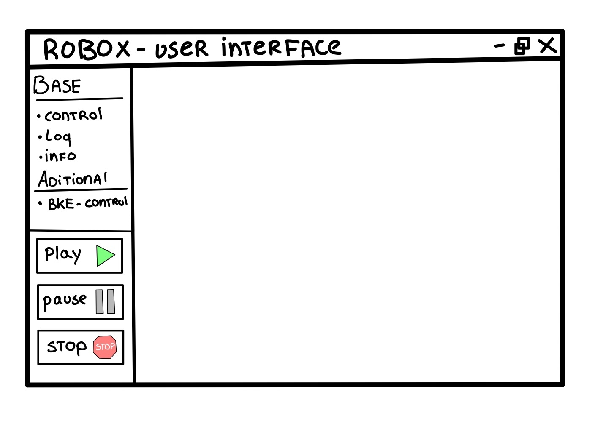|
|**Schets 1** - *GUI schets 1*|**Schets 2** - *GUI schets 2*|**Schets 3** - *GUI schets 3*|
|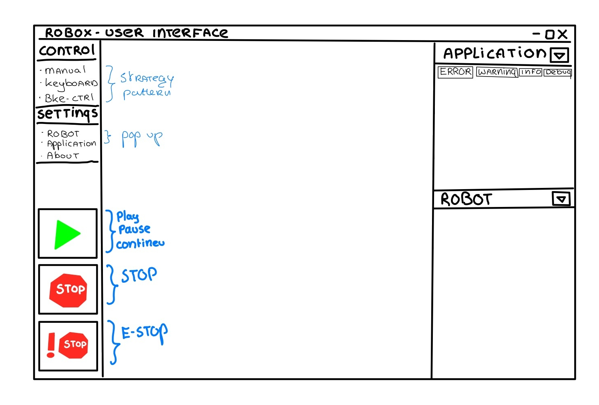|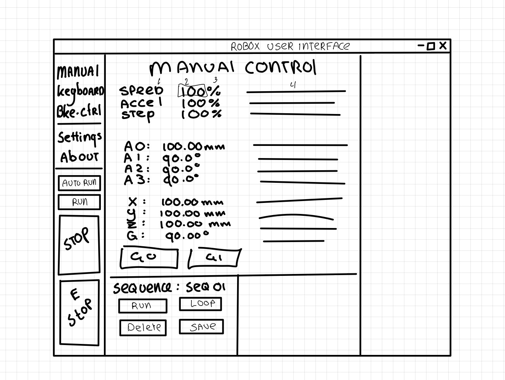||
|**Schets 4** - *GUI schets 4*|**Schets 5** - *GUI schets 5*||

### 3.5.2. Rapid application development <a name="chapter17"></a>

Voor de ontwikkeling van de GUI wordt gebruik gemaakt van de library [wxWidgets](https://www.wxwidgets.org/). Deze library maakt het mogelijk om een cross-platform GUI te ontwikkelen, deze library is ook gebruikt tijdens de opleiding. Voor de ontwikkeling van de daadwerkelijke frames is gebruik gemaakt van de Rapid application development (RAD) tool [wxFromBuilder](https://github.com/wxFormBuilder/wxFormBuilder), deze tool maakt het mogelijk om relatief snel een frame te bouwen.

<div style="page-break-after: always;"></div>

### 3.5.3. Iteratie 01 - Toetsenbord en muis <a name="chapter18"></a>

|||
|:---:|:---:|
|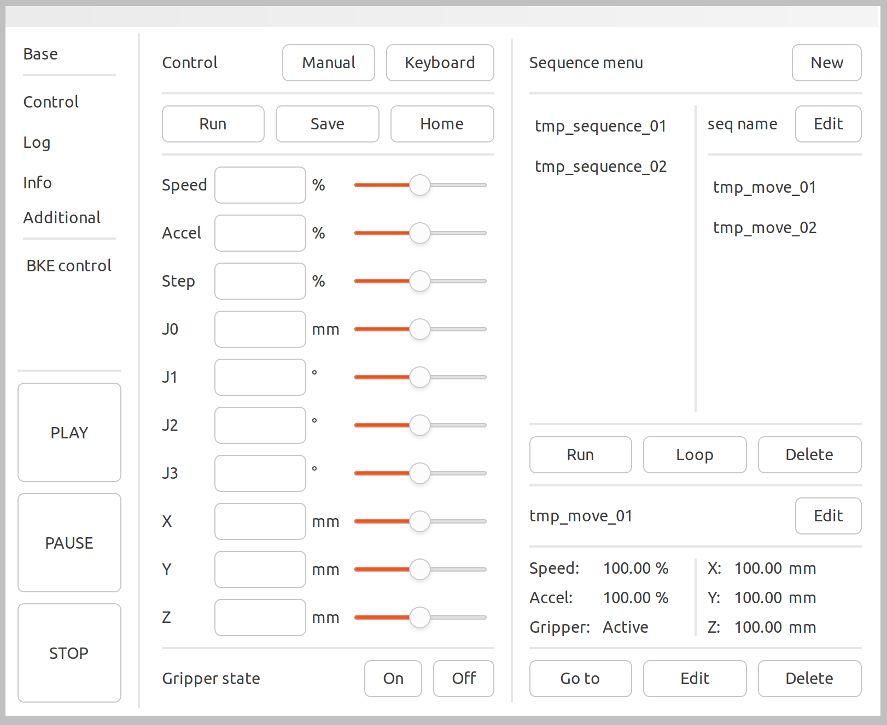||
|**Afbeelding 34** - *iteratie 01 - frame manual*|**Afbeelding 35** - *iteratie 01 - frame keyboard*|

> De vraagtekens in de afbeelding zijn placeholders voor uiteindelijke afbeeldingen.

De eerste iteratie van de GUI bevatte drie onderdelen. Het besturen van de robot door middel van sliders en tekstvelden, dit controle systeem is terug te zien in de afbeelding *iteratie 01 - frame manual*. Bij dit besturingssysteem was ht de bedoeling dat verschillende waardes aangepast zouden worden aan de hand van de eerder genoemde componenten. Vervolgens kon er op de 'Run'-knop gedrukt worden waardoor deze nieuwe waardes naar de robot gestuurd zouden worden volgens het [messageprotocol](bijlage/04_design_documents/07_protocol_description.pdf).

Het tweede onderdeel van deze iteratie is terug te zien in de afbeelding *iteratie 01 - frame keyboard*. Dit systeem kon geactiveerd worden door op de 'Keyboard'-knop te drukken boven in het frame. Deze controle methodiek was gebaseerd op dat de gebruiker verschillende toetsen op het toetsenbord indrukt, deze toetsen worden vervolgens direct vertaald naar bewegingscommando's en naar de robot verstuurd. De XY-positie van de robot kon worden bestuurd met de WASD-toetsen. De hoogte van de robot kon bestuurd worden met de pijltjes toetsen (pijltje omhoog voor omhoog, pijltje omlaag voor omlaag). De stap grote van de robot (hoeveel stappen per actie) kon worden ingesteld met de 1 t/m 0 toetsen, waarbij elke toets een percentage van de maximale stap grote zou zijn (1 = 10%, 0 = 100%). en tot slot de snelheid, deze kon ingesteld worden aan de hand van de '+' en '-' toetsen.

Het derde onderdeel in deze iteratie is het sequence paneel, deze is te zien in beide afbeeldingen (*iteratie 01 - frame manual*, *iteratie 01 - frame keyboard*) (rechts). Dit paneel was verantwoordelijk voor het aanmaken, opslaan, aanpassen, en verwijderen van sequences.

Een sequence is een verzameling van verschillende bewegingen die op volgorde afgespeeld konden worden. Wanneer er door middel van een control methodiek een bepaalde beweging is uitgevoerd kan deze opgeslagen worden in een sequence. Dit kan gedaan worden voor een aantal verschillende bewegingen (zo veel als je wilt). Deze sequence kan vervolgens afgespeeld worden zodat de robot alle bewegingen uitvoert die opgeslagen zijn in de sequence. Op deze manier kan de robot 'getraind' worden voor een bepaalde activiteit, en deze activiteit herhaaldelijk uitvoeren.

<div style="page-break-after: always;"></div>


### 3.5.4. Iteratie 02 - Sequence paneel <a name="chapter19"></a>

Bij de tweede iteratie is er voor gekozen om in verband met de naderende deadline de onderdelen bij manual control en keyboard control los te koppelen waardoor deze separaat van elkaar ontwikkeld konden worden, te beginnen bij het manual control onderdeel.

Beide het sequence paneel en het manual control paneel moest significant gesimplificeerd worden, wederom in verband met de deadline. Het resultaat is te zien in de onderstaande afbeelding *Iteratie 02 - Main frame*

|||
|:---|:---|
|In deze afbeelding is te zien dat de sliders, voor het bepalen van de hoeken en de cartesiaanse coördinaten, weggehaald zijn. Het sequence paneel zoals verteld sterk gesimplificeerd. Een beweging (move) kan nu opgeslagen worden in een sequence. Een sequence kan niet meer aangepast worden enkel afgespeeld. Deze simplificatie bevat nog steeds de basis functionaliteit van het sequencepaneel, maar laat een groot complex onderdeel vallen waardoor de kans groter werd dat de applicatie voor de deadline gerealiseerd zou worden.||
||**Afbeelding 36** - *iteratie 02 - Frame*|


### 3.5.5. Iteratie 03 - Hoeken en coördinaten <a name="chapter20"></a>

De derde iteratie was de laatste iteratie voor de GUI. Omdat het sequence paneel erg veel complexiteit met zich meebracht, is uiteindelijk toch voor gekozen dit onderdeel te laten vervallen voor het huidige project. De basis functionaliteit van het project is nog steeds haalbaar zonder het sequencepaneel.

|||
|:---|:---|
|Omdat de sliders die weggehaald waren bij de vorige iteratie toch eigenlijk wel erg geschikt waren voor de besturing van de robot, zeker voor het testen, zijn ze in deze iteratie weer terug gekomen. Er is wel voor gekozen om de besturing door middel van cartesiaanse coördinaten en de besturing aan de hand van hoeken te splitsen in twee lossen panelen. Er kon onderling gewisseld worden tussen deze panelen door op de knop 'Angles' te drukken voor besturing met hoeken, en op de knop 'Cartesian' voor besturing met coördinaten. ||
||**Afbeelding 37** - *iteratie 03 - Frame*|

De locatie waar het sequence paneel voorheen geplaatst was is tijdens deze iteratie gebruikt voor het weergeven van de huidige positie in hoeken en daar onder de positie in coördinaten. Deze positie werd tien keer per seconden geüpdatet. 

<div style="page-break-after: always;"></div>


### 3.5.6. Iteratie 04 - Simulatie <a name="chapter21"></a>

Tijdens de implementatie van het cartesiaanse coördinaten systeem bleken de slider geen ideale besturingsmethode te zijn, voor de coördinaten. Voor bijvoorbeeld een bepaalde X locatie zijn er weer andere Y coördinaten en andersom. Hierdoor moet er erg veel berekend worden in de applicatie zelf, niet handig.

De oplossing die gekozen was was om de cartesiaanse besturing te realiseren door middel van een simulatie. De simulatie levert de gebruiker beide het inzicht in de huidige locatie van de robot en levert een visueel besturingselement wat het overzicht verhoogd.

### 3.5.7. De implementatie <a name="chapter22"></a>

Tijdens de ontwikkeling van de GUI zijn er een drietal prototypes gemaakt. Het eerste prototype was de communicatie met de robot zelf, de [Driver](https://github.com/LukevLuijn/robox_docs/tree/main/prototypes/software/driver_test) (bijlage 13 - Driver). De driver is verantwoordelijk voor het interpreteren van de inkomende berichten van de robot. Het implementeren van de functionaliteiten van de firmware en het creëren van berichten voor de robot. De precisie werking van dit onderdeel van de GUI is terug te vinden in het [software design document](bijlage/04_design_documents/05_sdd_software.pdf) (Hoofdstuk 4.1 *Package - Driver*) (Bijlage 20 - sdd_software.pdf).

Het tweede prototype was de [Logger](https://github.com/LukevLuijn/robox_docs/tree/main/prototypes/software/logger_test) (bijlage 14 - Logger). De logger is verantwoordelijk voor het weergeven van log berichten uit de applicatie (GUI) zelf (intern) en van de log berichten van de firmware (extern). Deze log berichten moesten per **severity* te sorteren zijn. Ook moesten de interne en externe berichten los van elkaar weergegeven worden. Het resultaat van dit prototype is te zien in de onderstaande afbeeldingen, De precieze werking van de logger en uitleg over de onderdelen is terug te vinden in het [SDD](bijlage/04_design_documents/05_sdd_software.pdf) document (Hoofdstuk 4.2 *Package - Logger*) (bijlage 20 - sdd_software.pdf)

|||
|:---:|:---:|
||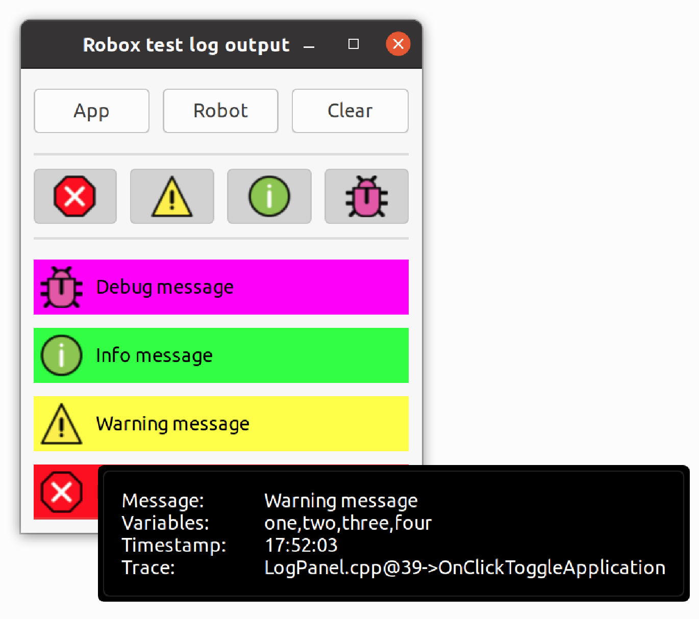|
|**Afbeelding 38** - *Logger 1*|**Afbeelding 39** - *Logger 2*|

> ```*``` *Severity* De log berichten zijn onderverdeeld in vier gradaties; ERROR, WARNING, INFO & DEBUG.

<div style="page-break-after: always;"></div>

Het derde prototype was de eerder genoemde [Simulatie](https://github.com/LukevLuijn/robox_docs/tree/main/prototypes/software/robot_visual_test) (bijlage 15 - Visual). Dit onderdeel is verantwoordelijk voor het weergeven van het in realtime weergeven van de huidige positie van het arm onderdeel van de robot. Verder is het verantwoordelijk voor het besturen van de arm in cartesiaanse coördinaten. Dit is mogelijk door de gripper in de simulatie te selecteren met de muis. De gripper kan vervolgens met de muis bewogen worden waardoor de andere assen mee bewegen.

Wanneer de robot met de muis bewogen wordt worden de bijhorende sliders en tekstvelden (A1 & A2) ook direct aangepast. Verder is de huidige positie van de gripper weergegeven in de simulatie. Hierdoor is het altijd duidelijk welke cartesiaanse coördinaten bij de huidige positie horen. In [dit](bijlage/05_clips/prototypes/robox_visual_test_00.mp4) filmpje (bijlage 24 - robox_visual_test_00.mp4)is de werking van de simulatie visueel weergegeven.

De uiteindelijke uitwerking van de simulatie in de applicatie is terug te vinden in het [SDD](bijlage/04_design_documents/05_sdd_software.pdf) (hoofdstuk *4.4 Package - frame*) (Bijlage 20 - sdd_software.pdf).

<div style="page-break-after: always;"></div>

# 4. Resultaten <a name="chapter23"></a>


|||
|:---:|:---:|
|||
|**Afbeelding 40** - *ROBOX voorkant* |**Afbeelding 41** - *ROBOX achterkant*|
|||
|**Afbeelding 42** - *ROBOX bovenkant* |**Afbeelding 43** - *ROBOX bekabeling*|
|||
|**Afbeelding 44** - *ROBOX bovenkant* |**Afbeelding 45** - *ROBOX bekabeling*|
<div style="page-break-after: always;"></div>

|                                                                                 |
| :-----------------------------------------------------------------------------: |
|  |
|  |
|                  **Afbeelding 46** - *Grafische user interface*                   |


<div style="page-break-after: always;"></div>

|      #      | Specificatie              | Waarde    | Bron                                     |
| :---------: | :------------------------ | :-------- | :--------------------------------------- |
| **SPEC-00** | Repeatability             | < 0.10 mm | [Resultaten](bijlage/06_repeatability.pdf) (bijlage x - results.pdf) |
| **SPEC-01** | Werk oppervlak            | 0,22 m²   | [MDD](bijlage/04_design_documents/03_mdd_hardware.pdf) (bijlage x - mdd_hardware.pdf)   |
| **SPEC-02** | Werk volume               | 0,095 m³  | [MDD](bijlage/04_design_documents/03_mdd_hardware.pdf) (bijlage x - mdd_hardware.pdf)   |
| **SPEC-03** | Verticale beweging        | 437mm     | [MDD](bijlage/04_design_documents/03_mdd_hardware.pdf) (bijlage x - mdd_hardware.pdf)   |
| **SPEC-04** | Verticale snelheid        | 45 mm/s   | [MDD](bijlage/04_design_documents/03_mdd_hardware.pdf) (bijlage x - mdd_hardware.pdf)   |
|             | **Segment 01 - Schouder** |           |                                          |
| **SPEC-05** | Minimale positie          | -90°      | [MDD](bijlage/04_design_documents/03_mdd_hardware.pdf) (bijlage x - mdd_hardware.pdf)   |
| **SPEC-06** | Maximale positie          | 90°       | [MDD](bijlage/04_design_documents/03_mdd_hardware.pdf) (bijlage x - mdd_hardware.pdf)   |
| **SPEC-07** | Maximale snelheid         | 234.48°/s | [MDD](bijlage/04_design_documents/03_mdd_hardware.pdf) (bijlage x - mdd_hardware.pdf)   |
|             | **Segment 02 - Elleboog** |           |                                          |
| **SPEC-08** | Minimale positie          | -360°     | [MDD](bijlage/04_design_documents/03_mdd_hardware.pdf) (bijlage x - mdd_hardware.pdf)   |
| **SPEC-09** | Maximale positie          | 360°      | [MDD](bijlage/04_design_documents/03_mdd_hardware.pdf) (bijlage x - mdd_hardware.pdf)   |
| **SPEC-10** | Maximale snelheid         | 234.48°/s | [MDD](bijlage/04_design_documents/03_mdd_hardware.pdf) (bijlage x - mdd_hardware.pdf)   |
| **SPEC-11** | Lengte                    | 240 mm    | [MDD](bijlage/04_design_documents/03_mdd_hardware.pdf) (bijlage x - mdd_hardware.pdf)   |
|             | **Segment 03 - Pols**     |           |                                          |
| **SPEC-12** | Minimale positie          | -360°     | [MDD](bijlage/04_design_documents/03_mdd_hardware.pdf) (bijlage x - mdd_hardware.pdf)   |
| **SPEC-13** | Maximale positie          | 360°      | [MDD](bijlage/04_design_documents/03_mdd_hardware.pdf) (bijlage x - mdd_hardware.pdf)   |
| **SPEC-14** | Maximale snelheid         | 234.48°/s | [MDD](bijlage/04_design_documents/03_mdd_hardware.pdf) (bijlage x - mdd_hardware.pdf)   |
| **SPEC-15** | Lengte                    | 150 mm    | [MDD](bijlage/04_design_documents/03_mdd_hardware.pdf) (bijlage x - mdd_hardware.pdf)   |

**Tabel 1** - *Robot specificaties*

<div style="page-break-after: always;"></div>

|   Index    | Onderdeel  | Doc     | Beschrijving                                                                                                                                                                                                                                                           |
| :--------: | :--------- | :------ | :--------------------------------------------------------------------------------------------------------------------------------------------------------------------------------------------------------------------------------------------------------------------- |
|**REPO-01**|*Project*|[Code](https://github.com/LukevLuijn/robox)|De publiekelijk beschikbare repository voor de software, firmware en alle modellen ontwikkeld voor het ROBOX project. In deze repository zijn alle onderdelen te vinden die nodig zijn voor het maken van een eigen ROBOX!|
|**REPO-02**|*Project*|[Docs](https://github.com/LukevLuijn/robox_docs)|De publiekelijk beschikbare repository voor alle documentatie geschreven voor dit project. Hier kunnen (Nederlandse) ROBOX-makers alle documentatie lezen over het ROBOX project.|

**Tabel 2** - *Repositories*

|   Index    | Onderdeel  | Doc     | Beschrijving                                                                                                                                                                                                                                                           |
| :--------: | :--------- | :------ | :--------------------------------------------------------------------------------------------------------------------------------------------------------------------------------------------------------------------------------------------------------------------- |
| **DOC-01** | *Hardware* | [MDD](bijlage/04_design_documents/03_mdd_hardware.pdf) (bijlage 18 - mdd_hardware.pdf)| Het model design description document is opgesteld als gecentraliseerde locatie voor beide de eisen aan het model en de beschrijving van het uiteindelijke resultaat.                                                                                                  |
| **DOC-02** | *Hardware* | [BOM](bijlage/04_design_documents/06_bill_of_materials.pdf) (bijlage 21 - bill_of_materials.pdf)| De bill of materials is opgesteld zodat het voor alle toekomstige ROBOX bouwers duidelijk is waar ze aan beginnen. In dit document zijn alle benodigde onderdelen benoemd met url en prijs.                                                                            |
| **DOC-03** | *Firmware* | [SRS](bijlage/04_design_documents/01_srs_firmware.pdf) (bijlage 16 - srs_firmware.pdf)| Het software requirements document voor de firmware is opgesteld om een duidelijk beeld te creëren van de beoogde functionaliteiten van het systeem. Het geeft verder ook duidelijk weer wat de staat van het product is.                                              |
| **DOC-04** | *Firmware* | [SDD](bijlage/04_design_documents/04_sdd_firmware.pdf) (bijlage 19 - sdd_firmware.pdf)| Het software design document voor de firmware is, bedoelt als een naslagwerk voor toekomstige iteraties van het ROBOX project. In dit document zijn de uitwerking en keuzes te vinden voor het gehele firmware product.                                                 |
| **DOC-05** | *Software* | [SRS](bijlage/04_design_documents/02_srs_software.pdf) (bijlage 17 - srs_software.pdf)| Het software requirements specification document voor de software is opgesteld om een duidelijk beeld te creëren van de verschillende (vereiste) functionaliteiten van de software. Aan de hand van verschillende usecases en requirements is de applicatie ontworpen. |
| **DOC-06** | *Software* | [SDD](bijlage/04_design_documents/05_sdd_software.pdf) (bijlage 20 - sdd_software.pdf)| Het software design description document voor de software geeft de uitwerking van de uiteindelijke applicatie weer. Dit document kan in toekomstige iteraties gebruikt worden om meer duidelijkheid te krijgen van het geïmplementeerde systeem.                       |

**Tabel 3** - *Documenten*

|   Index    | Onderdeel  | Doc     | Beschrijving                                                                                                                                                                                                                                                           |
| :--------: | :--------- | :------ | :--------------------------------------------------------------------------------------------------------------------------------------------------------------------------------------------------------------------------------------------------------------------- |
|**CP-01**|*Project*|[Gebruik](bijlage/05_clips/ui/ui_preview.mp4) (bijlage 27 - ui_preview.mp4)|In dit filmpje is het gebruik van de GUI te zien met het realtime resultaat van de robot.|

**Tabel 4** - *Clips*

<div style="page-break-after: always;"></div>

# 5. Conclusie <a name="chapter24"></a>

Aan het begin van dit document word de hoofdvraag van dit project opgesteld;

> **- Hoe maak je een robotarm die door iedereen (binnen de doelgroep) te bouwen is, goed presteert, en niet teveel kost?**

In het verloop van het ROBOX project is er geprobeerd deze hoofdvraag verder te definiëren aan de hand van experimenten en andere onderzoeken. Er zijn vervolgens verschillende deelvragen opgesteld;

> **1. Wat voor robotarm zal er gebouwd worden?**

> **2. Welke functionaliteiten verwacht de doelgroep?**

> **3. Wat is te duur en wat niet?**

> **4. Wat voor apparatuur kun je verwachten bij een gemiddelde hobbyist?**

> **5. Wat definieert een goede prestatie?**

De eerste deelvraag is beantwoord aan de hand van een literatuuronderzoek. Het type robot dat tijdens dit project gebouwd zou worden was een *SCARA robot*. Dit type robot zou beide de gewenste uitdaging op gebied van ontwerp en software met zich meebrengen. Het type voldeed aan de bewegingssnelheids-eis en scoorde sterk op de persoonlijke interesse schaal.

Vervolgens is er gekeken naar de verschillende functionaliteiten die noodzakelijk zijn voor de robot zodat de doelgroep eerder geneigd is om zelf een ROBOX te bouwen. De verschillende functionaliteiten zijn onderverdeeld in drie documenten, het [MDD](bijlage/04_design_documents/03_mdd_hardware.pdf) (bijlage 18 - mdd_hardware.pdf), [SRS (firmware)](bijlage/04_design_documents/01_srs_firmware.pdf) (bijlage 16 - srs_firmware.pdf) & [SRS (software)](bijlage/04_design_documents/02_srs_software.pdf) (bijlage 17 - srs_software.pdf). Deze functionaliteiten zijn het antwoord op de tweede deelvraag.

De derde deelvraag is puur gebaseerd op de persoonlijke instelling van de doelgroep. De totale prijs van ROBOX is terug te vinden in de bill of materials ([BOM](bijlage/04_design_documents/06_bill_of_materials.pdf) (bijlage 21 - bill_of_materials.pdf)) en komt neer op een bedrag van € 553,42 euro. Dit is erg veel geld voor een hobby project.

Gezien ikzelf val binnen de doelgroep zal deze deelvraag beantwoord worden op basis van persoonlijke mening; Als ik op zoek ben naar een robot arm project zou ik persoonlijk zeggen dat meer dan 500 euro onacceptabel is, tenzij het product voorzien is van alle gebruiksgemakken zoals bijvoorbeeld: Een handleiding, actief onderhouden firm- en software en een actieve gemeenschap om het product heen zodat troubleshooten van het product mogelijk is.

Voor de vierde deelvraag is uitgegaan van enkel een 3D-printer. Studenten, zoals ikzelf, wonen misschien op kamers. Hier is weinig ruimte voor apparatuur. Tijdens de ontwikkeling van ROBOX is er exclusief gebruik gemaakt van 'off-the-shelf'-onderdelen (met de uitzondering van de 3D geprinte onderdelen) zodat een eindgebruiker naast een 3D-printer en wat schroevendraaiers niks nodig heeft om het project te voltooien. 

Het beantwoorden van de vijfde deelvraag is gedaan in het [tweede experiment](bijlage/03_experiment_02/experiment_02.pdf) (bijlage 03 - experiment_02). In dit experiment wordt er gekeken naar de repeatability (herhaalbaarheid) van de robot in de staat van toen. Het resultaat van dat experiment was een repeatability van < 0.1 millimeter. Het huidige eindproduct is op een soortgelijke manier getest (zie bijlage X - clips/repeatability/*.) en de resultaten zijn vervolgens verwerkt in het document: [Resultaten](bijlage/06_repeatability.pdf) (bijlage 06- repeatability.pdf). De uiteindelijke repeatability van ROBOX voldoet aan de gestelde eisen in het tweede experiment (0.079 mm).

Nu alle deelvragen beantwoord zijn kan de hoofdvraag beantwoord worden, dit antwoord is gegeven in de vorm van dit document, het ontwerp proces. In dit document worden in detail beschreven hoe een dergelijke robot ontwikkeld kan worden. 

## 5.1. Verbeterpunten <a name="chapter25"></a>

Het uiteindelijke resultaat bevat op verschillende aspecten nog verbeterpunten, deze punten zijn in dit onderdeel vermeld.

- Het model bevat een verticale 'wiebel' deze is afkomstig uit de segmentverbinding tussen de schouder en de elleboog. Deze wiebel is ontstaan door het niet helemaal kunnen vastmaken van de bouten (Hoofdstuk *De verwezenlijking*).
- De controller is momenteel een handmatig gesoldeerd printplaatje, dit kan in toekomstige iteraties vervangen worden door een 'purpose-build'-PCB. Dit zal het toegankelijker maken voor eindgebruikers en zal schelen in ruimte.
- De printplaat voor de gripper is momenteel verwerkt in de hoofdcontroller zelf. Het is de bedoeling dat de gripper uitgewisseld kan worden zonder de robot uit elkaar te halen. In toekomstige iteraties moet de printplaat voor de gripper dan ook losgekoppeld worden van de controller.
- De maximale snelheden vermeld in het hoofdstuk *Resultaten* is gebaseerd op de maximale snelheid wanneer een enkele motor tegelijk beweegt. Wanneer meerdere motoren tegelijkertijd bewegen zijn deze snelheden niet meer haalbaar (de firmware slaat stappen over). Dit is het resultaat van een library die geschreven is voor relatief trage microcontrollers (Arduino 16 MHz). ROBOX maakt gebruik van een Teensy 4.0 met een snelheid van 600 MHz. Door gebruik te maken van een meer geoptimaliseerde library bijvoorbeeld [TeensyStep](https://github.com/luni64/TeensyStep) kan er waarschijnlijk een hogere algemene snelheid bereikt worden.
- In de software zijn een aantal elementen geschrapt in verband met de beschikbare tijd (Hoofdstuk *De software* & bijlage X - srs_software.pdf). Onderdelen als het sequence paneel en bijvoorbeeld Keyboard control. Deze onderdelen kunnen in een latere iteratie uitgewerkt worden, hierdoor zal de functionaliteit van de GUI sterk verhoogd worden.


<div style="page-break-after: always;"></div>

# 6. Reflectie <a name="chapter26"></a>

In dit hoofdstuk zal er gereflecteerd worden op de werkzaamheden van het ROBOX project. Bij aanvang van het project heb je een bepaald doel voor ogen, een product. Dit product wil je maken omdat je daar uiteindelijk iets uit haalt, een persoonlijke verrijking, verfijning van vaardigheden, of een andere drijfweer. Het doel van dit hoofdstuk is dan ook om terug te koppelen naar de drijfweer voor het ROBOX project en de resultaten te evalueren.

In dit hoofdstuk zal aan de hand van verschillende situatiebeschrijvingen terug gekoppeld worden naar de gang van zaken tijdens het ROBOX project. Wat ging er goed, wat niet en welke tegenslagen of meevallers er langs zijn gekomen.

## 6.1. Inleiding <a name="chapter27"></a>

Tijdens mijn studie carrière op de opleiding HBO-ICT en dan voornamelijk vanaf het ESD-profiel heb ik veel hobby projectjes gemaakt (zie hoofdstuk: *Inleiding*). Door deze projecten heb ik vaardigheden ontwikkeld die op de opleiding niet geleerd worden. Vaardigheden als 3D modelleren, het ontwerpen en maken van printplaatjes en het produceren van een hardware product van A tot Z. Dit zijn vaardigheden die in mijn ogen in mijn latere carrière goed van pas kunnen komen. 

Deze vaardigheden wil ik dan ook blijven verfijnen en het ROBOX project was hier een ideale uitwerking van. Het bevat alle eerder genoemde onderdelen en daarnaast nog een significant software onderdeel waarmee ik mijn op de opleiding geleerde vaardigheden kon testen.

Verder heb ik tijdens de eerder genoemde hobby projectjes altijd veel gebruik gemaakt van publiekelijk beschikbare informatie, open-source projecten, zonder deze informatie was het voor mij niet mogelijk geweest om dit soort vaardigheden te ontwikkelen en ik denk dan ook dat het nu tijd is om iets terug te geven aan deze gemeenschap. Met dit project kan ik laten zien wat ik in de afgelopen jaren heb geleerd op de opleiding en daarbuiten.

Het project is niet zonder slag of stoot gegaan, helaas, in de onderstaande alinea's zijn enkele situaties beschreven die tijdens dit project zijn voortgekomen.

## 6.2. Kromme lagers <a name="chapter28"></a>

Na afloop van het eerste experiment kwam ik erachter dat de huidige lager-opzet die ik bij het voorgaande robot project had toegepast niet zou werken met het ROBOX project gezien de oriëntatie van de segmenten en de montage methodiek, anders is. Op dit punt in het project was ik zo goed als klaar met het ontwerpen van de tweede iteratie van het model (zie hoofdstuk *Iteratie 02 - The bigger the better*). De realisatie dat mijn huidige ontwerp niet ging werken was een zware tegenslag, en viel zwaar. Op dit moment had ik al enkele onderdelen besteld en laten overvliegen vanuit china (aliexpress). Het plan was dan ook om de arm die week te printen en in elkaar te zetten zodat ik kon gaan beginnen met het testen.

Voor het nieuwe ontwerp moesten ook nieuwe onderdelen besteld worden, er zouden andere lagers gebruikt worden dan in het oorspronkelijke model en er zouden extra, axiale, lagers bijkomen. Dit betekende extra kosten en weer twee a drie weken wachten op de nieuwe onderdelen. Dit heeft een flinke deuk geslagen in mijn planning. 

Na twee en een halve week kwamen de nieuwe lagers binnen, op de onderstaande afbeeldingen zijn de staat van de lagers te zien, onbruikbaar. Het was niet mogelijk de lagers opnieuw van aliexpress te bestellen omdat ik de tijd niet had om nogmaals zo lang te wachten. De lagers moesten uit Nederland komen. Lagers zijn erg duur als je ze van Europese winkels koopt daarom haal ik ze altijd uit china. 

|||
|:---:|:---:|
|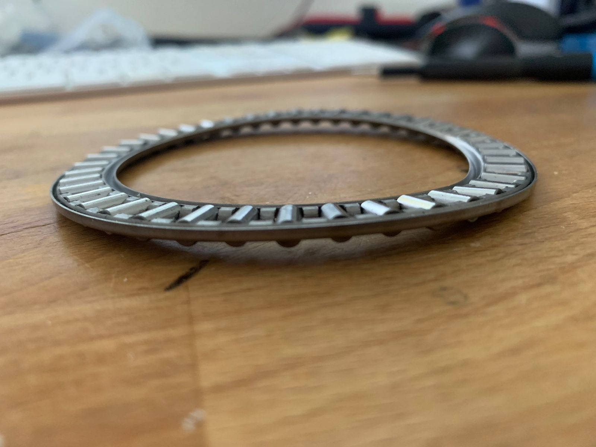|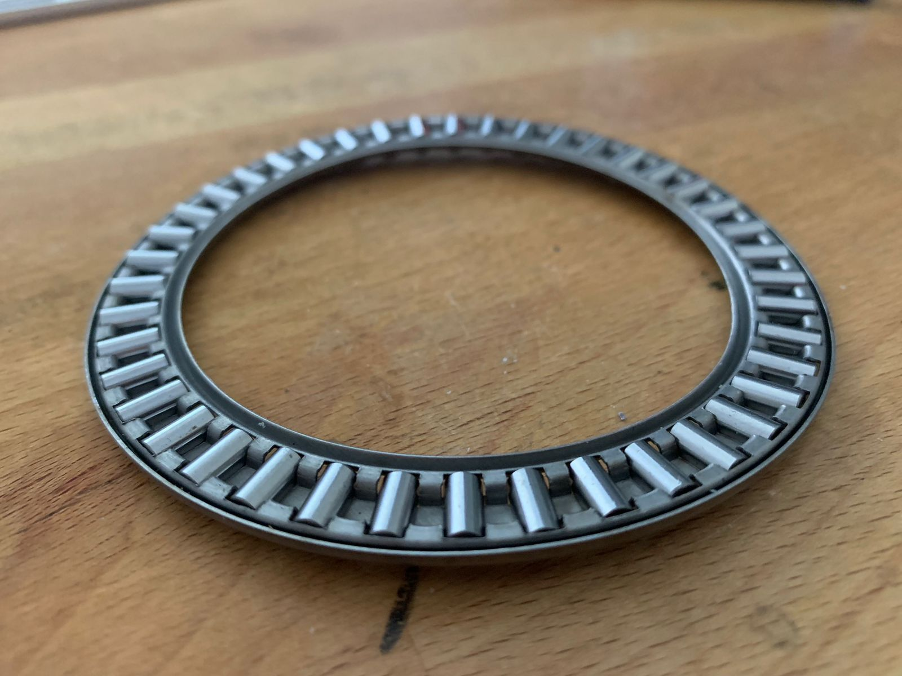|
|**Afbeelding 47** - *kromme lager 1*|**Afbeelding 48** - *kromme lager 2*|

## 6.3. Kapotte printer <a name="chapter29"></a>

Eind maart kwam er een kamer vrij in een huis waar ik graag wilde wonen. Halverwege april kon in de kamer in en gezien ik de financiële capaciteiten niet heb ik twee losse kamers te betalen ben ik direct verhuist. Van het bericht van een vrije kamer tot verhuizing zaten vier dagen. De komende twee weekenden ben ik bezig geweest met de kamer woon-klaar te maken.

Naast dat deze periode erg stressvol en vermoeiend was, zat ik toen precies in de periode dat ik alle onderdelen aan het printen was voor de robot. Het was cruciaal dat de onderdelen zo snel mogelijk geprint zouden worden wat de deadline van het tweede experiment kwam er aan, hiervoor moest ik een groot deel van de robot geprint hebben.

Tijdens de verhuizing is er iets kapot gegaan aan mijn 3D-printer waardoor deze niet meer fatsoenlijk kon presteren. Een groot deel van de tijd die ik oorspronkelijk had gepland voor het uitvoeren en uitwerken van het tweede experiment is toen besteed aan het repareren van de printer.

|||
|:---:|:---:|
|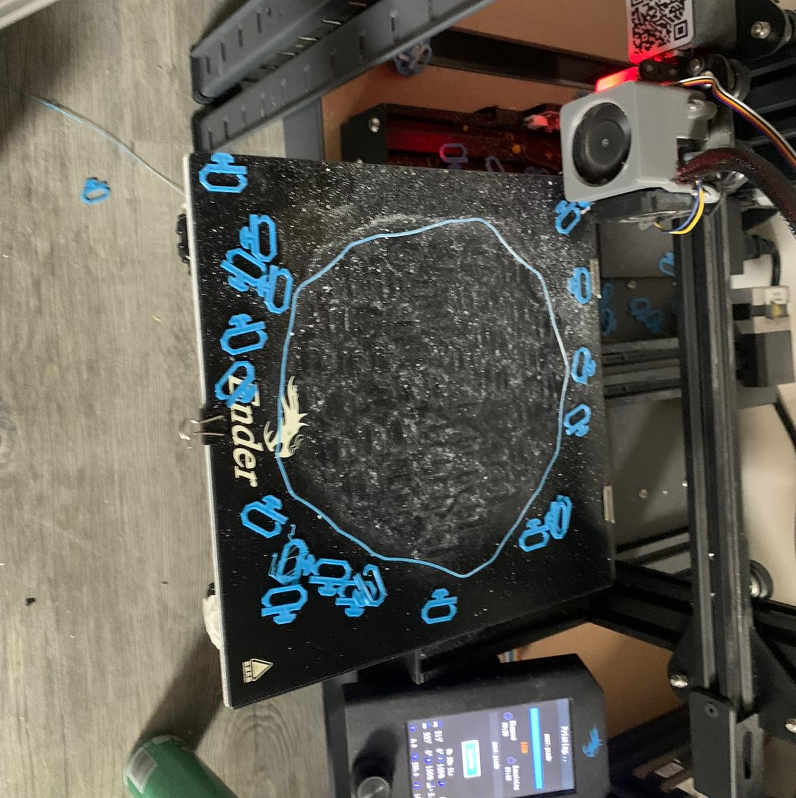|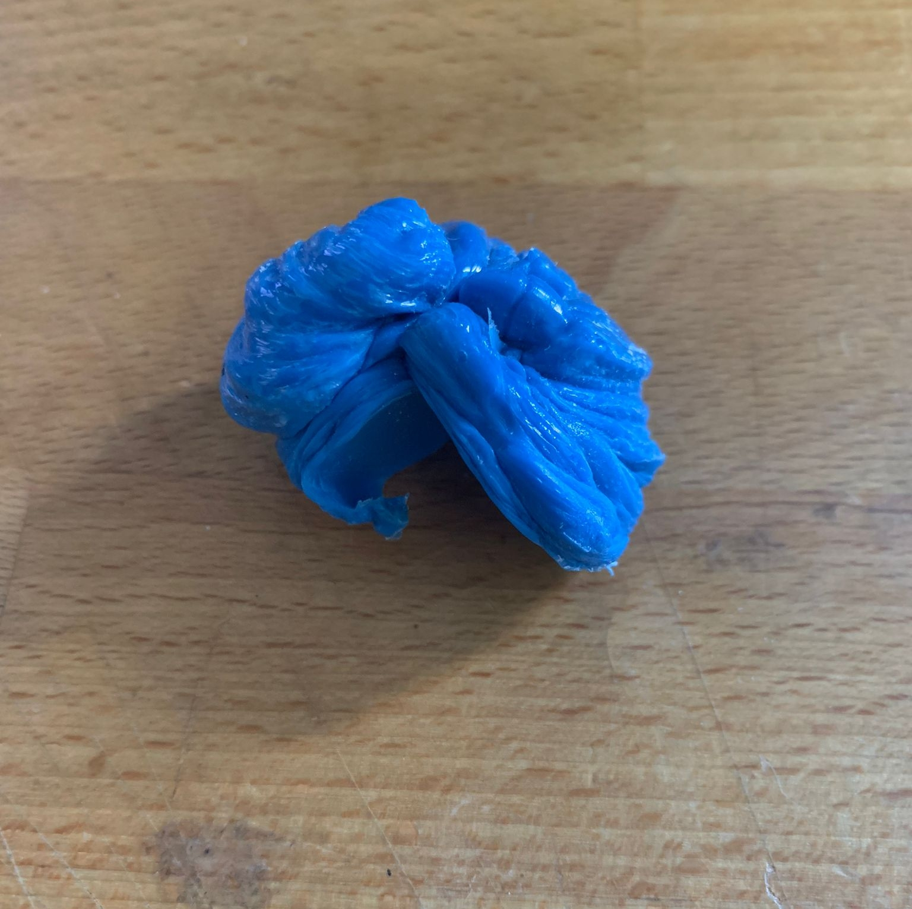|
|**Afbeelding 49** - *Kapotte printer 1*|**Afbeelding 50** - *Kapotte printer 2*|

<div style="page-break-after: always;"></div>

## 6.4. Ongeschikte library <a name="chapter30"></a>

Toen het model, GUI en firmware werkend en gedocumenteerd was ging ik spelen met de snelheid van de segmenten. Ik had de snelheid altijd vrij laag staan omdat je nooit zeker weet of je zelf gemaakte firm- en software wel doen wat er verwacht wordt. Tijdens het testen kwam ik erachter dat de robot velen malen sneller kon bewegen dan dat ik oorspronkelijk had gedacht. De Z-as kon wel 600% sneller ([commit](https://github.com/LukevLuijn/robox/commit/cc646f993e75f85acf4dab08a1b54f2aab9e3b03))! Ook de axiale assen zijn toen significant gestegen in maximale snelheid. 

Toen ik begon met het testen van de repeatability kwam ik erachter dat wat ik oorspronkelijk had bedacht niet geheel klopte, ik heb de nieuwe snelheden telkens getest met een enkele as. Nooit alles tegelijk. Bij het repeatability testen moesten alle assen tegelijkertijd werken. De repeatability had als resultaat een delta van meer dan 10 millimeter! 

Na een klein literatuur onderzoek kwam ik erachter dat de library die ik gebruik ([AccelStepper](https://www.airspayce.com/mikem/arduino/AccelStepper/)) voor het aansturen van de motoren niet geschikt is voor hoge stap snelheden. Het maximaal aantal betrouwbare stappen per seconde is voor deze library +/- 20.000, waar de robot **ver** overheen zat met alle assen actief.
Het moment van deze realisatie was te laat om er nog iets aan te doen, helaas.


## 6.5. Wat heb ik geleerd <a name="chapter31"></a>

Tijdens het ROBOX project heb ik geleerd dat alles, maar dan ook alles fout kan gaan. Je kan niet (enkel) uitgaan van de kennis en ervaring van voorgaande projecten. Elk onderdeel moet getest en gevalideerd worden. Elk project is anders. Dit geldt voor de onderdelen die te maken hebben met het model (zie afbeelding *Gefaalde prints*) en voor de firm- en software.

||
|:---:|
|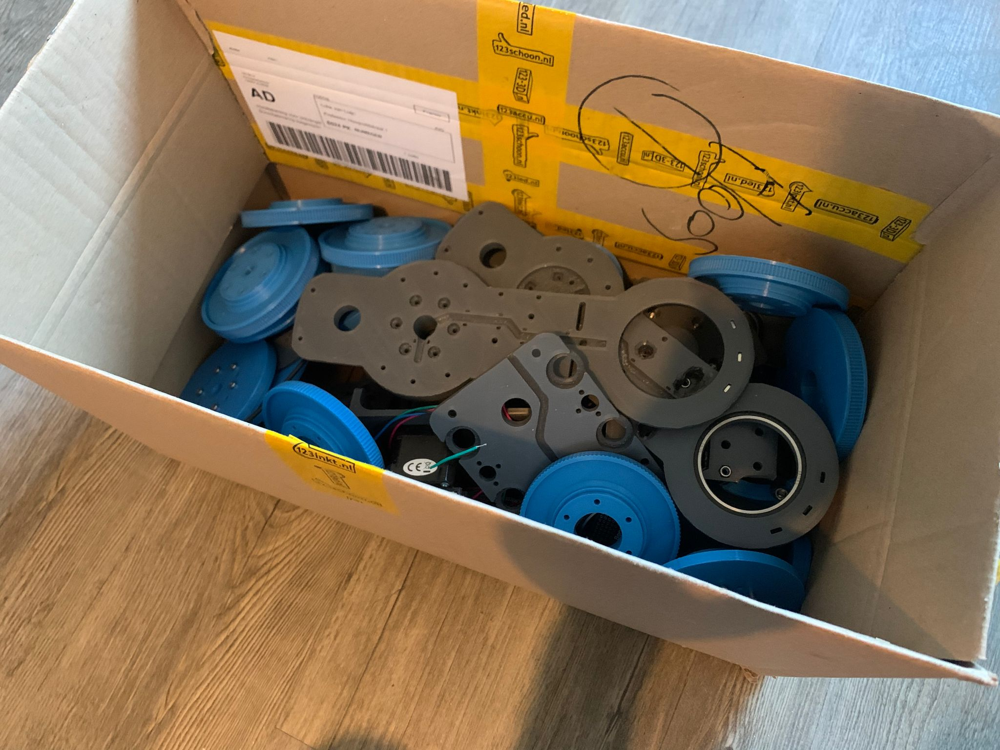|
|**Afbeelding 51** - *Gefaalde prints*|

Verder heb ik geleerd dat het handig kan zijn om een (lokaal) onderdeel te bestellen voor het testen zodat je in ieder geval zeker kan zijn dat je concept werkt. Pas wanneer het gevalideerd is moet je onderdelen bestellen met langere levertijden (goedkoper). Dit minimaliseert de tijd dat je aan het wachten bent, of de tijd die je verspilt aan het herstellen van de fouten die gemaakt zijn. Dit kan misschien wat duurder zijn in eerste instantie, maar ik denk dat over het hele project de kosten lager zijn.

Verder heb ik geleerd hoeveel tijd alles eigenlijk kost, tijdens de opleiding maak je altijd een onderdeel van een project. Of een klein project. Nu ik dit vrij grote project heb uitgevoerd merk ik pas hoeveel tijd je eigenlijk kwijt bent met het opzetten van een documentatie structuur, het eigenhandig implementeren van alle functionaliteiten en ook nog is het testen en valideren van alles wat je hebt gemaakt. 

Tijdens de conceptfase van het project had ik allerlei verschillende plannen; besturing door middel van een microcontroller smartwatch, een bluetooth controller, het toetsenbord. Allerlei configuratie mogelijkheden. Draadloze communicatie met de computer etc. Dit heb ik allemaal geschrapt in verband met tijdgebrek of complexiteit

Ik denk dat dit project heeft gedaan wat ik ervan verwacht had en meer. Mijn vaardigheden op gebied van modelleren, 3D-printen, ontwerpen en maken van hardware, het schrijven van firm- en software. Al deze aspecten zijn naar mijn inzien flink gestegen in kwaliteit, zelfs het schrijven van ondersteunende documentatie zoals de verschillende ontwerp documenten, zijn naar mijn idee stukken beter dan bijvoorbeeld vorig jaar.

<div style="page-break-after: always;"></div>

# 7. Literatuurlijst <a name="chapter32"></a>

| Index | Source                                                                                                                                                                                                                                                                                                                      | 
| :---: | :---                                                                                                                                                                                                                                                                                                                        | 
| 1     | Berkel, L. (z.d.). GRAND LITTLE PIANO. Grand Litte Piano. Geraadpleegd op 1 juni 2022, van [https://lottevanberkel10.wixsite.com/website-3/kopie-van-pre-master-tue](https://lottevanberkel10.wixsite.com/website-3/kopie-van-pre-master-tue)                                                                               | 
| 2     | Fairchild, M. (2021, 31 augustus). Types of Industrial Robots and Their Different Uses. HowToRobot. Geraadpleegd op 1 juni 2022, van [https://www.howtorobot.com/expert-insight/industrial-robot-types-and-their-different-uses](https://www.howtorobot.com/expert-insight/industrial-robot-types-and-their-different-uses) | 
| 3     | Berkel, L. (z.d.). GRAND LITTLE PIANO. Grand Litte Piano. Geraadpleegd op 1 juni 2022, van [https://lottevanberkel10.wixsite.com/website-3/kopie-van-pre-master-tueCartesian](https://lottevanberkel10.wixsite.com/website-3/kopie-van-pre-master-tueCartesian)                                                             | 
| 4     | Robots: Guide to The Most Scalable Robot Technology. (z.d.). #HowToRobot. Geraadpleegd op 3 juni 2022, van [https://www.howtorobot.com/expert-insight/cartesian-robots](https://www.howtorobot.com/expert-insight/cartesian-robots)                                                                                         | 
| 5     | CUI. (z.d.). AMT10 Series Modular Incremental Rotary Encoders. CUI Devices. Geraadpleegd op 3 juni 2022, van [https://www.cuidevices.com/product/motion/rotary-encoders/incremental/modular/amt10-series](https://www.cuidevices.com/product/motion/rotary-encoders/incremental/modular/amt10-series)                       | 
| 6     | ICA. (z.d.-a). Available product analysis - ICT research methods. ICA Research Methods. Geraadpleegd op 1 juni 2022, van [https://ictresearchmethods.nl/Available_product_analysis](https://ictresearchmethods.nl/Available_product_analysis)                                                                               | 
| 7     | ICA. (z.d.-b). Community research - ICT research methods. ICA Research Methods. Geraadpleegd op 2 juni 2022, van [https://ictresearchmethods.nl/Community_research](https://ictresearchmethods.nl/Community_research)                                                                                                       | 
| 8     | ICA. (z.d.-c). Component test - ICT research methods. ICA Research Methods. Geraadpleegd op 2 juni 2022, van [https://ictresearchmethods.nl/Component_test](https://ictresearchmethods.nl/Component_test)                                                                                                                   | 
| 9     | ICA. (z.d.-d). Literature study - ICT research methods. ICA Research Methods. Geraadpleegd op 1 juni 2022, van [https://ictresearchmethods.nl/Literature_study](https://ictresearchmethods.nl/Literature_study)                                                                                                             | 
| 10    | ICA. (z.d.-e). Model validation (ML) - ICT research methods. ICA Research Methods. Geraadpleegd op 1 juni 2022, van [https://ictresearchmethods.nl/Model_validation_(ML)](https://ictresearchmethods.nl/Model_validation_(ML))                                                                                              | 
| 11    | ICA. (z.d.-f). Multi-criteria decision making - ICT research methods. ICA Research Methods. Geraadpleegd op 1 juni 2022, van [https://ictresearchmethods.nl/Multi-criteria_decision_making](https://ictresearchmethods.nl/Multi-criteria_decision_making)                                                                   | 
| 12    | ICA. (z.d.-g). Requirements prioritization - ICT research methods. ICA Reasearch Methods. Geraadpleegd op 1 juni 2022, van [https://ictresearchmethods.nl/Requirements_prioritization](https://ictresearchmethods.nl/Requirements_prioritization)                                                                           | 
| 13    | Wikipedia contributors. (2022, 17 februari). Faraday cage. Wikipedia. Geraadpleegd op 1 juni 2022, van [https://en.wikipedia.org/wiki/Faraday_cage](https://en.wikipedia.org/wiki/Faraday_cage)                                                                                                                             | 


<div style="page-break-after: always;"></div>

# 8. Bijlage <a name="chapter33"></a>


|#|Naam|Bestand|Github|
|:---:|:---|:---|:---:|
|**01**|Prototypes|bijlage/01_prototypes|[URL](https://github.com/LukevLuijn/robox_docs/tree/main/prototypes)|
|**02**|Experiment 01|bijlage/02_experiment_01|[URL](https://github.com/LukevLuijn/robox_docs/tree/main/digital_media_productions/experiment_01)|
|**03**|Experiment 02|bijlage/03_experiment_02|[URL](https://github.com/LukevLuijn/robox_docs/tree/main/digital_media_productions/experiment_02)|
|**04**|Design documents|bijlage/04_design_documents|[URL](https://github.com/LukevLuijn/robox_docs/tree/main/design)|
|**05**|Repeatability test clips|bijlage/05_clips|n/a|
|**06**|Repeatability|bijlage/06_repeatability.pdf|n/a|
|**07**|Reflectie|bijlage/07_reflectie.pdf|n/a|
|**08**|Repositories|bijlage/08_repositories.txt|n/a|
|**--**|**bijlage/01_prototypes/firmware/***||
|**09**|Homing          |bijlage/01_prototypes/firmware/homing_test|[URL](https://github.com/LukevLuijn/robox_docs/tree/main/prototypes/firmware/homing_test)|
|**10**|Message         |bijlage/01_prototypes/firmware/message_test|[URL](https://github.com/LukevLuijn/robox_docs/tree/main/prototypes/firmware/message_test)|
|**11**|Serial          |bijlage/01_prototypes/firmware/serial_test|[URL](https://github.com/LukevLuijn/robox_docs/tree/main/prototypes/firmware/serial_test)|
|**12**|State machine   |bijlage/01_prototypes/firmware/state_machine_test|[URL](https://github.com/LukevLuijn/robox_docs/tree/main/prototypes/firmware/state_machine_test)|
|**--**|**bijlage/01_prototypes/software/***||
|**13**|Driver|bijlage/01_prototypes/software/driver_test|[URL](https://github.com/LukevLuijn/robox_docs/tree/main/prototypes/software/driver_test)|
|**14**|Logger|bijlage/01_prototypes/software/logger_test|[URL](https://github.com/LukevLuijn/robox_docs/tree/main/prototypes/software/logger_test)|
|**15**|Visual|bijlage/01_prototypes/software/visual_test|[URL](https://github.com/LukevLuijn/robox_docs/tree/main/prototypes/software/robot_visual_test)|
|**--**|**bijlage/04_design_documents/***||
|**16**|SRS Firmware|bijlage/04_design_documents/01_srs_firmware.pdf|[URL](https://github.com/LukevLuijn/robox_docs/blob/513851e61e6b88738ea2febd4442bd3a37c69446/design/firmware/srs/chapters/srs_firmware.md)|
|**17**|SRS Software|bijlage/04_design_documents/02_srs_software.pdf|[URL](https://github.com/LukevLuijn/robox_docs/blob/main/design/software/srs/chapters/srs_software.md)|
|**18**|MDD Hardware|bijlage/04_design_documents/03_mdd_hardware.pdf|[URL](https://github.com/LukevLuijn/robox_docs/blob/main/design/hardware/mdd/chapters/mdd_hardware.md)|
|**19**|SDD Firmware|bijlage/04_design_documents/04_sdd_firmware.pdf|[URL](https://github.com/LukevLuijn/robox_docs/blob/513851e61e6b88738ea2febd4442bd3a37c69446/design/firmware/sdd/chapters/sdd_firmware.md)|
|**20**|SDD Software|bijlage/04_design_documents/05_sdd_software.pdf|[URL](https://github.com/LukevLuijn/robox_docs/blob/main/design/software/sdd/chapters/sdd_software.md)|
|**21**|Bill of materials|bijlage/04_design_documents/06_bill_of_materials.pdf|[URL](https://github.com/LukevLuijn/robox_docs/blob/513851e61e6b88738ea2febd4442bd3a37c69446/design/hardware/bom/README.md)|
|**22**|Protocol description|bijlage/04_design_documents/07_protocol_description.pdf|[URL](https://github.com/LukevLuijn/robox_docs/blob/513851e61e6b88738ea2febd4442bd3a37c69446/protocol/chapters/protocol_description.md)|
|**--**|**bijlage/05_clips/prototypes/***||
|**23**|Homing test  |bijlage/05_clips/prototypes/homing_test_clip_00.mp4|[URL](https://raw.githubusercontent.com/LukevLuijn/robox_docs/main/prototypes/firmware/homing_test/assets/homing_test_clip_00.mp4)|
|**24**|Visual test  |bijlage/05_clips/prototypes/robox_visual_test_00.mp4|[URL](https://github.com/LukevLuijn/robox_docs/blob/main/prototypes/software/robot_visual_test/clips/robox_visual_test_00.mp4?raw=true)|
|**25**|Serial test  |bijlage/05_clips/prototypes/serial_speed_test_00.mp4|[URL](https://raw.githubusercontent.com/LukevLuijn/robox_docs/main/prototypes/firmware/serial_test/assets/serial_speed_test_00.mp4)|
|**26**|State machine|bijlage/05_clips/prototypes/state_machine_test_clip_00.mp4|[URL](https://raw.githubusercontent.com/LukevLuijn/robox_docs/main/prototypes/firmware/state_machine_test/assets/state_machine_test_clip_00.mp4)|
|**--**|**bijlage/05_clips/ui/***||
|**27**|GUI preview clip|bijlage/05_clips/ui/ui_preview.mp4|n/a|
|**--**|**bijlage/05_clips/repeatability/***||
|**28**|Repeatability test 01|bijlage/05_clips/repeatability/test_01.webm|n/a|
|**29**|Repeatability test 02|bijlage/05_clips/repeatability/test_02.webm|n/a|
|**30**|Repeatability test 03|bijlage/05_clips/repeatability/test_03.webm|n/a|
|**31**|Repeatability test 04|bijlage/05_clips/repeatability/test_04.webm|n/a|
|**32**|Repeatability test 05|bijlage/05_clips/repeatability/test_05.webm|n/a|


