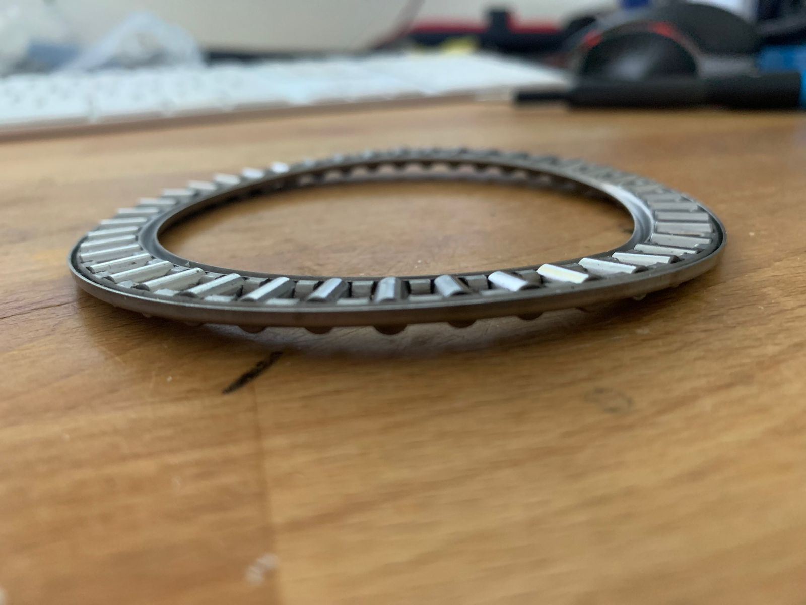
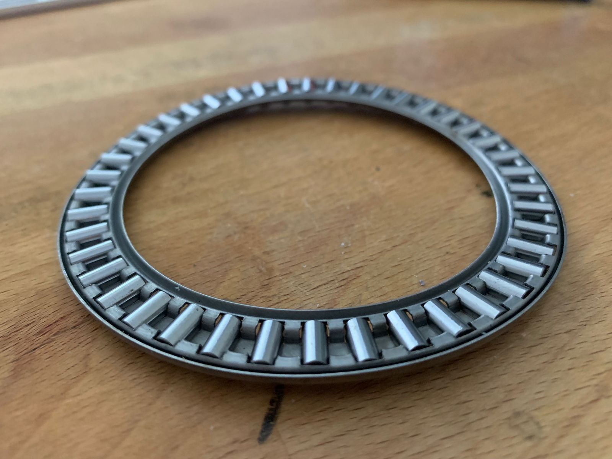
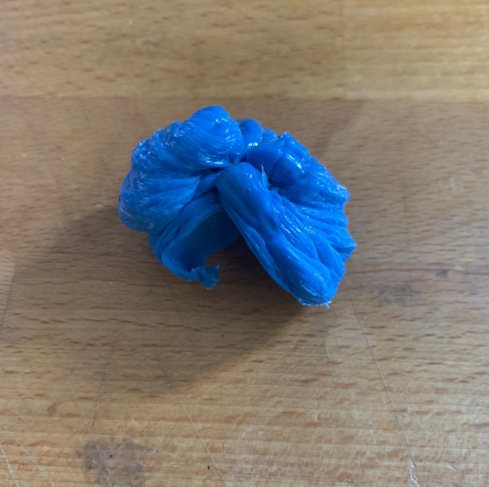
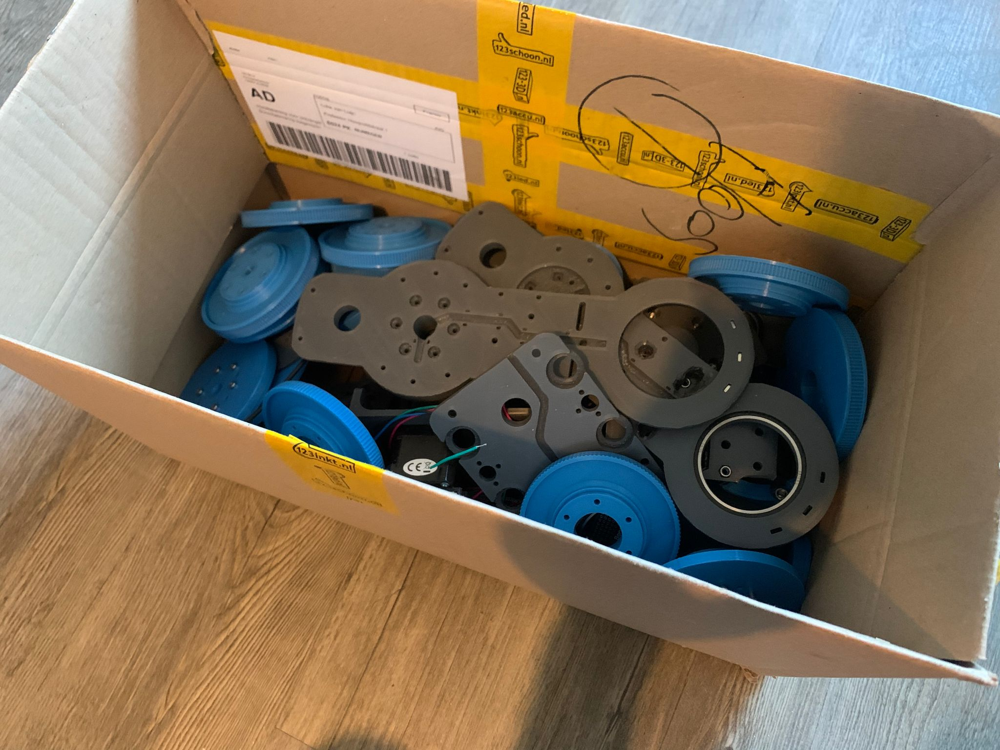

In dit hoofdstuk zal er gereflecteerd worden op de werkzaamheden van het ROBOX project. Bij aanvang van het project heb je een bepaald doel voor ogen, een product. Dit product wil je maken omdat je daar uiteindelijk iets uit haalt, een persoonlijke verrijking, verfijning van vaardigheden, of een andere drijfweer. Het doel van dit hoofdstuk is dan ook om terug te koppelen naar de drijfweer voor het ROBOX project en de resultaten te evalueren.

In dit hoofdstuk zal aan de hand van verschillende situatiebeschrijvingen terug gekoppeld worden naar de gang van zaken tijdens het ROBOX project. Wat ging er goed, wat niet en welke tegenslagen of meevallers er langs zijn gekomen.

## Inleiding

Tijdens mijn studie carrière op de opleiding HBO-ICT en dan voornamelijk vanaf het ESD-profiel heb ik veel hobby projectjes gemaakt (zie hoofdstuk: *Inleiding*). Door deze projecten heb ik vaardigheden ontwikkeld die op de opleiding niet geleerd worden. Vaardigheden als 3D modelleren, het ontwerpen en maken van printplaatjes en het produceren van een hardware product van A tot Z. Dit zijn vaardigheden die in mijn ogen in mijn latere carrière goed van pas kunnen komen. 

Deze vaardigheden wil ik dan ook blijven verfijnen en het ROBOX project was hier een ideale uitwerking van. Het bevat alle eerder genoemde onderdelen en daarnaast nog een significant software onderdeel waarmee ik mijn op de opleiding geleerde vaardigheden kon testen.

Verder heb ik tijdens de eerder genoemde hobby projectjes altijd veel gebruik gemaakt van publiekelijk beschikbare informatie, open-source projecten, zonder deze informatie was het voor mij niet mogelijk geweest om dit soort vaardigheden te ontwikkelen en ik denk dan ook dat het nu tijd is om iets terug te geven aan deze gemeenschap. Met dit project kan ik laten zien wat ik in de afgelopen jaren heb geleerd op de opleiding en daarbuiten.

Het project is niet zonder slag of stoot gegaan, helaas, in de onderstaande alinea's zijn enkele situaties beschreven die tijdens dit project zijn voortgekomen.

## Kromme lagers

Na afloop van het eerste experiment kwam ik erachter dat de huidige lager-opzet die ik bij het voorgaande robot project had toegepast niet zou werken met het ROBOX project gezien de oriëntatie van de segmenten en de montage methodiek, anders is. Op dit punt in het project was ik zo goed als klaar met het ontwerpen van de tweede iteratie van het model (zie hoofdstuk *Iteratie 02 - The bigger the better*). De realisatie dat mijn huidige ontwerp niet ging werken was een zware tegenslag, en viel zwaar. Op dit moment had ik al enkele onderdelen besteld en laten overvliegen vanuit china (aliexpress). Het plan was dan ook om de arm die week te printen en in elkaar te zetten zodat ik kon gaan beginnen met het testen.

Voor het nieuwe ontwerp moesten ook nieuwe onderdelen besteld worden, er zouden andere lagers gebruikt worden dan in het oorspronkelijke model en er zouden extra, axiale, lagers bijkomen. Dit betekende extra kosten en weer twee a drie weken wachten op de nieuwe onderdelen. Dit heeft een flinke deuk geslagen in mijn planning. 

Na twee en een halve week kwamen de nieuwe lagers binnen, op de onderstaande afbeeldingen zijn de staat van de lagers te zien, onbruikbaar. Het was niet mogelijk de lagers opnieuw van aliexpress te bestellen omdat ik de tijd niet had om nogmaals zo lang te wachten. De lagers moesten uit Nederland komen. Lagers zijn erg duur als je ze van Europese winkels koopt daarom haal ik ze altijd uit china. 

|||
|:---:|:---:|
|||
|**!afbeelding** - *kromme lager 1*|**!afbeelding** - *kromme lager 2*|

## Kapotte printer

Eind maart kwam er een kamer vrij in een huis waar ik graag wilde wonen. Halverwege april kon in de kamer in en gezien ik de financiële capaciteiten niet heb ik twee losse kamers te betalen ben ik direct verhuist. Van het bericht van een vrije kamer tot verhuizing zaten vier dagen. De komende twee weekenden ben ik bezig geweest met de kamer woon-klaar te maken.

Naast dat deze periode erg stressvol en vermoeiend was, zat ik toen precies in de periode dat ik alle onderdelen aan het printen was voor de robot. Het was cruciaal dat de onderdelen zo snel mogelijk geprint zouden worden wat de deadline van het tweede experiment kwam er aan, hiervoor moest ik een groot deel van de robot geprint hebben.

Tijdens de verhuizing is er iets kapot gegaan aan mijn 3D-printer waardoor deze niet meer fatsoenlijk kon presteren. Een groot deel van de tijd die ik oorspronkelijk had gepland voor het uitvoeren en uitwerken van het tweede experiment is toen besteed aan het repareren van de printer.

|||
|:---:|:---:|
|||
|**!afbeelding** - *Kapotte printer 1*|**!afbeelding** - *Kapotte printer 2*|

## Ongeschikte library

Toen het model, GUI en firmware werkend en gedocumenteerd was ging ik spelen met de snelheid van de segmenten. Ik had de snelheid altijd vrij laag staan omdat je nooit zeker weet of je zelf gemaakte firm- en software wel doen wat er verwacht wordt. Tijdens het testen kwam ik erachter dat de robot velen malen sneller kon bewegen dan dat ik oorspronkelijk had gedacht. De Z-as kon wel 600% sneller ([commit](https://github.com/LukevLuijn/robox/commit/cc646f993e75f85acf4dab08a1b54f2aab9e3b03))! Ook de axiale assen zijn toen significant gestegen in maximale snelheid. 

Toen ik begon met het testen van de repeatability kwam ik erachter dat wat ik oorspronkelijk had bedacht niet geheel klopte, ik heb de nieuwe snelheden telkens getest met een enkele as. Nooit alles tegelijk. Bij het repeatability testen moesten alle assen tegelijkertijd werken. De repeatability had als resultaat een delta van meer dan 10 millimeter! 

Na een klein literatuur onderzoek kwam ik erachter dat de library die ik gebruik ([AccelStepper](https://www.airspayce.com/mikem/arduino/AccelStepper/)) voor het aansturen van de motoren niet geschikt is voor hoge stap snelheden. Het maximaal aantal betrouwbare stappen per seconde is voor deze library +/- 20.000, waar de robot **ver** overheen zat met alle assen actief.
Het moment van deze realisatie was te laat om er nog iets aan te doen, helaas.

## Wat heb ik geleerd

Tijdens het ROBOX project heb ik geleerd dat alles, maar dan ook alles fout kan gaan. Je kan niet (enkel) uitgaan van de kennis en ervaring van voorgaande projecten. Elk onderdeel moet getest en gevalideerd worden. Elk project is anders. Dit geldt voor de onderdelen die te maken hebben met het model (zie afbeelding *Gefaalde prints*) en voor de firm- en software.

||
|:---:|
||
|**!afbeelding** - *Gefaalde prints*|

Verder heb ik geleerd dat het handig kan zijn om een (lokaal) onderdeel te bestellen voor het testen zodat je in ieder geval zeker kan zijn dat je concept werkt. Pas wanneer het gevalideerd is moet je onderdelen bestellen met langere levertijden (goedkoper). Dit minimaliseert de tijd dat je aan het wachten bent, of de tijd die je verspilt aan het herstellen van de fouten die gemaakt zijn. Dit kan misschien wat duurder zijn in eerste instantie, maar ik denk dat over het hele project de kosten lager zijn.

Verder heb ik geleerd hoeveel tijd alles eigenlijk kost, tijdens de opleiding maak je altijd een onderdeel van een project. Of een klein project. Nu ik dit vrij grote project heb uitgevoerd merk ik pas hoeveel tijd je eigenlijk kwijt bent met het opzetten van een documentatie structuur, het eigenhandig implementeren van alle functionaliteiten en ook nog is het testen en valideren van alles wat je hebt gemaakt. 

Tijdens de conceptfase van het project had ik allerlei verschillende plannen; besturing door middel van een microcontroller smartwatch, een bluetooth controller, het toetsenbord. Allerlei configuratie mogelijkheden. Draadloze communicatie met de computer etc. Dit heb ik allemaal geschrapt in verband met tijdgebrek of complexiteit

Ik denk dat dit project heeft gedaan wat ik ervan verwacht had en meer. Mijn vaardigheden op gebied van modelleren, 3D-printen, ontwerpen en maken van hardware, het schrijven van firm- en software. Al deze aspecten zijn naar mijn inzien flink gestegen in kwaliteit, zelfs het schrijven van ondersteunende documentatie zoals de verschillende ontwerp documenten, zijn naar mijn idee stukken beter dan bijvoorbeeld vorig jaar.