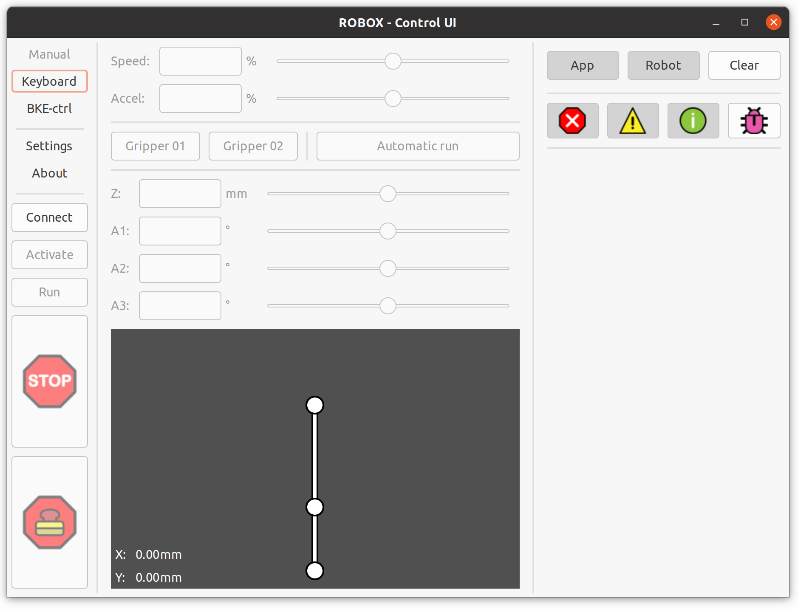
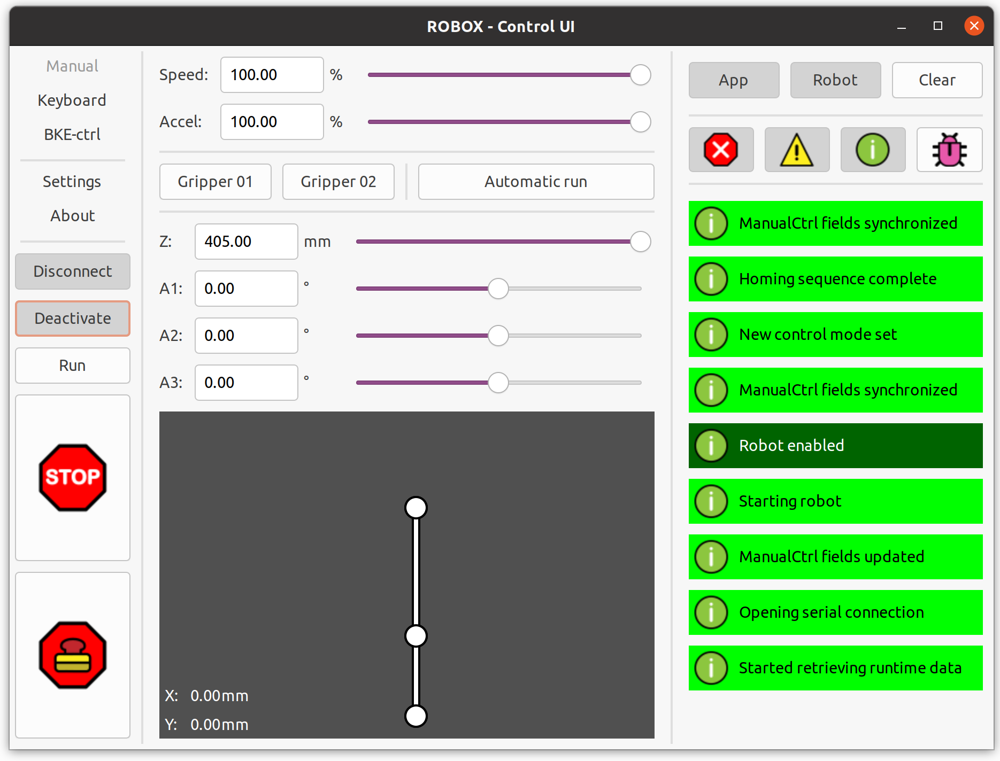

|||
|:---:|:---:|
|||
|**!afbeelding** - *ROBOX voorkant* |**!afbeelding** - *ROBOX achterkant*|
|||
|**!afbeelding** - *ROBOX bovenkant* |**!afbeelding** - *ROBOX bekabeling*|
|||
|**!afbeelding** - *ROBOX bovenkant* |**!afbeelding** - *ROBOX bekabeling*|

|                                                                                 |
| :-----------------------------------------------------------------------------: |
|  |
|  |
|                  **!afbeelding** - *Grafische user interface*                   |

|      #      | Specificatie              | Waarde    | Bron                                     |
| :---------: | :------------------------ | :-------- | :--------------------------------------- |
| **SPEC-00** | Repeatability             | < 0.10 mm | [Resultaten](bijlage/06_repeatability.pdf) (bijlage x - results.pdf) |
| **SPEC-01** | Werk oppervlak            | 0,22 m²   | [MDD](bijlage/04_design_documents/03_mdd_hardware.pdf) (bijlage x - mdd_hardware.pdf)   |
| **SPEC-02** | Werk volume               | 0,095 m³  | [MDD](bijlage/04_design_documents/03_mdd_hardware.pdf) (bijlage x - mdd_hardware.pdf)   |
| **SPEC-03** | Verticale beweging        | 437mm     | [MDD](bijlage/04_design_documents/03_mdd_hardware.pdf) (bijlage x - mdd_hardware.pdf)   |
| **SPEC-04** | Verticale snelheid        | 45 mm/s   | [MDD](bijlage/04_design_documents/03_mdd_hardware.pdf) (bijlage x - mdd_hardware.pdf)   |
|             | **Segment 01 - Schouder** |           |                                          |
| **SPEC-05** | Minimale positie          | -90°      | [MDD](bijlage/04_design_documents/03_mdd_hardware.pdf) (bijlage x - mdd_hardware.pdf)   |
| **SPEC-06** | Maximale positie          | 90°       | [MDD](bijlage/04_design_documents/03_mdd_hardware.pdf) (bijlage x - mdd_hardware.pdf)   |
| **SPEC-07** | Maximale snelheid         | 234.48°/s | [MDD](bijlage/04_design_documents/03_mdd_hardware.pdf) (bijlage x - mdd_hardware.pdf)   |
|             | **Segment 02 - Elleboog** |           |                                          |
| **SPEC-08** | Minimale positie          | -360°     | [MDD](bijlage/04_design_documents/03_mdd_hardware.pdf) (bijlage x - mdd_hardware.pdf)   |
| **SPEC-09** | Maximale positie          | 360°      | [MDD](bijlage/04_design_documents/03_mdd_hardware.pdf) (bijlage x - mdd_hardware.pdf)   |
| **SPEC-10** | Maximale snelheid         | 234.48°/s | [MDD](bijlage/04_design_documents/03_mdd_hardware.pdf) (bijlage x - mdd_hardware.pdf)   |
| **SPEC-11** | Lengte                    | 240 mm    | [MDD](bijlage/04_design_documents/03_mdd_hardware.pdf) (bijlage x - mdd_hardware.pdf)   |
|             | **Segment 03 - Pols**     |           |                                          |
| **SPEC-12** | Minimale positie          | -360°     | [MDD](bijlage/04_design_documents/03_mdd_hardware.pdf) (bijlage x - mdd_hardware.pdf)   |
| **SPEC-13** | Maximale positie          | 360°      | [MDD](bijlage/04_design_documents/03_mdd_hardware.pdf) (bijlage x - mdd_hardware.pdf)   |
| **SPEC-14** | Maximale snelheid         | 234.48°/s | [MDD](bijlage/04_design_documents/03_mdd_hardware.pdf) (bijlage x - mdd_hardware.pdf)   |
| **SPEC-15** | Lengte                    | 150 mm    | [MDD](bijlage/04_design_documents/03_mdd_hardware.pdf) (bijlage x - mdd_hardware.pdf)   |

**!tabel** - *Robot specificaties*

|   Index    | Onderdeel  | Doc     | Beschrijving                                                                                                                                                                                                                                                           |
| :--------: | :--------- | :------ | :--------------------------------------------------------------------------------------------------------------------------------------------------------------------------------------------------------------------------------------------------------------------- |
|**REPO-01**|*Project*|[Code](https://github.com/LukevLuijn/robox)|De publiekelijk beschikbare repository voor de software, firmware en alle modellen ontwikkeld voor het ROBOX project. In deze repository zijn alle onderdelen te vinden die nodig zijn voor het maken van een eigen ROBOX!|
|**REPO-02**|*Project*|[Docs](https://github.com/LukevLuijn/robox_docs)|De publiekelijk beschikbare repository voor alle documentatie geschreven voor dit project. Hier kunnen (Nederlandse) ROBOX-makers alle documentatie lezen over het ROBOX project.|

**!tabel** - *Repositories*

|   Index    | Onderdeel  | Doc     | Beschrijving                                                                                                                                                                                                                                                           |
| :--------: | :--------- | :------ | :--------------------------------------------------------------------------------------------------------------------------------------------------------------------------------------------------------------------------------------------------------------------- |
| **DOC-01** | *Hardware* | [MDD](bijlage/04_design_documents/03_mdd_hardware.pdf) (bijlage 18 - mdd_hardware.pdf)| Het model design description document is opgesteld als gecentraliseerde locatie voor beide de eisen aan het model en de beschrijving van het uiteindelijke resultaat.                                                                                                  |
| **DOC-02** | *Hardware* | [BOM](bijlage/04_design_documents/06_bill_of_materials.pdf) (bijlage 21 - bill_of_materials.pdf)| De bill of materials is opgesteld zodat het voor alle toekomstige ROBOX bouwers duidelijk is waar ze aan beginnen. In dit document zijn alle benodigde onderdelen benoemd met url en prijs.                                                                            |
| **DOC-03** | *Firmware* | [SRS](bijlage/04_design_documents/01_srs_firmware.pdf) (bijlage 16 - srs_firmware.pdf)| Het software requirements document voor de firmware is opgesteld om een duidelijk beeld te creëren van de beoogde functionaliteiten van het systeem. Het geeft verder ook duidelijk weer wat de staat van het product is.                                              |
| **DOC-04** | *Firmware* | [SDD](bijlage/04_design_documents/04_sdd_firmware.pdf) (bijlage 19 - sdd_firmware.pdf)| Het software design document voor de firmware is, bedoelt als een naslagwerk voor toekomstige iteraties van het ROBOX project. In dit document zijn de uitwerking en keuzes te vinden voor het gehele firmware product.                                                 |
| **DOC-05** | *Software* | [SRS](bijlage/04_design_documents/02_srs_software.pdf) (bijlage 17 - srs_software.pdf)| Het software requirements specification document voor de software is opgesteld om een duidelijk beeld te creëren van de verschillende (vereiste) functionaliteiten van de software. Aan de hand van verschillende usecases en requirements is de applicatie ontworpen. |
| **DOC-06** | *Software* | [SDD](bijlage/04_design_documents/05_sdd_software.pdf) (bijlage 20 - sdd_software.pdf)| Het software design description document voor de software geeft de uitwerking van de uiteindelijke applicatie weer. Dit document kan in toekomstige iteraties gebruikt worden om meer duidelijkheid te krijgen van het geïmplementeerde systeem.                       |

**!tabel** - *Documenten*

|   Index    | Onderdeel  | Doc     | Beschrijving                                                                                                                                                                                                                                                           |
| :--------: | :--------- | :------ | :--------------------------------------------------------------------------------------------------------------------------------------------------------------------------------------------------------------------------------------------------------------------- |
|**CP-01**|*Project*|[Gebruik](bijlage/05_clips/ui/ui_preview.mp4) (bijlage 27 - ui_preview.mp4)|In dit filmpje is het gebruik van de GUI te zien met het realtime resultaat van de robot.|

**!tabel** - *Clips*