<br>
<br>

<div align="center">
    <h1 style="font-size:50px;"> 
        DMP - Experiment 01 
    </h1>
    <h2 style="font-size:30px;">
        Torque tests
    <h2>
    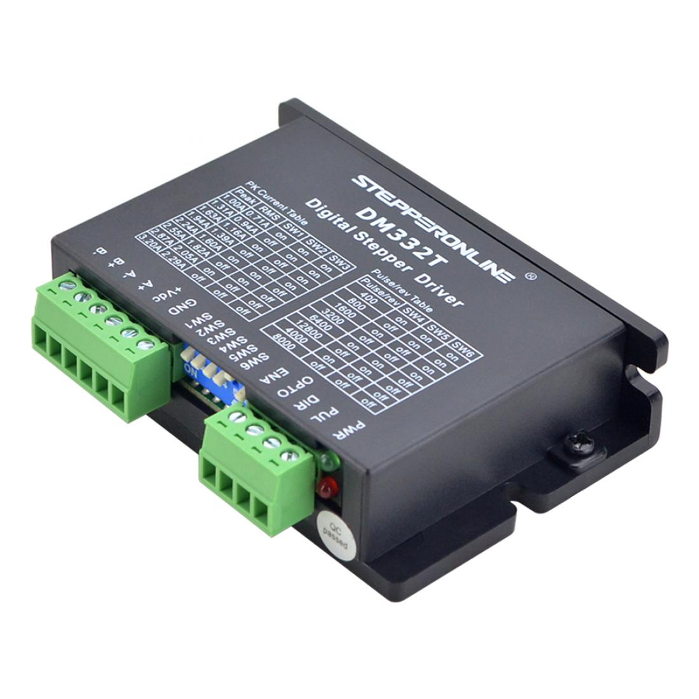

</div>


<br>
<br>


|                    |                                     |                      |                |
| :----------------- | :---------------------------------- | -------------------- | -------------- |
| **Auteur**         | Luke van Luijn                      | **Docentbegeleider** | Mario de Vries |
| **Student nummer** | 587478                              | **Plaats**           | Nijmegen       |
| **Opleiding**      | HBO-ICT                             | **Datum**            | 11-03-2022     |
| **Profiel**        | Embedded Software Development (ESD) | **Versie**           | 1.0            |
| **Studiejaar**     | Jaar 3                              |                      |                |
| **Minor**          | Digital Media Productions (DMP)     |                      |                |

<div style="page-break-after: always;"></div>

<a name="chapter/inhoudsopgaven"></a>

# Inhoudsopgaven

- 1 [Inleiding](#chapter0)
	- 1.1 [Stepper motor](#chapter1)
	- 1.2 [Stepper driver](#chapter2)
- 2 [Hoofd- en deelvragen](#chapter3)
	- 2.1 [Deelvragen](#chapter4)
- 3 [Onderzoeksmethode](#chapter5)
- 4 [Relevanten aspecten](#chapter6)
	- 4.1 [Mogelijke stepper drivers](#chapter7)
- 5 [Betrouwbaar testen](#chapter8)
	- 5.1 [Loadcell](#chapter9)
	- 5.2 [Weegschaal](#chapter10)
	- 5.3 [Tests](#chapter11)
- 6 [Meetopstelling](#chapter12)
	- 6.1 [Opzet](#chapter13)
	- 6.2 [Code](#chapter14)
- 7 [Resultaten](#chapter15)
- 8 [Conclusie](#chapter16)
- 9 [Literatuurlijst](#chapter17)

<div style="page-break-after: always;"></div>

<a name="chapter/inhoudsopgaven"></a>

# 1. Inleiding <a name="chapter0"></a>


In dit experiment zal worden onderzocht wat het torque verlies is van verschillende klasse stepper drivers over een range van verschillende microstepping configuraties. Het resultaat van dit onderzoek is noodzakelijk voor het bepalen welke driver in de uiteindelijke robot gebruikt zal worden. <br>
In dit onderzoek zal ik voor de verschillende microstepping configuraties een torque test uitvoeren, hier later meer over, op basis van deze resultaten wordt vervolgens bepaald wat het torque verlies is van die motor met die configuratie. Door alle resultaten te vergelijken kan vervolgens geconcludeerd worden welke driver het meest geschikt is voor dit project.

## 1.1. Stepper motor <a name="chapter1"></a>

Een stepper motor, of stappen motor, is een motor speciaal ontworpen voor het maken van precieze en voorspelbare bewegingen. In de onderstaande afbeelding (Stepper motor - **stator**) is te zien dat de motor meerdere coils heeft, in de afbeelding 'Stator coils'. Deze polen zijn om en om onderverdeeld in twee groepen, de zogenaamde 'coils'. Een coil bestaat uit koperen draad gewikkeld rondom een ferromagnetisch materiaal, meestal ijzer. Door stroom door deze koperen draad te sturen ontstaat er een magnetisch veld, door de richting van de stroom te veranderen kan de polariteit van de elektromagneet worden omgedraaid. <br>
In de afbeelding 'Stepper motor - **stator**' is het onderdeel 'Rotor Poles' te zien, dit zijn kleine magneetjes, de hoeveelheid van deze magneetjes bepaald de stap resolutie van de stepper. Over het algemeen zijn er twee soorten resoluties, 1.8 graden per stap (200 stappen per revolutie) en 0.9 graden per stap (400 stappen per revolutie). De resoluties worden bepaald door de twee 'Rotor poles', beide deze ringen bevatten hetzelfde aantal magneten, maar een van de ringen heeft een offset van de resolutie van de stepper motor. In de afbeelding is te zien dat de rechter rotor pole net een stukje verder is gedraaid dan de linker. Een stepper motor maakt zijn bewegingen door de polariteit van de coils telkens te veranderen van polariteit, door de helft van de coils een polariteit 'noord' te geven en de andere helft een polariteit van 'zuid' trekt het een set magneten aan op de rotor poles, en zet de motor een 'stap'. Door vervolgens deze polariteit weer om te draaien kan de motor nog een stap zetten, deze handeling kan herhaald worden voor het gewenst aantal stappen.

|||
|:---:|:---:|
|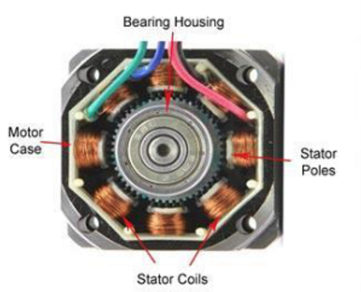|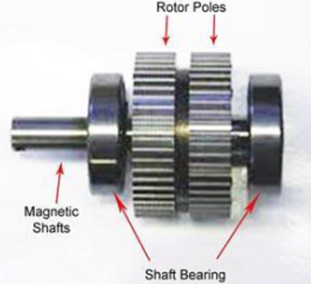|
|**Afbeelding 1** - *Stepper motor - **Stator***|**Afbeelding 2** - *Stepper motor - **Rotor***|

## 1.2. Stepper driver <a name="chapter2"></a>

Om een stepper motor aan te sturen door middel van een microcontroller moet er gebruik gemaakt worden van een stepper driver. Zoals in het voorgaande hoofdstuk verteld maakt een stepper motor zijn stappen door de polariteit van de coils te veranderen, het veranderen van deze polariteit wordt geregeld door een stepper driver. <br>
Een stepper driver kan aan de hand van puls signalen de stepper motor laten roteren. De richting van deze stappen wordt bepaald aan de hand van een 'directional pulse' en de snelheid, de hoeveelheid stappen per seconde  (Steps Per Second (SPS)) wordt bepaald aan de hand van de frequentie van de puls signalen. <br>
Het gebruik van een stepper driver levert ook de mogelijkheid om de stappen van de motor te verkleinen, dit wordt microstepping genoemd. Microstepping wordt gerealiseerd door het de coils niet voor elke stap 100 procent van het vermogen te geven maar een deel daarvan hierdoor kan de rotor locaties innemen buiten de voorbepaalde resolutie en is microstepping mogelijk. Microstepping heeft als resultaat dat de beweging van de motor meer 'smooth' is, dit gaat wel ten koste van de maximale torque van de motor.


<a name="chapter/onderzoeksvraag"></a>

# 2. Hoofd- en deelvragen <a name="chapter3"></a>


In dit onderzoek zal de onderstaande hoofdvraag worden beantwoord. 

> **- Welke stepper driver is het meest geschikt voor de scara robot?**

## 2.1. Deelvragen <a name="chapter4"></a>

Het beantwoorden van deze hoofdvraag zal worden gedaan door middel van het beantwoorden van verschillende deelvragen, deze deelvragen staan hieronder weergegeven.

> **1. Welke aspecten van een stepper driver zijn relevant voor de scara robot?**

Deze deelvraag is bedoeld voor het opstellen van mogelijke kandidaten die geschikt zijn om te testen. Stepper drivers zijn relatief dure componenten en klakkeloos testen is daarom geen optie.

Aan de hand van de relevante aspecten zal er een shortlist opgesteld worden waaruit enkele stepper drivers komen die het meest overeenkomen met de gestelde eisen.

Voor het uitwerken van deze deelvraag zal er gebruik gemaakt worden van de ["Available product analysis"](https://ictresearchmethods.nl/Available_product_analysis) methode. Over deze methode is meer terug te vinden in het hoofdstuk Onderzoeksmethode

> **2. Hoe kan het torque verlies van een stepper driver betrouwbaar getest worden?**

Deze deelvraag is bedoeld voor het onderzoeken hoe torque over het algemeen gemeten wordt. Hierbij zullen verschillende bronnen gebruikt worden, maar ook zaken zoals youtube gezien daar erg veel informatie over dit soort projecten te vinden is.

Voor het uitwerken van deze deelvraag zal een lab onderzoek plaatsvinden, voor dit onderzoek zullen een tweetal onderzoeksmethode gebruikt worden; ["Hardware validation"](https://ictresearchmethods.nl/Hardware_validation) en ["Data analytics"](https://ictresearchmethods.nl/Data_analytics). Ook over deze methodes is meer terug te vinden in het hoofdstuk Onderzoeksmethode.

<div style="page-break-after: always;"></div>

<a name="chapter/onderzoeksmethode"></a>

# 3. Onderzoeksmethode <a name="chapter5"></a>


In dit onderzoek zullen verschillende methodes aan bod komen. Het onderzoek zal beginnen met een klein web-onderzoek naar geschikte stepper drivers, de geschiktheid zal gewaardeerd worden op basis van prijs, fysieke omvang, klanten reviews en beschikbaarheid. Voor dit onderdeel is gebruik gemaakt van de methode: ["Available product analysis"](https://ictresearchmethods.nl/Available_product_analysis)

Het tweede onderdeel is het daadwerkelijk testen van de gekozen drivers, gezien de drivers een hardware component zijn met als resultaat een fysieke toestand zal er gebruik gemaakt worden van een lab onderzoek, waarbij twee methodes gebruikt zullen worden. Ten eerste de methode ["Hardware validation"](https://ictresearchmethods.nl/Hardware_validation) voor het verifiëren van de nieuwe hardware. Verder zal er gebruik gemaakt worden van de methode ["Data analytics"](https://ictresearchmethods.nl/Data_analytics), door middel van deze methode zal de daadwerkelijke data vergaard worden.

||||
|:---:|:---:|:---:|
|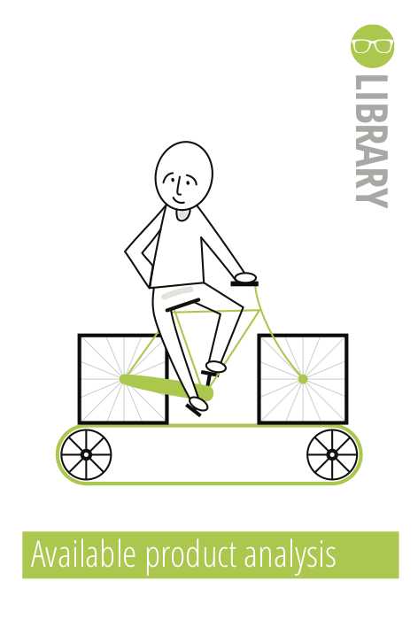|||
| **Afbeelding 3** - *Methode: **Available product analysis***| **Afbeelding 4** - *Methode: **Hardware validation***| **Afbeelding 5** - *Methode: **Data analytics***|


Gezien er eerst een keuze gemaakt moet worden over de daadwerkelijke hardware en de kosten die deze hardware met zich meebrengen is de methode "Available product analysis" een zeer geschikte keuze. Door een duidelijke analyse te maken van de verschillende mogelijkheden wordt de kans op een miskoop geminimaliseerd.

Omdat er nieuwe hardware aangeschaft wordt zal deze hardware geverifieerd moeten worden. Eerst kijken of de hardware überhaupt werkt en hoe deze hardware vervolgens aangestuurd moet worden. De methode "Hardware validation" past daarom goed bij dit onderdeel.

Dit onderzoek draait om het vergelijken van data. De data verkregen uit de verschillende tests moet op een correcte manier vergeleken worden om hier tastbare conclusies uit te kunnen halen. De methode "Data analytics" is om deze reden de juiste methodiek.

<div style="page-break-after: always;"></div>

<a name="chapter/relevanten_aspecten"></a>

# 4. Relevanten aspecten <a name="chapter6"></a>


Voor het beantwoorden van deze deelvraag zal er gekeken moeten worden naar de eisen van de scara robot. In de onderstaande tabel staan de verschillende eisen weergegeven, voorzien van een beschrijving waarom deze eis bestaat. In dit hoofdstuk is er gebruik gemaakt van de 'Available product analysis' methode.

|   #   | Eis                | Beredenering                                                                                                                                                                                                                                                                                                                                                                |
| :---: | :----------------- | :--------------------------------------------------------------------------------------------------------------------------------------------------------------------------------------------------------------------------------------------------------------------------------------------------------------------------------------------------------------------------- |
|   1   | Enable/disable     | Bij het voorgaande robot arm project is ondervonden dat stepper motoren vrij warm kunnen worden, warm genoeg om het 3D geprinte plastic te doen smelten. Om deze reden moet er een mogelijkheid zijn om de stepper motoren te kunnen activeren en deactiveren wanneer deze niet actief in gebruik zijn waardoor de temperatuur van de motor in bedwang gehouden kan worden. |
|   2   | Current limiting   | Met 'current limiting' wordt bedoeld dat waneer de stepper motor niet actief aangestuurd wordt door de microcontroller de driver dit zelf detecteert en de stepper motor een verminderde stroom toevoer levert waardoor en minder warmteontwikkeling ontstaat. Deze eis is opgesteld om dezelfde reden als de voorgaande eis.                                               |
|   3   | Microstepping      | Omdat precisie een belangrijk aspect is van een robot arm is het maximaliseren van de precisie van de stepper motoren cruciaal. Microstepping levert deze mogelijkheid. De robot arm zal waarschijnlijk gebruik maken van een microstepping configuratie van 1600 stappen per revolutie (1/8), dit is het streven.                                                           |
|   4   | Drive voltage      | De scara robot zal gebruik maken van een systeem voltage van 12 of 24 volt (met de reden dat voor deze voltages relatief goedkope converters beschikbaar zijn). De stepper driver zal deze voltages minimaal moeten ondersteunen.                                                                                                                                            |
|   5   | Logic voltage      | De scara robot zal bestuurd worden door of een ESP32 of een Teensy microcontroller, beide deze controllers en vergelijkbare controllers hebben een logic voltage van 3.3 volt in tegenstelling tot de gebruikelijke 5.0 volt. De stepper driver zal de mogelijkheid moeten bieden tot het gebruiken van een 3.3 volt controller zonder extra conversie.                       |
|   6   | Max current rating | De stepper motoren die gebruikt zullen worden in de scara robot zullen tussen de twee en drie ampère gebruiken. De stepper driver zal deze ampèrages moeten ondersteunen.                                                                                                                                                                                                    |
|   7   | Prijs              | Een van de eisen van dit project is het zo goedkoop mogelijk ontwikkelen van de robot. De prijs per driver is daarom een relevante statistiek.                                                                                                                                                                                                                               |
|   8   | Fysieke omvang     | De controlerende hardware zal verwerkt moeten worden in het frame van de robot. Een (te) grote driver leidt tot een (te) groot frame. Hoe kleiner de driver, hoe meer ruimte over blijft voor andere componenten.                                                                                                                                                       |

**Tabel 1** - *Relevanten aspecten*

## 4.1. Mogelijke stepper drivers <a name="chapter7"></a>

In de onderstaande tabel zijn een zes-tal stepper drivers weergegeven, voor elke stepper driver staat tevens of ze voldoen aan de gestelde eisen. 

|Driver| A4988 | DRV8825 | TMC5160 | DM332T | DM542T | DM420Y |
|:---| :---: | :-----: | :-----: | :----: | :----: | :----: |
|Afbeelding|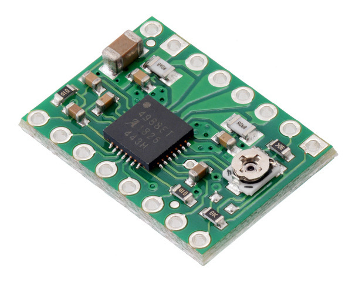|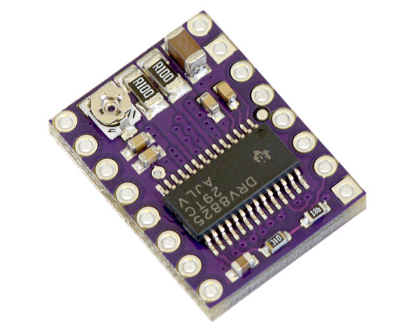||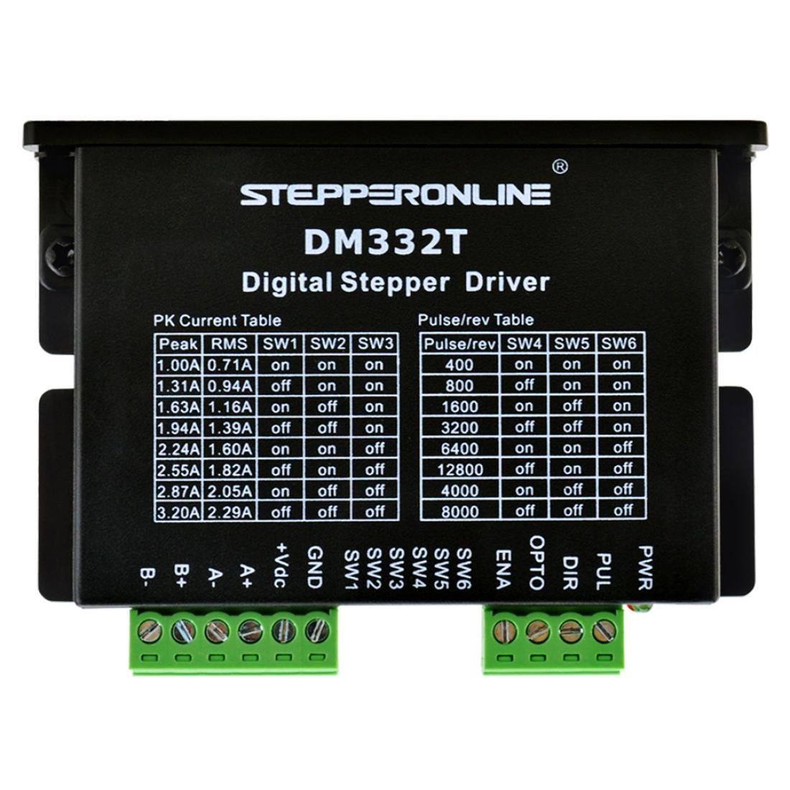|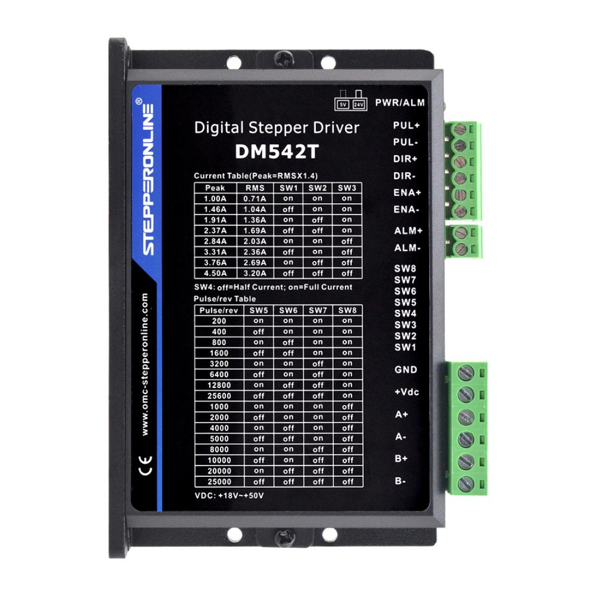|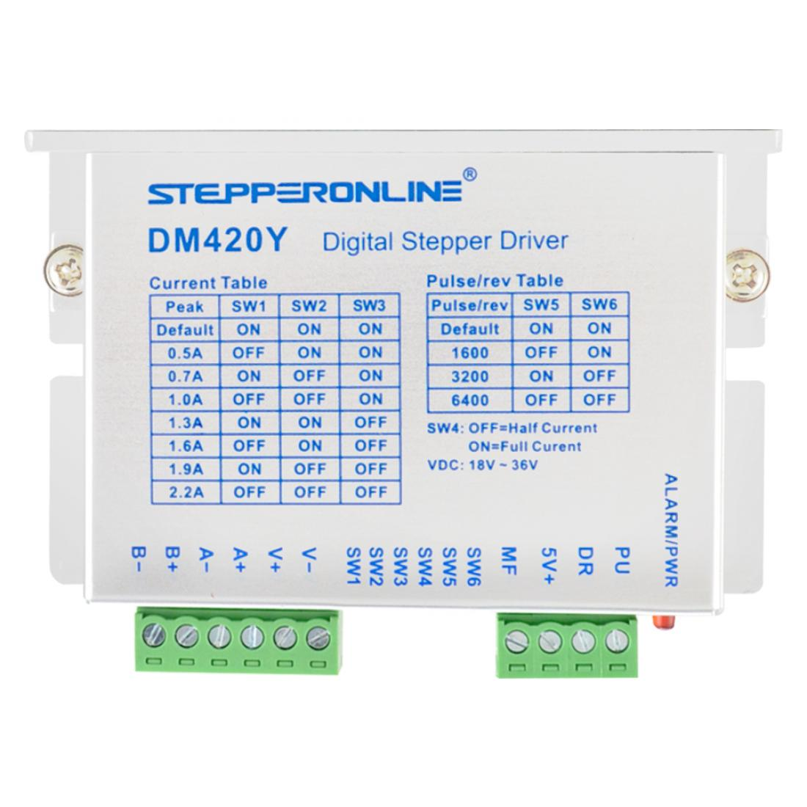|
|Enable/disable|✓|✓|✓|✓|✓|✓|
|Current limiting|X|X|X|✓<br> always|✓<br> optional|✓<br> optional|
|Microstepping|✓ <br> 1/16|✓ <br> 1/32|✓ <br> 1/256|✓ <br> 1/64|✓ <br> 1/128 |✓ <br> 1/32|
|Drive voltage|✓ <br>8 - 35 volt|✓ <br>8.2 - 45 volt|✓ <br>10 - 35 volt|✓ <br>18 - 30 volt|✓ <br>20 - 50 volt|✓ <br>18 - 36 volt|
|Logic voltage|✓ <br> 3.0 - 5.5 volt|✓ <br> 3.3/5 volt|✓ <br> 3.3 - 5 volt|✓ <br> any|✓ <br> any|✓ <br> any|
|Max current rating (rated/peak)|X <br> 1/2 amp|X <br> 1.5/2.2 amp|✓ <br> 3.0/4.2 amp|✓ <br> 0.71/3.2 amp|✓ <br> 0.71/4.5 amp|X <br> 0.5/2.2 amp|
|Prijs|€ 8,14|€ 17,22|€ 24,00|€ 15,23|€ 19,57|€ 18,78|
|Fysieke omvang|15.2mm x 20.3mm x 1.6mm|15.2mm x 20.3mmx 1.6mm|15.2mm x 20.3mmx 1.6mm|86mm x 55mm x 20mm|118mm x 75,5mm x 25.5mm|86mm x 55mm x 20mm|
|URL|[A4988](https://www.pololu.com/product/1182/faqs)|[DRV8825](https://www.pololu.com/product/2133)|[TMC5160](https://www.tinytronics.nl/shop/en/mechanics-and-actuators/motor-controllers-and-drivers/stepper-motor-controllers-and-drivers/tmc5160-motor-driver-module)|[DM332T](https://www.omc-stepperonline.com/stepper-motor-driver/digital-stepper-drive-1-0-3-2a-18-30vdc-for-nema-17-23-stepper-motor-dm332t)|[DM542T](https://www.omc-stepperonline.com/stepper-motor-driver/digital-stepper-driver-1-0-4-2a-20-50vdc-for-nema-17-23-24-stepper-motor-dm542t)|[DM420Y](https://www.omc-stepperonline.com/stepper-motor-driver/y-series-digital-stepper-driver-0-3-2-2a-dc18v-36v-for-nema-14-17-23-stepper-motor-dm420y)|

**Tabel 2** - *Mogelijke stepper drivers*

In de bovenstaande tabel is te zien dat er twee stepper drivers voldoen aan alle gestelde eisen, dit zijn de DM332T en de DM542T. Deze stepper drivers zullen in dit onderzoek gebruikt worden.


<div style="page-break-after: always;"></div>

<a name="chapter/betrouwbaar_testen"></a>

# 5. Betrouwbaar testen <a name="chapter8"></a>


Voor het betrouwbaar testen van het torque verlies zal ten eerste gekeken moeten worden naar hoe torque überhaupt gemeten wordt. Informatie over het meten van torque kan vrij makkelijk op internet gevonden worden, in [dit](https://www.youtube.com/watch?v=Emvo3bLT-Z4&t=477s&ab_channel=3DprintedLife) (3DPrintedLife, 2021) filmpje bijvoorbeeld, vanaf minuut 7:31 wordt er laten zien dat de torque van gemeten wordt aan de hand van een loadcell. Een ander voorbeeld is [dit](https://www.youtube.com/watch?v=smQJeg87ff8&ab_channel=Skyentific) (Skyentific, 2019) filmpje waar twee test methodes gebruikt worden. De eerste methode (vanaf 6:20) is voor het testen van de 'pull out torque', hierbij wordt gekeken hoeveel gewicht er aan de motor gehangen kan worden voordat deze zijn positie verliest. De andere methode (vanaf 13:00) laat het gebruik van een weegschaal zien om te meten hoeveel torque (in gram) de motor kan geven in normale operatie. Voor het beantwoorden van deze deelvraag is gebruik gemaakt van beide lab onderzoek methodes; 'Hardware validation' & 'Data analytics'. 

## 5.1. Loadcell <a name="chapter9"></a>

De eerste methode die tijdens dit onderzoek is toegepast is de 'loadcell' methode. Het testplatform (zie Meetopstelling) heeft een theoretische torque output van ```+/-2.0 kg.cm``` daarom is er gebruik gemaakt van een [5 kg loadcell](https://www.tinytronics.nl/shop/en/sensors/weight-pressure-force/load-cells/load-cell-5kg) in combinatie met een [HX711 versterker](https://www.tinytronics.nl/shop/en/sensors/weight-pressure-force/load-cells/load-cell-amplifier-hx711). Het testplatform zou met verschillende microstepping configuraties tegen de loadcell aandrukken, de loadcell meet vervolgens de kracht in grammen en print deze naar het scherm. Onderstaand zijn enkele afbeeldingen te zien van het kalibratie proces van de loadcell.

|||
|:---:|:---:|
||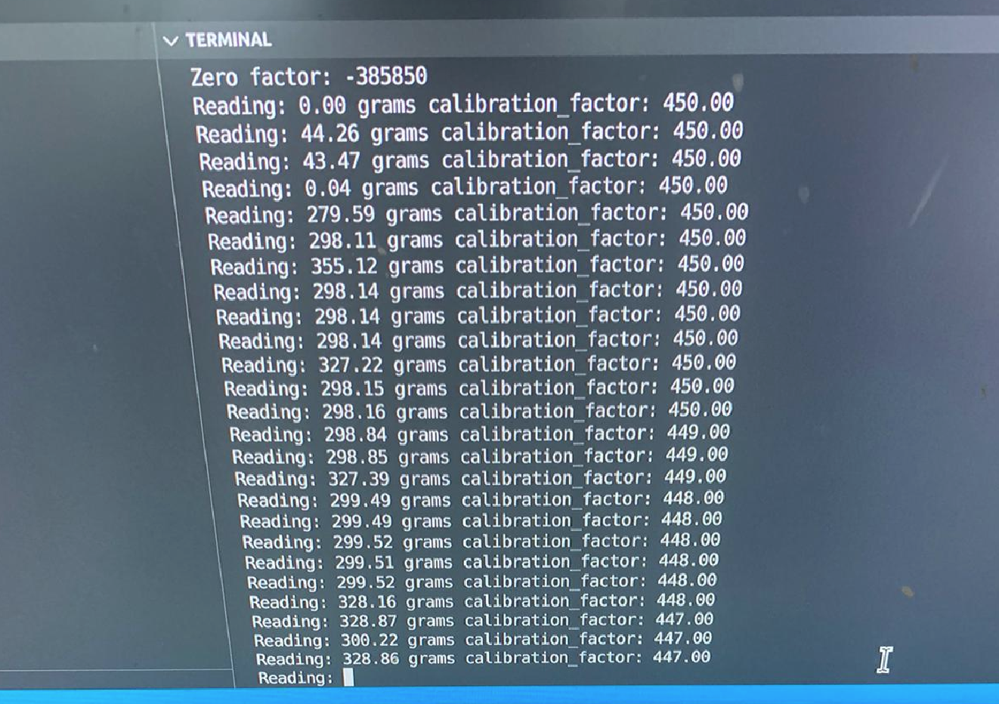|
|**Afbeelding 6** - *Loadcell opzet*|**Afbeelding 7** - *Loadcell calibratie*|

Voor het kalibreren van de loadcell moet er een bekend gewicht op de loadcell geplaatst worden. Vervolgens kan de 'calibratie-factor' aangepast worden zodat de loadcell het correcte gewicht meet. De motor op de loadcell is exact 300 gram, te zien in de rechter afbeelding is dat de loadcell te veel ruis met detecteert, soms wel 20 procent! Gezien de complexiteit die het zou kosten om de loadcell 'ruis-vrij' te maken is de keuze gemaakt om een andere methode toe te passen.

## 5.2. Weegschaal <a name="chapter10"></a>

Zoals voorheen verteld kan de torque output ook gemeten worden met een weegschaal. Door de output van de meetopstelling (de arm) te laten drukken op een weegschaal kan de kracht in grammen worden afgelezen. Voor het uitvoeren van deze methode moest de meetopstelling lichtelijk aangepast worden zodat de weegschaal niet weggedrukt zou worden door de arm zelf. In het hoofdstuk ['Meetopstelling'](#chapter/meetopstelling) is hier meer over terug te vinden.


## 5.3. Tests <a name="chapter11"></a>

Voor het valideren van de hardware is er een programma geschreven die aan de hand van een hall effect sensor, een sensor die een magnetisch veld kan detecteren, een 'homing sequence' opgezet. Hiermee wordt bedoeld dat de stepper motor beweegt tot de sensor een magneet detecteert, hierdoor weet de motor welke positie hij zich precies bevind. Aan de hand van dat stukje code kan gevalideerd worden of de motor, driver en sensor naar behoeven werkt. Verder wordt deze 'homing sequence' voor het starten van een test uitgevoerd, hierdoor kan met zekerheid gezegd worden dat de motor naar dezelfde exacte locatie beweegt voor elke test.<br>
Voor het uitvoeren van de daadwerkelijke tests is er een programma geschreven dat voor zes verschillende snelheden (10, 20, 40, 60, 80 & 100 RPM) drie keer contact maakt met de weegschaal. De motor beweegt net zo lang door tot het dreigt een stap te verliezen, dan zal de motor stoppen en wachten. De resultaten van deze tests zijn gefilmd met behulp van een webcam gemonteerd boven de weegschaal. De webcam neemt telkens de waarde van de weegschaal op waardoor deze later terug te vinden zijn. 

> De verschillende metingen zijn terug te vinden in de bijlage (bijlage/clips/DM332T & ../DM542T).


<a name="chapter/meetopstelling"></a>

# 6. Meetopstelling <a name="chapter12"></a>


De onderstaande afbeeldingen laten de aansluiting zien tussen de microcontroller en de verschillende componenten. In het schema zijn twee stepper drivers en twee motoren afgebeeld. Deze sets zijn tijdens het testen uitgewisseld en nooit tegelijkertijd aangesloten.

|||
|:---:|:---:|
||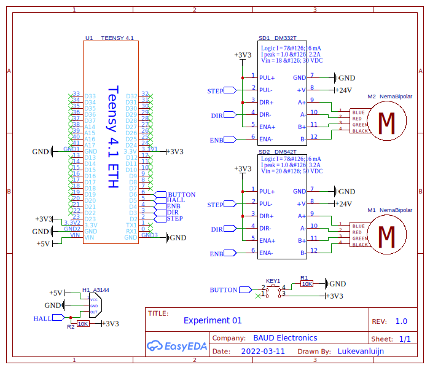|
|**Afbeelding 8** - *Aansluiting*|**Diagram 1** - *Aansluitingsschema*|

<div style="page-break-after: always;"></div>

## 6.1. Opzet <a name="chapter13"></a>

Zoals eerder vermeld is er gebruik gemaakt van een weegschaal voor het nemen van de verschillende metingen. Deze weegschaal en de 3D geprinte constructie zijn door middel van verschillende extrusion palen aan elkaar verbonden. Verder is er een webcam gemonteerd boven de weegschaal die de resultaten opneemt waardoor deze later terug te zien zijn. Op de onderstaande afbeeldingen is de daadwerkelijke opstelling weergegeven.

|||
|:---:|:---:|
|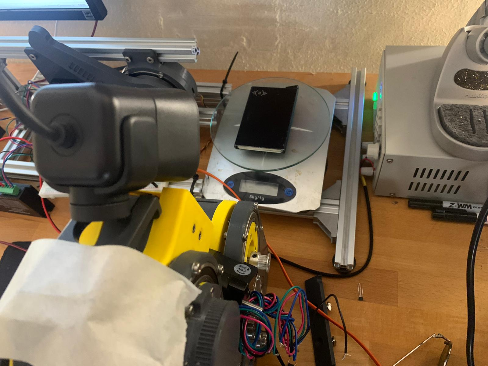|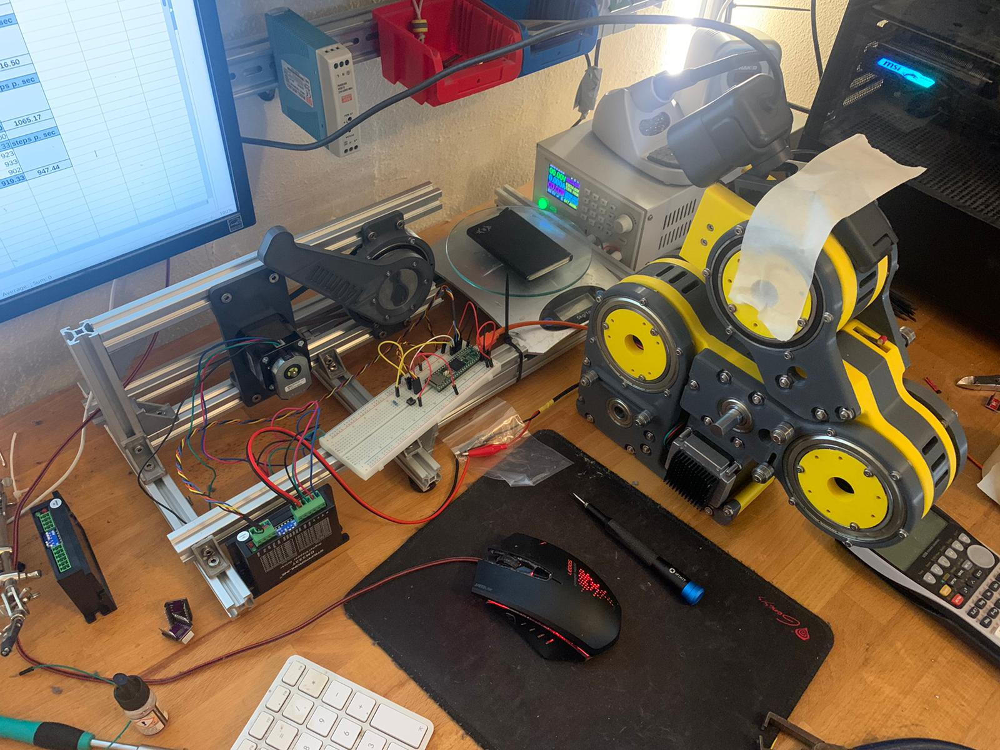|
|**Afbeelding 9** - *Meetopstelling 1*|**Afbeelding 10** - *Meetopstelling 2*|

## 6.2. Code <a name="chapter14"></a>

> De code is terug te vinden in de bijlage (bijlage/code/src/main.cpp)

In dit onderdeel zullen de verschillende onderdelen van de code dieper toegelicht worden. Te beginnende bij regel 16 t/m 21, dit is de microstepping configuratie. Op de stepper drivers zelf moet de daadwerkelijke configuratie aangeven worden, maar in de code wordt ook rekening gehouden met deze instellingen. Als de configuratie veranderd moet dat op deze locatie in de code ook veranderd worden.<br>
De methode ```HomeStepper()``` omvat de eerder besproken 'homing sequence'. De verantwoordelijkheid van deze methode is het accuraat (her)positioneren van de stepper motor door middel van de hall effect sensor. Het detecteren van de hall effect sensor gebeurt door middel van de ```LimitSwitchTrigger()``` methode (regel 162 t/m 184), dit is een lichtelijk aangepaste kopie van de ['debounce code'](https://www.arduino.cc/en/Tutorial/BuiltInExamples/Debounce) van Arduino.<br>
De methode ```TestCycle()``` is het hart van de applicatie. Deze methode wacht tot er op de knop gedrukt is (aan de van een interrupt service routine (ISR)), zodra er op de knop is gedrukt wordt de motor geactiveerd (regel 102), worden de tests uitgevoerd en wordt de motor vervolgens weer gedeactiveerd.<br>
De tests worden uitgevoerd in de methode ```ExecuteTest(uint8_t sampleSize, uint8_t index)``` (regel 108 t\m 142). De parameter 'sampleSize' staat voor het aantal metingen die genomen moeten worden. De parameter 'index' is de snelheidsindex welke van de zes snelheden er bij deze test gebruikt zal worden. Verder zijn er nog de methodes ```GetSpeedDelay(double RPM)``` (regel 218 t/m 225), deze rekent een bepaalde RPM (rotations per minute) om naar een vertraging in het aanroepen van de stepper driver, in deze berekening wordt rekening gehouden met de huidige microstepping configuratie. De methode ```MakeManySteps(uint32_t steps, uint32_t delay, bool forwards)``` & ```MakeSingleStep(uint32_t delay, bool forwards)``` (regel 144 t/m 161), verzorgen respectievelijk het uitvoeren van meerdere stappen en een enkele stap. Tot slot de methode ```Timer(uint32_t& time, uint32_t interval)``` (regel 227 t/m 235), dit is enkel een software timer gebruikt voor het uitvoeren van tijd gerelateerde onderdelen.


<a name="chapter/resultaten"></a>

# 7. Resultaten <a name="chapter15"></a>


> De rauwe resultaten zijn terug te vinden in de bijlage (bijlage/results/exp_01_results.ods)

In de onderstaande grafieken zijn de verschillende resultaten weergegeven van de uitgevoerde tests. De 'force vs. rotation speed' grafieken laten het verlies in torque zien per microstepping configuratie. Opmerkelijk aan deze resultaten is dat er per microstepping configuratie een aanzienlijk verlies in torque terug te vinden is echter is dit verlies in torque niet gerelateerd aan de snelheid van motor. In de grafieken 'force vs. microstepping' is een duidelijkere weergaven van het torque verlies weergegeven. In de DM332T grafiek is te zien dat de torque afnamen meer geleidelijk plaatsvind* dan bij de DM542T. De DM542T blijft nagenoeg gelijk tot een microstepping configuratie van 1600, daarna ondervind deze driver een sterke daling.

De initiële torque van de DM542T is aanzienlijk hoger en blijft langere tijd gelijk. Echter bij een microstepping configuratie van 12800 zijn beide drivers op hetzelfde torque niveau. Dit laat zien dat na een configuratie van 1600 beide drivers identiek functioneren.

> ```*``` In de grafiek force vs. microstepping van de DM332T stepper driver is een piek te zien voor een microstepping configuratie van 3200. Dit volgt het patroon niet en er wordt aangenomen dat dit een fout is, opgelopen tijdens het afnemen van de tests.

|||
|:---:|:---:|
|||
|**Grafiek 1** - *DM332T - Force vs. rotation speed*|**Grafiek 2** - *DM332T - Force vs. microstepping*|

|||
|:---:|:---:|
|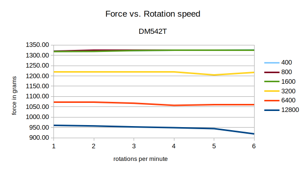|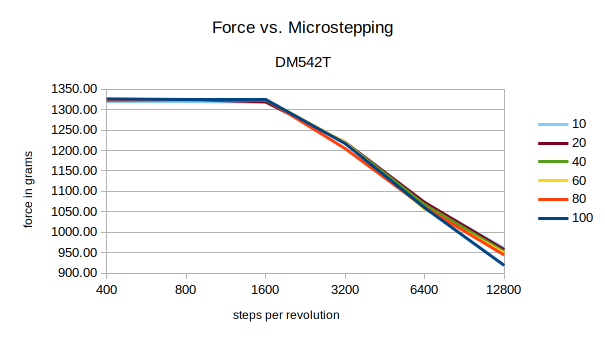|
|**Grafiek 3** - *DM542T - Force vs. rotation speed*|**Grafiek 4** - *DM542T - Force vs. microstepping*|

<div style="page-break-after: always;"></div>

<a name="chapter/conclusie"></a>

# 8. Conclusie <a name="chapter16"></a>


 Om dit experiment kort samen te vatten is er eerst gekeken naar welke aspecten van de stepper drivers relevant zijn voor dit project. Op basis van deze aspecten zijn er verschillende stepper drivers vergeleken op basis van deze aspecten, uit deze vergelijking is gebleken dat de DM332T en de DM542T de meest geschikte stepper drivers zijn voor dit project.
Vervolgens is er gekeken naar de methodiek van het meten. Welke opstelling betrouwbare resultaten zou kunnen leveren. Hieruit is de meetopstelling van de weegschaal gekomen. De weegschaal biedt betrouwbare en herhaalbare metingen.
Tot slot zijn de daadwerkelijke tests uitgevoerd, hieruit is gebleken dat de DM542T tot een configuratie van 1600 aanzienlijk beter presteert dan de DM332T en dus op gebied van torque meer geschikt is voor dit project.

Tot slot, gezien de fysieke omvang en de hogere prijs van de DM542T is de keuze gevallen op de DM332T. De DM332T levert ongeveer 100 gram minder torque dan de DM542T en lijkt mij daarom nog steeds uiterst geschikt voor dit project. De DM332T is ook aanzienlijk kleiner dan de DM542T wat het vele malen makkelijker maakt om te integreren in de daadwerkelijke robot.

<div style="page-break-after: always;"></div>

<a name="chapter/literatuurlijst"></a>

# 9. Literatuurlijst <a name="chapter17"></a>

| Index | Source                                                                                                                                                                                                                                                                                                                                                                                                                 | 
| :---: | :---                                                                                                                                                                                                                                                                                                                                                                                                                   | 
| 1     | HAN-ICA. (z.d.-a). Available product analysis - ICT research methods. Available Product Analysis. Geraadpleegd op 11 maart 2022, van [https://ictresearchmethods.nl/Available_product_analysis](https://ictresearchmethods.nl/Available_product_analysis)                                                                                                                                                              | 
| 2     | HAN-ICA. (z.d.-b). Data analytics - ICT research methods. Data Analytics. Geraadpleegd op 11 maart 2022, van [https://ictresearchmethods.nl/Data_analytics](https://ictresearchmethods.nl/Data_analytics)                                                                                                                                                                                                              | 
| 3     | HAN-ICA. (z.d.-c). Hardware validation - ICT research methods. Hardware Validation. Geraadpleegd op 11 maart 2022, van [https://ictresearchmethods.nl/Hardware_validation](https://ictresearchmethods.nl/Hardware_validation)                                                                                                                                                                                          | 
| 4     | Pololu. (z.d.-a). Pololu - A4988 Stepper Motor Driver Carrier. A4988. Geraadpleegd op 11 maart 2022, van [https://www.pololu.com/product/1182/faqs](https://www.pololu.com/product/1182/faqs)                                                                                                                                                                                                                          | 
| 5     | Pololu. (z.d.-b). Pololu - DRV8825 Stepper Motor Driver Carrier, High Current. DRV8825. Geraadpleegd op 11 maart 2022, van [https://www.pololu.com/product/2133](https://www.pololu.com/product/2133)                                                                                                                                                                                                                  | 
| 6     | StepperOnline. (z.d.). Y Series Digital Stepper Driver - DM420Y. DM420Y. Geraadpleegd op 11 maart 2022, van [https://www.omc-stepperonline.com/stepper-motor-driver/y-series-digital-stepper-driver-0-3-2-2a-dc18v-36v-for-nema-14-17-23-stepper-motor-dm420y](https://www.omc-stepperonline.com/stepper-motor-driver/y-series-digital-stepper-driver-0-3-2-2a-dc18v-36v-for-nema-14-17-23-stepper-motor-dm420y)       | 
| 7     | StepperOnline. (2018, 7 december). Digital Stepper Driver - DM332T. DM332T. Geraadpleegd op 11 maart 2022, van [https://www.omc-stepperonline.com/stepper-motor-driver/digital-stepper-drive-1-0-3-2a-18-30vdc-for-nema-17-23-stepper-motor-dm332t](https://www.omc-stepperonline.com/stepper-motor-driver/digital-stepper-drive-1-0-3-2a-18-30vdc-for-nema-17-23-stepper-motor-dm332t)                                | 
| 8     | StepperOnline. (2022, 17 februari). Digital Stepper Driver - DM542T. DM542T. Geraadpleegd op 11 maart 2022, van [https://www.omc-stepperonline.com/stepper-motor-driver/digital-stepper-driver-1-0-4-2a-20-50vdc-for-nema-17-23-24-stepper-motor-dm542t](https://www.omc-stepperonline.com/stepper-motor-driver/digital-stepper-driver-1-0-4-2a-20-50vdc-for-nema-17-23-24-stepper-motor-dm542t)                       | 
| 9     | TinyTronics. (z.d.). TMC5160 Motor Driver Module. TMC5160. Geraadpleegd op 11 maart 2022, van [https://www.tinytronics.nl/shop/en/mechanics-and-actuators/motor-controllers-and-drivers/stepper-motor-controllers-and-drivers/tmc5160-motor-driver-module](https://www.tinytronics.nl/shop/en/mechanics-and-actuators/motor-controllers-and-drivers/stepper-motor-controllers-and-drivers/tmc5160-motor-driver-module) | 
| 10    | 3DPrintedLife. (2021, 2 mei). My 3D Printed Harmonic Drive Performs Surprisingly Well! YouTube. Geraadpleegd op 11 maart 2022, van [https://www.youtube.com/watch?v=Emvo3bLT-Z4&t=477s&ab_channel=3DprintedLife](https://www.youtube.com/watch?v=Emvo3bLT-Z4&t=477s&ab_channel=3DprintedLife)                                                                                                                          | 
| 11    | Skyentific. (2019, 9 maart). Torque Test of Robot Actuator (Brushless Motor Robotic Joint). YouTube. Geraadpleegd op 11 maart 2022, van [https://www.youtube.com/watch?v=smQJeg87ff8&ab_channel=Skyentific](https://www.youtube.com/watch?v=smQJeg87ff8&ab_channel=Skyentific)                                                                                                                                         | 
| 12    | TinyTronics. (z.d.). Load Cell - 5kg. Geraadpleegd op 11 maart 2022, van [https://www.tinytronics.nl/shop/en/sensors/weight-pressure-force/load-cells/load-cell-5kg](https://www.tinytronics.nl/shop/en/sensors/weight-pressure-force/load-cells/load-cell-5kg)                                                                                                                                                        | 
| 13    | TinyTronics. (2021, 17 mei). Load Cell Amplifier- HX711. Geraadpleegd op 11 maart 2022, van [https://www.tinytronics.nl/shop/en/sensors/weight-pressure-force/load-cells/load-cell-amplifier-hx711](https://www.tinytronics.nl/shop/en/sensors/weight-pressure-force/load-cells/load-cell-amplifier-hx711)                                                                                                             | 
| 14    | Arduino. (z.d.). Debounce. Geraadpleegd op 11 maart 2022, van [https://www.arduino.cc/en/Tutorial/BuiltInExamples/Debounce/](https://www.arduino.cc/en/Tutorial/BuiltInExamples/Debounce/)                                                                                                                                                                                                                             | 


**Tabel 3** - *literatuurlijst*

<a name="chapter/bijlage"></a>

<div style="page-break-after: always;"></div>


