<br>
<br>

<div align="center">
    <h1 style="font-size:50px;"> 
        DMP - Experiment 02 
    </h1>
    <h2 style="font-size:30px;">
        Repeatability testing
    <h2>
    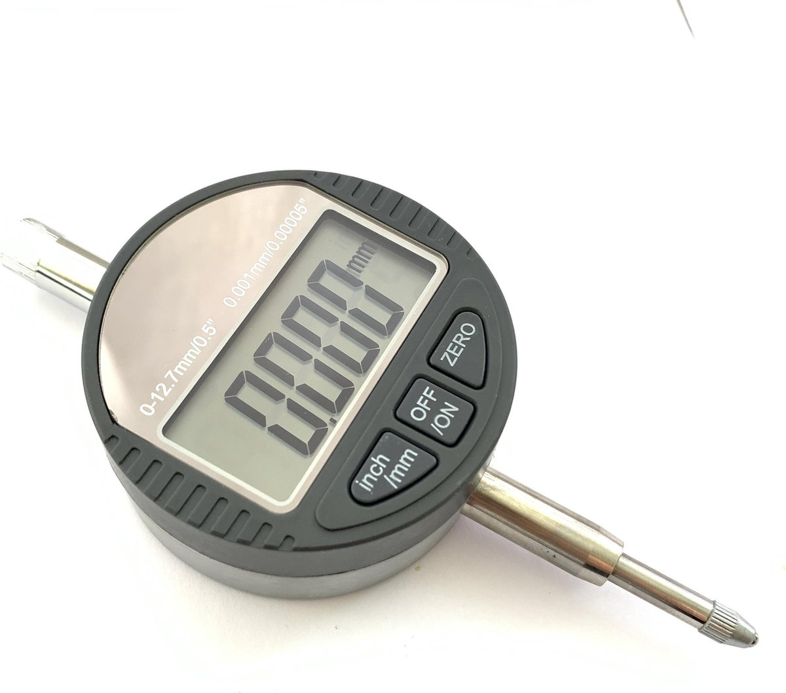

</div>


<br>
<br>


|                    |                                     |                      |                                 |
| :----------------- | :---------------------------------- | -------------------- | ------------------------------- |
| **Auteur**         | Luke van Luijn                      | **Minor**            | Digital Media Productions (DMP) |
| **Student nummer** | 587478                              | **Docentbegeleider** | Mario de Vries                  |
| **Opleiding**      | HBO-ICT                             | **Plaats**           | Nijmegen                        |
| **Profiel**        | Embedded Software Development (ESD) | **Datum**            | 15-04-2022                      |
| **Studiejaar**     | Jaar 3                              | **Versie**           | 1.0                             |

<div style="page-break-after: always;"></div>

<div style="page-break-after: always;"></div>

# Inhoudsopgaven

- 1 [Inleiding](#chapter0)
- 2 [Onderzoeksvraag](#chapter1)
	- 2.1 [Deelvragen](#chapter2)
- 3 [Onderzoeksmethode](#chapter3)
- 4 [Robot configuraties](#chapter4)
- 5 [Betrouwbaar testen](#chapter5)
	- 5.1 [Meetklok](#chapter6)
	- 5.2 [Snelheid & Microstepping](#chapter7)
	- 5.3 [Segmenten & afstand](#chapter8)
	- 5.4 [De tests](#chapter9)
- 6 [Meetopstelling](#chapter10)
	- 6.1 [Opzet](#chapter11)
	- 6.2 [Code](#chapter12)
- 7 [Resultaten](#chapter13)
- 8 [Conclusie](#chapter14)
- 9 [Literatuurlijst](#chapter15)

<div style="page-break-after: always;"></div>


<a name="chapter/inleiding"></a>

# 1. Inleiding <a name="chapter0"></a>

Dit experiment is gebaseerd op het uitzoeken hoe en het meten van de herhaalbaarheid (repeatability) van de robot arm. Repeatability is een statistiek gebruikt om aan te geven hoe betrouwbaar de bewegingen van de robot zijn. In de onderstaande afbeelding is een voorbeeld te zien van repeatability tegenover accuracy (precisie).

| | |
|:---:|:---:|
|||
|**Afbeelding 1** - *Repeatability & Accuracy*|**Afbeelding 2** - *Atlas - repeatability testing*|

Repeatability is een direct resultaat van de gebruikte componenten en het ontwerp van de robot zelf. De repeatability kan niet worden verbeterd zonder andere fysieke componenten te gebruiken, repeatability is dus een direct resultaat van de daadwerkelijke robot. Een robot met een hoge repeatability maar een lage accuracy (links onder in de afbeelding) is in essentie een slecht afgestelde machine, en kan altijd opnieuw gekalibreerd worden, accuracy is dus een direct resultaat van software of gebruik van de robot.<br>
In dit experiment zal onderzocht worden hoe de repeatability het beste getest kan worden. Het meten van repeatability is een proces dat zeer precies moet gebeuren gezien deze statistiek tot micrometer precies gemeten wordt. Naast een betrouwbare meetopstelling is een geschikte methodiek ook noodzakelijk. Over dit onderdeel is meer te lezen in het hoofdstuk Onderzoeksvraag en het hoofdstuk Betrouwbaar testen.<br>
Verder zal er gekeken worden naar de verschillende configuraties van de arm die betrekking hebben tot de repeatability van de arm. Verschillende aspecten van de arm zullen in meerdere maten betrekking hebben tot de resultaten, deze verschillende aspecten worden allemaal getest, de uitkomst van dit onderdeel zal een waardevolle bijdrage leveren voor het uiteindelijke product. Zo kunnen er bijvoorbeeld configuraties gemeden worden of juist niet omdat deze een bepaalde invloed hebben op de prestaties van de robot. Over deze onderdelen is wederom meer te lezen in de Onderzoeksvraag, ook in het hoofdstuk Robot configuraties staat dit onderdeel centraal.<br>
In het verdere document zal er nog gesproken worden over het resultaat van de deelvraag betrouwbaar testen, in het hoofdstuk Meetopstelling. In dit hoofdstuk zal in detail ingegaan worden op de verschillende aspecten van de meetopstelling, hoe de verschillende resultaten zijn verkregen en wat er gedaan is om zo betrouwbaar mogelijk te testen.<br>
Tot slot de hoofdstukken Resultaten & Conclusie. In het hoofdstuk Resultaten zal ingegaan worden op de verkregen resultaten en hoe deze geïnterpreteerd kunnen worden tot het uiteindelijke antwoord op de hoofdvraag. In het hoofdstuk conclusie zullen de antwoorden op de deelvragen gecombineerd met de verkregen resultaten samen tot een antwoord op de hoofdvraag komen. 


<a name="chapter/onderzoeksvraag"></a>

# 2. Onderzoeksvraag <a name="chapter1"></a>

In dit experiment zal de volgende hoofdvraag onderzocht en uiteindelijk beantwoord worden:

> - Wat is de repeatability van de robot in zijn huidge staat?

Gezien de robot nog niet geheel gerealiseerd is is het niet mogelijk om de daadwerkelijke repeatability te testen voor de gehele arm. Wel kan er een inschatting gemaakt worden van de verwachte repeatability van de complete arm op basis van de verkregen resultaten. Deze hoofdvraag zal beantwoord worden in het hoofdstuk [Conclusie](!chapter/conclusie).

## 2.1. Deelvragen <a name="chapter2"></a>

Voor het beantwoorden van de hoofdvraag zijn een tweetal deelvragen opgesteld: 

> 1. Welke configuraties van de robot zullen invloed hebben op de repeatability van de robot en hoe kunnen deze aspecten getest worden?

Gezien de robot de mogelijkheid heeft tot verschillende soft- en hardwarematige configuraties is het van belang om te concluderen welke aspecten invloed hebben op de repeatability en deze aspecten te testen. De resultaten kunnen in de uiteindelijke uitwerking van de robot belangrijk zijn. Configuraties zoals microstepping, snelheid en afgelegde afstand kunnen bijvoorbeeld invloed hebben op deze statistiek.

> 2. Hoe kan de repeatability van de robot betrouwbaar getest worden?

In deze deelvraag zal onderzocht worden hoe de repeatability in het algemeen gemeten wordt. Verschillende bronnen, bijvoorbeeld youtube, zullen gebruikt worden om een geschikte testopstelling te ontwikkelen voor de huidige robot en het beantwoorden van deze deelvraag.

Voor het uitwerken van deze deelvraag zal gebruik gemaakt worden van een tweetal methodieken; De [Community research](https://ictresearchmethods.nl/Community_research) methode zal gebruikt worden voor het uitzoeken van een geschikte meet opstelling. De methode [Non-functional test](https://ictresearchmethods.nl/Non-functional_test) voor het uitvoeren van de verschillende tests.

<a name="chapter/onderzoeksmethode"></a>

<div style="page-break-after: always;"></div>

# 3. Onderzoeksmethode <a name="chapter3"></a>


Dit onderzoek is onderverdeeld in drie delen, het uitzoeken hoe de hoofdvraag onderzocht kan worden, het uitvoeren van de verschillende tests en tot slot het analyseren van de verkregen resultaten. Voor deze drie verschillende onderdelen zijn drie verschillende methodes gebruikt.

||||
|:---:|:---:|:---:|
||||
|**Afbeelding 3** - *Methode: **Community research***|**Afbeelding 4** - *Methode: **Non-functional test***|**Afbeelding 5** - *Methode: **Data analytics***|

Het eerste onderdeel, Het uitzoeken van de manier van testen, zal gedaan worden door middel van de [Community research](https://ictresearchmethods.nl/Community_research) methode. Aangezien het testen van de repeatability is al bekend is in de robot arm industrie, is er voor dit onderdeel gekozen voor 'Community research'.

Het tweede onderdeel, het uitvoeren van de daadwerkelijke tests, zal gebeuren volgens de [Non-functional test](https://ictresearchmethods.nl/Non-functional_test) methode. Het weten van de repeatability van de robot is belangrijk, maar een niet-functioneel onderdeel van het project. De repeatability statistiek valt tussen de 'reliability' en 'performance' requirements.

Tot slot het derde onderdeel, het analyseren van de verkregen resultaten. Voor dit onderdeel is gekozen voor de methode [Data analytics](https://ictresearchmethods.nl/Data_analytics). Deze methode sluit perfect aan op de taak. Uit de verschillende tests zal een omvangrijke dataset komen. Deze dataset zal vervolgens geanalyseerd moeten worden om tot een concrete conclusie te komen.


<a name="chapter/robot_configuraties"></a>

# 4. Robot configuraties <a name="chapter4"></a>


Voor het beantwoorden van deze deelvraag zal gekeken worden naar de verschillende configuraties van de robot die betrekking hebben tot de repeatability. In de onderstaande vier onderdelen is te lezen welke onderdelen gekozen zijn en waarom.

Deze aspecten zijn onder andere op [dit](https://www.youtube.com/watch?v=OU80pkbl-KM&t=8s&ab_channel=Skyentific) (Skyentific, 2018) filmpje gebaseerd  vanaf minuut twee (02:00 - 03:45) beginnen de tests, in deze tests wordt onderscheid gemaakt tussen beide afstand, snelheid en bewegende segmenten. Verder wordt er in [dit](https://www.youtube.com/watch?v=CCgI4R1TEzI&t=862s&ab_channel=ChrisAnnin) (Annin, 2017) filmpje nog een demonstratie gegeven van verschillende methodes voor het testen van repeatability (00:00 - 04:38).

|Onderdeel|Beschrijving|
|:---|:---|
|**Afstand**|Dit onderdeel is toegevoegd aan de test omdat als er een verschil in repeatability is in de test dit verschil proportioneel zou moeten zijn aan de afgelegde afstand. Als een segment van de arm bijvoorbeeld 90 graden beweegt en een afwijking heeft van tien procent dan zou de arm over een afstand van 180 graden een afwijking van 20% moeten hebben. Of deze theorie daadwerkelijk toepasbaar is op de robot zal met deze configuratie onderzocht worden.|
|**Microstepping**|Microstepping staat voor het opdelen van de basis resolutie van een stepper motor (meestal 200 stappen per revolutie) naar een hoger aantal stappen per revolutie ten koste van een bepaalde hoeveelheid torque, in [dit](https://www.linearmotiontips.com/microstepping-basics/) artikel is hier meer over te lezen. Ook is er een diepere uitleg van gegeven in het eerste experiment. In theorie zou een hogere stepper resolutie (microstepping) een positieve invloed moeten hebben op de repeatability van de arm. Een hogere resolutie betekend dat de stepper motor meer precies kan bepalen welke positie het precies moet aannemen om de beoogde positie aan te nemen.|
|**Snelheid**|Het aspect snelheid is toegevoegd aan dit experiment omdat het logischerwijs invloed heeft op de repeatability van een stepper motor. Een hogere snelheid verhoogd de kans op een gemiste stap en verlaagd de capaciteit van de motor om 'op tijd' te stoppen.|
|**Segmenten**|Het gebruik van meerdere segmenten van de robot zal ook invloed hebben op de repeatability van de robot. De huidige robot bestaat uit twee beweegbare onderdelen (zie onderstaande afbeeldingen). Het eerste onderdeel, het onderdeel dat de meetklok raakt, heeft bijvoorbeeld geen extra gewicht (load) aan het motor hangen en kan hierdoor zonder weerstand bewegen. Het tweede onderdeel is van zichzelf een stuk zwaarder en zal door dit extra gewicht ook anders presteren in de repeatability tests.|

| | |
|:---:|:---:|
|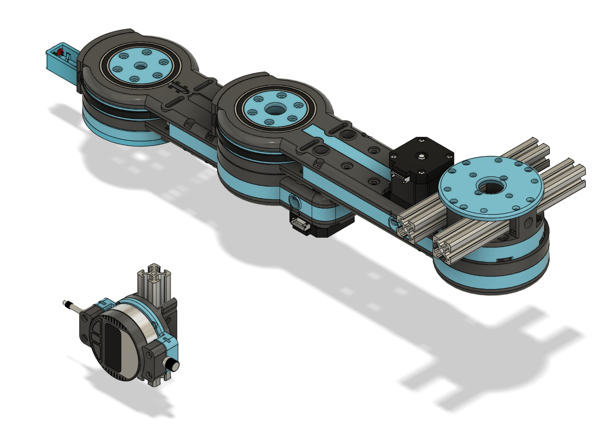||
|**Afbeelding 6** - *Robot - **basis locatie***|**Afbeelding 7** - *Robot - **trigger locatie***|


<a name="chapter/betrouwbaar_testen"></a>

# 5. Betrouwbaar testen <a name="chapter5"></a>

In dit hoofdstuk zullen de vier onderdelen aangekaart in het voorgaande hoofdstuk centraal staan. Er zal gekeken worden op welke manier deze aspecten het best getest kunnen worden.

## 5.1. Meetklok <a name="chapter6"></a>

Voor het meten van de afwijking in micrometers is er gebruik gemaakt van een [meetklok](https://www.bol.com/nl/nl/p/meetklok-digitale-meetklok-0-001-mm-0-12-7mm/9300000021240080/?s2a=). Een meetklok is een klein apparaat met een pin die ingedrukt kan worden. Hoever de pin precies ingedrukt wordt wordt op het display weergegeven in milimeters, tot drie decimalen. Door middel van deze klok kan de afwijking van de arm tot de micrometer precies gemeten worden. De gebruikte meetklok is in de onderstaande afbeelding weergegeven.

|||
|:---:|:---:|
|||
|**Afbeelding 8** - *Meetklok*|**Afbeelding 9** - *Robot - **Trigger locatie***|

## 5.2. Snelheid & Microstepping <a name="chapter7"></a>

Voor het testen van de invloed van de bewegingssnelheid worden er vier snelheden gehanteerd; 15, 30, 60, en  120 toeren per minuut. Qua microstepping wordt er gebruik gemaakt van 400, 800, 1600 en 3200 stappen per revolutie.

Voor de uiteindelijke implementatie zal er gebruik gemaakt worden van een maximale snelheid van 30 tot 60 toeren per minuut, deze snelheid is beide veilig voor de stepper motor en de robot arm zelf. Ook levert deze snelheid de meest ideale torque ([torque curve pdf](https://www.omc-stepperonline.com/download/17HS19-0406S_Torque_Curve.pdf)). Om beide uiterste te testen is er ook voor gekozen om 15 en 120 toeren per minuut te testen.

Het is nog niet geheel zeker wat de uiteindelijke microstepping resolutie zal worden voor de robot arm, daarom zal er gekeken moeten worden naar de juiste verhouding tussen noodzakelijke torque en resolutie. Door deze onzekerheid zijn er vier verschillende resoluties getest; 400, 800, 1600 en 3200. 

<div style="page-break-after: always;"></div>

## 5.3. Segmenten & afstand <a name="chapter8"></a>

Om de invloed van de verschillende segmenten en de afgelegde afstand te testen zijn de onderstaande posities bepaald. Zoals te zien in de onderstaande tabel is er onderscheid gemaakt tussen beide segment en afstand. In de eerste kolom is te zien dat het eerste segment op drie afstanden getest is; 75°, 150° en 225° graden, hetzelfde voor de tweede kolom. In de derde kolom staan de posities van weergegeven voor de tests waarbij beide segmenten bewegen naar de 'trigger locatie' (zie afbeelding 'trigger locatie'). De drie rijen geven de afgelegde afstand aan.

| |Eerste segment|Tweede segment|Beide segmenten|
|:---:|:---:|:---:|:---:|
|**75°** |||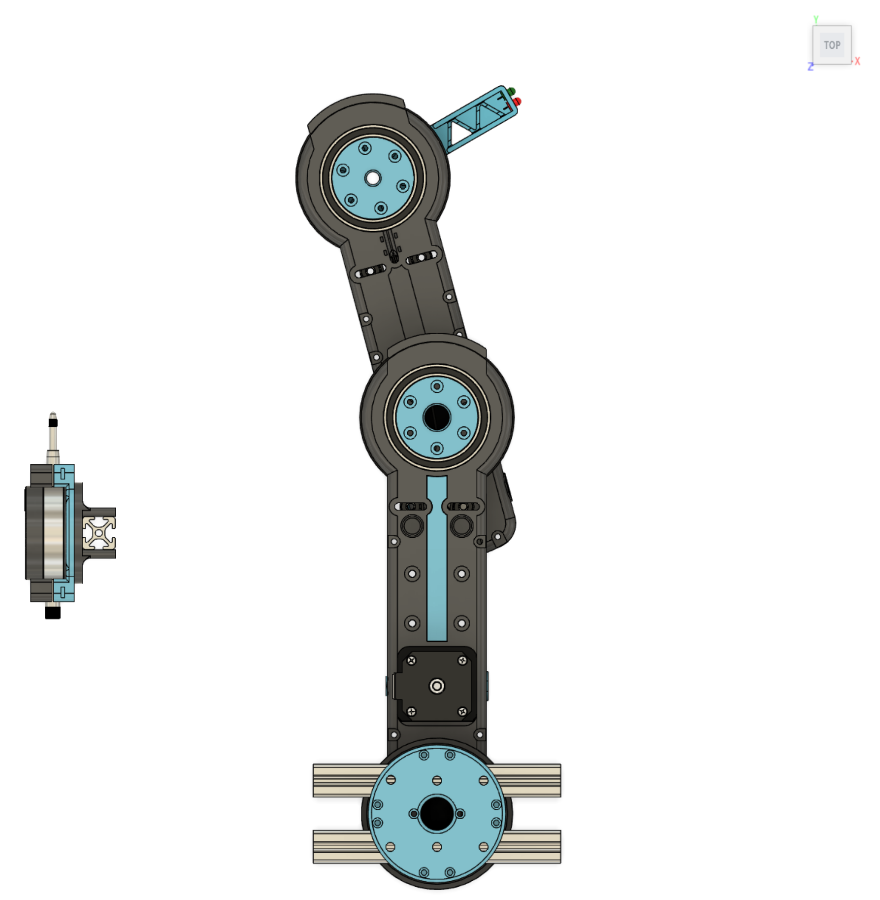|
|**150**°|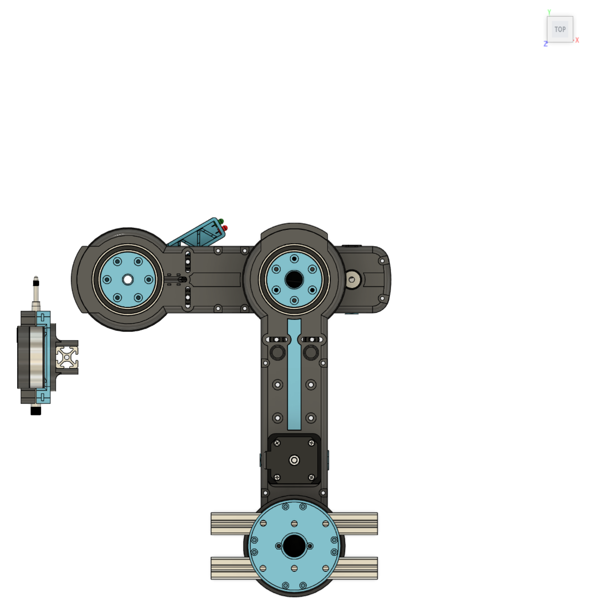|||
|**225°**||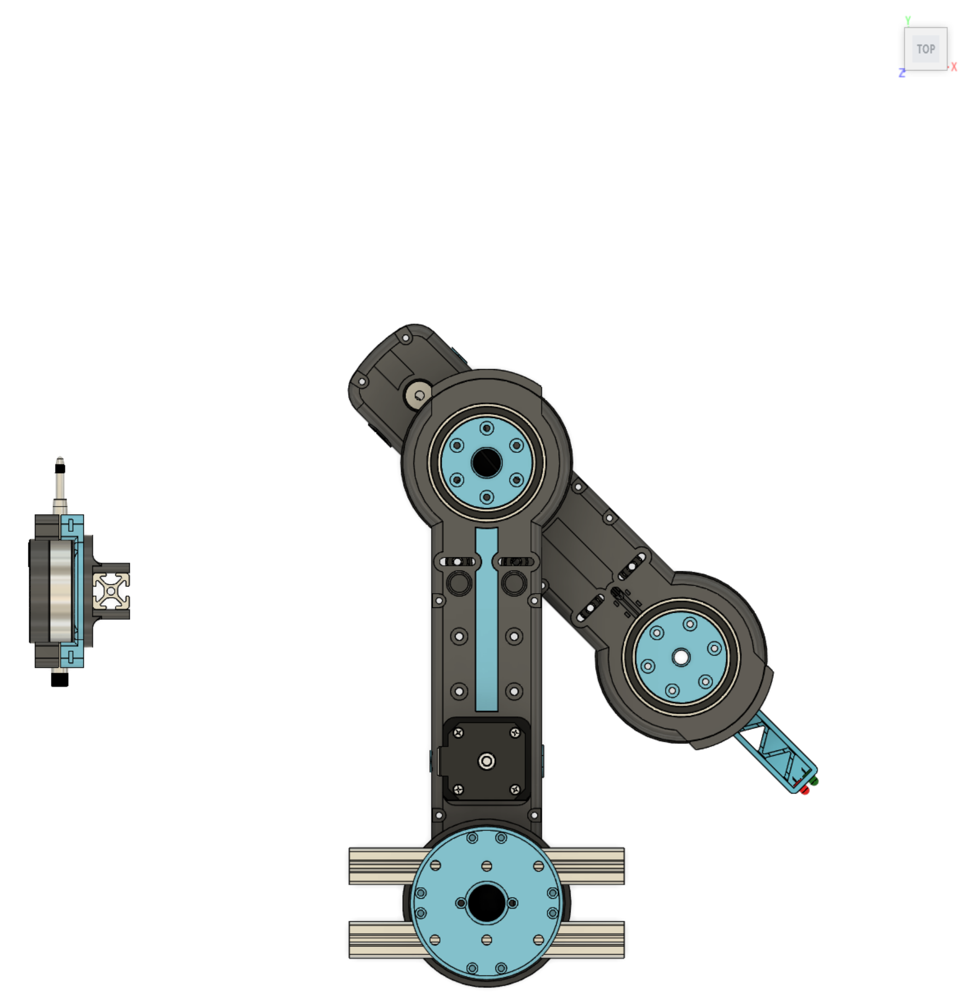||

**Tabel 1** - Segmenten & afstand

<div style="page-break-after: always;"></div>

## 5.4. De tests <a name="chapter9"></a>

In het onderstaande diagram is de test sequence schematisch weergegeven, onder deze afbeelding worden de stappen van dit schema omschreven.


**Afbeelding 10** - *Test sequence*

Wanneer een test gestart wordt zal er ten eerste een homing sequence uitgevoerd worden. Omdat een stepper motor geen idee heeft hoe deze georiënteerd is zal hij bij aanvang van het programma eest naar een bekende staat moeten bewegen. Dit gebeurt aan de hand van twee magneten gemonteerd op de as met een bijhorende [hall effect sensor](https://www.tinytronics.nl/shop/en/sensors/magnetic-field/3144-hall-effect-switch). Door beide magneten 'op te zoeken' weet de motor waar hij is en is zijn staat bekend.

Vervolgens zal het programma de tests voor het eerste segment starten. Het programma beweegt de arm naar de 'trigger locatie' (zie de bovenstaande afbeelding 'trigger locatie') en zal daar vervolgens wachten tot de gebruiker de meetklok heeft gereset. Zodra de gebruiker op de knop drukt begint het programma met de tests.
Het programma zet eerst de snelheid, te beginnen bij 15 toeren per minuut. Voor deze snelheid zal het programma drie tests uitvoeren voor de 75° graden positie, drie voor de 150°, en drie voor de 225° graden positie. Deze sequence wordt herhaald voor de resterende snelheden.

Zodra alle snelheden en posities getest zijn zal het programma doorgaan naar het tweede segment. De meetklok wordt nogmaals gereset en het programma wacht weer op de gebruiker. Deze hele sequence, wordt ook herhaald voor het derde onderdeel: beide segmenten. 

Zodra dit alles is uitgevoerd zal de microstepping resolutie verhoogd worden en draait dit alles nogmaals voor elke resolutie.

Door elke positie op elke snelheid voor ieder segment drie maal uit te voeren kan er met meer zekerheid gezegd worden dat het resultaat het daadwerkelijke resultaat is een geen uitschieter.

> De daadwerkelijk uitgevoerde tests zijn terug te vinden in de bijlage (bijlage/clips/MS400, ../MS800, ../MS1600 & ../MS3200) 


<a name="chapter/meetopstelling"></a>

# 6. Meetopstelling <a name="chapter10"></a>


De onderstaande afbeeldingen laten de aansluiting zien tussen de microcontroller en de verschillende hardware componenten.

|||
|:---:|:---:|
||**Afbeelding 11** - *Aansluiting*|
||**Schema 1** - *Aansluitschema*|

## 6.1. Opzet <a name="chapter11"></a>

Zoals in het voorgaande hoofdstuk vermeld zijn de laatste twee segmenten van de arm gebruikt voor deze tests. Verder is er nog een houder 3D-geprint voor beide de twee segmenten van de robot arm en de meetklok. Dit alles is gemonteerd op een aluminium extrusion frame. Ook de elektronica zoals de stepper drivers en de voeding zijn op dit frame gemonteerd. Een webcam is op twee verfbussen geplaatst zodat het direct op de meetklok gericht kan worden. Ook is er nog een lamp gericht op de meetklok en een ventilator voor extra light en koeling. In de onderstaande afbeeldingen staat de gebruikte opstelling weergegeven.

|||
|:---:|:---:|
|||
|**Afbeelding 12** - *Meetopstelling 01*|**Afbeelding 13** - *Meetopstelling 02*|

## 6.2. Code <a name="chapter12"></a>

In het onderstaande klasse diagram is een schematische weergaven van de code te zien.

> De daadwerkelijke code is terug te vinden in de bijlage (bijlage/code/src voor de *.cpp bestanden & bijlage/code/include voor de *.h bestanden.)


In de header(*.h) 'config.h' staan alle pin configuraties en tevens configuraties zoals microstepping. De klasse LED is verantwoordelijk voor het besturen van de verschillende LEDs gebruikt in dit experiment. De methodes ```On, Off en Blink``` zijn hiervan de voornaamste (LED.cpp regel 35 - 58). In de klasse Motor wordt de besturing van de motoren geregeld. Deze klasse erft  van de externe library ['AccelStepper'](https://www.airspayce.com/mikem/arduino/AccelStepper/). Deze library regelt onder andere accel- en deceleratie van de stepper motors voor een meer gestroomlijnde beweging. De klasse Motor levert nog enkele toevoegingen op deze library met de methodes ```MoveDegrees, MoveToAngle, RunDegrees, RunToAngle``` (Motor.cpp regel 34 - 53). Deze methodes regelen beweging op basis van een opgegeven hoek in plaats van een bepaald aantal stappen. Verder is in deze klasse ook de homing sequence verwerkt, deze is terug te vinden op regel 78 - 131. De klasse Switch is een kopie van de klasse Limit beide klasse regelen het 'debouncen' van een hardware switch, dit is een lichtelijk aangepaste versie van de ['debounce code'](https://www.arduino.cc/en/Tutorial/BuiltInExamples/Debounce) van Arduino. De belangrijke methodes zijn in dit onderdeel de methode ```Triggered``` deze methode retourneert 'true' wanneer de switch daadwerkelijk getriggerd word. In het bestand main.cpp worden al deze losse klasse's aan elkaar geknoopt dit bestand bevat onderandere de code voor het uitvoeren van een experiment, dit is terug te vinden in de methode ```RunExperiment``` regel 131 - 200. In deze methode is de eerder besproken 'test sequence' uitgewerkt.


<a name="chapter/resultaten"></a>

# 7. Resultaten <a name="chapter13"></a>


> De rauwe resultaten zijn terug te vinden in de bijlage (bijlage/results/exp_02_results.ods), de grafieken zijn terug te vinden op sheet 'spread' & 'segment' in hetzelfde doucment.

In de onderstaande tabel zijn de verschillende resultaten weergegeven, de kolommen zijn onderverdeeld in de verschillende bewegende segmenten en de rijen zijn de verschillende microstepping configuraties. Alle grafieken hebben dezelfde schaling.

||Eerste segment|Tweede segment|Beide segmenten|
|:---:|:---:|:---:|:---:|
|MS400 | |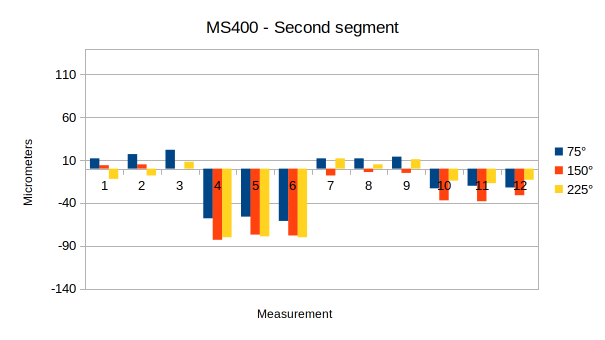 |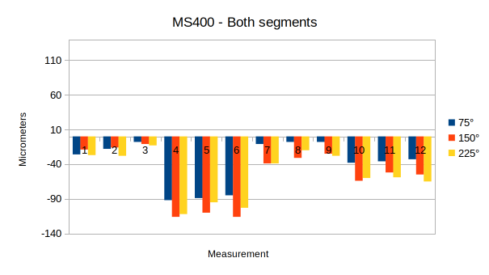|
|MS800 |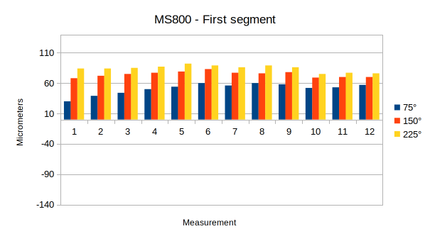 |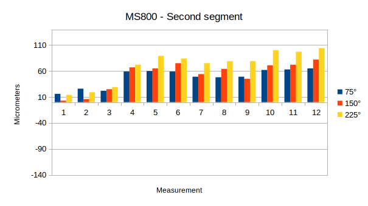 ||
|MS1600||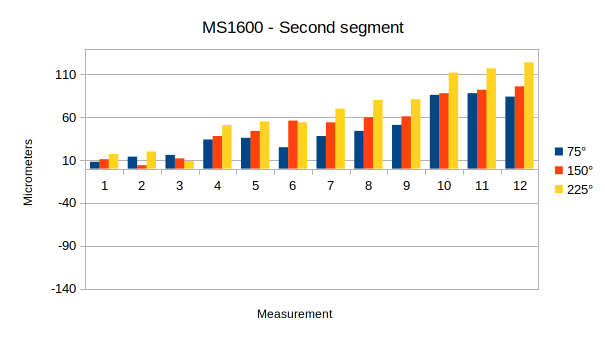|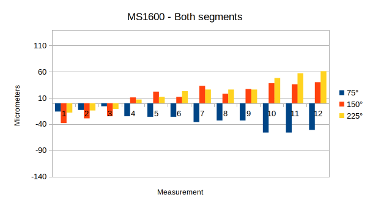|
|MS3200||||

**Tabel 2** - *Resultaten - **afwijking per microstepping configuratie, per segment in micrometers***

Naar verwachting is te zien naarmate de microstepping configuratie hoger wordt de afwijking van het nul-punt lager. Verder is ook te zien dat met name bij de kolom 'Tweede segment' de afwijking aanzienlijk hoger wordt naarmate de snelheid omhoog* gaat. Dit zal een direct resultaat zijn van het hogere gewicht van dat segment. De afwijking van het eerste segment is namelijk nagenoeg gelijk.

Opmerkelijke resultaten zijn dat het erop lijkt dat als beide segmenten tegelijk bewegen dat de afwijking minder wordt. Naar verwachting zou de afwijking van beide losse segmenten opgeteld moeten worden voor de resultaten van de beweging van beide segmenten. Een ander opmerkelijk resultaat zijn de grafieken van MS400 voor het tweede en beide segmenten. Bij deze grafieken zijn opmerkelijke dallen te zien bij een snelheid van 30 en 120 toeren per minuut. Dit is waarschijnlijk het resultaat van het raken van de van de natuurlijke 'resonance' van de stepper motor. Dit kan leiden tot een hogere vibratie van de motor en eventueel torque verlies. In dit geval dus een hogere afwijking in de metingen. Deze theorie wordt verder bevestigd door [dit](https://www.linearmotiontips.com/what-is-stepper-motor-resonance-and-how-can-it-be-avoided/) (Collins, 2020) artikel. Hierin wordt vermeld dat deze 'resonance' vermeden kan worden door een andere snelheid of een andere microstepping resolutie aan te nemen. Te zien in de grafieken van de andere microstepping resoluties (800,1600 & 3200) dat deze resonance verdwenen is.

> ```*``` De snelheid wordt elke drie metingen verhoogd.

||||
|:---:|:---:|:---:|
| | | |
|**Grafiek 1** - *Eerste segment 225°*|**Grafiek 2** - *Tweede segment - 225°*|**Grafiek 3** - *Beide segmenten - 225°*|

Wanneer de afwijking per microstepping resolutie vergeleken wordt per segment voor de 225° graden positie is te zien dat er zoals eerder vermeld naar verwachting nauwelijks verschil in afwijking te zien is voor de verschillende snelheden voor het eerste segment. Bij de tweede en beide segmenten is te zien dat de afwijking geleidelijk hoger wordt naarmate de snelheid toeneemt. Dit verloopt dus volgens verwachting.


<a name="chapter/conclusie"></a>

# 8. Conclusie <a name="chapter14"></a>


Om dit experiment kort samen te vatten. Eerst is er gekeken naar welke onderdelen van de configureerbare aspecten van de robot betrekking zouden kunnen hebben tot de uiteindelijke repeatability van de robot. Uit deze deelvraag werd duidelijk dat de snelheid, afgelegde afstand, microstepping configuratie en hoeveel segmenten tegelijkertijd bewegen van belang zijn. Vervolgens is er gekeken hoe deze aspecten betrouwbaar getest kunnen worden. Er zijn verschillende snelheden en microstepping resoluties gekozen op basis van de configuraties, die uiteindelijk in de robot gebruikt zullen worden. Verder zijn er meerdere test posities opgesteld die beide de afstand en het aantal segmenten test. Dit alles is gecombineerd in een test sequence en vervolgens via de meetopstelling getest.

Er zijn enkele opmerkelijke resultaten verkregen, zoals bijvoorbeeld de 'resonance' bij een microstepping resolutie van 400. Ook het feit dat wanneer beide segmenten worden gecombineerd de afwijking omlaag gaat. Naast de opmerkelijke situaties zijn de resultaten nagenoeg verlopen volgens verwachting en kan de hoofdvraag beantwoord worden.

Het antwoord op de hoofdvraag; *'Wat is de repeatability van de robot in zijn huidige staat?'*, is afhankelijk van de uiteindelijke microstepping resolutie. Gezien het probleem met de 'resonance' valt een microstepping resolutie van 400 af. Voor de resoluties 800,1600 en 3200 zijn de uiteindelijke repeatability statistieken in de onderstaande tabel weergegeven:

|Resolutie|Maximale afwijking|Minimale afwijking|Verschil|Repeatability|
|:---|:---:|:---:|:---:|:---:|
|MS800 |-37 μm|38 μm|75 μm|**0.075 mm**|
|MS1600|-18 μm|61 μm|79 μm|**0.079 mm**|
|MS3200|-44 μm|41 μm|85 μm|**0.085 mm**|

**Tabel 3** - *Resultaten - **repeatability***

Zoals in de tabel te zien is de uiteindelijke repeatability voor alle drie de microstepping resoluties **< 0.1 mm** dit is een uitstekende prestatie, maar niet geheel representatief. De uiteindelijke arm krijgt nog een extra draaiend onderdeel die natuurlijk extra spelling met zich meebrengt.

<div style="page-break-after: always;"></div>

# 9. Literatuurlijst <a name="chapter15"></a>

| Index | Source                                                                                                                                                                                                                                                                                                                                                         | 
| :---: | :---                                                                                                                                                                                                                                                                                                                                                           | 
| 1     | Bouchard, S. (z.d.). Robotic Gripper Repeatability Definition and Measurement. Robotiq. Geraadpleegd op 15 april 2022, van [https://blog.robotiq.com/bid/36551/Robotic-Gripper-Repeatability-Definition-and-Measurement](https://blog.robotiq.com/bid/36551/Robotic-Gripper-Repeatability-Definition-and-Measurement)                                          | 
| 2     | Lickindorf, D. (2019, 12 juli). Repeatability testing in progress. Hackaday. Geraadpleegd op 15 april 2022, van [https://hackaday.io/project/168259-atlas-6dof-3d-printed-universal-robot/log/171655-repeatability-testing-in-progress](https://hackaday.io/project/168259-atlas-6dof-3d-printed-universal-robot/log/171655-repeatability-testing-in-progress) | 
| 3     | Community research - ICT research methods. (z.d.). ICT Research Methods. Geraadpleegd op 15 april 2022, van [https://ictresearchmethods.nl/Community_research](https://ictresearchmethods.nl/Community_research)                                                                                                                                               | 
| 4     | Data analytics - ICT research methods. (z.d.). ICT Research Methods. Geraadpleegd op 15 april 2022, van [https://ictresearchmethods.nl/Data_analytics](https://ictresearchmethods.nl/Data_analytics)                                                                                                                                                           | 
| 5     | Non-functional test - ICT research methods. (z.d.). ICT Research Methods. Geraadpleegd op 15 april 2022, van [https://ictresearchmethods.nl/Non-functional_test](https://ictresearchmethods.nl/Non-functional_test)                                                                                                                                            | 
| 6     | Collins, D. (2019, 24 november). Microstepping for Stepper Motors. Linear Motion Tips. Geraadpleegd op 15 april 2022, van [https://www.linearmotiontips.com/microstepping-basics/](https://www.linearmotiontips.com/microstepping-basics/)                                                                                                                     | 
| 7     | Skyentific. (2018, 1 september). Is it the best DIY 3D printed robotic arm? Precision, speed and payload test. YouTube. Geraadpleegd op 15 april 2022, van [https://www.youtube.com/watch?v=OU80pkbl-KM&t=8s&ab_channel=Skyentific](https://www.youtube.com/watch?v=OU80pkbl-KM&t=8s&ab_channel=Skyentific)                                                    | 
| 8     | Annin, C. (2017, 23 september). AR2 6 axis stepper motor robot. YouTube. Geraadpleegd op 15 april 2022, van [https://www.youtube.com/watch?v=CCgI4R1TEzI&t=862s&ab_channel=ChrisAnnin](https://www.youtube.com/watch?v=CCgI4R1TEzI&t=862s&ab_channel=ChrisAnnin)                                                                                               | 
| 9     | Bol. (z.d.). Meetklok - Digitale meetklok. Bol.com. Geraadpleegd op 15 april 2022, van [https://www.bol.com/nl/nl/p/meetklok-digitale-meetklok-0-001-mm-0-12-7mm/9300000021240080/?s2a=](https://www.bol.com/nl/nl/p/meetklok-digitale-meetklok-0-001-mm-0-12-7mm/9300000021240080/?s2a=)                                                                      | 
| 10    | TinyTronics. (z.d.). 3144 Hall Effect Switch. Geraadpleegd op 15 april 2022, van [https://www.tinytronics.nl/shop/en/sensors/magnetic-field/3144-hall-effect-switch](https://www.tinytronics.nl/shop/en/sensors/magnetic-field/3144-hall-effect-switch)                                                                                                        | 
| 11    | AccelStepper: AccelStepper library for Arduino. (z.d.). AccelStepper. Geraadpleegd op 15 april 2022, van [https://www.airspayce.com/mikem/arduino/AccelStepper/](https://www.airspayce.com/mikem/arduino/AccelStepper/)                                                                                                                                        | 
| 12    | Arduino. (z.d.). Debounce. Geraadpleegd op 15 april 2022, van [https://www.arduino.cc/en/Tutorial/BuiltInExamples/Debounce/](https://www.arduino.cc/en/Tutorial/BuiltInExamples/Debounce/)                                                                                                                                                                     | 
| 13    | Collins, D. (2020, 12 november). What is stepper motor resonance and how can it be avoided? Linear Motion Tips. Geraadpleegd op 15 april 2022, van [https://www.linearmotiontips.com/what-is-stepper-motor-resonance-and-how-can-it-be-avoided/](https://www.linearmotiontips.com/what-is-stepper-motor-resonance-and-how-can-it-be-avoided/)                  | 


