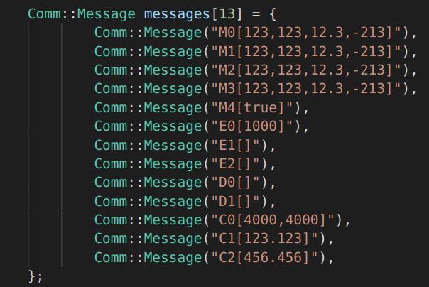
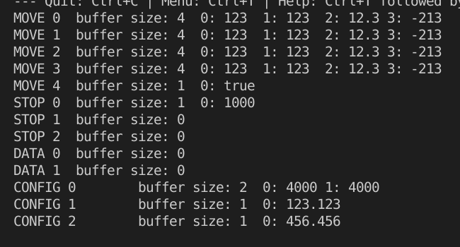

# Firmware prototype - Message

In dit prototype is de opzet van de messages bepaald. Verder is er een eerste iteratie van het message protocol opgezet.

In dit prototype zijn de belangrijke onderdelen de klasse [**Message**](https://github.com/LukevLuijn/robox_docs/blob/main/prototypes/firmware/message_test/code/include/Message.h) en het [**protocol**](https://github.com/LukevLuijn/robox_docs/blob/main/prototypes/firmware/message_test/code/include/msg_protocol.h).

|Input|Output|
|:---:|:---:|
|||
|**Afbeelding 1** - *Input*|**Afbeelding 2** - *Output*|